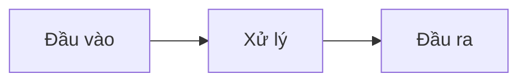

# CLAUDE.md — Khóa học Master Claude Code

## TỔNG QUAN DỰ ÁN

Đây là khóa học chuyên sâu, chất lượng chuyên nghiệp dạy developer cách master Claude Code (CLI coding agent của Anthropic). Khóa học sẽ được xuất bản dưới nhiều dạng:

- **Khóa học online** (Markdown → Docusaurus/MkDocs website)
- **Nguồn cho NotebookLM** (upload .md trực tiếp)
- **Sách in** (Markdown → Pandoc → DOCX → InDesign/Canva → In ấn)
- **Tài liệu workshop** (Phần DEMO + PRACTICE dùng làm bài thực hành trực tiếp)

**Ngôn ngữ**: Tiếng Anh (`/en/`) và Tiếng Việt (`/vi/`) — luôn duy trì cả hai đồng bộ.

**Tác giả**: Ethan Nguyen (Senior Android Engineer, 12+ Năm Kinh Nghiệm, Việt Nam, chuyên KMP/Android/Backend)

---

## CẤU TRÚC KHÓA HỌC

- **16 Phase** → **55 Module** → **~200+ Chủ đề**
- Mỗi phase là một thư mục: `phase-XX-ten/`
- Mỗi module là một file: `XX-ten-module.md`
- Cả hai ngôn ngữ theo cùng cấu trúc và đánh số

### Cấu trúc thư mục

```
claude-code-mastery/
├── CLAUDE.md                     ← FILE NÀY (quy tắc dự án cho Claude Code)
├── CLAUDE.vi.md                  ← Bản tiếng Việt
├── README.md                     ← Tổng quan khóa học (song ngữ)
├── SUMMARY.md                    ← Mục lục đầy đủ
│
├── en/                           ← Nội dung tiếng Anh
│   ├── phase-01-foundation/
│   │   ├── 01-installation.md
│   │   ├── 02-interfaces-modes.md
│   │   └── 03-context-basics.md
│   ├── phase-02-security/
│   │   └── ...
│   └── ...
│
├── vi/                           ← Nội dung tiếng Việt
│   ├── phase-01-foundation/
│   │   ├── 01-installation.md
│   │   └── ...
│   └── ...
│
├── assets/
│   ├── diagrams/                 ← Mermaid source + PNG đã export
│   └── screenshots/              ← Screenshots có chú thích
│
├── cheatsheets/
│   ├── en/
│   └── vi/
│
├── templates/                    ← CLAUDE.md templates, prompt recipes
│   ├── claude-md-kmp.md
│   ├── claude-md-backend.md
│   └── ...
│
└── scripts/
    ├── build-pdf.sh              ← Pipeline build Pandoc
    ├── build-docx.sh
    └── build-site.sh
```

---

## PHƯƠNG PHÁP GIẢNG DẠY: Progressive Hands-on Hybrid

Mỗi module BẮT BUỘC phải theo **cấu trúc 7 Block** chính xác. Không ngoại lệ. Đảm bảo tính nhất quán cho toàn bộ 55 module, cả hai ngôn ngữ, và mọi định dạng xuất bản.

### 7 Block (Bắt buộc)

| # | Block | Mục đích | Độ dài mục tiêu |
|---|-------|----------|-----------------|
| 1 | **WHY — Tại sao cần?** | Pain point thực tế, tạo động lực | 3-5 câu |
| 2 | **CONCEPT — Khái niệm** | Mô hình tư duy cốt lõi, lý thuyết | 1-2 đoạn + sơ đồ |
| 3 | **DEMO — Làm mẫu** | Hướng dẫn từng bước | 5-15 bước, copy-paste được |
| 4 | **PRACTICE — Tự thực hành** | Bài tập thực hành | 1-3 bài có kết quả mong đợi |
| 5 | **CHEAT SHEET — Bảng tra cứu** | Bảng tham chiếu nhanh | Tối đa 1 trang, dễ scan |
| 6 | **PITFALLS — Tránh sai lầm** | Lỗi thường gặp | 3-7 mục, format ❌ Sai → ✅ Đúng |
| 7 | **REAL CASE — Tình huống thực** | Câu chuyện production | 1 câu chuyện cụ thể từ dự án thật |

---

## TEMPLATE MODULE

Mỗi file module BẮT BUỘC bắt đầu với cấu trúc chính xác sau:

```markdown
# Module X.Y: [Tên Module]

> **Thời gian học**: ~XX phút
> **Yêu cầu trước**: Module X.Z (hoặc "Không có")
> **Kết quả**: Sau module này, bạn sẽ biết [kỹ năng cụ thể]

---

## 1. WHY — Tại sao cần học cái này?

[2-5 câu mô tả PAIN POINT THỰC TẾ. Bắt đầu bằng một tình huống mà người đọc
có thể liên hệ. Khiến họ cảm thấy "đúng, mình cần cái này." Không viết sáo rỗng.]

---

## 2. CONCEPT — Khái niệm cốt lõi

[Giải thích mô hình tư duy. Dùng ví von, phép so sánh. Thêm sơ đồ (Mermaid)
nếu khái niệm liên quan đến flow, kiến trúc, hoặc quan hệ.

Nếu cần sơ đồ, dùng format:]



[Giữ lý thuyết ngắn gọn. Đây KHÔNG PHẢI giáo trình đại học — chỉ cần đủ để
hiểu TẠI SAO đằng sau mỗi lệnh/tính năng.]

---

## 3. DEMO — Làm mẫu từng bước

[Các bước đánh số. Mỗi bước có:
1. Làm gì (lệnh hoặc hành động)
2. Sẽ thấy gì (output mong đợi)
3. Tại sao quan trọng (giải thích 1 câu)

TẤT CẢ lệnh phải thật, đã test, copy-paste được luôn.
Dùng tên project và cấu trúc file thực tế.]

**Bước 1: [Hành động]**
```bash
lệnh ở đây
```
Output mong đợi:
```
output ở đây
```

**Bước 2: [Hành động]**
...

---

## 4. PRACTICE — Tự thực hành

### Bài tập 1: [Tiêu đề]
**Mục tiêu**: [Cần đạt được gì]
**Hướng dẫn**:
1. ...
2. ...
3. ...

**Kết quả mong đợi**: [Thành công trông như thế nào]

<details>
<summary>💡 Gợi ý</summary>
[Gợi ý mà không cho đáp án đầy đủ]
</details>

<details>
<summary>✅ Đáp án</summary>
[Đáp án đầy đủ có giải thích]
</details>

---

## 5. CHEAT SHEET — Bảng tra cứu nhanh

| Lệnh / Tính năng | Mô tả | Ví dụ |
|---|---|---|
| `lệnh` | Làm gì | `cách dùng` |

---

## 6. PITFALLS — Những sai lầm cần tránh

| ❌ Sai lầm | ✅ Cách đúng |
|---|---|
| Làm X mà không có Y | Luôn làm Y trước vì... |

---

## 7. REAL CASE — Tình huống thực tế

**Bối cảnh**: [Mô tả ngắn tình huống thực]
**Vấn đề**: [Chuyện gì xảy ra hoặc cần giải quyết]
**Giải pháp**: [Claude Code được dùng thế nào để giải quyết]
**Kết quả**: [Outcome cụ thể, có số liệu nếu có thể]

---

> **Tiếp theo**: [Module X.Z: Tiêu đề](link) →
```

---

## QUY TẮC VIẾT

### Giọng văn & Ngữ điệu
- **Thoải mái nhưng chuyên nghiệp** — như senior dev mentor đồng nghiệp
- Dùng "bạn" để xưng hô trực tiếp
- Câu ngắn. Không dùng ngôn ngữ học thuật
- Hài hước nhẹ OK khi tự nhiên. Không gượng ép
- Có quan điểm rõ ràng — recommend best practice, không lấp lửng

### Nội dung kỹ thuật
- TẤT CẢ lệnh phải thật và đã test. KHÔNG BAO GIỜ bịa flag hay API
- Hiển thị CẢ lệnh VÀ output
- Ghi version number khi cần (vd: "Claude Code v1.x+")
- Feature beta hoặc có thể thay đổi: đánh dấu `⚠️ Tính năng beta — có thể thay đổi`
- Terminal examples dùng `$` prefix cho input người dùng, không prefix cho output
- Code blocks BẮT BUỘC chỉ định ngôn ngữ: ````bash`, ````json`, ````typescript`...

### Quy tắc format
- H1 (`#`) = Tiêu đề module duy nhất (một file một H1)
- H2 (`##`) = Chỉ dùng cho 7 block headers
- H3 (`###`) = Sub-section trong các block
- **Bold** cho thuật ngữ quan trọng lần đầu xuất hiện
- `code` cho lệnh, flag, tên file, config key
- Dùng bảng cho so sánh và cheat sheet
- Dùng `<details>` cho đáp án/gợi ý (thu gọn được)
- Sơ đồ: ưu tiên Mermaid (render mọi nơi). Dự phòng: ASCII art
- Độ rộng dòng tối đa: 100 ký tự (để render PDF đẹp)

### Quy tắc độ dài
- Tổng module: **800-1500 từ** (sweet spot cho 20-40 phút đọc + thực hành)
- WHY: 50-100 từ
- CONCEPT: 150-300 từ
- DEMO: 200-400 từ
- PRACTICE: 150-300 từ
- CHEAT SHEET: 100-200 từ (dạng bảng)
- PITFALLS: 100-200 từ
- REAL CASE: 100-200 từ

### Quy tắc song ngữ
- Bản tiếng Việt KHÔNG PHẢI dịch từng từ — viết lại tự nhiên bằng giọng Việt
- Thuật ngữ kỹ thuật giữ nguyên tiếng Anh: "context window", "token", "sandbox", "hook"
- Giải thích tiếng Việt có thể thêm ngữ cảnh văn hóa (vd: ví dụ banking app Việt Nam)
- Hai bản phải cover cùng chủ đề và cấu trúc
- Bản tiếng Việt có thể dài hơn một chút (câu tiếng Việt thường dài hơn)

---

## QUY TẮC ĐỘ CHÍNH XÁC KỸ THUẬT

Các quy tắc này rất quan trọng. Vi phạm chúng sẽ làm mất uy tín của toàn bộ khóa học.

### Quy tắc chung
1. KHÔNG BAO GIỜ bịa lệnh CLI, flag, URL, hoặc API endpoint. Nếu không chắc 100% một lệnh tồn tại, đánh dấu `⚠️ Cần xác minh` và để lại comment cho tác giả kiểm tra.
2. KHÔNG BAO GIỜ bịa số version. Dùng format placeholder như `X.Y.Z` thay vì số cụ thể giả.
3. KHÔNG BAO GIỜ đánh dấu phương pháp chính thức là "deprecated" trừ khi có thể trích dẫn thông báo deprecation.
4. Khi hiển thị output mong đợi, dùng nội dung thực tế nhưng rõ ràng là placeholder. Đánh dấu với comment `# Output có thể khác`.
5. Lệnh cài đặt thay đổi thường xuyên. Với các module Phase 1 cụ thể: mọi lệnh install, URL, và package name PHẢI được xác minh với documentation live trước khi viết.

### Quy trình xác minh
Trước khi viết bất kỳ phần DEMO hoặc CHEAT SHEET nào:
- Tự hỏi: "Mình có chắc 100% lệnh này tồn tại với syntax chính xác này không?"
- Nếu CÓ → viết nó
- Nếu KHÔNG → viết nó với suffix `⚠️ Cần xác minh`
- KHÔNG BAO GIỜ đoán và trình bày như sự thật

### Các lệnh đã xác nhận tồn tại (verified)
Cập nhật danh sách này khi các module được viết:
- `claude` — khởi động session tương tác
- `claude -p "prompt"` — chế độ one-shot
- `claude config` — quản lý cấu hình
- `/help` — liệt kê lệnh trong session
- `/compact` — nén context
- `/clear` — reset context
- `/cost` — hiển thị token usage
- `/init` — khởi tạo CLAUDE.md cho project

### Các lệnh cần xác minh
- `/status` — có thể có hoặc không
- `/model` — phương pháp chọn model chưa rõ
- `brew install --cask claude-code` — chưa xác minh
- URL native installer — chưa xác minh

---

## QUY TẮC NỘI DUNG BẢO MẬT

Phase 2 (Bảo mật & Sandbox) yêu cầu tiêu chuẩn chính xác cao nhất trong toàn bộ khóa học. Lời khuyên bảo mật sai là nguy hiểm — tệ hơn cả không có lời khuyên.

### Quy tắc bắt buộc cho Module bảo mật
1. KHÔNG BAO GIỜ khẳng định một tính năng bảo mật tồn tại trừ khi bạn chắc 100%. Đánh dấu TẤT CẢ claim bảo mật chưa chắc với `⚠️ Cần xác minh — test trong môi trường của bạn trước khi tin tưởng điều này`.
2. KHÔNG BAO GIỜ cho sự yên tâm giả. Đừng nói "Claude Code không thể truy cập X" trừ khi bạn xác minh được điều này được enforce. Dùng ngôn ngữ như "Mặc định, Claude Code có thể có quyền truy cập X" — giả định tệ nhất, xác minh tốt nhất.
3. Luôn giả định RỦI RO TỐI ĐA trong threat model. Nếu không chắc Claude Code có đọc được ~/.ssh/ không, giả định nó CÓ THỂ và khuyên accordingly.
4. Phân biệt rõ giữa:
   - Bảo vệ ĐÃ XÁC MINH (confirmed bởi docs/testing)
   - Thực hành KHUYẾN NGHỊ (best practice, không bắt buộc)
   - Rủi ro GIẢ ĐỊNH (những thứ có thể xảy ra, coi như thật)
5. Lệnh và cấu hình bảo mật PHẢI có bước xác minh. Đừng chỉ nói "chạy X để an toàn" — chỉ cách VERIFY nó đã hoạt động.
6. Với nội dung sandbox/Docker: kiểm tra mental tất cả Dockerfile về vấn đề rõ ràng. Thêm comment giải thích các dòng liên quan đến security.
7. Với quản lý secret: KHÔNG BAO GIỜ hiển thị format API key thật có thể bị nhầm với key thật. Dùng giá trị giả rõ ràng như `sk-FAKE-DO-NOT-USE-xxxxxxxxxxxx`.
8. Khi discuss về permission: luôn đề cập chuyện gì xảy ra nếu bảo vệ THẤT BẠI. Blast radius là gì?

### Giọng văn cho nội dung bảo mật
- Trực tiếp, thậm chí thẳng thừng. "Điều này SẼ lộ key của bạn" không phải "Điều này có thể dẫn đến lộ key"
- Dùng kịch bản tấn công cụ thể, không phải rủi ro trừu tượng
- Mọi biện pháp giảm thiểu phải trả lời: "Làm sao tôi verify điều này đang hoạt động?"

---

## GIÁO TRÌNH PHASE & MODULE (Đầy đủ)

### Phase 1: Nền tảng (Foundation)
- 1.1 Cài đặt & Cấu hình
- 1.2 Giao diện & Các chế độ
- 1.3 Context Window cơ bản

### Phase 2: Bảo mật & Sandbox (Security & Sandboxing)
- 2.1 Mô hình mối đe dọa — Hiểu rủi ro
- 2.2 Hệ thống quyền chuyên sâu
- 2.3 Môi trường Sandbox
- 2.4 Quản lý bí mật (Secret Management)
- 2.5 Kiểm soát hệ thống & Giám sát

### Phase 3: Quy trình làm việc cốt lõi (Core Workflows)
- 3.1 Đọc & Hiểu codebase
- 3.2 Viết & Sửa code
- 3.3 Tích hợp Git
- 3.4 Terminal & Shell Operations

### Phase 4: Prompt Engineering & Bộ nhớ (Memory)
- 4.1 Kỹ thuật Prompting
- 4.2 CLAUDE.md — Bộ nhớ dự án
- 4.3 Slash Commands
- 4.4 Hệ thống Memory

### Phase 5: Làm chủ Context (Context Mastery)
- 5.1 Kiểm soát Context
- 5.2 Tối ưu Context
- 5.3 Context hình ảnh & Visual

### Phase 6: Chế độ Suy nghĩ & Lập kế hoạch (Thinking & Planning)
- 6.1 Think Mode (Extended Thinking)
- 6.2 Plan Mode
- 6.3 Chiến lược kết hợp Think + Plan

### Phase 7: Multi-Agent & Auto Coding toàn phần
- 7.1 Các cấp độ Auto Coding
- 7.2 Quy trình Full Auto
- 7.3 Kiến trúc Multi-Agent
- 7.4 Agentic Loop Patterns
- 7.5 Công cụ điều phối Multi-Agent

### Phase 8: Meta-Debugging — Debug chính con AI
- 8.1 Phát hiện & Phòng tránh Hallucination
- 8.2 Phát hiện & Phá vòng lặp (Loop)
- 8.3 Context bị lẫn lộn
- 8.4 Đánh giá chất lượng
- 8.5 Quy trình khẩn cấp

### Phase 9: Legacy Code & Brownfield Projects
- 9.1 Archeology Mode — Khai quật code cũ
- 9.2 Refactoring từng phần (Incremental)
- 9.3 Sinh test cho Legacy Code
- 9.4 Phân tích Tech Debt

### Phase 10: Quy tắc làm việc nhóm (Team Collaboration)
- 10.1 Đồng bộ CLAUDE.md cho team
- 10.2 Quy ước Git cho AI
- 10.3 Quy trình Code Review
- 10.4 Chia sẻ kiến thức
- 10.5 Quản trị & Chính sách

### Phase 11: Automation & Headless
- 11.1 Headless Mode
- 11.2 Claude Code SDK
- 11.3 Hệ thống Hooks
- 11.4 Tích hợp GitHub Actions
- 11.5 MCP (Model Context Protocol)

### Phase 12: n8n & Tích hợp Workflow
- 12.1 Claude Code + n8n
- 12.2 Các mẫu Workflow
- 12.3 Điều phối n8n + SDK

### Phase 13: Phân tích dữ liệu (Data & Analysis)
- 13.1 Phân tích dữ liệu
- 13.2 Sinh báo cáo
- 13.3 Phân tích Log & Lỗi

### Phase 14: Tối ưu hiệu năng (Optimization)
- 14.1 Tối ưu Task
- 14.2 Tối ưu Tốc độ
- 14.3 Tối ưu Chất lượng
- 14.4 Tối ưu Chi phí

### Phase 15: Templates, Skills & Hệ sinh thái
- 15.1 CLAUDE.md Templates
- 15.2 Command Templates & Prompt Recipes
- 15.3 Claude Code Skills
- 15.4 Hệ sinh thái cộng đồng
- 15.5 Phát triển Skill tùy chỉnh

### Phase 16: Thực chiến (Real-World Mastery)
- 16.1 Case Studies
- 16.2 Workflow theo Role
- 16.3 Thiết kế Workshop & Dạy học

---

## CHECKLIST CHẤT LƯỢNG (Chạy cho mỗi module)

Trước khi coi module là hoàn thành, kiểm tra TẤT CẢ mục:

- [ ] Theo đúng cấu trúc 7 block (không thiếu block nào)
- [ ] H1 là tiêu đề module, H2 chỉ là 7 block headers
- [ ] Phần WHY có pain point dễ liên hệ (không chung chung)
- [ ] Phần CONCEPT có sơ đồ khi hữu ích
- [ ] Lệnh DEMO thật, đã test, copy-paste được
- [ ] DEMO hiển thị output mong đợi cho mỗi lệnh
- [ ] PRACTICE có ít nhất 1 bài tập với đáp án trong `<details>`
- [ ] CHEAT SHEET vừa 1 trang khi in
- [ ] PITFALLS dùng format ❌/✅
- [ ] REAL CASE cụ thể (không phải "hãy tưởng tượng bạn...")
- [ ] Tất cả code block đã chỉ định ngôn ngữ
- [ ] Thuật ngữ kỹ thuật chính xác (không bịa flag/API)
- [ ] Tổng từ 800-1500
- [ ] Bản tiếng Anh tương ứng tồn tại và cùng cấu trúc
- [ ] Tham chiếu chéo module khác đúng số thứ tự
- [ ] Metadata block (thời gian, yêu cầu trước, kết quả) đã điền

---

## LỆNH CHO CLAUDE CODE

Khi làm việc trên dự án này, dùng các quy ước sau:

```bash
# Tạo module mới
# Luôn chỉ rõ: số phase, số module, ngôn ngữ
# Ví dụ: "Viết module 2.3 bằng tiếng Việt theo template"

# Lệnh build
./scripts/build-pdf.sh vi        # Build PDF tiếng Việt
./scripts/build-pdf.sh en        # Build PDF tiếng Anh
./scripts/build-docx.sh vi       # Build DOCX tiếng Việt
./scripts/build-site.sh          # Build website (cả hai ngôn ngữ)
```

---

## CONTENT STRATEGY
See [CONTENT-STRATEGY.md](./CONTENT-STRATEGY.md) for content taxonomy, agent team, and classification rules. Always follow this when creating content.


## LƯU Ý QUAN TRỌNG

1. **Không bao giờ bịa tính năng Claude Code**. Nếu không chắc flag/lệnh có tồn tại, nói rõ. Đánh dấu tính năng chưa chắc bằng `⚠️ Cần xác minh`.
2. **Nội dung bảo mật (Phase 2) phải đặc biệt cẩn thận** — lời khuyên bảo mật sai còn tệ hơn không có lời khuyên.
3. **Bản tiếng Việt KHÔNG PHẢI bản dịch** — viết song song bằng giọng văn Việt. Thuật ngữ kỹ thuật giữ tiếng Anh.
4. **Mỗi module độc lập** — đọc riêng được, nhưng có tham chiếu module liên quan.
5. **Sơ đồ**: ưu tiên Mermaid. Lưu PNG đã export trong `assets/diagrams/` cho bản PDF.
6. **Screenshots**: lưu trong `assets/screenshots/` với tên mô tả như `02-permission-prompt.png`.
7. **Khi viết phần REAL CASE**: ưu tiên ví dụ liên quan đến developer Việt Nam (banking app Việt, hệ sinh thái Shopee, dự án KMP mobile) nhưng vẫn giữ tính phổ quát.
