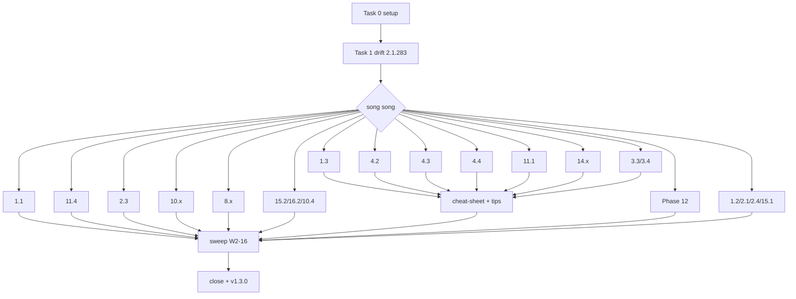

# Audit Remediation — Wave 2 (Tier 2 Update) Implementation Plan

> **For agentic workers:** REQUIRED SUB-SKILL: Use superpowers:subagent-driven-development (recommended) or superpowers:executing-plans to implement this plan task-by-task. Steps use checkbox (`- [ ]`) syntax for tracking.

**Goal:** Đưa ~40 module còn lại (audit §9 Tier 2 #8–22 + Phase 12 rebuild + sweep X1–X6) về trạng thái "verified against Claude Code v2.1.283", EN + VI, để cuối wave mọi module 64/64 có `verified` + `claude_version`, lint bật fail cho frontmatter và word-count > 2200, release v1.3.0.

**Architecture:** Giữ nguyên quy trình 7 bước A–G của Wave 1 (fetch docs → draft EN → chạy lab → paste output → VI → lint/build → reviewer subagent → PR). Mỗi task = một PR độc lập vào `develop`, EN + VI cùng PR. Bước A dùng notes đã fetch ngày 27/09/2026 trong `docs/superpowers/plans/wave2-notes/` (A–E) làm điểm xuất phát và chỉ fetch lại các mục notes đánh dấu NOT FOUND. Task 0 dọn lab; Task 1 vá drift v2.1.283 ở module Wave 1; Task 2–16 là W2-1…W2-15; Task 17 = W2-17 (module mồ côi); Task 18 = W2-16 sweep; Task 19 siết lint + release.

**Tech Stack:** Claude Code **v2.1.283** (máy dev, đã login subscription), Node 22, `gh`, `jq`, Docker (Phase 12, 2.3), Astro/Starlight, `npm run lint:course`, `node --test`.

**Spec:** `docs/superpowers/specs/2026-09-21-course-audit-remediation-design.md` §3.3 (W2-1…W2-16), §4 (DoD), §5 (quy trình), §7 (rủi ro), §8 (tiêu chí toàn đợt), §9.2 (xương sống hai vòng lặp), §9.3 (mapping Anthropic). Audit: `docs/audit/2026-09-21-course-audit.md` §4A–4B, §6, §7 (X1–X16), §9 Tier 2, Phụ lục A. Registry: `docs/references/anthropic-sources.md`. Plan trước: `docs/superpowers/plans/2026-09-21-audit-wave1-tier1-rewrite.md` (quy trình A–G, lab `~/cc-lab`).

## Global Constraints

- **Điều kiện tiên quyết**: Wave 1 đã merge (v1.2.0 trên `develop`, lint 0 error — đo 27/09: `135 files, 0 errors, 1379 warnings`).
- Baseline version: `claude_version: 2.1.283`, `verified: 2026-MM-DD` = ngày chạy lab thật của task. Nếu máy dev lên version mới trước khi task xong: chạy lại DEMO, dùng version mới, ghi vào PR.
- Mọi module chạm tới trong Wave 2: EN **800–1500 từ** (đếm bằng `parse.mjs#countWords`), VI ≤ EN×1.1; tuyệt đối ≤ 2200 (sẽ thành lint **error** ở Task 19).
- Frontmatter bắt buộc: `title`, `description`, `verified`, `claude_version` (sẽ thành lint **error** ở Task 19).
- Mọi lệnh/flag/slash/setting key/env var/hook event phải có trong notes `wave2-notes/*.md` (hoặc notes Wave 1) **kèm URL**, hoặc được fetch lại ở Bước A của task. Không có → không dạy, hoặc `⚠️ Needs verification` kèm lý do.
- Mọi "Expected output" chạy thật (lab `~/cc-lab` hoặc lab riêng của task), dán nguyên văn (được rút gọn bằng `…`), dòng đầu block là `# Output may vary`. Output lấy từ docs (không chạy được, ví dụ GitHub Action) ghi rõ `# Example from docs: <url>`.
- Mọi `claude -p` ghi file/chạy lệnh có `--permission-mode acceptEdits|auto|dontAsk` hoặc `--allowedTools "…"`. `--dangerously-skip-permissions` chỉ xuất hiện kèm câu "only inside a sandbox/container you can throw away".
- **Esc** = interrupt turn, giữ session. **Ctrl+C** = "Interrupt, or clear input" — lần thứ hai thoát (interactive-mode). Course khuyên Esc; không bao giờ dạy Ctrl+C là "emergency stop an toàn".
- **`/context`** = occupancy. **`/usage`** = spend (`/cost` và `/stats` là alias của `/usage`). Không dùng `/cost` làm context gauge.
- Trích dẫn Anthropic: `(S<n>)` + link registry; số liệu nguyên văn + ngày; nếu cần nguồn mới (ví dụ costs page "$13 per developer per active day") → thêm vào registry trong cùng PR.
- Giá model: chỉ 14.4 và cheat-sheet; luôn kèm `⚠️ verify at https://platform.claude.com/docs/en/about-claude/pricing (checked YYYY-MM-DD)`.
- Không nhân vật "Susan" (Task 17/18 đổi tên theo case). Không số liệu hiệu suất không nguồn.
- Branch `feat/audit-w2-<slug>` tách từ `develop` mới nhất — **không** stack PR lên feature branch khác. Commit trailer `Co-Authored-By: Claude Opus 5.5 (1M context) <noreply@anthropic.com>`; PR body kết thúc `🤖 Generated with [Claude Code](https://claude.com/claude-code)`.
- `npm install` luôn `--ignore-scripts`.
- Reviewer subagent ≠ writer; mọi verdict kèm URL docs; verdict không URL = chưa verify.

## Review Focus

Năm loại tình huống người học sẽ gặp mà spec không nói và không test nào của task bắt được — mỗi dòng có bước kiểm tra ở task sở hữu:

1. **Người học dùng loại tài khoản khác máy tác giả** (API key Console / Bedrock / Vertex thay vì subscription): auto mode, `claude setup-token`, `/logout`, fast mode, cache TTL đều khác theo loại tài khoản. Người học kỳ vọng module nói rõ output được chụp với loại tài khoản nào và chỗ nào sẽ khác. → Task 2 (1.1), Task 7 (11.1), Task 9 (14.x): mỗi DEMO có dòng `Tested with: Claude <plan> subscription, v2.1.283` và một hàng PITFALLS "On API key / Bedrock: …"; Bước E grep `Tested with:` ≥ 1.
2. **Người học trên Windows native / WSL**: sandbox không chạy native Windows, phím Option↔Alt, installer khác. Người học kỳ vọng mọi phím tắt có cả hai biến thể và mọi tính năng chỉ-macOS/Linux có ghi chú. → Task 2, Task 10 (2.3), Task 15 (cheat-sheet): Bước E grep `Option+` phải đi kèm `Alt+` trên cùng dòng; 2.3 có câu "Native Windows is not supported".
3. **Người học chạy version cũ hơn 2.1.283** (AGENTS.md cần ≥ 2.1.277, `permission_denials` cần ≥ 2.1.259, auto là mode khởi đầu mọi plan từ 2.1.283, `--agents <file>` cần ≥ 2.1.281). Người học kỳ vọng thấy "requires vX.Y.Z+" ở đúng chỗ thay vì output không khớp. → Task 1, Task 4 (4.2), Task 7: Bước F yêu cầu reviewer liệt kê mọi feature có min-version trong docs và kiểm tra module có ghi.
4. **Headless / CI trên repo không tin cậy** (PR từ fork, thư mục lạ): `claude -p` không có trust dialog, vẫn chạy hook trong `.claude/settings.json` và server trong `.mcp.json` của repo; GitHub Action nhận comment body từ người lạ. Người học kỳ vọng module cảnh báo và chỉ cách chặn (`--bare`, `--strict-mcp-config` ⚠️, `env:` thay vì `${{ }}` trong `run:`). → Task 7 (11.1) PITFALLS + Task 8 (11.4) Bước E grep `\${{ github.event` chỉ xuất hiện trong khối `env:` hoặc trong dòng ❌.
5. **Dữ liệu frontmatter bẩn cho lint mới**: `verified` sai định dạng (`2026-9-3`, `27/09/2026`), ngày tương lai, hoặc thiếu hẳn. Người học/CI kỳ vọng lint báo rõ thay vì crash hoặc im lặng. → Task 19 Step 1 có test cho cả ba trường hợp.

---

## Thay đổi so với spec §3.3 (phát hiện khi fetch lại docs 27/09/2026)

Nguồn: `docs/superpowers/plans/wave2-notes/{A,B,C,D,E}-*.md`. Các task dưới đây đã áp dụng; ghi lại để reviewer không "sửa ngược" theo spec cũ.

| # | Spec/course đang giả định | Docs 27/09 (v2.1.283) | Ảnh hưởng |
|---|---|---|---|
| Δ1 | `auto` là mode khởi đầu chỉ trên Pro/Max/Team (Wave 1 viết vậy ở 2.2:145, 7.1:70,179) | quickstart: "With Claude Code v2.1.283 or later, auto mode is the built-in starting permission mode for interactive terminal sessions"; `-p` vẫn khởi đầu Manual mọi plan | Task 1 vá 2.2, 7.1, 2.5 (nếu có), 1.2 |
| Δ2 | `#` quick-add vào memory (W2-5, W2-14) | Không có trong interactive-mode/memory/commands; `#` không nằm trong bảng Quick Commands | Không dạy `#`. Nếu lab cho thấy vẫn chạy → `⚠️ undocumented` |
| Δ3 | `/pr-comments` (W2-11) | "Removed in v2.1.91. Ask Claude directly to view pull request comments instead." | Dạy prompt + `--from-pr`; `/pr-comments` chỉ trong PITFALLS ❌ |
| Δ4 | `includeCoAuthoredBy` ⚠️ (W2-10, W2-11) | Deprecated từ v2.0.62; dùng `attribution.commit` / `attribution.pr`; trailer mặc định `Co-Authored-By: <model name> <noreply@anthropic.com>`, PR `🤖 Generated with [Claude Code](https://claude.com/claude-code)` | Task 5, 11, 12 |
| Δ5 | "1M premium" (W2-8) | "A 900k-token request is billed at the same per-token rate as a 9k-token request" (4.6+); Sonnet 5 native 1M | 14.4 không có dòng phụ phí 1M |
| Δ6 | `/cost` riêng biệt | `/cost`, `/stats` = alias `/usage`; `/insights` = HTML report | X1 viết lại: `/context` vs `/usage` |
| Δ7 | Background task: BashOutput (audit §4A 3.4) | Không còn BashOutput/KillShell; `run_in_background` + `/tasks` (alias `/bashes`); lệnh hết timeout tự chuyển nền | Task 12 |
| Δ8 | `claude ultrareview` | Không có subcommand; `/code-review ultra` | Task 11 |
| Δ9 | "disable auto-compact" | Không có `DISABLE_AUTO_COMPACT`; có `/autocompact <size>`, `CLAUDE_CODE_AUTO_COMPACT_WINDOW`, `CLAUDE_AUTOCOMPACT_PCT_OVERRIDE` (chỉ hạ được) | Task 3, 13 |
| Δ10 | n8n Execute Command gọi `claude` (12.1) | "isn't available on n8n Cloud"; "disabled by default from n8n 2.0" (`NODES_EXCLUDE`) | Task 16 đổi kiến trúc chính sang HTTP → service |
| Δ11 | Token math "~0.75 word/token" (W2-2) | Không có trên docs page nào đã fetch | Không dạy hệ số; đo bằng `/context` trên file thật |
| Δ12 | `-p` an toàn trong mọi thư mục | "a `-p` session runs the hooks in a project's `.claude/settings.json` and connects the servers in its `.mcp.json`, even in a folder you've never trusted" | Task 7, 8 PITFALLS; 2.1 (Task 17) threat model |
| Δ13 | Ctrl+C không interrupt | interactive-mode: Ctrl+C "Interrupt, or clear input"; lần 2 thoát; Ctrl+D ×2 cũng thoát | Nguyên tắc 4 giữ (khuyên Esc) nhưng không nói "Ctrl+C không dừng được" |
| Δ14 | Không có task cho 1.2, 2.1, 2.4, 15.1 | 4 module này chưa có `verified`; 2.1/2.4 > 2200 từ; 1.2 có Ctrl+C + `/cost` + 28 dòng `claude -p` | Thêm **W2-17** (Task 17) — bắt buộc trước khi bật lint fail |

---

## Quy trình chung cho mỗi task (A–G)

Giữ nguyên Wave 1 (plan Wave 1 §"Quy trình chung"), với các điều chỉnh:

**Bước A — Docs.** Đọc notes `wave2-notes/<file>` liệt kê trong task. Với mọi mục task cần mà notes ghi NOT FOUND/⚠️, fetch lại trực tiếp: `curl -s https://code.claude.com/docs/en/<slug>.md` (endpoint `.md` trả raw, không bị summarizer cắt) và append kết quả vào `wave2-notes/task-<n>-<slug>.md` với URL + quote. Chỉ dùng syntax có trong notes.

**Bước B — Draft EN.** Template 7 block (CLAUDE.md). Mỗi lệnh DEMO có comment `# docs: <slug>`. Metadata block: time / prerequisite / outcome. H1 = `# Module X.Y: Title`.

**Bước C — Chạy lab.** `cd ~/cc-lab` (hoặc lab của task). Interactive: copy text từ terminal, không screenshot. Output dán vào ` ```text ` với dòng đầu `# Output may vary`. Lệnh lỗi → sửa DEMO, không sửa output. Cuối bước: `git -C ~/cc-lab status --short` phải sạch (reset những gì task tạo ra).

**Bước D — Draft VI.** Parallel authoring, cùng số block/exercise/lệnh; thuật ngữ EN; output block dùng chung EN.

**Bước E — Lint + build + grep.**
```bash
npm run lint:course <en-files> <vi-files>
npm run build 2>&1 | tail -3
node /private/tmp/wc.mjs <en-files> <vi-files>   # script ở Task 0 Step 3
```
Expected: 0 error; build `Complete!`; EN ≤ 1500, VI ≤ EN×1.1. Cộng các grep riêng của task (phải ra đúng số ghi trong task).

**Bước F — Reviewer subagent.** Dispatch `oh-my-claudecode:code-reviewer` (model opus) với prompt Wave 1 Bước F, bổ sung ba dòng:
> Also: (a) list every feature in the files that the docs give a minimum version for, and check the module states it; (b) flag any sentence saying a behaviour depends on plan/account type without naming which; (c) confirm no statement contradicts the "Δ" table in `docs/superpowers/plans/2026-09-27-audit-wave2-tier2-update.md`.

Sửa mọi `WRONG`/`NOT FOUND`; lặp F tới khi sạch.

**Bước G — Commit + PR.**
```bash
git checkout develop && git pull --ff-only && git checkout -b feat/audit-w2-<slug>
git add <files>
git commit -m "<type>(<module>): <one line> (audit W2-<n>)

Co-Authored-By: Claude Opus 5.5 (1M context) <noreply@anthropic.com>"
git push -u origin feat/audit-w2-<slug>
gh pr create --base develop --title "<type>(<module>): … (audit W2-<n>)" --body "<docs pages checked (URL list); audit rows closed; Δ rows applied; lint/build/word counts; reviewer table summary>

🤖 Generated with [Claude Code](https://claude.com/claude-code)"
```
Tác giả merge bằng tay; task sau luôn tách lại từ `develop` sau khi pull.

---

### Task 0: Chuẩn bị Wave 2

**Files:**
- Modify: `.gitignore` (thêm `docs/superpowers/plans/wave2-notes/`)
- Create (ngoài repo): `/private/tmp/wc.mjs`; reset `~/cc-lab`

- [ ] **Step 1: gitignore notes**

```bash
cd /Users/luatnq/workspace/shipwithai/claude-code-mastery
printf "\n# Wave 2 docs notes (local only)\ndocs/superpowers/plans/wave2-notes/\n" >> .gitignore
git status --short   # chỉ .gitignore và plan này
```

- [ ] **Step 2: Lab sạch + version**

```bash
cd ~/cc-lab && git status --short && git log --oneline | head -3 && claude --version
ls -a .claude 2>/dev/null
```
Expected: không có thay đổi chưa commit; `2.1.283 (Claude Code)` (hoặc mới hơn — nếu mới hơn, ghi version vào mọi task của wave). Nếu `.claude/` còn file từ Wave 1 (agents, skills, settings) → `git -C ~/cc-lab clean -fdx -e node_modules && git -C ~/cc-lab checkout -- .`.

- [ ] **Step 3: Script đếm từ**

```bash
cat > /private/tmp/wc.mjs <<'EOF'
import fs from 'fs';
import { parseDoc, countWords } from '/Users/luatnq/workspace/shipwithai/claude-code-mastery/scripts/lint-course/parse.mjs';
for (const f of process.argv.slice(2)) {
  const t = fs.readFileSync(f, 'utf8');
  console.log(countWords(parseDoc(t)), /^verified:/m.test(t) ? 'V' : '-', f);
}
EOF
node /private/tmp/wc.mjs src/content/docs/en/claude-code/phase-01-foundation/01-installation.md
```
Expected: `1290 - src/content/docs/en/claude-code/phase-01-foundation/01-installation.md`.

- [ ] **Step 4: Commit plan + gitignore trên branch riêng**

```bash
git checkout -b chore/audit-w2-plan
git add .gitignore docs/superpowers/plans/2026-09-27-audit-wave2-tier2-update.md
git commit -m "docs: wave 2 implementation plan

Co-Authored-By: Claude Opus 5.5 (1M context) <noreply@anthropic.com>"
git push -u origin chore/audit-w2-plan
gh pr create --base develop --title "docs: audit wave 2 plan" --body "Plan for audit Wave 2 (Tier 2 update, v1.3). Notes fetched 2026-09-27 are local-only.

🤖 Generated with [Claude Code](https://claude.com/claude-code)"
```

---

### Task 1 (W2-0): Vá drift v2.1.283 ở module Wave 1

**Files:**
- Modify: `en,vi/…/phase-02-security/02-permission-system.md` (EN :145 vùng quanh)
- Modify: `en,vi/…/phase-07-multi-agent-auto/01-auto-coding-levels.md` (EN :70, :179 vùng quanh)
- Modify (nếu grep trúng): các module Wave 1 khác nói về starting mode
- Branch: `feat/audit-w2-drift-2-1-283`

**Notes:** A (quickstart), C (headless: "`-p` … Manual on every plan"), wave1-notes/task-6-permissions.md.

- [ ] **Step 1: Tìm mọi câu về starting mode**

```bash
grep -rn -i "starting mode\|starting permission\|Pro/Max/Team\|Pro, Max and Team\|Pro, Max, and Team" src/content/docs/{en,vi}/claude-code/
```
Ghi danh sách dòng.

- [ ] **Step 2: Xác nhận trên lab**

```bash
cd ~/cc-lab && claude
```
Trong session: đọc dòng mode indicator ở status area (copy text) → `/exit`. Sau đó `claude -p "Create file drift.txt with hi" ; ls drift.txt` → file **không** được tạo (Manual trong `-p`). Ghi cả hai output vào `wave2-notes/task-1-drift.md`.

- [ ] **Step 3: Sửa nội dung** — mỗi dòng Step 1 viết lại theo Δ1: *"From v2.1.283, interactive sessions start in `auto` on every plan; `claude -p` still starts in Manual. `permissions.defaultMode` overrides both."* Nếu output lab Step 2 ở 2.2/7.1 DEMO khác indicator mới → thay output, cập nhật `verified`/`claude_version: 2.1.283`.
- [ ] **Step 4:** Bước D (VI cùng chỗ), Bước E (grep Step 1 chỉ còn câu mới), Bước F (reviewer chỉ trên các đoạn đã sửa), Bước G `fix(2.2,7.1): starting mode per v2.1.283 (audit W2-0)`.

---

### Task 2 (W2-1): Module 1.1 Installation & Configuration

**Files:**
- Rewrite: `en,vi/…/phase-01-foundation/01-installation.md` (EN 1290 / VI 1535 từ)
- Branch: `feat/audit-w2-install`

**Notes:** A (toàn bộ). Fetch thêm: `https://code.claude.com/docs/en/troubleshoot-install.md` (NOT FOUND trong A).

**Audit rows đóng:** §6 1.1 (9 issue); §4B Install; X3 (`:296` Ctrl+C); X11 Susan (1.1); §4D REAL CASE generic 1.1.

**Contract EN:**
- Frontmatter `title: 'Installation & Configuration'`; ~25 phút; Prerequisite: None; Outcome: *"install Claude Code with the native installer (or Homebrew/WinGet/apt), sign in with a subscription, Console key or cloud provider, and verify the install with `claude doctor` and `/status`"*.
- **WHY**: senior dev làm theo hướng dẫn npm cũ → `EBADENGINE`, PATH hỏng, 2 bản `claude` song song. Không nhân vật Susan.
- **CONCEPT**: bảng 4 kênh cài (native — auto-update nền; Homebrew `--cask` hai cask `claude-code`/`claude-code@latest` — không auto-update; WinGet `Anthropic.ClaudeCode` — không auto-update; apt/dnf/apk repo ký của Anthropic — cập nhật qua system upgrade; npm = "Advanced installation options", Node 22+). Binary tại `~/.local/bin/claude` → `~/.local/share/claude/versions/`. Mermaid: `install → claude (browser login) → /status → claude doctor → first prompt`. Bảng auth: subscription (`/login`), Console (`claude auth login --console`), Bedrock (`CLAUDE_CODE_USE_BEDROCK=1`), Vertex (`CLAUDE_CODE_USE_VERTEX=1` + `CLOUD_ML_REGION` + `ANTHROPIC_VERTEX_PROJECT_ID`), Foundry (`CLAUDE_CODE_USE_FOUNDRY`) + thứ tự ưu tiên 7 mục (quote notes A). Credential lưu: macOS Keychain, Linux/Windows `~/.claude/.credentials.json` mode 0600. Yêu cầu hệ thống nguyên văn. Update: `claude update`, `autoUpdatesChannel` `latest|stable`, `DISABLE_AUTOUPDATER` vs `DISABLE_UPDATES`.
- **DEMO** (chạy thật trên macOS máy dev; Windows/Linux lệnh lấy từ docs, ghi `# docs: setup` — không bịa output):
  1. `which -a claude; claude --version` (phát hiện bản trùng).
  2. `curl -fsSL https://claude.ai/install.sh | bash` — nếu máy dev đã cài native, chạy lại lệnh và dán output thật (idempotent).
  3. `claude doctor` — dán output.
  4. `claude auth status --text` — dán (che email bằng `you@example.com`).
  5. Trong session: `/status` (copy phần Login/Setting sources, che thông tin cá nhân).
  6. `claude update` — dán (`Claude Code is up to date (…)` hoặc thông báo update).
  7. `claude -p "Reply with exactly: INSTALL OK" --output-format json | jq -r .result` → `INSTALL OK`.
  8. IDE/Desktop/web: 3 dòng mỗi thứ theo notes A (VS Code extension bundle CLI riêng — "Installing the extension does not put `claude` on your shell PATH"; JetBrains cần CLI trước, plugin Beta; Desktop tab Code; `claude --cloud "<task>"`) — pointer tới module 1.4 (Wave 3).
- **PRACTICE**: Ex1 = cài trên máy thứ hai/VM theo kênh khác (Homebrew hoặc WinGet) rồi `claude doctor` — Solution có output mẫu từ docs; Ex2 = chuyển từ npm sang native: `npm uninstall -g @anthropic-ai/claude-code` → native → `which -a claude` còn 1 dòng; Ex3 = cấu hình `autoUpdatesChannel: "stable"` trong `~/.claude/settings.json` rồi `/config` kiểm tra. Mỗi Ex có ✅ Solution.
- **CHEAT SHEET**: bảng lệnh cài 3 OS; `claude update|doctor|auth login|logout|status|setup-token`; `/login /logout /status /doctor /exit`; exit = `/exit` hoặc Ctrl+D ×2 (Ctrl+C ×2 cũng thoát).
- **PITFALLS**: ❌ `sudo npm install -g` → ✅ native; ❌ `brew install claude-code` (thiếu `--cask`); ❌ `npm update -g` → ✅ `npm install -g …@latest` (nếu buộc dùng npm); ❌ quên Homebrew/WinGet không auto-update; ❌ `ANTHROPIC_API_KEY` còn trong shell khiến Claude dùng key thay vì subscription (thứ tự ưu tiên); ❌ `claude doctor` vs `/doctor` nhầm vai; ❌ nghĩ extension VS Code cài luôn CLI. Hàng Review Focus #1: "On Bedrock/Vertex `/logout` is unavailable".
- **REAL CASE**: team VN (mobile KMP, 6 dev, máy macOS + Windows) chuẩn hoá cài đặt: native installer + `autoUpdatesChannel: stable` + `claude doctor` trong checklist onboarding. Không số liệu bịa.
- Dòng `Tested with: Claude <plan> subscription, v2.1.283, macOS <ver>` dưới DEMO.

- [ ] **Step 1:** Bước A (notes A + fetch `troubleshoot-install.md`).
- [ ] **Step 2:** Bước B.
- [ ] **Step 3:** Bước C (DEMO 1–7).
- [ ] **Step 4:** Bước D.
- [ ] **Step 5:** Bước E + grep: `grep -c "Susan\|Ctrl+C.*stop\|may or may not exist\|Node 18" <en> <vi>` = 0; `grep -c "Tested with:" <en>` ≥ 1; `grep -n "Option+" <en> <vi>` mỗi dòng có `Alt+`.
- [ ] **Step 6:** Bước F.
- [ ] **Step 7:** Bước G `rewrite(1.1): native installer, auth paths, doctor (audit W2-1)`.

---

### Task 3 (W2-2): Module 1.3 Context Window Basics

**Files:**
- Rewrite: `en,vi/…/phase-01-foundation/03-context-basics.md` (EN 2062 / VI 2601 → ≤1500/1650)
- Branch: `feat/audit-w2-context-basics`

**Notes:** B §5 (context, compaction, 1M), §1 (compaction survival), §6 (sessions), §2 (`@`). E §1 (model aliases).

**Audit rows đóng:** §6 1.3 (9 issue: token math, fake `/cost`, `/read`, "REPL context dies", 3 exercise lặp); §4B Context gauge, Token math; X1, X5, X6 cho 1.3; §4A Fake output 1.3; Susan (1.3). Spec §9.2 (diagram hai vòng lặp đặt tạm ở 1.3 CONCEPT).

**Contract EN:**
- Outcome: *"read `/context`, reference files with `@`, steer compaction with `/compact <instructions>`, and decide between `/compact`, `/clear` and a new session"*.
- **WHY**: giữ WHY cũ (audit "WHY tốt") nhưng bỏ nhân vật; nỗi đau = Claude "quên" quyết định đầu phiên sau auto-compact.
- **CONCEPT**: (1) Context window = mọi thứ model thấy trong một request (system prompt, tools, CLAUDE.md, memory, hội thoại, output tool). (2) **Không** dạy hệ số từ/token (Δ11) — thay bằng "đo trên file thật: `@file` rồi `/context`". (3) Cỡ cửa sổ: Sonnet 5 native 1M, `opus[1m]`, `CLAUDE_CODE_DISABLE_1M_CONTEXT` (quote B §5). (4) Auto-compact mặc định bật, ~967K với native 1M; `/autocompact <size>`; `CLAUDE_AUTOCOMPACT_PCT_OVERRIDE` chỉ hạ ngưỡng; project-root CLAUDE.md được đọc lại sau compact. (5) `/compact <instructions>` vs `/clear` vs session mới (`--continue`/`/resume` — transcript persist 30 ngày; **bỏ** "session chết khi exit"). (6) (S6) *"smallest set of high-signal tokens"*. (7) Diagram hai vòng lặp spec §9.2 (Gather→Act→Verify (S7); Plan→Design→Build→Test→Deploy→Maintain (S3)) với 1 câu: "vòng trong sống trong context window này".
- **DEMO** (lab):
  1. `claude` → `/context` ngay đầu (baseline: system prompt + tools + memory) — dán grid text.
  2. `@src/math.js explain this file` → `/context` lại — thấy tăng.
  3. `/usage` — cho thấy đây là tiền/token đã tính, **không** phải occupancy (X1).
  4. `/compact Keep the decisions about divide() error handling` → dán thông báo thật (hoặc `Not enough messages to compact.` nếu phiên quá ngắn — khi đó thêm 3–4 lượt trước).
  5. `/clear` — không hỏi xác nhận; `/context` về baseline.
  6. Thoát, `claude --continue` → Claude còn nhớ lượt trước (bác bỏ "session dies").
- **PRACTICE**: Ex1 = đo chi phí context của 1 file lớn (`@package-lock.json` trên project thật) bằng `/context`; Ex2 = viết `/compact` instruction cho task refactor dài; Ex3 = quyết định compact/clear/new session cho 4 tình huống (bảng) — ✅ Solution mỗi bài. Xóa 3 exercise lặp cũ.
- **CHEAT SHEET**: `/context`, `/usage` (alias `/cost`), `/compact [instr]`, `/autocompact`, `/clear`, `@file`, `@dir/`, `--continue`, `--resume`, `/resume`, env vars 1M/compact.
- **PITFALLS**: ❌ `/cost` để xem context đầy → ✅ `/context`; ❌ `/read file` → ✅ `@file`; ❌ "compact mỗi 30 phút" → ✅ auto-compact + `/compact <focus>` khi đổi pha; ❌ `DISABLE_AUTO_COMPACT` (không tồn tại); ❌ "exit = mất hội thoại" → ✅ `--continue`; ❌ "1 token ≈ 2 words".
- **REAL CASE**: giữ H3 VI "Tiếng Việt tốn nhiều token hơn" (audit §8 "giữ") nhưng chỉ nói định tính + cách đo bằng `/context`, không số; EN case tương ứng: prompt/tài liệu tiếng Việt trong repo fintech — đo bằng `/context` trước/sau khi chuyển doc dài sang skill (pointer 15.3).

- [ ] **Step 1:** Bước A (notes B, E).
- [ ] **Step 2:** Bước B.
- [ ] **Step 3:** Bước C (DEMO 1–6).
- [ ] **Step 4:** Bước D (VI ≤1650; giữ H3 tiếng Việt).
- [ ] **Step 5:** Bước E + `grep -c "/read \|Susan\|≈ 2 words\|4 chars" <en> <vi>` = 0; `grep -c "/cost" <en> <vi>` chỉ trong câu alias/PITFALLS ❌.
- [ ] **Step 6:** Bước F.
- [ ] **Step 7:** Bước G `rewrite(1.3): /context, @file, compaction (audit W2-2)`.

---

### Task 4 (W2-3): Module 4.2 CLAUDE.md — Project Memory

**Files:**
- Rewrite: `en,vi/…/phase-04-prompt-memory/02-claude-md.md` (EN 1950 / VI 1443)
- Branch: `feat/audit-w2-claude-md`

**Notes:** B §1 (toàn bộ memory), D §6 (managed CLAUDE.md, `claudeMd` key).

**Audit rows đóng:** §6 4.2 (9 issue: hierarchy "override", thiếu managed/`.claude/CLAUDE.md`/`CLAUDE.local.md`/`@imports`/`.claude/rules/`, `claude -p "…/init"`, in file 2 lần); §4B CLAUDE.md hierarchy; §5.8 (rules, imports, local, managed, AGENTS.md, lazy-load); §9.3 dòng CLAUDE.md prune test (S1, S15), Progressive disclosure (S8).

**Contract EN:**
- Outcome: *"write a lean CLAUDE.md with `/init`, split it with `@imports` and `.claude/rules/` (with `paths:`), and verify what loaded with `/memory` and `/context`"*.
- **WHY**: CLAUDE.md 600 dòng → Claude bỏ qua rule quan trọng; (S1) *"Bloated CLAUDE.md files cause Claude to ignore your actual instructions"* (thêm vào registry nếu chưa có quote này).
- **CONCEPT**: bảng vị trí (managed per-OS paths; `~/.claude/CLAUDE.md`; `./CLAUDE.md` hoặc `./.claude/CLAUDE.md`; `./CLAUDE.local.md`); **concatenate, không override** (quote); thứ tự root→cwd, local sau; subdir lazy-load; `@path` import tối đa 4 hop, external import cần approve; `.claude/rules/*.md` + `paths:` (chỉ field `paths` được đọc); `AGENTS.md` (≥ v2.1.277, chỉ khi không có CLAUDE.md, trừ `claude-md-and-agents-md`); `claudeMdExcludes`; mục tiêu < 200 dòng (docs memory + S15). Mermaid: các tầng file → concatenate → context. 3 lớp progressive disclosure (S8): CLAUDE.md (luôn load) → rules có `paths` (khi đọc file khớp) → skills (khi liên quan).
- **DEMO** (lab):
  1. `claude` → `/init` → dán tóm tắt Claude tạo (rút gọn) → `wc -l CLAUDE.md`.
  2. Tạo `.claude/rules/tests.md` với `paths: ["tests/**"]` + 2 rule; `docs/architecture.md` và thêm `@docs/architecture.md` vào CLAUDE.md.
  3. `/memory` → dán danh sách file (copy text).
  4. `/context` → phần "Memory files" liệt kê những gì đã load; đọc `tests/math.test.mjs` rồi `/context` lại → rule `tests.md` xuất hiện.
  5. `CLAUDE.local.md` với 1 dòng cá nhân + kiểm tra `.gitignore`.
  6. Dọn lab: `git -C ~/cc-lab checkout -- . && git -C ~/cc-lab clean -fd`.
- **PRACTICE**: Ex1 = prune test (S1) *"Would removing this cause Claude to make mistakes?"* trên một CLAUDE.md mẫu 120 dòng (cung cấp trong module, ≤ 40 dòng hiển thị, phần còn lại mô tả) → Solution: bản 45 dòng + 2 file rules; Ex2 = monorepo: root + `apps/web/CLAUDE.md` + rule `paths: ["apps/api/**"]`; Ex3 = repo đã có `AGENTS.md` — Claude đọc gì? (Solution theo quy tắc default `claude-md-or-agents-md`). VI Ex2 phải có ✅ Solution (audit §8).
- **CHEAT SHEET**: bảng vị trí file × ai chia sẻ × khi nào load; `/init`, `/memory`, `@path`, `.claude/rules/`, `claudeMdExcludes`, `CLAUDE_CODE_NEW_INIT=1`.
- **PITFALLS**: ❌ "file con override file cha" → ✅ concatenate — mâu thuẫn thì sửa ở gốc; ❌ `claude -p "/init"` (không cần, `/init` interactive); ❌ dán nguyên style guide vào CLAUDE.md → ✅ rules/skill; ❌ tin CLAUDE.md để chặn hành vi → ✅ `permissions.deny`/hook (2.2, 11.3 — nguyên tắc 2); ❌ `#` để thêm memory nhanh (Δ2) → ✅ sửa file hoặc `/memory`.
- **REAL CASE**: giữ 6-section template + tribal-knowledge section (audit "Giữ"), **một lần** (dedupe, file mẫu đầy đủ chuyển sang `templates/claude-md-project-example.md` nếu > 40 dòng, link từ module).

- [ ] **Step 1:** Bước A (notes B §1, D §6).
- [ ] **Step 2:** Nếu cần: tạo `templates/claude-md-project-example.md` từ file mẫu hiện tại (một bản, đã sửa hierarchy); thêm path vào `extraFiles` của `scripts/lint-course.config.json`.
- [ ] **Step 3:** Bước B.
- [ ] **Step 4:** Bước C (DEMO 1–6).
- [ ] **Step 5:** Bước D.
- [ ] **Step 6:** Bước E + `grep -ci "override" <en> <vi>` chỉ trong PITFALLS ❌; `grep -c "claude -p \"/init\|claude -p '/init" <en> <vi>` = 0.
- [ ] **Step 7:** Bước F.
- [ ] **Step 8:** Bước G `rewrite(4.2): concatenate hierarchy, imports, rules (audit W2-3)`.

---

### Task 5 (W2-4): Module 4.3 Slash Commands

**Files:**
- Rewrite: `en,vi/…/phase-04-prompt-memory/03-slash-commands.md` (EN 2223 / VI 2657)
- Branch: `feat/audit-w2-slash-commands`

**Notes:** B §2 (built-in A–P, `.claude/commands/`, frontmatter, `$ARGUMENTS`, `!`), §3 (shortcuts). Fetch lại: `https://code.claude.com/docs/en/commands.md` đầy đủ (B NOT FOUND #3: bảng Q–Z) — lưu `wave2-notes/task-5-commands.md`; file này cũng dùng cho Task 15.

**Audit rows đóng:** §6 4.3 (11 issue: fake output 5 command, `/project:`, thiếu `/agents /hooks /mcp /plugin /login /usage /sandbox /output-style`, không shortcuts, "compact mỗi 30-40 phút"); §5.2 Commands; X1, X5, X6 cho 4.3.

**Contract EN:**
- Outcome: *"find any built-in command with `/`, write a project command in `.claude/commands/` with arguments and a pre-run `!` block, and know when to promote it to a skill"*.
- **CONCEPT**: 3 loại: built-in / custom (`.claude/commands/<name>.md`, `~/.claude/commands/`, subdir → `/subdir:name`) / skill & plugin (15.3). "A file at `.claude/commands/deploy.md` and a skill at `.claude/skills/deploy/SKILL.md` both create `/deploy`" (quote); skill thắng khi trùng. Frontmatter: `description`, `argument-hint`, `allowed-tools`, `model`, `disable-model-invocation`. `$ARGUMENTS`, `$0`/`$1`…, `` !`cmd` `` (lỗi = abort cả lệnh), `@file`. Bảng 12 built-in theo nhóm (session: `/clear /compact /context /resume /rewind`; config: `/model /effort /permissions /config /memory`; extend: `/agents /hooks /mcp /plugin /skills`; account: `/login /usage /status /doctor`) — tên và mô tả lấy từ `task-5-commands.md`.
- **DEMO** (lab):
  1. Gõ `/` → copy 10 dòng đầu danh sách (output thật).
  2. `/help` → dán rút gọn.
  3. Tạo `.claude/commands/review-file.md`: frontmatter `description`, `argument-hint: "<path>"`, `allowed-tools: Read, Bash(git diff *)`; body dùng `$1` và `` !`git diff --stat` ``.
  4. `/review-file src/math.js` → dán phần đầu phản hồi.
  5. Tạo `.claude/commands/frontend/component.md` → hiện là `/frontend:component` trong danh sách.
  6. Dọn lab.
- **PRACTICE**: Ex1 = `/fix-issue <number>` dùng `$1` + `` !`gh issue view $1` `` (Solution nêu `allowed-tools: Bash(gh issue view *)`); Ex2 = chuyển command có file phụ trợ thành skill (pointer 15.3); Ex3 = compact-vs-clear (giữ exercise tốt của module cũ, sửa theo Task 3).
- **CHEAT SHEET**: bảng built-in theo nhóm (≈25 lệnh, mỗi lệnh 1 dòng) + cú pháp custom command + shortcuts liên quan (`/` menu, Tab, `!`, `@`, `?`).
- **PITFALLS**: ❌ `/project:review` → ✅ `/review` hoặc `/subdir:name`; ❌ viết output `/help`, `/cost` bằng tay → ✅ chạy thật; ❌ `!` gọi lệnh có thể fail không `|| true`; ❌ command có side effect không `disable-model-invocation: true`; ❌ `/pr-comments` (Δ3).
- **REAL CASE**: giữ "cheat-sheet names ~90% đúng" tinh thần: team tạo 3 command dùng chung trong repo (`/review-file`, `/release-notes`, `/fix-issue`) commit vào `.claude/commands/`.

- [ ] **Step 1:** Bước A (notes B + fetch `commands.md`).
- [ ] **Step 2:** Bước B.
- [ ] **Step 3:** Bước C.
- [ ] **Step 4:** Bước D (VI 2657 → ≤1650).
- [ ] **Step 5:** Bước E + `grep -c "/project:\|/user:\|30-40 min\|30-40 phút" <en> <vi>` = 0.
- [ ] **Step 6:** Bước F.
- [ ] **Step 7:** Bước G `rewrite(4.3): built-ins 2026, custom commands (audit W2-4)`.

---

### Task 6 (W2-5): Module 4.4 Memory System

**Files:**
- Rewrite: `en,vi/…/phase-04-prompt-memory/04-memory-system.md` (EN 1633 / VI 1956)
- Branch: `feat/audit-w2-memory`

**Notes:** B §1 (auto memory, `/memory`), §4 (checkpointing), §6 (sessions, transcript path, retention). A (credential path cho layout `~/.claude/`).

**Audit rows đóng:** §6 4.4 (8 issue: "stateless between sessions", mâu thuẫn 1.2, `claude config`/`config.json`, `ls ~/.claude/` output sai, "hỏi Claude có memory không"); §4B Memory; §5.3 `/rewind`, sessions; §5.8 auto memory; X4 (một phần); X9; Susan (4.4).

**Contract EN:**
- Outcome: *"explain the four kinds of memory Claude Code keeps — CLAUDE.md, auto memory, session transcripts, checkpoints — resume or fork a past session, rewind a bad turn, and inspect each on disk"*.
- **CONCEPT**: giữ "brain vs scratch paper" và global-vs-project (audit "Giữ") map lên 4 tầng: (1) CLAUDE.md (bạn viết — 4.2); (2) auto memory (Claude viết, `~/.claude/projects/<project>/memory/MEMORY.md` + topic files, 200 dòng/25KB đầu load mỗi phiên, bật mặc định, `autoMemoryEnabled`, `CLAUDE_CODE_DISABLE_AUTO_MEMORY`); (3) transcript (`~/.claude/projects/<project>/<session-id>.jsonl`, 30 ngày, `cleanupPeriodDays`, `--continue`, `--resume`, `/resume`, `--fork-session`, `/branch`, `/rename`, `/export`); (4) checkpoint (mỗi prompt, 100 gần nhất, `/rewind` hoặc Esc Esc, **không** track thay đổi bằng Bash (S15)). Mermaid 4 tầng × ai viết × tồn tại bao lâu.
- **DEMO** (lab):
  1. `ls ~/.claude/` → dán (che tên riêng); `ls ~/.claude/projects | grep cc-lab`.
  2. `claude` → "Remember that this lab uses node:test, never jest" → `/memory` → dán màn hình; `cat ~/.claude/projects/<cc-lab>/memory/MEMORY.md`.
  3. `claude -n memory-demo` → vài lượt → `/exit` → `claude --resume memory-demo` → hỏi lại.
  4. Nhờ Claude sửa `src/math.js` → Esc Esc → menu rewind (copy text các lựa chọn) → "Restore code and conversation" → `git diff` trống.
  5. `/branch try-alt` → dán thông báo 2 session ID.
  6. Dọn lab (xóa memory của cc-lab nếu tạo: xóa đúng thư mục `memory/` của project cc-lab — kiểm tra đường dẫn trước khi `rm`).
- **PRACTICE**: Ex1 = tìm transcript của phiên hôm qua và `/export` ra file; Ex2 = tắt auto memory cho một repo nhạy cảm (`{"autoMemoryEnabled": false}` trong `.claude/settings.json`) và kiểm tra bằng `/memory`; Ex3 = rewind sau khi Claude chạy `rm` qua Bash → chứng minh file **không** quay lại, khôi phục bằng `git restore`. ✅ Solution cả ba.
- **CHEAT SHEET**: bảng 4 tầng; lệnh session; đường dẫn file trên đĩa; settings/env liên quan.
- **PITFALLS**: ❌ "Claude stateless between sessions" → ✅ transcript + auto memory; ❌ `claude config set` / `~/.claude/config.json` → ✅ `settings.json`; ❌ hỏi Claude "bạn nhớ gì" làm bằng chứng → ✅ `/memory`, mở file; ❌ tin `/rewind` hoàn tác `rm` → ✅ git; ❌ commit `CLAUDE.local.md`; ❌ `#` quick-add (Δ2).
- **REAL CASE**: giữ case freelancer 4 client (audit §3) — map: CLAUDE.md per client + auto memory per repo + `claude --resume <name>` per client.

- [ ] **Step 1:** Bước A.
- [ ] **Step 2:** Bước B.
- [ ] **Step 3:** Bước C.
- [ ] **Step 4:** Bước D (VI ≤1650).
- [ ] **Step 5:** Bước E + `grep -ci "stateless\|claude config\|config.json\|Susan" <en> <vi>` = 0 (trừ PITFALLS ❌).
- [ ] **Step 6:** Bước F.
- [ ] **Step 7:** Bước G `rewrite(4.4): four memory layers, resume, rewind (audit W2-5)`.

---

### Task 7 (W2-6): Module 11.1 Headless Mode

**Files:**
- Rewrite: `en,vi/…/phase-11-automation-headless/01-headless-mode.md` (EN 969 / VI 1177; 42–44 dòng `claude -p` thiếu flag)
- Branch: `feat/audit-w2-headless`

**Notes:** C §1–4 (toàn bộ). Fetch lại: `https://code.claude.com/docs/en/cli-reference.md` hàng `--system-prompt`, `--strict-mcp-config`, `--tools`, `--setting-sources` (C NOT FOUND #1).

**Audit rows đóng:** §6 11.1 (6 issue: edit không flag, "Approval: Skipped or auto", `claude -r "auth-work"` ⚠️, thiếu `--json-schema`/`--input-format`/`--bare`/`--agents`/`setup-token`/stream events); §4B Headless ghi file; §5.7; X2 cho 11.1; §9.3 fan-out (S1).

**Contract EN:**
- Outcome: *"run `claude -p` in scripts with explicit permissions, get machine-readable results with `--output-format json` and `--json-schema`, stream events, and authenticate CI with `claude setup-token` or an API key"*.
- **WHY**: script chạy `claude -p "fix lint"` trên CI → im lặng không sửa gì (bị deny) nhưng exit 0.
- **CONCEPT**: câu chủ đạo: **"Non-interactive = pre-authorize or denied"** — quote C: "For `-p`, the built-in starting permission mode is Manual on every plan"; denial hiện trong `permission_denials` (≥ v2.1.259). Thang pre-authorize: `--allowedTools` hẹp (`Bash(git diff *)` — chú ý dấu cách trước `*`) → `--permission-mode acceptEdits|dontAsk|auto` → `--dangerously-skip-permissions` (chỉ sandbox). Output: `text`/`json` (`result`, `session_id`, `total_cost_usd`)/`stream-json` (+ `--verbose`, `--include-partial-messages`; events `system/init`, `assistant`, `user`, `stream_event`, `result`). `--json-schema` → `structured_output`. `--bare` (bỏ hooks/skills/MCP/CLAUDE.md; "recommended mode for scripted and SDK calls"; không đọc `CLAUDE_CODE_OAUTH_TOKEN`). `--max-turns`, `--max-budget-usd`, `--no-session-persistence`, `--continue`/`--resume` với `-p`. Auth CI: `claude setup-token` (1 năm, gắn subscription của người tạo) vs `ANTHROPIC_API_KEY` Console (khuyên cho org). Stdin tối đa 10MB; exit code 0/≠0.
- **DEMO** (lab):
  1. `claude -p "Add a subtract function to src/math.js"` → dán output + `git diff` trống (bị deny).
  2. Cùng lệnh + `--allowedTools "Read,Edit"` → `git diff` có thay đổi. Reset.
  3. `claude -p "List exported functions in src/math.js" --output-format json | jq '{result, session_id, total_cost_usd}'`.
  4. `--json-schema '{"type":"object","properties":{"functions":{"type":"array","items":{"type":"string"}}},"required":["functions"]}'` → `jq .structured_output`.
  5. `--output-format stream-json --verbose | jq -c 'select(.type) | {type, subtype}' | head` → thấy `system/init`, `assistant`, `result`.
  6. Fan-out (S1): `for f in src/*.js; do claude -p "Add JSDoc to $f" --allowedTools "Read,Edit" --max-turns 5; done` — chạy trên 2 file trước ("try on 2-3 files, then scale").
  7. `--bare` với `ANTHROPIC_API_KEY` giả → dán lỗi xác thực thật (chứng minh bare không đọc OAuth); nếu máy dev không có API key → chỉ trích docs, ghi `# Example from docs`.
- **PRACTICE**: Ex1 = script pre-commit gọi `claude -p` read-only review `git diff --cached` (`--allowedTools "Bash(git diff *)"`) và exit 1 nếu `structured_output.blocking == true`; Ex2 = tiếp tục phiên bằng `--resume "$session_id"` lấy từ JSON; Ex3 = giới hạn chi phí `--max-budget-usd 0.50` + `--max-turns 3`. ✅ Solution cả ba.
- **CHEAT SHEET**: bảng flag (giữ bảng cũ phần đúng — audit "Giữ") + cột "needs permission?"; JSON fields; stream event types.
- **PITFALLS**: ❌ `claude -p` sửa file không flag → ✅ `--allowedTools`/`--permission-mode`; ❌ `Bash(git diff*)` (khớp `git diff-index`) → ✅ `Bash(git diff *)`; ❌ parse `result` text bằng regex → ✅ `--json-schema`; ❌ `--bare` + `CLAUDE_CODE_OAUTH_TOKEN`; ❌ chạy `-p` trong repo lạ (Δ12: hook và `.mcp.json` của repo chạy không qua trust dialog) → ✅ `--bare` hoặc review `.claude/` trước; ❌ OAuth token cá nhân làm secret org.
- **REAL CASE**: pipeline nightly của team VN tạo changelog từ `git log` bằng `-p --json-schema`, auth bằng API key workspace riêng; kèm `--max-budget-usd`.
- `Tested with:` dòng dưới DEMO.

- [ ] **Step 1:** Bước A (notes C + fetch cli-reference 4 hàng).
- [ ] **Step 2:** Bước B.
- [ ] **Step 3:** Bước C (DEMO 1–7; reset lab sau mỗi bước ghi file).
- [ ] **Step 4:** Bước D.
- [ ] **Step 5:** Bước E + kiểm tra X2: `grep -n "claude -p" <en> <vi> | grep -v -- "--permission-mode\|--allowedTools\|--dangerously\|--output-format json\|--json-schema\|List\|explain"` → mỗi dòng còn lại là lệnh read-only hoặc dòng ❌ (ghi lý do vào PR); `grep -c "Skipped or auto" <en> <vi>` = 0.
- [ ] **Step 6:** Bước F.
- [ ] **Step 7:** Bước G `rewrite(11.1): pre-authorize or denied, json-schema, stream-json (audit W2-6)`.

---

### Task 8 (W2-7): Module 11.4 GitHub Actions Integration

**Files:**
- Rewrite: `en,vi/…/phase-11-automation-headless/04-github-actions.md` (EN 1180 / VI 940)
- Branch: `feat/audit-w2-gha`
- Lab: repo tạm `cc-lab-gha` trên GitHub (**hỏi tác giả trước khi tạo** — hành động ra ngoài; private repo; xóa sau task nếu tác giả đồng ý)

**Notes:** C §5 (github-actions), §6 (gitlab), §3 (setup-token). Fetch thêm: `https://github.com/anthropics/claude-code-action/blob/main/docs/security.md` (C NOT FOUND #2) và GitHub docs "Security hardening for GitHub Actions — script injections" (`https://docs.github.com/en/actions/security-for-github-actions/security-guides/security-hardening-for-github-actions`) — lưu quote về `env:`.

**Audit rows đóng:** §4A 11.4 (DIY + script injection + `paths`/`paths-ignore`); §6 11.4 (5 issue, "v11.4", "8s" bịa); §5.7 `claude-code-action@v1`, `/install-github-app`, GitLab; §4D bảo mật 11.4.

**Contract EN:**
- Outcome: *"install the Claude GitHub App with `/install-github-app`, run `anthropics/claude-code-action@v1` on `@claude` mentions and on a schedule, and keep secrets and untrusted input out of shell steps"*.
- **CONCEPT**: 2 mode của action — interactive (không `prompt`, chờ `@claude`) / automation (`prompt:` chạy ngay); inputs `prompt`, `claude_args` (ví dụ `--max-turns 5 --model …`), `anthropic_api_key` | `claude_code_oauth_token`, `github_token`, `trigger_phrase`, `settings`, `use_bedrock|use_vertex|use_foundry`; `permissions:` tối thiểu (quote khối docs: `contents`, `pull-requests`, `issues` write; `id-token: write`; `actions: read`); chỉ user có write access trigger được, bot cần `allowed_bots`; commit bằng `GITHUB_TOKEN` mặc định không trigger workflow khác. Diagram: comment `@claude` → workflow → action → Claude Code → commit/PR comment. Bảo mật: không đưa `${{ github.event.comment.body }}` vào `run:` — dùng `env:`; secrets; OIDC cho cloud provider.
- **DEMO** (repo `cc-lab-gha`, nếu tác giả đồng ý; nếu không → output lấy từ docs, ghi `# Example from docs`):
  1. Trong `claude` tại repo: `/install-github-app` → dán các bước màn hình (che org).
  2. `.github/workflows/claude.yml` = khối minimal verbatim từ docs (`actions/checkout@v6`, `anthropics/claude-code-action@v1`).
  3. Mở issue, comment `@claude add a README section about tests` → dán link PR/nhật ký job (rút gọn).
  4. Workflow automation: `on: schedule` + `prompt: "Summarize open issues labelled bug"` + `claude_args: "--max-turns 5"`.
  5. Ví dụ ❌/✅ script injection: step `run: echo "${{ github.event.comment.body }}"` (❌, **không** commit vào repo demo) vs `env: BODY: ${{ github.event.comment.body }}` + `run: echo "$BODY"` (✅).
  6. GitLab: khối `.gitlab-ci.yml` verbatim từ docs + "beta, maintained by GitLab".
- **PRACTICE**: Ex1 = review PR tự động khi `pull_request: [opened, synchronize]` với prompt review + `claude_args: "--max-turns 5"`; Ex2 = sửa workflow cũ có `paths` + `paths-ignore` cùng event (invalid) → chỉ giữ một; Ex3 = migrate từ `@beta` (`direct_prompt` → `prompt`, `custom_instructions` → `--append-system-prompt`). ✅ Solution.
- **CHEAT SHEET**: inputs table; `permissions:` block; trigger matrix; auth options (API key / setup-token / OIDC).
- **PITFALLS**: ❌ `npm i -g` + `claude -p` tự dựng → ✅ action v1; ❌ `${{ }}` trong `run:`; ❌ `paths` + `paths-ignore` cùng event; ❌ commit API key/token; ❌ quên `id-token: write`; ❌ `/install-github-app` trên repo GitLab (in notice rồi thoát); ❌ OAuth token cá nhân cho org.
- **REAL CASE**: giữ GHA cost-control patterns (audit "Giữ") viết lại trên action v1: `--max-turns`, chỉ trigger trên label, concurrency group. Xóa "8s" và "v11.4".

- [ ] **Step 1:** Hỏi tác giả: tạo `cc-lab-gha` (private) để chạy DEMO 1–4? Ghi câu trả lời vào PR.
- [ ] **Step 2:** Bước A (notes C + 2 trang bảo mật).
- [ ] **Step 3:** Bước B.
- [ ] **Step 4:** Bước C.
- [ ] **Step 5:** Bước D (VI 940 → ≥ 800).
- [ ] **Step 6:** Bước E + `grep -n '\${{ github.event' <en> <vi>` → mỗi dòng nằm dưới `env:` hoặc là ví dụ ❌; `grep -c "v11.4\|checkout@v3\|paths-ignore" <en> <vi>` chỉ trong PITFALLS.
- [ ] **Step 7:** Bước F (thêm yêu cầu: reviewer chạy `actionlint` nếu có trên máy cho mọi khối YAML: `brew list actionlint || true`).
- [ ] **Step 8:** Bước G `rewrite(11.4): claude-code-action v1, injection-safe (audit W2-7)`.

---

### Task 9 (W2-8): Modules 14.2 Speed + 14.3 Quality + 14.4 Cost

**Files:**
- Rewrite: `en,vi/…/phase-14-optimization/02-speed-optimization.md`, `03-quality-optimization.mdx`, `04-cost-optimization.md`
- Modify: `docs/references/anthropic-sources.md` (thêm quote costs page "$13 per developer per active day…" vào S15 nếu chưa có)
- Branch: `feat/audit-w2-optimization`

**Notes:** E §1–4, §8 (pricing), §5 (shortcuts), §9 (output styles). wave1-notes/task-1-hooks.md (hooks-as-gate), task-4-phase7.md (subagents, worktree).

**Audit rows đóng:** §6 14.2 (5 issue), 14.3 (2), 14.4 (6); §4B Pricing, Speed/Quality; §5.5 `/fast`, `/effort`, caching; X1 (14.2), X2 (14.2), X16; §9.3 dòng verify (S1, S7), writer≠reviewer (S12), cost ladder (S15), token multiplier (S10, S15), evals (S11).

**Contract 14.2 Speed:**
- CONCEPT: 4 đòn bẩy tốc độ có thật — `/fast` (⚠️ research preview; Opus 5.5/5/4.8; tới 2.5× nhanh, giá cao hơn; `Option+O`/`Alt+O`), `/effort` (thấp hơn = nhanh hơn; mặc định theo model), làm song song (subagents; `--worktree`/`-w`; Ctrl+B đẩy lệnh chạy lâu ra nền + `/tasks`), cắt context (Task 3). Bỏ bảng "model scores" bịa và "Opus chậm".
- DEMO: `/fast` toggle (copy text); `/effort low` vs `high` cho cùng prompt — so thời gian wall bằng `time claude -p … --effort low --allowedTools Read` (chạy thật, dán số thật, `# Output may vary`); `claude -w speed-a` và `claude -w speed-b` song song (2 terminal) — `git worktree list`; Ctrl+B với `npm test -- --watch` ⚠️ (dùng lệnh lab thật).
- PITFALLS: ❌ 3× `claude -p … &` cùng repo (race git, bị deny) → ✅ `-w` + permission flag; ❌ `/cost` làm gauge; ❌ bật fast mode mọi lúc (giá; lần bật đầu tính lại toàn bộ context chưa cache).

**Contract 14.3 Quality:**
- CONCEPT: (S1) *"Give Claude a check it can run"*; (S7) verify = rules / visual / LLM-as-judge; cổng chất lượng deterministic: `PostToolUse` lint hook, `Stop` hook chạy test (11.3); reviewer subagent fresh context (S12 "confident praising"; S3 "The agent that wrote the code has no way to approve it"); `.claude/rules/` cho chuẩn code; output style (`/output-style Explanatory|Learning|Concise|Proactive`); mini-eval (S11: 20–50 task thật, đọc transcript). Bỏ "think step by step" (thinking đã bật — 6.1).
- DEMO: `PostToolUse` hook `npx eslint --fix` (từ 11.3, rút gọn) + `Stop` hook `npm test`; subagent `.claude/agents/reviewer.md` (`tools: Read, Grep, Glob`) → "Use the reviewer subagent on the last diff"; `/output-style` list (copy text).
- PITFALLS: ❌ "think step by step" để tăng chất lượng; ❌ để cùng session tự chấm; ❌ quy chuẩn chỉ trong prompt.

**Contract 14.4 Cost:**
- CONCEPT: số chính thức (S15/costs, nguyên văn + ngày): *"around $13 per developer per active day and $150-250 per developer per month, with costs remaining below $30 per active day for 90% of users"*; agent teams ≈ 7× (S15), agent ~4×/multi-agent ~15× (S10). Bảng giá ⚠️ (Opus 5.5, Opus 5, Sonnet 5, Haiku 4.5, Fable 5.1 — lấy từ E §8, ghi ngày) thay "Opus 5× Sonnet" bịa. Prompt caching tự động (TTL 1h subscription trong hạn mức / 5m API — hành động làm mất cache: đổi model, đổi effort, compact, bật fast mode lần đầu, thêm MCP server). Không phụ phí 1M (Δ5). Subscription vs API: `/usage` (alias `/cost`, `/stats`), `/insights`, `--max-budget-usd`, `opusplan`, OTel pointer (10.5). Cost ladder (S15): `/clear` giữa task → model theo việc → ít MCP → hooks/skills tiền xử lý → CLAUDE.md < 200 dòng → subagent cho việc verbose.
- DEMO: `/usage` (dán, che số tài khoản nếu cần); `claude -p "…" --output-format json --allowedTools Read | jq .total_cost_usd` hai lần liên tiếp cùng prompt → lần hai rẻ hơn nhờ cache (số thật; nếu không rẻ hơn, ghi đúng quan sát); `--max-budget-usd 0.05` với task lớn → dán thông báo dừng; `/model opusplan` (copy text); `/insights` → đường dẫn report.
- PITFALLS: ❌ giá 2024 (Opus $15/$75, Haiku $0.25) → ✅ bảng ⚠️ có ngày; ❌ "1M tốn phụ phí"; ❌ đổi model/effort liên tục giữa phiên (mất cache); ❌ "$1,200→$380" (xóa ở 14.2, 14.4 và tips — Task 15).
- REAL CASE 14.4: team VN dùng `/insights` + `--max-budget-usd` trên CI; không số tiết kiệm bịa.

- [ ] **Step 1:** Bước A (notes E, wave1 notes 1 & 4). Mở pricing page, ghi ngày kiểm tra.
- [ ] **Step 2:** Bước B ×3 (14.2 → 14.3 → 14.4).
- [ ] **Step 3:** Bước C (lab; dọn `.claude/agents/reviewer.md`, hooks, worktree `git -C ~/cc-lab worktree prune`).
- [ ] **Step 4:** Bước D ×3.
- [ ] **Step 5:** Bước E ×3 + `grep -c "\$15/\$75\|0.25/\$1.25\|5× Sonnet\|5x Sonnet\|1,200\|think step by step" <6 files>` = 0 (trừ PITFALLS ❌); `grep -c "⚠️" <14.4 en>` ≥ 1 cạnh bảng giá.
- [ ] **Step 6:** Bước F (một reviewer cho 6 file).
- [ ] **Step 7:** Bước G `rewrite(14.2–14.4): fast/effort, quality gates, real cost model (audit W2-8)` — 3 commit, 1 PR.

---

### Task 10 (W2-9): Module 2.3 Sandbox Environments

**Files:**
- Rewrite: `en,vi/…/phase-02-security/03-sandbox.md` (EN 2548 / VI 3161 → ≤1500/1650)
- Branch: `feat/audit-w2-sandbox`

**Notes:** D §1 (sandboxing), §2 (devcontainer), §3 (security), §10 (web). Fetch lại raw: `curl -s https://raw.githubusercontent.com/anthropics/claude-code/main/.devcontainer/init-firewall.sh` (D NOT FOUND #4) → quote danh sách domain nguyên văn.

**Audit rows đóng:** §6 2.3 (7 issue: container không có Claude Code, REAL CASE mâu thuẫn cwd, "logged to Anthropic"); §4B Sandbox; §5.4 built-in sandbox, devcontainer; X12 (2.3); Susan (2.3); §9.3 layered containment (S13).

**Contract EN (security module — áp CLAUDE.md "SECURITY CONTENT RULES"):**
- Outcome: *"turn on the built-in sandbox with `/sandbox`, restrict Bash filesystem and network access with `sandbox.*` settings, run Claude Code in the official devcontainer with an egress firewall, and verify each control actually blocks"*.
- **CONCEPT**: (S13) containment ở environment layer trước; sandbox = filesystem **và** network (quote D "Effective sandboxing requires both…"). Ba lớp: built-in sandbox (Seatbelt/bubblewrap; macOS/Linux/WSL2; **native Windows không hỗ trợ**; chỉ áp cho Bash/PowerShell/Monitor + process con — Read/Edit/Write đi qua permission system) → devcontainer chính thức (non-root, `init-firewall.sh` default-deny + allowlist) → cloud session (claude.ai/code, VM cô lập). Bảng VERIFIED / RECOMMENDED / ASSUMED RISK (quy tắc security #4). Giới hạn nguyên văn: proxy không inspect TLS, domain fronting, `allowUnixSockets` + docker.sock, `dangerouslyDisableSandbox` retry → chặn bằng `allowUnsandboxedCommands: false`; devcontainer + `--dangerously-skip-permissions` không chặn exfiltrate `~/.claude`. Data handling đúng theo data-usage (commercial không train; 30 ngày) thay overclaim.
- **DEMO** (lab, macOS máy dev):
  1. `/sandbox` → copy tab Mode/Config; chọn Auto-allow.
  2. `.claude/settings.json`: `{"sandbox":{"enabled":true,"allowUnsandboxedCommands":false,"network":{"allowedDomains":["registry.npmjs.org"]},"filesystem":{"denyRead":["~/.ssh"]}}}`.
  3. Nhờ Claude chạy `curl -sI https://example.com` → bị chặn (dán output thật); `npm view left-pad version` → chạy được.
  4. Nhờ Claude chạy `cat ~/.ssh/config` → bị chặn; nhờ Read tool đọc `~/.ssh/config` → đi qua permission prompt (chứng minh sandbox chỉ áp cho Bash).
  5. Devcontainer: clone `.devcontainer/` từ `anthropics/claude-code` vào lab, `devcontainer up` hoặc VS Code "Reopen in Container" (nếu Docker có sẵn) → trong container `curl -sI https://example.com` fail, `curl -sI https://api.github.com` OK (đúng self-test của script). Nếu không có Docker Desktop → chỉ trích docs, ghi `# Example from docs`.
  6. Dọn lab.
- **PRACTICE**: Ex1 = allowlist cho project Android (Gradle/Maven domain) + verify bằng lệnh bị chặn; Ex2 = chặn `~/.aws/credentials` qua `sandbox.credentials.files` hoặc `denyRead` + verify; Ex3 = managed enforcement `{"sandbox":{"enabled":true,"failIfUnavailable":true,"allowUnsandboxedCommands":false}}` (quote D) — Solution giải thích nơi đặt file managed (pointer 10.5).
- **CHEAT SHEET**: `/sandbox`; `sandbox.*` keys (bảng: key → tác dụng → mặc định nếu docs nêu); devcontainer files; "verify" column mỗi dòng.
- **PITFALLS**: ❌ `docker run --network=none` rồi chạy `claude` (không reach API) → ✅ allowlist; ❌ tin sandbox che Read/Edit; ❌ allow `github.com` rộng (fronting); ❌ mount `~/.ssh` vào container; ❌ `allowUnixSockets` docker.sock; ❌ "Anthropic log và train trên code của bạn" (overclaim) → ✅ quote data-usage theo loại tài khoản.
- **REAL CASE**: bỏ Susan; giữ "Docker flag-by-flag / mount table / verification steps" (audit "Giữ") dưới dạng devcontainer; case: team fintech VN chạy agent đêm trong devcontainer, allowlist chỉ npm + api.anthropic.com + GitHub; mô tả blast radius nếu firewall hỏng (quy tắc security #8).

- [ ] **Step 1:** Bước A (notes D + raw init-firewall.sh).
- [ ] **Step 2:** Bước B.
- [ ] **Step 3:** Bước C.
- [ ] **Step 4:** Bước D.
- [ ] **Step 5:** Bước E + `grep -c "network=none\|network none\|Susan\|used in model training" <en> <vi>` = 0 (trừ ❌); `grep -c "Native Windows is not supported\|không hỗ trợ Windows native" <en> <vi>` ≥ 1 mỗi file.
- [ ] **Step 6:** Bước F + "security overclaim check" (như Wave 1 Task 6).
- [ ] **Step 7:** Bước G `rewrite(2.3): built-in sandbox, devcontainer firewall (audit W2-9)`.

---

### Task 11 (W2-10): Phase 10 Team Collaboration (10.1–10.5)

**Files:**
- Update: `en,vi/…/phase-10-team-collaboration/01-team-claude-md.md`, `02-git-conventions.md`, `03-code-review-protocol.md`, `04-knowledge-sharing.md`, `05-governance-policy.md`
- Branch: `feat/audit-w2-team`

**Notes:** D §4–9, §11–13; B §1 (rules, imports); E §7 (attribution, worktrees). 10.4 phụ thuộc Task 14 (W2-13) — làm 10.4 ở Task 14, task này chỉ 10.1/10.2/10.3/10.5.

**Audit rows đóng:** §6 10.1 (3), 10.2 (2), 10.3 (1), 10.5 (4); §5.4 managed settings; §5.10 OTel/ZDR; §5.7 `/code-review`; X7 (10.5); §9.3 writer≠reviewer (S1, S12, S3), AI-native SDLC (S3), Secure SDLC (S4), prune test (S1).

**Contract 10.1 Team CLAUDE.md:** giữ lazy-load monorepo diagram + `CLAUDE.local.md` (audit "Giữ"); thêm managed CLAUDE.md (paths per OS + `claudeMd` key), `.claude/rules/` với `paths:`, `@imports`, `/memory`, `/init`; PITFALLS (S1) prune test + "Bloated CLAUDE.md…" (không lặp nguyên 4.2 — link 4.2). DEMO: repo 2 app, rule scoped `paths`, `/memory` cho thấy file load.

**Contract 10.2 Git Conventions:** CONCEPT (S3) git convention theo artifact (intent.md → spec.md → plan.md + diff → PR). Claude tự `git commit`/`gh pr create`; trailer mặc định `Co-Authored-By: <model> <noreply@anthropic.com>` và PR footer (quote E §7); `attribution.commit`/`attribution.pr`, `attribution: false` (≥ v2.1.281); `includeCoAuthoredBy` deprecated (Δ4). `--worktree` per feature. Giữ atomic-commit drill. DEMO: nhờ Claude commit trong lab → `git log -1` dán trailer thật; đổi `attribution.commit` trong `.claude/settings.json` → commit lại → trailer mới.

**Contract 10.3 Code Review:** giữ author/reviewer protocol; map (S3) *"The agent that wrote the code has no way to approve it"*, (S12) confident praising → reviewer = fresh context: `/code-review` (alias `/review`; `ultra` = cloud multi-agent), `/security-review`, reviewer subagent read-only, claude-code-action trên PR (link 11.4). Human gate ở handoff giữa artifact (spec §9.2). DEMO: `/code-review` trên diff lab → dán tóm tắt; `/security-review` → dán tóm tắt.

**Contract 10.5 Governance:** thesis "governance trên giấy → enforced": managed settings (paths per OS, `managed-settings.d/`, MDM/registry, server-managed; precedence 5 tầng nguyên văn); managed-only keys (`disableBypassPermissionsMode`, `allowManagedPermissionRulesOnly`, `allowManagedHooksOnly`, `allowedMcpServers`/`deniedMcpServers`, `strictKnownMarketplaces`, `forceLoginMethod`/`forceLoginOrgUUID`); OTel (`CLAUDE_CODE_ENABLE_TELEMETRY`, exporter env, prompt bị redact mặc định — ⚠️ tên metric verify raw page); ZDR (Enterprise, bật bởi Anthropic, tắt cloud sessions/Remote Control…); analytics dashboard. Giữ security classification table. REAL CASE (S4): *"single-purpose identity with the minimum permissions"*, *"Every automated approval, tool call, and agent-to-agent message is logged… and lands in our SIEM"*, 80% / 8× nguyên văn + ngày. DEMO: `sudo mkdir -p "/Library/Application Support/ClaudeCode"` + ghi managed-settings.json mẫu (deny `.env`, `disableBypassPermissionsMode: "disable"`) **chỉ khi tác giả đồng ý sửa file hệ thống trên máy dev** → `/status` dòng `Setting sources` + thử `claude --dangerously-skip-permissions` bị chặn → xóa file; nếu không đồng ý → dùng `--settings managed-test.json` để demo precedence và ghi rõ đây không phải managed thật.

- [ ] **Step 1:** Hỏi tác giả về DEMO 10.5 ghi `/Library/Application Support/ClaudeCode/managed-settings.json` (cần sudo, sẽ xóa sau).
- [ ] **Step 2:** Bước A (notes D, B, E; fetch raw `monitoring-usage.md` để chốt tên metric — D NOT FOUND #5).
- [ ] **Step 3:** Bước B ×4 (10.1 → 10.2 → 10.3 → 10.5).
- [ ] **Step 4:** Bước C (lab; xóa managed file nếu tạo, kiểm tra `ls "/Library/Application Support/ClaudeCode"` trống).
- [ ] **Step 5:** Bước D ×4.
- [ ] **Step 6:** Bước E ×4 + `grep -c "includeCoAuthoredBy" <8 files>` chỉ trong câu "deprecated"; `grep -c "pr-comments\|claude ultrareview" <8 files>` = 0 (trừ ❌).
- [ ] **Step 7:** Bước F.
- [ ] **Step 8:** Bước G `rewrite(10.1–10.3,10.5): managed settings, attribution, review gates (audit W2-10)` — 4 commit, 1 PR.

---

### Task 12 (W2-11): Modules 3.3 Git Integration + 3.4 Terminal & Shell

**Files:**
- Rewrite: `en,vi/…/phase-03-core-workflows/03-git-integration.md` (EN 1347 / VI 1593), `04-terminal-shell.md` (EN 2405 / VI 2862)
- Branch: `feat/audit-w2-git-terminal`

**Notes:** E §6 (Bash tool), §7 (git, PR, worktree, attribution), §10 (Bash rule syntax); D §1 (`!` chạy ngoài sandbox).

**Audit rows đóng:** §6 3.3 (5 issue: "advisor", co-author, `/pr-comments`, worktrees, squash interactive), 3.4 (8 issue: `cd` mâu thuẫn, fake background UI, bare `&`, `--only=production`, `node:18`, `docker-compose` v1, timeout, Ctrl+B, `/tasks`, `Bash(...)`); §4A 3.4 Background; §4B Git; X3/X4 (3.x).

**Contract 3.3:** Claude tự commit/PR (quote), dùng `gh`/`glab`; trailer mặc định + `attribution` (link 10.2); đọc PR comment bằng prompt (Δ3) + `claude --from-pr <n>`; `--worktree`/`-w` (`.claude/worktrees/<name>`, cần ≥ 1 commit, `.worktreeinclude`); `/install-github-app` pointer 11.4. Giữ atomic commits + "CLAUDE.md convention hook". Sửa `:365` squash interactive → `git reset --soft` hoặc nhờ Claude soạn message. DEMO: nhờ Claude "commit this with a conventional message" → `git log -1`; "create a PR" trên repo `cc-lab-gha` (nếu Task 8 có) hoặc chỉ `gh pr create --dry-run` ⚠️ (kiểm tra flag tồn tại trước — nếu không có, bỏ bước); `claude -w fix-divide` → `git worktree list`.

**Contract 3.4:** giữ REAL CASE kubectl 2AM + operator cheat sheet (audit "Giữ"). CONCEPT: Bash tool — `cd` **có** giữ giữa các lệnh trong main session nếu vẫn trong project/`--add-dir` (quote E §6), reset kèm `Shell cwd was reset to <dir>`; `CLAUDE_BASH_MAINTAIN_PROJECT_WORKING_DIR=1` để luôn quay về; `export` không giữ; alias/function từ rc file được nạp. Timeout 2 phút mặc định / 10 phút tối đa (`BASH_DEFAULT_TIMEOUT_MS`, `BASH_MAX_TIMEOUT_MS`); hết timeout → tự chuyển nền (trừ `sleep`); output ~30.000 ký tự inline (`BASH_MAX_OUTPUT_LENGTH`). Nền: `run_in_background`, Ctrl+B (tmux: 2 lần), `/tasks` (alias `/bashes`) (Δ7). `!` shell mode — chạy **ngoài** sandbox. Rule `Bash(npm run test *)` ≡ `Bash(npm run test:*)`; khoảng trắng trước `*`; deny `Bash(rm *)` không chặn `/bin/rm` hay `bash -c` (quote — "isn't a security boundary"). DEMO: nhờ Claude `cd src && ls` rồi `pwd` ở lượt sau; `! git status` (shell mode); lệnh `node -e "setTimeout(()=>{},200000)"` → quan sát chuyển nền + `/tasks` (copy text); Ctrl+B trên lệnh `npm test` chạy lâu (lab thêm test `setTimeout` 60s tạm thời, xóa sau).
- Sửa cơ học: `--only=production` → `--omit=dev`, `node:18` → `node:22`, `docker-compose` → `docker compose`, bỏ bare `&`, bỏ UI "⏳ Running in background" bịa.

- [ ] **Step 1:** Bước A (notes E, D §1).
- [ ] **Step 2:** Bước B ×2.
- [ ] **Step 3:** Bước C (dọn worktree + test tạm).
- [ ] **Step 4:** Bước D ×2 (VI 3.4 2862 → ≤1650).
- [ ] **Step 5:** Bước E ×2 + `grep -c "pr-comments\|BashOutput\|KillShell\|docker-compose\|--only=production\|node:18\|Running in background" <4 files>` = 0 (trừ ❌).
- [ ] **Step 6:** Bước F.
- [ ] **Step 7:** Bước G `rewrite(3.3,3.4): Claude commits, worktrees, Bash tool reality (audit W2-11)` — 2 commit.

---

### Task 13 (W2-12): Phase 8 Meta-Debugging (8.1–8.5)

**Files:**
- Update: `en,vi/…/phase-08-meta-debugging/01-hallucination-detection.mdx` (EN 1880 / VI 1149), `02-loop-detection.md`, `03-context-confusion.md`, `04-quality-assessment.md`, `05-emergency-procedures.md`
- Branch: `feat/audit-w2-meta-debugging`

**Notes:** B §3 (Esc, Esc Esc, Ctrl+C), §4 (checkpointing), §5 (`/compact`, `/context`); wave1-notes/task-1-hooks.md, task-4-phase7.md.

**Audit rows đóng:** §6 8.1 (web claim, `findLast`, Ex3, `go get -u`), 8.2 (Ctrl+C, ladder), 8.3 (fake compact, Ex1-2 solution), 8.4 (hooks/subagents/action), 8.5 (`/rewind`, Ctrl+C ×5, CLAUDE.md prevention, `git checkout`); X3, X4, X5, X7 (8.5); spec §4 ngoại lệ "VI 8.1 là chuẩn — EN 8.1 viết lại theo VI"; §9.3 dòng 5 failure pattern (S1), course-correct (S1, S15), writer≠reviewer, long-running harness (S12, S14), evals (S11).

**Contract (mental model giữ nguyên — 3-strike, taxonomy, Quick Scan, STOP→ASSESS→CONTAIN→RECOVER):**
- **8.1**: EN viết lại theo VI (case VNPay `vnpay-nodejs`/`buildPaymentUrl`, ~30 phút, cỡ ~1150–1400 từ); sửa "can't browse web" → Claude có WebFetch/WebSearch và tự chạy `npm view` được — hallucination vẫn xảy ra khi nó **không** kiểm; `Array.findLast()` là thật (ES2023) → đổi ví dụ API bịa khác; `go get -u` → `go list -m -versions <module>`; PITFALLS (S12) early victory; (S14) verifier. Giữ `npm view` → E404 demo thật (chạy lại, dán output).
- **8.2**: 3-strike ↔ (S1) *"If you've corrected Claude more than twice on the same issue… /clear and start fresh"*; ladder: Esc → `/rewind` (Esc Esc) → `/compact <focus>` → `/clear` → session mới; bỏ Ctrl+C `:276`.
- **8.3**: fake compact output → `/compact <focus>` thật + `/context` trước/sau (dán); thêm Solution Ex1–2 (EN); (S1) kitchen-sink session.
- **8.4**: Quick Scan giữ; thêm cổng deterministic (PostToolUse lint, Stop test — link 11.3), reviewer subagent fresh context, claude-code-action review (link 11.4), mini-eval (S11); (S1)(S7) "give Claude a check it can run".
- **8.5**: STOP = **Esc** (không Ctrl+C); ASSESS = `git status`, `git diff`, `/rewind` menu (xem checkpoint); CONTAIN = `/rewind` "Restore code" cho edit của Claude, nhưng **Bash changes không track** (S15) → git; RECOVER = `git restore <file>` (thay `git checkout <file>`), reflog giữ. Prevention: `permissions.deny` + PreToolUse hook thay "NEVER delete" trong CLAUDE.md (nguyên tắc 2).
- DEMO chung chạy trong lab: một phiên cố ý làm sai → Esc → Esc Esc (copy menu) → restore → `git diff` trống; phiên Claude `rm` qua Bash → rewind không cứu → `git restore`.

- [ ] **Step 1:** Bước A.
- [ ] **Step 2:** Bước B ×5 (8.1 dựa trên VI).
- [ ] **Step 3:** Bước C (lab; dọn).
- [ ] **Step 4:** Bước D ×5 (VI 8.1 chỉ sửa kỹ thuật, giữ case; thêm Solution Ex2–3 nếu còn thiếu).
- [ ] **Step 5:** Bước E ×5 + `grep -n "Ctrl+C" <10 files>` chỉ ở ngữ cảnh thoát; `grep -c "can't browse\|không thể duyệt web\|git checkout <file>\|git checkout --" <10 files>` = 0; `grep -c "/rewind" <8.2,8.5 en/vi>` ≥ 1; `grep -c "<details>" <8.1 en> <8.3 en>` ≥ số exercise ×1.
- [ ] **Step 6:** Bước F.
- [ ] **Step 7:** Bước G `update(8.1–8.5): Esc, /rewind, /compact focus, quality gates (audit W2-12)` — 5 commit, 1 PR.

---

### Task 14 (W2-13): Modules 15.2 + 16.2 + 10.4 — slash "templates" thành commands/skills thật

**Files:**
- Update: `en,vi/…/phase-15-templates-skills/02-command-prompt-templates.md` (EN 790), `…/phase-16-real-world-mastery/02-role-workflows.md` (EN 780), `…/phase-10-team-collaboration/04-knowledge-sharing.md` (EN 885)
- Branch: `feat/audit-w2-command-templates`

**Notes:** B §2 (commands), wave1-notes/task-3-skills-plugins.md (skills/plugins), task-4-phase7.md (subagents), E §9 (output styles).

**Audit rows đóng:** §6 15.2 (paste-in `{{code}}`, `/review /test /doc…` không tạo), 16.2 (`/component /api /review /arch /terraform` không cách tạo; thiếu per-role subagents, output styles, `--chrome`), 10.4 (`docs/prompts/*.md` reinvent commands/skills/plugins; "Think carefully prefix"); §4B Slash commands; §9.3 per-team story (S2).

**Contract:**
- **15.2** đổi trục: "Command Templates" = file `.claude/commands/*.md` / skill thật. Mỗi recipe trong module cũ (review, test, doc, refactor…) → một file command hoàn chỉnh (frontmatter `description`, `argument-hint`, `allowed-tools`; `$ARGUMENTS`; `` !`git diff` ``). Giữ prompt recipes dạng prose chỉ khi là prompt một lần. DEMO: tạo 3 command trong lab, gọi thử 1 cái (dán output). Link 4.3, 15.3.
- **16.2** mỗi role 1 bộ: (a) command/skill cụ thể có file, (b) 1 subagent (`.claude/agents/<role>.md` frontmatter theo wave1 notes), (c) output style nếu hợp (`Learning` cho junior), (d) một story có nguồn (S2): Security (TDD, stack-trace ~3×), Data Infra (screenshot ~20 phút outage), Inference (~80% research), Product Design (Figma→code), Legal (non-eng) — số nguyên văn + ngày. `--chrome` chỉ nếu cli-reference xác nhận (⚠️ nếu không).
- **10.4** `docs/prompts/*.md` → `.claude/commands/` + `.claude/skills/` commit trong repo; chia sẻ cross-repo = plugin + marketplace nội bộ (link 15.4/15.5); giữ lessons-learned template; bỏ "Think carefully prefix" (6.1).

- [ ] **Step 1:** Bước A.
- [ ] **Step 2:** Bước B ×3.
- [ ] **Step 3:** Bước C (tạo/gọi command + 1 subagent trong lab; dọn).
- [ ] **Step 4:** Bước D ×3.
- [ ] **Step 5:** Bước E ×3 + `grep -c "{{code}}\|docs/prompts\|Think carefully" <6 files>` = 0 (trừ ❌); mọi `/<name>` trong 16.2 có file định nghĩa trong module: `grep -o "/[a-z-]\+" <16.2 en> | sort -u` đối chiếu tay.
- [ ] **Step 6:** Bước F.
- [ ] **Step 7:** Bước G `rewrite(15.2,16.2,10.4): real commands, skills, role kits (audit W2-13)` — 3 commit.

---

### Task 15 (W2-14): Cheat Sheet + Tips & Tricks

**Files:**
- Rewrite: `en,vi/claude-code/cheat-sheet.mdx` (EN 1389 / VI 1581), `tips-tricks.mdx` (EN 1800 / VI 2045)
- Branch: `feat/audit-w2-cheatsheet`
- **Phụ thuộc:** làm sau khi Task 3, 4, 5, 6, 7, 9, 12 đã merge (cheat-sheet tổng hợp chúng).

**Notes:** `wave2-notes/task-5-commands.md` (bảng A–Z đầy đủ), B §3, E §1/§5/§6, C §2, wave1-notes (permissions, hooks).

**Audit rows đóng:** §6 Cheat sheet/Tips (`/cost` "check context", hierarchy "overrides", model tiers stale, permission table không cơ chế, Ctrl+C, gitleaks; tips stats bịa `:26,44,64,138,192,308`, fake `/cost`, "30/60/80%" vs "50-70%", n8n section lặp); X1, X3, X16.

**Contract:**
- **cheat-sheet** (không bị giới hạn 7 block — lint bỏ qua H2 count; vẫn ≤ 2200 từ): các bảng — Install & auth · CLI flags (~25: `-p -c -r -n --fork-session --permission-mode --allowedTools --disallowedTools --output-format --input-format --json-schema --max-turns --max-budget-usd --bare --agents --append-system-prompt --mcp-config --add-dir --worktree --effort --model --fallback-model --settings --plugin-dir --cloud` — mỗi flag lấy mô tả từ notes C/E) · Slash commands (~30, nhóm như Task 5, từ `task-5-commands.md`) · Shortcuts (Esc, Esc Esc, Shift+Tab, Ctrl+B, Ctrl+O, Ctrl+R, Ctrl+T, Ctrl+G, Ctrl+V, Option/Alt+T, Option/Alt+P, Option/Alt+O, `!`, `@`, `?`, Ctrl+C, Ctrl+D — **không** `#`) · Memory files (concatenate) · Permission rules (cú pháp thật) · Models (alias, không ID cứng; giá → link 14.4) · Context (`/context` vs `/usage`). Xóa bảng gitleaks-git-thuần (thuộc 2.4).
- **tips-tricks**: giữ tips đúng; xóa mọi stat bịa (liệt kê theo audit dòng); thay `/cost` → `/context`; thêm Ctrl+B, `/rewind`, `--worktree`, subagents, `/effort`, `/fast`, auto-compact, `/insights`; bỏ section n8n (link Phase 12); compact threshold thống nhất theo Task 3 (không số % tự đặt).

- [ ] **Step 1:** Kiểm tra phụ thuộc: `gh pr list --state merged --search "audit W2-" --limit 20` có đủ W2-2/3/4/5/6/8/11.
- [ ] **Step 2:** Bước A (đọc lại module đã merge + notes).
- [ ] **Step 3:** Bước B ×2; mỗi lệnh interactive trong bảng đã được chạy ở một module Wave 1/2 — nếu chưa, chạy trong lab.
- [ ] **Step 4:** Bước D ×2.
- [ ] **Step 5:** Bước E + `grep -c "35%\|12%\|\$8 and 45\|40-60%\|200+ files\|1,200" <4 files>` = 0; `grep -n "/cost" <4 files>` chỉ trong dòng alias; `grep -n "| \`#\`" <4 files>` = 0; `grep -n "Option+" <4 files>` đều có `Alt+`.
- [ ] **Step 6:** Bước F (reviewer đối chiếu **mọi** hàng bảng với URL).
- [ ] **Step 7:** Bước G `rewrite(cheat-sheet,tips): 2026 commands, flags, shortcuts (audit W2-14)`.

---

### Task 16 (W2-15): Phase 12 rebuild — n8n + Claude Code

**Files:**
- Rewrite: `en,vi/…/phase-12-n8n-workflows/01-claude-code-n8n.md`, `02-workflow-patterns.md`, `03-n8n-sdk-orchestration.md` (có thể đổi `title`; giữ slug file để không vỡ link)
- Lab: `~/cc-lab-n8n/` (Docker compose: n8n + service Agent SDK)
- Branch: `feat/audit-w2-n8n`

**Notes:** C Part 2 (n8n), C §3–4 (setup-token, SDK), wave1-notes/task-2-agent-sdk.md. Fetch lại (C NOT FOUND #3–8): README image Docker `github.com/n8n-io/n8n/tree/master/docker/images/n8n` (base OS), trang `block-specific-nodes` (cú pháp `NODES_EXCLUDE`), Code node `$input.all()` URL hiện tại, dropdown model của Anthropic Chat Model node, nhãn Merge "Position".

**Audit rows đóng:** §4D Phase 12 lệch chủ đề; §6 Phase 12 (12.1: image không có `claude`, Execute Command disabled/Cloud, không permission flag, `/usr/local/bin/claude`, `$json.subject` inconsistent, "400+ integrations"; 12.2: node names cũ, fence không lang; 12.3: Messages API, `require()`, model ID cũ); §4B n8n; audit §9 Tier 3 #28 (quyết định: **rebuild**, không cắt).

**Kiến trúc được dạy (Δ10):**
```mermaid
graph LR
    T[n8n Trigger<br/>webhook / schedule] --> H[HTTP Request node]
    H --> S[agent-service<br/>Agent SDK query()]
    S --> R[(repo volume)]
    S --> H2[JSON result]
    H2 --> N[n8n: Slack / Email / GitHub nodes]
```
- **12.1 Claude Code + n8n**: hai cách gọi — (A) **khuyên dùng**: n8n HTTP Request → service nhỏ chạy Agent SDK (`@anthropic-ai/claude-agent-sdk`, `allowedTools` hẹp, `permissionMode: 'acceptEdits'` chỉ khi cần, `maxTurns`) trong container riêng; (B) self-host n8n với Execute Command (bật lại qua `NODES_EXCLUDE`, không có trên Cloud, disabled mặc định từ 2.0) + image mở rộng có `claude` (native installer, `~/.local/bin/claude`) + `CLAUDE_CODE_OAUTH_TOKEN` hoặc `ANTHROPIC_API_KEY` + `claude -p … --allowedTools … --output-format json` — kèm cảnh báo bảo mật (node chạy shell với quyền n8n). DEMO chạy thật: `docker compose up` (n8n + agent-service), workflow webhook → HTTP Request → service → trả JSON; dán output `curl` tới webhook.
- **12.2 Workflow patterns**: 3–4 pattern trên kiến trúc (A): fan-out Loop Over Items (batch size 1) → service; Merge (Combine → Position ⚠️ nhãn theo docs); Code node `$input.all()` gom kết quả; error branch + retry; human-approval (Wait node ⚠️ verify tên). Node names 2026 theo notes C. Fence có language.
- **12.3 n8n + SDK orchestration**: thay Messages API trong Code node bằng: (1) agent-service Agent SDK (hooks trong code, `settingSources`, session resume bằng `session_id`); (2) khi nào dùng n8n native **AI Agent** node + **Anthropic Chat Model** node (chat/tool-calling không cần filesystem) vs Claude Code (cần repo, tool Bash/Edit). Model: alias, không ID cứng (theo dropdown đã verify). `description:` frontmatter có.

- [ ] **Step 1:** Bước A (notes C + 5 fetch còn thiếu). Ghi phiên bản n8n dùng trong lab (`docker run --rm n8nio/n8n --version`).
- [ ] **Step 2:** Dựng lab `~/cc-lab-n8n`: `compose.yaml` (n8n + agent-service Node 22 + volume repo `~/cc-lab`), `agent-service/server.mjs` (~40 dòng: POST `/run` → `query()` với `allowedTools: ['Read','Grep','Glob']`, trả `{result, session_id, total_cost_usd}`). Chạy `curl -s localhost:<port>/run -d '{"prompt":"List exported functions in src/math.js"}'` → JSON.
- [ ] **Step 3:** Bước B ×3 (12.1 → 12.2 → 12.3); code service và compose in trong module đúng như lab.
- [ ] **Step 4:** Bước C (workflow n8n import/export JSON — dán phần JSON rút gọn của workflow trong module ở fence `json`).
- [ ] **Step 5:** Bước D ×3.
- [ ] **Step 6:** Bước E ×3 + `grep -c "Split In Batches\|/usr/local/bin/claude\|claude-sonnet-4\|\$items()\|400+ integrations\|require(" <6 files>` = 0 (trừ ❌); mọi `claude -p` có permission flag.
- [ ] **Step 7:** Bước F (reviewer đối chiếu thêm docs.n8n.io cho node names).
- [ ] **Step 8:** Bước G `rebuild(12.1–12.3): n8n → Agent SDK service (audit W2-15)` — 3 commit. Dọn: `docker compose -f ~/cc-lab-n8n/compose.yaml down -v`.

---

### Task 17 (W2-17): Modules còn sót — 1.2, 2.1, 2.4, 15.1

**Files:**
- Update: `en,vi/…/phase-01-foundation/02-interfaces-modes.md` (EN 1718, 28 dòng `claude -p`), `…/phase-02-security/01-threat-model.md` (EN 2636 / VI 3282), `…/phase-02-security/04-secret-management.md` (EN 2532 / VI 3150), `…/phase-15-templates-skills/01-claude-md-templates.md` (EN 899)
- Branch: `feat/audit-w2-leftovers`

**Notes:** A, C (headless cho 1.2), D §1/§3/§8 (2.1, 2.4), B §1 (15.1). Fetch: `https://github.com/gitleaks/gitleaks` README (lệnh `gitleaks git --pre-commit --staged`, `gitleaks dir`).

**Lý do (Δ14):** không thuộc task W2 nào trong spec, nhưng thiếu `verified` và/hoặc > 2200 từ → chặn Task 19. **Phạm vi hẹp**: không tái cấu trúc (1.2 sẽ tái cấu trúc ở W3-1); chỉ sửa mechanics sai + cắt độ dài + frontmatter.

**Contract:**
- **1.2**: X1 (`/cost` → `/usage`/`/context`), X2 (mọi `claude -p` ghi file có flag; bảng `-p` bỏ ⚠️ vì là core), X3 (Ctrl+C → Esc), `Option+P`/`Option+T` xác nhận (B §3) + `Alt+`; starting mode theo Δ1; giữ session resume, decision flowchart, KMP case. ≤1500 từ.
- **2.1**: cắt 2636 → ≤1500 (VI ≤1650): giữ access rings, blast-radius, files-at-risk, fake-key discipline; bỏ "permission system may exist" (link 2.2), `.claudeignore` (đã blacklist), "Wait — that's wrong"; thêm **Bash-tool vs file-tool** (X13: Read trong cwd không prompt, ngoài cwd có prompt; sandbox chỉ áp Bash — quote D §1/§3); prompt injection qua WebFetch/MCP/plugins (WebFetch dùng context riêng — quote); Δ12 (`-p` trong repo lạ chạy hook/.mcp.json); (S13) layered containment. Susan → đổi tên theo case.
- **2.4**: cắt 2532 → ≤1500: giữ leak chain, 4 layer, `.env.example`, hook gitleaks, rotation table (audit "module tốt nhất Phase 2"); gitleaks lệnh mới; `git filter-repo`; `permissions.deny: ["Read(./.env)"]` + `sandbox.credentials` thay `.claudeignore`; bỏ training overclaim (quote data-usage); REAL CASE (S4) *"single-purpose identity with the minimum permissions"*. Susan/Tùng → tên theo case.
- **15.1**: thêm `@imports`, `.claude/rules/` `paths:`, < 200 dòng (S15); "Next.js 14" → version hiện tại ⚠️ hoặc bỏ version; fence có lang.
- Tất cả: `verified`, `claude_version: 2.1.283`; mọi output mới chạy thật.

- [ ] **Step 1:** Bước A.
- [ ] **Step 2:** Bước B ×4 (bắt đầu 2.1, 2.4 — nặng nhất).
- [ ] **Step 3:** Bước C (1.2 demo `-p`; 2.1 demo Read ngoài cwd → prompt; 2.4 demo deny `.env` + gitleaks pre-commit trong lab — cần `brew install gitleaks`, hỏi tác giả nếu chưa có).
- [ ] **Step 4:** Bước D ×4.
- [ ] **Step 5:** Bước E ×4 + `grep -c "Susan\|Tùng\|Wait — that's wrong\|may exist" <8 files>` = 0; word count EN ≤1500 cả 4.
- [ ] **Step 6:** Bước F (+ security overclaim check cho 2.1/2.4).
- [ ] **Step 7:** Bước G `update(1.2,2.1,2.4,15.1): mechanics + length, verified (audit W2-17)` — 4 commit.

---

### Task 18 (W2-16): Sweep cross-cutting X1–X6 (chạy cuối, trước Task 19)

**Files (EN + VI, 16 module):**
- `phase-03-core-workflows/01-reading-codebases.md` (EN 2021 → ≤1500), `02-writing-code.mdx`
- `phase-04-prompt-memory/01-prompting-techniques.md`
- `phase-05-context-mastery/01-controlling-context.md`, `02-context-optimization.md`, `03-image-context.md` (EN 2064 → ≤1500)
- `phase-09-legacy-brownfield/01…04`
- `phase-13-data-analysis/01…03`
- `phase-14-optimization/01-task-optimization.md`
- `phase-16-real-world-mastery/01-case-studies.md`, `03-teaching-workshop.md`
- Branch: `feat/audit-w2-sweep` (có thể tách 2 PR: `-sweep-a` Phase 3–5, `-sweep-b` Phase 9/13/14/16 — mỗi PR vẫn EN+VI)

**Notes:** B, C, E (tổng hợp); module đã merge ở Task 2–17 là chuẩn tham chiếu (link tới thay vì dạy lại).

**Audit rows đóng:** §6 các dòng 3.1, 3.2, 4.1, 5.1–5.3, 9.1–9.4, 13.1–13.3, 14.1, 16.1, 16.3; X1, X2, X4, X5, X6, X11, X15, X16 trên các file này; §9.3 dòng Explore→Plan (3.1 WHY, 14.1 CHEAT SHEET), verify (9.3 WHY, 3.2 DEMO), context engineering (5.1, 5.2, 3.1), interview→SPEC (4.1 PRACTICE), 5 failure pattern (5.1, 16.3), long-running harness (9.3), per-team (5.3, 9.3, 13.3), AI-native SDLC (16.1 case #1 = Anthropic), evals (16.3), fan-out (9.2), cost ladder (5.2).

**Checklist áp cho mỗi file (một commit/file cặp EN+VI):**

| # | Kiểm tra | Cách sửa |
|---|---|---|
| X1 | `/cost` dùng để xem context | `/context`; spend = `/usage` |
| X2 | `claude -p` ghi file/chạy lệnh không flag | thêm `--allowedTools`/`--permission-mode` |
| X3 | Ctrl+C = dừng khẩn cấp | Esc |
| X4 | Không có `/rewind` nơi audit nêu (3.2, 9.2, 14.1) | 1–2 câu + link 8.5 |
| X5 | "compact mỗi N phút", không `/compact <focus>` | auto-compact + `/compact <focus>` (link 1.3) |
| X6 | Không `@file` (3.1, 4.1) | `@path`, `@dir/` |
| X16 | Số liệu bịa (4.1:358-366 metrics, 5.2 REAL CASE "95% vs 60%", 5.3 "4K = 3000+ tokens", fake image tokens) | xóa hoặc thay bằng số (S#) nguyên văn |
| — | Output viết tay (5.1 `/cost`, 5.2, 5.3 image tokens) | chạy lại trong lab, dán thật |
| — | Susan (3.1, 3.2) | tên theo case |
| — | "55 modules" (16.1, 16.3) | "64 modules" |
| — | Fix riêng: 3.1 Fastify "tap" → `node:test`; 3.1 dùng Explore subagent thay "đọc signature tay" (S6); 5.3 Claude tự screenshot (Chrome/Playwright MCP — link 11.5) + REAL CASE (S2) Data Infra outage; 9.3 `npm test -- file.js` + "fix the TEST" có nguồn (S12); 9.4 Express 5 + `npm audit`, `--output-format json`; 13.1 `--add-dir`, Read offset/limit, output Bash ~30K; 13.2 `claude -p … Save to reports/` + flag (document skills → pointer W3-4); 13.3 `tail -n 10000 app.log \| claude -p` + Ctrl+B; 14.1 plan mode, `/rewind`, subagents, (S1) "describe the diff in one sentence → skip the plan"; 16.1 case #1 = Anthropic (S3, S4, số nguyên văn + ngày), bỏ "100% real examples"; 16.3 logistics workshop (`claude doctor`, `-w` per attendee, `--permission-mode` cho demo, eval nhỏ (S11)) | như cột trái |
| — | Frontmatter | `verified`, `claude_version: 2.1.283` sau khi chạy lại mọi output trong file |

- [ ] **Step 1:** Liệt kê vi phạm tự động làm baseline cho PR:

```bash
F=$(ls src/content/docs/{en,vi}/claude-code/phase-0{3,4,5,9}-*/*.md* src/content/docs/{en,vi}/claude-code/phase-1{3,4,6}-*/*.md* | grep -v "03-git\|04-terminal\|02-claude-md\|03-slash\|04-memory\|02-speed\|03-quality\|04-cost\|02-role")
grep -n "/cost\|Ctrl+C\|Susan\|55 modules\|/read \|compact every\|compact mỗi" $F > /private/tmp/sweep-before.txt
grep -n "claude -p" $F | grep -v -- "--permission-mode\|--allowedTools\|--dangerously" >> /private/tmp/sweep-before.txt
wc -l /private/tmp/sweep-before.txt
```

- [ ] **Step 2:** Với từng file (thứ tự bảng Files): áp checklist; chạy lại output trong lab; Bước D (VI cùng lúc); Bước E cho cặp file; commit `sweep(<module>): X1–X6 (audit W2-16)`.
- [ ] **Step 3:** Chạy lại lệnh Step 1 → mỗi dòng còn lại có lý do (dòng ❌, lệnh read-only) ghi trong PR.
- [ ] **Step 4:** Bước F (reviewer chia 2: Phase 3–5; Phase 9/13/14/16).
- [ ] **Step 5:** Bước G (1 hoặc 2 PR).

---

### Task 19: Đóng Wave 2 — siết lint, release v1.3.0

**Files:**
- Modify: `scripts/lint-course/checks.mjs` (thêm check `verified-date`)
- Modify: `scripts/lint-course/checks.test.mjs`
- Modify: `scripts/lint-course.config.json` (`recommendedLevel: "error"`, `words.maxLevel: "error"`, `verified.maxAgeDays: 90`)
- Modify: `scripts/lint-course.baseline.json` (regenerate), `package.json` (`1.3.0`), `README.md` (baseline line), `docs/audit/2026-09-21-course-audit.md` (Status), `CLAUDE.md` + `CLAUDE.vi.md` (bỏ "warn tới hết Wave 2" nếu có ghi)
- Branch: `chore/audit-w2-close`

**Interfaces:**
- Consumes: `checkDoc(doc, { relPath, config, isModule, checkFrontmatter })` và `doc.frontmatter.fields` (`scripts/lint-course/parse.mjs`).
- Produces: `checkDoc(doc, { …, today })` — `today: Date` (mặc định `new Date()`); rule mới `verified-date` với level `error` (định dạng sai hoặc ngày tương lai) và `config.verified.staleLevel` (quá `maxAgeDays`).

- [ ] **Step 1: Viết test thất bại** — sửa `scripts/lint-course/checks.test.mjs`:

Đổi helper `run` để cố định ngày:
```js
const TODAY = new Date('2026-12-01T00:00:00Z');
const run = (body, opts = {}) =>
  checkDoc(parseDoc(fm + body), { relPath: 'en/claude-code/phase-01-foundation/01-x.md', config, isModule: true, today: TODAY, ...opts });
```
Đổi test cũ thành error (sau khi config đổi):
```js
test('frontmatter: missing description and verified are both errors', () => {
  const doc = parseDoc(`---\ntitle: T\n---\n# T\n\n${seven}\n`);
  const issues = checkDoc(doc, { relPath: 'x', config, isModule: true, today: TODAY });
  assert.ok(issues.some((i) => i.rule === 'frontmatter-required' && i.level === 'error'));
  assert.ok(issues.some((i) => i.rule === 'frontmatter-recommended' && i.level === 'error'));
});
```
Thêm:
```js
const withVerified = (v) =>
  parseDoc(`---\ntitle: T\ndescription: D\nverified: ${v}\nclaude_version: 2.1.283\n---\n# T\n\n${seven}\n`);
const vIssues = (v, today = TODAY) =>
  checkDoc(withVerified(v), { relPath: 'x', config, isModule: true, today }).filter((i) => i.rule === 'verified-date');

test('verified-date: fresh date has no issue', () => {
  assert.deepEqual(vIssues('2026-11-20'), []);
});

test('verified-date: older than maxAgeDays is stale at configured level', () => {
  const issues = vIssues('2026-08-01');
  assert.equal(issues.length, 1);
  assert.equal(issues[0].level, config.verified.staleLevel);
  assert.match(issues[0].message, /122 ngày/);
});

test('verified-date: malformed values are errors', () => {
  for (const v of ['2026-9-3', '27/09/2026', 'yesterday', '2026-13-45']) {
    const issues = vIssues(v);
    assert.equal(issues.length, 1, v);
    assert.equal(issues[0].level, 'error', v);
  }
});

test('verified-date: future date is an error', () => {
  const issues = vIssues('2027-01-01');
  assert.equal(issues.length, 1);
  assert.equal(issues[0].level, 'error');
  assert.match(issues[0].message, /tương lai/);
});

test('verified-date: quoted YAML value is accepted', () => {
  assert.deepEqual(vIssues("'2026-11-20'"), []);
});

test('words-max is an error once maxLevel is error', () => {
  const long = Array.from({ length: 2300 }, () => 'word').join(' ');
  const issues = run(`# T\n\n${seven}\n\n${long}\n`);
  assert.ok(issues.some((i) => i.rule === 'words-max' && i.level === 'error'));
});
```

- [ ] **Step 2: Chạy test, xác nhận fail**

Run: `node --test scripts/lint-course/checks.test.mjs`
Expected: FAIL — `verified-date` tests (rule chưa tồn tại), `frontmatter-recommended` level `warn` ≠ `error`, `words-max` level `warn`, `config.verified` undefined.

- [ ] **Step 3: Implement**

`scripts/lint-course.config.json` — sửa/ thêm:
```json
  "words": { "warn": 1500, "max": 2200, "maxLevel": "error" },
  "frontmatter": {
    "required": ["title", "description"],
    "recommended": ["verified", "claude_version"],
    "recommendedLevel": "error"
  },
  "verified": { "maxAgeDays": 90, "staleLevel": "warn" },
```

`scripts/lint-course/checks.mjs` — đổi chữ ký và thêm check **bên trong** khối `if (checkFrontmatter) { … }`, sau vòng lặp `recommended` (templates/ không có frontmatter nên bỏ qua):
```js
export function checkDoc(doc, { relPath, config, isModule, checkFrontmatter = true, today = new Date() }) {
```
```js
    const rawVerified = doc.frontmatter.fields.verified;
    if (rawVerified !== undefined && config.verified) checkVerified(rawVerified.replace(/^['"]|['"]$/g, ''));
```
và hàm lồng (cạnh `checkBlacklist`):
```js
  function checkVerified(v) {
    const m = v.match(/^(\d{4})-(\d{2})-(\d{2})$/);
    const d = m && new Date(Date.UTC(+m[1], +m[2] - 1, +m[3]));
    if (!d || d.getUTCMonth() !== +m[2] - 1 || d.getUTCDate() !== +m[3]) {
      push('error', 'verified-date', 1, `\`verified: ${v}\` không đúng định dạng YYYY-MM-DD`);
      return;
    }
    const days = Math.floor((today.getTime() - d.getTime()) / 86400000);
    if (days < 0) push('error', 'verified-date', 1, `\`verified: ${v}\` ở tương lai`);
    else if (days > config.verified.maxAgeDays)
      push(config.verified.staleLevel, 'verified-date', 1, `\`verified: ${v}\` đã ${days} ngày (> ${config.verified.maxAgeDays}) — chạy lại DEMO`);
  }
```
(2026-12-01 − 2026-08-01 = 122 ngày.)

- [ ] **Step 4: Chạy test, xác nhận pass**

Run: `npm test`
Expected: tất cả PASS (gồm test cũ của parse/pairs/baseline/fix và `src/lib/*.test.mjs`).

- [ ] **Step 5: Lint toàn repo với rule mới**

Run: `npm run lint:course 2>&1 | grep -E "error|files," | tail -20`
Expected: `135 files, 0 errors, N warnings`. Nếu có `frontmatter-recommended`/`words-max` error → module đó chưa qua Task 1–18: quay lại task sở hữu, **không** hạ level.

- [ ] **Step 6: Baseline + commit lint**

```bash
npm run lint:course:baseline
git add scripts/lint-course.config.json scripts/lint-course/checks.mjs scripts/lint-course/checks.test.mjs scripts/lint-course.baseline.json
git commit -m "chore(lint): frontmatter and word-count become errors; verified-date check

Co-Authored-By: Claude Opus 5.5 (1M context) <noreply@anthropic.com>"
```

- [ ] **Step 7: Status + version**

Thêm vào `docs/audit/2026-09-21-course-audit.md` ngay dưới Status hiện có:
```markdown
> **Status 2026-MM-DD**: Wave 2 (v1.3.0) đã merge — §9 Tier 2 #8–22, Phase 12 rebuild (#28 = rebuild), X1–X6/X11/X15/X16 trên toàn course. 64/64 module có `verified` + `claude_version` (baseline v2.1.283). Còn lại: Wave 3 (Tier 3 #23–27).
```
`package.json` → `"version": "1.3.0"`; README baseline → *"Verified against Claude Code v2.1.283 (2026-MM) — Tier 1 + Tier 2 complete; see docs/audit/"*. Grep CLAUDE.md/CLAUDE.vi.md cho "Wave 2" và cập nhật câu nói về mức warn.

- [ ] **Step 8: Verify toàn bộ**

```bash
npm test && npm run lint:course | tail -2 && npm run build 2>&1 | tail -3
node /private/tmp/wc.mjs src/content/docs/{en,vi}/claude-code/phase-*/*.md* | grep -c " - "
```
Expected: test pass; `0 errors`; build xanh; lệnh cuối in `0` (không module nào thiếu `verified`).

- [ ] **Step 9: PR + release**

`gh pr create --base develop --title "chore: v1.3.0 — audit wave 2 complete"`. Sau khi tác giả merge: release theo flow protected main — PR `develop → main`, **tag `v1.3.0` chỉ sau khi PR main merge và tác giả xác nhận**, không push thẳng `main`.

- [ ] **Step 10:** Mở plan Wave 3 bằng skill writing-plans từ spec §3.4 — fetch lại docs trước (notes mới `wave3-notes/`).

---

## Thứ tự thực thi & song song



- Các task trong nhánh song song không chạm cùng file (đã kiểm: 10.4 chỉ ở Task 14; 1.2 chỉ ở Task 1 (dòng starting mode) và Task 17 — làm Task 1 trước).
- Mỗi PR tách từ `develop` mới nhất sau khi pull; không stack.
- Ước lượng: Task 9, 11, 13, 16, 17, 18 là lớn nhất (≥ 3 module hoặc lab riêng).

---

## Self-review

- **Spec coverage:** §3.3 W2-1…W2-15 → Task 2–16; W2-16 → Task 18 (cuối); spec §4 DoD → Global Constraints + Bước E/F; §5 → quy trình A–G; §6 git → Bước G + Task 19 Step 9; §7 rủi ro "lint warn nếu verified > 90 ngày (bật sau Wave 2)" → Task 19 `verified-date`; spec §3.1 "Word count > 2200 warn tới hết Wave 2" + "Frontmatter warn → fail khi Wave 2 xong" → Task 19; §8 "64/64 verified" (68 sau Wave 3) → Task 17 + Task 18 + Task 19 Step 8; §9.2 diagram tạm ở 1.3 → Task 3 CONCEPT; §9.3 mọi dòng có wave W2 → gán vào task (S1 T4/T7/T9/T13/T18; S2 T14/T18; S3 T9/T11/T18; S4 T11/T17; S6 T3/T18; S7 T9/T13; S8 T4; S10 T9; S11 T9/T13/T18; S12 T9/T13/T18; S13 T10/T17; S14 T13; S15 T4/T6/T9/T13). Gap spec không có → thêm Task 1 (drift) và Task 17 (4 module mồ côi).
- **Placeholder scan:** mỗi DEMO liệt kê lệnh cụ thể; chỗ phụ thuộc hành động ra ngoài (repo GitHub tạm, file managed hệ thống, cài gitleaks) có bước hỏi tác giả và phương án thay thế; chỗ phụ thuộc docs chưa fetch được đều chỉ rõ URL cần fetch ở Bước A.
- **Tên nhất quán:** notes `wave2-notes/{A,B,C,D,E}-*.md` + `task-<n>-<slug>.md`; lab `~/cc-lab`, `~/cc-lab-n8n`, `cc-lab-gha`; branch `feat/audit-w2-*`; rule lint `verified-date`, config `verified.{maxAgeDays,staleLevel}`, option `today`.
- **Review Focus:** 5 dòng, mỗi dòng có bước kiểm ở task sở hữu (Task 2/7/9 `Tested with:`; Task 2/10/15 `Option+`↔`Alt+`, Windows; Task 1/4/7 reviewer min-version; Task 7/8 grep untrusted input; Task 19 test định dạng/tương lai).
