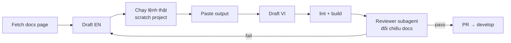
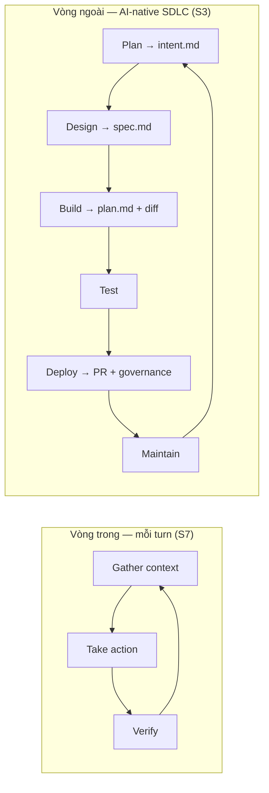

# Spec: Cập nhật course theo Audit 21/09/2026

> **Nguồn**: `docs/audit/2026-09-21-course-audit.md` (audit 64 module EN/VI đối chiếu docs
> chính thức, Claude Code v2.1.278).
> **Trạng thái**: Design đã chốt với tác giả ngày 21/09/2026.
> **Baseline**: Claude Code **v2.1.278** (đã xác nhận `claude --version` trên máy dev).
> **Plan thực thi**: `docs/superpowers/plans/2026-09-21-course-audit-remediation.md`.

---

## 1. Mục tiêu

Đưa course về trạng thái **"Verified against Claude Code v2.1.278 (09/2026)"**:

- Mọi lệnh, flag, slash command, setting key, file config, hook event, frontmatter trong course
  truy vết được về một page trên `code.claude.com/docs`.
- Mọi "Expected output" lấy từ session Claude Code thật trên máy dev, không viết tay.
- Không còn module nào dạy hệ thống không tồn tại (audit §4A) hay mental model 2024-2025 đã sai
  (audit §4B).
- Site EN và VI đồng bộ tại mọi thời điểm trên `develop`.

### Giữ nguyên (không thuộc scope)

- Curriculum 16 phase, thứ tự phase, tên phase.
- Cấu trúc 7-block, giọng văn, cách xưng hô.
- Mental model và REAL CASE đã được audit §3 đánh giá tốt (3-layer reading, PCE loop, RTAV,
  3-strike, five-layer excavation, strangler fig, kubectl 2AM, VNPay, Khoa Đà Nẵng…).
- Design system site, Astro/Starlight config.
- Phase 9 và Phase 13: chỉ sửa nhỏ theo audit, không rewrite.

---

## 2. Bảy nguyên tắc xuyên suốt

Ghi vào `CLAUDE.md` của course, áp cho mọi module từ đây về sau:

1. **Mental model giữ, mechanics re-platform.** Khái niệm đúng thì giữ nguyên; chỉ thay lệnh,
   flag, file config, output bằng feature native 2026.
2. **Enforced > recommended.** Khi dạy kiểm soát, ưu tiên `permissions.allow/deny/ask`, hooks
   `PreToolUse` exit 2, sandbox, managed settings. CLAUDE.md và prompt chỉ là advisory — phải
   nói rõ điều đó.
3. **Headless phải pre-authorize.** Mọi `claude -p` ghi file hoặc chạy lệnh phải có
   `--permission-mode acceptEdits` / `--allowedTools "Edit,Write"` / hoặc
   `--dangerously-skip-permissions` **kèm** ghi chú chỉ dùng trong sandbox.
4. **Esc ≠ Ctrl+C; `/context` ≠ `/cost`.** Esc interrupt turn và giữ session; Ctrl+C ×2 thoát.
   `/context` xem occupancy; `/cost` xem tiền.
5. **Không fake.** Không output viết tay, không số liệu hiệu suất không nguồn, không repo/star
   count bịa, không nhân vật lặp ("Susan" ×9).
6. **EN + VI cùng task, cùng PR.** Không merge EN khi VI tương ứng còn lỗi cũ.
7. **Dạy theo cách Anthropic tự làm.** Mỗi practice lớn trong course neo vào một nguồn chính
   thức của Anthropic (docs best-practices, engineering blog, AI-native SDLC playbook) kèm URL +
   ngày; chỉ dùng số liệu Anthropic công bố, không dùng số bịa hay third-party. Chi tiết §9.

---

## 3. Cấu trúc wave

| Wave | Phạm vi | Release |
|---|---|---|
| **0 — Hạ tầng** | Lint script + CI; CLAUDE.md course; quick-win cơ học (audit Phụ lục B); `templates/`; metadata | v1.1.1 |
| **1 — Tier 1 rewrite** | 7 nhóm module "uy tín chảy máu" (audit §9 Tier 1) | v1.2 |
| **2 — Tier 2 update** | ~22 module update lớn (audit §9 Tier 2) + Phase 12 rebuild + sweep cross-cutting | v1.3 |
| **3 — Nội dung mới** | 4 module mới (audit §9 Tier 3) → 64 → 68 module | v2.0 |

Wave 0 đi trước vì lint là lưới an toàn cho mọi wave sau, và sed quick-win chạy trước rewrite
giữ cho số dòng trích dẫn trong audit còn dùng được (±3 dòng).

### 3.1 Wave 0 — Hạ tầng (v1.1.1)

**W0-A. Lint script** — `scripts/lint-course.mjs`, chạy bằng `npm run lint:course`, test bằng
`node --test` (theo pattern `src/lib/*.test.mjs` sẵn có). Quét mọi `.md`/`.mdx` trong
`src/content/docs/{en,vi}/claude-code/phase-*/`.

| Check | Mức | Ghi chú |
|---|---|---|
| Số H2 (`^## `) ngoài code block = 7 | fail | Bỏ qua `index.mdx`, `cheat-sheet.mdx`, `tips-tricks.mdx` |
| Fence cân (số ```` ``` ```` chẵn, không fence mở trong fence) | fail | Bắt lỗi fence lồng nhau audit X10 |
| Fence có language | fail | ```` ``` ```` trống |
| `##` xuất hiện bên trong code block | fail | Audit §4D "`##` trong code block" |
| Blacklist pattern (bảng dưới) | fail | Regex, case-sensitive |
| Word count > 2200 | fail | Đếm sau khi bỏ frontmatter và code block |
| Word count > 1500 | warn | Target CLAUDE.md 800-1500 |
| Dòng > 100 ký tự (ngoài code block, table, URL) | warn | Hiện mọi file đều vi phạm; không block |
| Frontmatter thiếu `verified` / `claude_version` | warn | Chuyển thành fail khi Wave 2 xong |
| Frontmatter thiếu `description` | fail | 12.3 hiện thiếu |
| Module EN có file VI cùng tên (và ngược lại), cùng extension | fail | 6.1, 11.2 hiện lệch `.md`/`.mdx` |

Blacklist tối thiểu (mở rộng khi phát hiện thêm):

```
claude config (show|reset)
\.claudeignore
/read \S
/(project|user):
pre-file-write|post-file-write|pre-command|post-command|pre-session|post-session
\.claude/hooks\.json
claude skill (install|list|remove|info)
claude_desktop_config
--network[= ]none
claude-3-5-sonnet|claude-sonnet-4-2025|claude-opus-4\b
from ['"]@anthropic-ai/claude-code['"]
Split In Batches
gitleaks protect
git filter-branch
/usr/local/bin/claude
Ctrl\+C.{0,40}(stop|interrupt|emergency)   # warn, không fail — cần đọc ngữ cảnh
```

CI: thêm `.github/workflows/lint-course.yml` chạy `npm ci --ignore-scripts && npm run
lint:course && npm run build` trên PR vào `develop`/`main`. Repo hiện chưa có workflow nào.

**W0-B. CLAUDE.md course** — sửa để phản ánh repo thật:

- Directory layout: `src/content/docs/{en,vi}/claude-code/phase-XX/`, `scripts/`,
  `templates/`, `docs/audit/`, `docs/superpowers/`. Bỏ `assets/`, `cheatsheets/`,
  `scripts/build-*.sh` (không tồn tại).
- "55 Modules" → "64 Modules" (68 sau Wave 3).
- Thay "Commands Known to Exist" / "Need Verification" bằng pointer tới audit Phụ lục A và
  rule: *"Mọi lệnh phải trích được docs page; nếu không, ⚠️ Needs verification"*.
- Thêm 7 nguyên tắc §2 vào WRITING RULES.
- Thêm frontmatter bắt buộc: `verified: YYYY-MM-DD`, `claude_version: X.Y.Z`.
- Thêm mục "Definition of Done" (§4 dưới).
- Sửa `CLAUDE.vi.md` song song.

**W0-C. Quick-win cơ học** — audit Phụ lục B mục 1-15, EN + VI, chủ yếu sed/script:

1. Fix 14 fence lồng nhau EN (2.4, 2.5, 4.2) + 11 VI.
2. Thêm language cho ~50 fence trống.
3. Xóa H2 thứ 8 (8.1 `## Key Takeaways` → H3 hoặc gộp vào REAL CASE; 2.5
   `## Phase 2 Complete` → H3 trong REAL CASE).
4. `##` trong code block (5.2, 6.2, 6.3, 7.3, 7.5, 8.5) → `###` hoặc bỏ `#`.
5. Grep-replace toàn course theo bảng Phụ lục B.5 (model ID → alias, `brew --cask`, gitleaks,
   `filter-repo`, `docker compose`, `node:22`, `--omit=dev`, `npm test -- file`, `~/.local/bin`,
   Loop Over Items, `/read` → `@`, `/project:` → bare).
   **Ngoại lệ**: `Ctrl+C` → `Esc` **không** sed mù — sửa tay từng chỗ vì có chỗ Ctrl+C đúng
   (thoát session).
6. Xóa rác biên tập: 2.1:403, 3.1:6-9, 2.4:790-792, 2.4:88 "Tùng", 11.4 "v11.4".
7. "55" → "64 modules" trong 16.1, 16.3 (README/CLAUDE.md thuộc W0-B/W0-E).
8. Thay `houston.webp` trong `index.mdx` EN+VI bằng ảnh của course (hoặc bỏ `hero.image`).
9. `description:` cho 12.3.
10. Extension VI 6.1, 11.2 → `.mdx` khớp EN.
11. Xóa VI 7.1 flags `--plan`, `--auto`.
12. Thêm solution còn thiếu: VI 4.2 Ex 2; EN 8.1 Ex 3; EN 8.3 Ex 1-2; VI 8.1 Ex 2-3.

Không làm ở Wave 0: wrap dòng >100 (Phụ lục B.14) — sẽ tự sạch khi rewrite từng module.

**W0-D. `templates/`** — tạo thư mục root `templates/` với 3 file lấy từ 2.5:
`claude-md-security-example.md`, `security-checklists.md`, `onboarding-security.md`. 2.5 link
tới GitHub path. (2.5 sẽ được cắt ở Wave 1; Wave 0 chỉ tách file, chưa cắt prose.)

**W0-E. Baseline** — README thêm dòng *"Verified against Claude Code v2.1.278 (2026-09)"*;
`package.json` version → `1.1.1`.

**W0-F. Registry nguồn Anthropic** — tạo `docs/references/anthropic-sources.md`: bảng URL +
ngày + 3-5 quote ngắn cho mỗi nguồn ở §9.1. Module trích dẫn theo registry, không tự chép URL.
CLAUDE.md course thêm rule: *"Khi nói 'Anthropic khuyên/làm X', phải link registry entry."*

### 3.2 Wave 1 — Tier 1 rewrite (v1.2)

7 task, mỗi task = EN + VI, mỗi task một PR. Nội dung bắt buộc lấy từ audit §9 Tier 1 + Phụ lục A.

| Task | Module | Viết lại quanh | Docs page |
|---|---|---|---|
| W1-1 | **11.3 Hooks** | `settings.json` → `hooks.<Event>[].{matcher, hooks[].{type,command,timeout}}`; events core (`PreToolUse`, `PostToolUse`, `PostToolUseFailure`, `PermissionRequest`, `UserPromptSubmit`, `SessionStart`, `SessionEnd`, `Stop`, `SubagentStart/Stop`, `Notification`, `PreCompact`); JSON stdin (`jq -r '.tool_input.file_path'`); exit 2 = block; stdout `hookSpecificOutput.permissionDecision` / `updatedInput` / `additionalContext`; types `command`/`prompt`/`agent`; `/hooks`; `disableAllHooks`; security của hooks. 3 exercise: `PostToolUse(Write\|Edit)` lint → `PreToolUse` block `.env` & `git push --force` → `Stop`/`SessionEnd` notify | `/docs/en/hooks` |
| W1-2 | **11.2 Agent SDK** | `@anthropic-ai/claude-agent-sdk` + `claude-agent-sdk` (PyPI); `query()`, `ClaudeSDKClient`, options (`allowedTools`, `permissionMode`, `systemPrompt`, `mcpServers`, `hooks`, `agents`, `settingSources`, `maxTurns`); `tool()` + `createSdkMcpServer()`; phân biệt Agent SDK vs Managed Agents. 1 section subprocess fallback: `execFileSync` (không `execSync` string) + `--output-format json` + `--json-schema`. Đổi tên file/slug nếu cần, giữ redirect | `/docs/en/agent-sdk` |
| W1-3 | **15.3 + 15.5 + 15.4** | Skills: `.claude/skills/<name>/SKILL.md`, `~/.claude/skills/`; frontmatter `name`, `description`, `allowed-tools`, `disable-model-invocation`, `user-invocable`, `argument-hint`, `model`; `$ARGUMENTS`/`$1`, `` !`cmd` ``, `@file`; auto-trigger theo description; `/skills`, `/skill-doctor`; `scripts/`/`references/`. Plugins: `.claude-plugin/plugin.json`, `marketplace.json`, `/plugin marketplace add`, `/plugin install name@marketplace`, `claude plugin install\|validate\|eval`, `--plugin-dir`, `enabledPlugins`. 15.4: official marketplace, `anthropics/skills`, `awesome-claude-code` — **không** star count. 15.5 deploy skill phải có `allowed-tools` | `/docs/en/skills`, `/docs/en/plugins` |
| W1-4 | **Phase 7 (7.1–7.5)** | 7.1: 7 permission modes, Shift+Tab, `--permission-mode`, `defaultMode`, `/permissions`, `--dangerously-skip-permissions` là thật + sandbox. 7.2: boundary bằng `permissions.deny` + hook + `--worktree`, `--max-turns`, `/rewind`. 7.3: re-platform 3 pattern — orchestrator-worker = parallel subagents (`.claude/agents/*.md`, Agent tool, Explore/Plan built-in); pipeline = chained subagents (pointer 7.6 Dynamic Workflows ở Wave 3); specialist = agent teams (TeamCreate/TaskCreate/SendMessage). 7.4: Stop hook, `--max-turns`, `/loop`, `/rewind`, Esc. 7.5: ladder bash → subagents → teams → background agents (`--bg`, `claude agents/attach/logs/stop`) → Agent SDK; sửa GHA snippet. Mọi `claude -p` còn giữ phải có permission flag | `/docs/en/sub-agents`, `/docs/en/agent-teams`, `/docs/en/permissions` |
| W1-5 | **6.1 + 6.2 + 6.3** | 6.1: thinking mặc định bật, `ultrathink` là keyword thật, `/effort low\|medium\|high\|xhigh\|max`, `--effort`, `effortLevel`, Option+T, Ctrl+O, `MAX_THINKING_TOKENS`; bỏ thang "think step by step" Level 1-3. 6.2: plan mode native — Shift+Tab, `--permission-mode plan`, `defaultMode: "plan"`, plan file, `opusplan`; giữ PCE loop. 6.3: mode-decision matrix trên feature thật; sửa "compact giữa Think và Plan" | `/docs/en/common-workflows` (plan mode, extended thinking), `/docs/en/cli-reference` |
| W1-6 | **2.2 + 2.5** | 2.2 CONCEPT quanh `permissions.allow/deny/ask` + rule syntax (`Bash(git status:*)`, `Read(./.env)`, `Edit`, `mcp__server__tool`), 7 modes, precedence (managed > `--settings` > `.local.json` > `.claude/settings.json` > `~/.claude/settings.json`), `/permissions`, `PreToolUse` hook làm enforcement, `disableBypassPermissionsMode`; prompt thật "1. Yes / 2. Yes, don't ask again… / 3. No"; bỏ `lsp_diagnostics`. 2.5: cắt 6.894 → ≤1.500 từ, link `templates/`, dạy ít nhất 1 enforced control thật (deny rule + hook) và verify nó hoạt động; bỏ `claude config`, `--network=none`, prompt "Read .env Allow?" | `/docs/en/permissions`, `/docs/en/settings` |
| W1-7 | **11.5 MCP** | `claude mcp add --transport http\|stdio --scope local\|project\|user -e KEY=val`, `add-json`, `list\|get\|remove\|login`; `.mcp.json` với `${VAR}`; `/mcp` + OAuth; `mcp__server__tool` permission; `@server:resource`, `/mcp__server__prompt`; `MAX_MCP_OUTPUT_TOKENS`; `--strict-mcp-config`; bỏ Desktop config, bỏ server archived, sửa "never sees credentials", không hard-code token trong file commit | `/docs/en/mcp` |

### 3.3 Wave 2 — Tier 2 update (v1.3)

Task list (plan chi tiết viết khi bắt đầu Wave 2, vì docs có thể đổi giữa chừng):

| Task | Module | Trọng tâm (audit §9 Tier 2 mục 8-22) |
|---|---|---|
| W2-1 | 1.1 | Native installer 3 OS, `--cask`, `winget`, `/login`, subscription vs API vs Bedrock/Vertex, `claude doctor/update`, IDE/desktop/web |
| W2-2 | 1.3 | Token math (~0.75 word/token); `/context`; auto-compact; `/compact <focus>`; 1M `[1m]`; bỏ "session chết"; `@file` |
| W2-3 | 4.2 | Hierarchy concatenate (managed, `.claude/CLAUDE.md`, `CLAUDE.local.md`, `@imports`, `.claude/rules/` `paths:`, subdir lazy-load, `AGENTS.md`); dedupe file mẫu |
| W2-4 | 4.3 | Regenerate output; danh sách command 2026; `.claude/commands/` + frontmatter/`$1`/`` ! ``/`@`; shortcuts |
| W2-5 | 4.4 | Transcript persist, `/resume`, `/rewind`; auto memory `/memory`, `#`; layout `~/.claude/` thật |
| W2-6 | 11.1 | "Non-interactive = pre-authorize or denied"; `--json-schema`; `--input-format stream-json`; `--bare`; `--agents`; `setup-token` |
| W2-7 | 11.4 | `anthropics/claude-code-action@v1`, `/install-github-app`; fix script injection (`env:`); fix `paths`; `permissions:`; `--max-turns`; GitLab note |
| W2-8 | 14.2 / 14.3 / 14.4 | `/fast`, `/effort`, hooks-as-gate, reviewer subagents, `--worktree`, Ctrl+B; giá hiện tại ⚠️, prompt caching, `/usage /stats /insights`, `--max-budget-usd`, `opusplan` |
| W2-9 | 2.3 | Bỏ `--network=none`; egress allowlist + devcontainer chính thức + `init-firewall.sh`; built-in sandbox `/sandbox`; auth vào container; Claude Code on the web |
| W2-10 | 10.1–10.5 | Managed settings + precedence + deny + `allowedMcpServers` + OTel + ZDR; `.claude/rules/`; `@imports`; attribution setting ⚠️; `/code-review`, claude-code-action |
| W2-11 | 3.3 / 3.4 | Claude tự commit/PR, co-author mặc định, `/pr-comments`, worktrees; fix `cd`; `run_in_background`/Ctrl+B/`/tasks`; Bash timeout; `Bash(...)` rules |
| W2-12 | 8.1–8.5 | `/rewind` + Esc; `/compact <focus>` + `/context`; sửa web claim 8.1; hooks/subagents 8.4; `git restore` |
| W2-13 | 15.2 / 16.2 / 10.4 | Slash "templates" thành `.claude/commands/` hoặc skills thật |
| W2-14 | cheat-sheet + tips | ~30 slash, ~25 flag, shortcuts (Ctrl+B/R/T, `#`); `/cost`→`/context`; hierarchy; xóa stats bịa |
| W2-15 | **Phase 12 rebuild** | 12.1: n8n self-host gọi Claude Code headless đúng cách (image có `claude`, permission flags, `CLAUDE_CODE_OAUTH_TOKEN`); 12.2: pattern với node names 2026 (Loop Over Items, `$input.all()`); 12.3: n8n → service Agent SDK (thay Messages API) + nhắc n8n native Anthropic/AI Agent nodes |
| W2-16 | Sweep cross-cutting | 5.1–5.3, 9.1–9.4, 13.1–13.3, 3.1, 3.2, 4.1, 14.1, 16.1, 16.3: áp X1–X6 (`/context`, permission flag, Esc, `/rewind`, `/compact <focus>`, `@file`), xóa số liệu bịa, đổi tên "Susan" theo case |

### 3.4 Wave 3 — Nội dung mới (v2.0)

| Task | Module mới | Nội dung |
|---|---|---|
| W3-1 | **1.4 Interfaces** | Desktop app + scheduled tasks; VS Code/JetBrains (inline diff, plan review, agent map); Claude Code on the web `--cloud`; Remote Control `/remote-control`, `/teleport`; `--chrome`; Slack `/install-slack-app`. 1.2 thu về CLI + `-p` + session |
| W3-2 | **7.6 Dynamic Workflows** | `agent()/pipeline()/parallel()/phase()`, `/workflows`, `ultracode`, resume, `workflowSizeGuideline` |
| W3-3 | **10.6 Enterprise & Observability** | Bedrock/Vertex/Foundry env vars, LLM gateway, managed settings, OpenTelemetry, analytics, ZDR, self-hosted runner |
| W3-4 | **13.4 Document Skills** | docx/pptx/xlsx/pdf bundled skills (`anthropics/skills`); image feedback loop |
| W3-5 | Metadata | 64 → 68 ở README, CLAUDE.md, index.mdx, SUMMARY.md, COURSE-INDEX.md, 16.1, 16.3; sidebar Starlight; "Next" links |

Mỗi module mới viết theo template 7-block, EN + VI, cùng contract §4.

---

## 4. Definition of Done — mỗi module (EN và VI)

- [ ] 7-block đúng thứ tự; H2 = 7; không `##` trong code block
- [ ] Frontmatter có `title`, `description`, `verified: YYYY-MM-DD`, `claude_version: 2.1.xxx`
- [ ] Word count 800–1500 (VI được dài hơn ~10%); tuyệt đối ≤ 2200
- [ ] Mọi lệnh/flag/setting key/event/frontmatter field trích được docs page (ghi page trong
      PR description); không còn pattern blacklist
- [ ] Mọi "Expected output" chạy thật trên máy dev và có `# Output may vary`; giá model giữ
      `⚠️ Needs verification` nếu không đối chiếu được pricing page ngay lúc viết
- [ ] Mọi `claude -p` ghi file/chạy lệnh có permission flag
- [ ] Ít nhất 1 exercise có `<details>` ✅ Solution
- [ ] Không số liệu hiệu suất không nguồn; không nhân vật "Susan" trừ khi giữ 1 case
- [ ] Cross-reference tới module khác dùng số/slug đúng; "Next" link đúng
- [ ] Nếu §9.3 có dòng cho module này: practice đó đã lồng vào đúng block, có link registry;
      số liệu Anthropic (nếu dùng) đúng nguyên văn nguồn
- [ ] VI là parallel authoring cùng PR; thuật ngữ giữ English
- [ ] `npm run lint:course` và `npm run build` xanh

Ngoại lệ VI đã chốt: VI 8.1 (case VNPay) là chuẩn — EN 8.1 viết lại theo VI. VI 7.1/7.3/7.4
quay về song song với EN mới (bỏ phần thêm riêng).

---

## 5. Quy trình per task (Wave 1–3)



1. **Fetch docs**: `code.claude.com/docs/en/<page>` (WebFetch hoặc `claude-code-guide` agent).
   Trích đúng syntax, không dựa vào trí nhớ. Feature audit đánh dấu ⚠️ (`http`/`mcp_tool` hook
   type, `ConfigChange`/`WorktreeCreate` events, `--advisor`, `alwaysThinkingEnabled`…) chỉ
   dạy khi docs page xác nhận; nếu chỉ có trong changelog → không dạy hoặc ⚠️.
2. **Draft EN** theo template CLAUDE.md.
3. **Chạy thật**: tạo project scratch trong scratchpad (không phải repo course), chạy từng lệnh
   DEMO, copy output. Với lệnh cần API (`claude -p`), dùng máy dev đã login.
4. **Draft VI** — parallel authoring, không dịch máy.
5. **Lint + build** local.
6. **Reviewer subagent** (`oh-my-claudecode:code-reviewer` hoặc `claude-code-guide`): đối chiếu
   từng lệnh/flag/key với docs, mỗi verdict phải kèm link docs page. Writer và reviewer là hai
   agent khác nhau.
7. **PR** vào `develop`, description liệt kê docs page đã đối chiếu và audit mục đã đóng.

---

## 6. Git / release

- Branch: `feat/audit-w<N>-<slug>` từ `develop`. Ví dụ `feat/audit-w0-lint`,
  `feat/audit-w1-hooks`.
- Wave 0: 3 PR — (a) lint script + CI, (b) CLAUDE.md + templates + metadata + baseline,
  (c) quick-win sed EN+VI. Merge theo thứ tự a → c → b (lint bắt được sed sai; b chốt version).
- Wave 1: 7 PR, mỗi task một PR. Không phụ thuộc nhau, có thể song song.
- Wave 2: PR theo task; W2-16 sweep cuối cùng.
- Wave 3: PR theo module; W3-5 metadata cuối cùng.
- Release: cuối mỗi wave merge `develop` → `main`, tag `vX.Y.Z`, merge ngược về `develop`
  (theo flow hiện tại, commit `7d6cb25`).
- `npm install` luôn `--ignore-scripts` (hook `.claude/hooks/npm-audit-check.sh` chặn plain
  install).

---

## 7. Rủi ro và cách xử lý

| Rủi ro | Xử lý |
|---|---|
| Docs đổi trong lúc làm (Claude Code release ~hàng tuần) | Pin `claude_version` per module; README ghi baseline; lint warn nếu `verified` > 90 ngày (bật sau Wave 2) |
| Cắt 2.5/4.2/2.4 mất nội dung tốt | Đẩy sang `templates/`, không xóa; link từ module |
| Reviewer subagent hallucinate "docs nói X" | Verdict phải kèm URL docs page; nếu không có URL, coi như chưa verify |
| Sed quick-win phá ngữ cảnh (đặc biệt Ctrl+C) | Ctrl+C sửa tay; mọi sed khác review diff trước commit; lint chạy sau sed |
| VI drift lại sau khi sync | Lint check cặp EN/VI cùng tồn tại + cùng extension; PR template yêu cầu tick "VI updated" |
| Wave 1 quá lớn cho một release | 7 PR độc lập; nếu chậm, release v1.2 với những PR đã merge, phần còn lại sang v1.2.1 |
| Giá model sai lần nữa | Chỉ 14.4 và cheat-sheet nói giá; luôn kèm `⚠️ verify at pricing page` + ngày |

---

## 8. Tiêu chí hoàn thành toàn bộ đợt

- [ ] `npm run lint:course` 0 fail trên toàn course EN + VI
- [ ] 0 file khớp blacklist
- [ ] 68/68 module EN và VI có `verified` + `claude_version`
- [ ] Audit §4A (nội dung bịa): mọi dòng đã đóng
- [ ] Audit §5 gap matrix: không còn 🔴; ❌ chỉ còn ở mục đã ghi rõ "ngoài scope"
- [ ] README/CLAUDE.md/index/SUMMARY/COURSE-INDEX cùng một con số module
- [ ] Site EN và VI build xanh, sidebar khớp

---

## 9. Lồng ghép AI-native SDLC của Anthropic

Course hiện có **0** tham chiếu tới bất kỳ tài liệu process nào của Anthropic (grep
`best-practices`, `anthropic.com/engineering`, "Explore → Plan", worktree, multi-Claude,
"give Claude a way to verify" đều = 0 file). Đây là cơ hội lớn: course đang dạy mental model
tự nghĩ, trong khi Anthropic đã công bố process họ dùng nội bộ với số liệu thật. Nguyên tắc
lồng ghép: **không thêm module "Anthropic làm gì"** — đưa vào WHY / CONCEPT / PITFALLS /
REAL CASE của module sẵn có, để người học thấy "đây là cách chính chủ làm", không phải lý thuyết.

### 9.1 Nguồn chính thức (đã fetch 21/09/2026)

| # | Nguồn | Ngày | Dùng cho |
|---|---|---|---|
| S1 | `code.claude.com/docs/en/best-practices` — "patterns that have proven effective across Anthropic's internal teams" | living | Explore→Plan→Implement→Commit; "give Claude a check it can run"; CLAUDE.md prune test; writer/reviewer; 5 failure pattern; "let Claude interview you → SPEC.md → fresh session"; fan-out `-p` |
| S2 | `claude.com/blog/how-anthropic-teams-use-claude-code` | 24/07/2025 | Per-team story: Security (TDD, stack-trace ~3× nhanh hơn), Data Infra (screenshot dashboard lúc outage, ~20 phút), Inference (~80% giảm research time), Product Design (Figma → code), Data Science (React app không biết TS), Legal (non-eng build tool) |
| S3 | `claude.com/blog/the-ai-native-sdlc-playbook` | 21/08/2026 | 6 stage Plan→`intent.md`, Design→`spec.md`, Build→`plan.md`+diff, Test, Deploy (PR + governance), Maintain (incident → `intent.md`); "Code is no longer the bottleneck — the human-speed steps around it are"; "A skill is a control, though an advisory one… A hook is the deterministic layer behind it"; "The agent that wrote the code has no way to approve it" |
| S4 | `claude.com/blog/how-anthropic-secures-its-ai-native-software-development-lifecycle` | 21/07/2026 | "Claude authors about 80% of the code merged into our codebase today"; "ship 8x as much code per quarter as… 2021 to 2025"; review agent scoped hẹp; risk-tier codebase + sampled auto-merge; "single-purpose identity with the minimum permissions"; mọi tool call log vào SIEM; security guideline nằm trong CLAUDE.md + org skills |
| S5 | `anthropic.com/engineering/building-effective-agents` | 19/12/2024 | Workflows vs agents; 5 pattern: prompt chaining, routing, parallelization, orchestrator-workers, evaluator-optimizer; ACI design |
| S6 | `anthropic.com/engineering/effective-context-engineering-for-ai-agents` | 29/09/2025 | "smallest set of high-signal tokens"; compaction; structured note-taking; subagent trả về 1.000-2.000 token; just-in-time context |
| S7 | `claude.com/blog/building-agents-with-the-claude-agent-sdk` | 29/09/2025 | Loop **gather context → take action → verify work → repeat**; verify = rules-based / visual / LLM-as-judge |
| S8 | `anthropic.com/engineering/equipping-agents-for-the-real-world-with-agent-skills` | 16/10/2025 | Progressive disclosure 3 lớp (name+description → SKILL.md → linked files) |
| S9 | `anthropic.com/engineering/writing-tools-for-agents` | 11/09/2025 | Ít tool, giá trị cao; namespace; semantic ID; response format; mô tả tool "như cho new hire" |
| S10 | `anthropic.com/engineering/multi-agent-research-system` | 13/06/2025 | Orchestrator + 3-5 subagent song song; agent ~4× token chat, multi-agent ~15×; evals từ ~20 query |
| S11 | `anthropic.com/engineering/demystifying-evals-for-ai-agents` | 09/01/2026 | 20-50 task thật; grader code/model/human; đọc transcript; pass@k; saturation |
| S12 | `anthropic.com/engineering` — "Effective harnesses for long-running agents" (26/11/2025) và "Harness design for long-running application development" (24/03/2026) | 2025-26 | Initializer + coding agent; progress file; feature checklist; "unacceptable to remove or edit tests"; tách generator/evaluator ("confident praising"); context reset > compaction khi "context anxiety"; early victory declaration |
| S13 | `anthropic.com/engineering` — "Beyond permission prompts: sandboxing" (20/10/2025), "How we built Claude Code auto mode" (25/03/2026), "How we contain Claude across products" (25/05/2026) | 2025-26 | Sandbox = filesystem **và** network; 84% ít prompt hơn nội bộ; approval fatigue; classifier 2 lớp; 3 tier action; containment ở environment layer trước, model layer sau; "distrust custom components" |
| S14 | `anthropic.com/engineering` — "Building a C compiler with a team of parallel Claudes" (05/02/2026) | 2026 | 16 agent song song, ~2.000 session, 100K dòng, $20K; "the task verifier is nearly perfect, otherwise Claude will solve the wrong problem"; log chi tiết ra file, giữ output in-context vài dòng |
| S15 | `code.claude.com/docs/en/costs`, `/sub-agents`, `/agent-teams`, `/workflows`, `/checkpointing`, `/security` | living | Cost ladder; khi nào subagent / team / workflow; team ≈ 7× token; checkpoint không track Bash |

**Loại khỏi course**: thread của Boris Cherny (10-15 session song song, ~80% bắt đầu bằng plan
mode) — chỉ có bản paraphrase third-party, không fetch được nguồn gốc. Các con số "90% code do
Claude viết", "Cowork 4 người 10 ngày", "54% PR nhận comment" — chưa có primary URL → không dùng.

**Cần ⚠️ verify tận trang trước khi dạy** (agent trích từ best-practices nhưng audit chưa có):
`/goal`, `/verify`, `/batch`, `/btw`, `/effort ultracode`, hook event `PostFileEdit`,
`TaskCompleted`, `--teammate-mode`, `CLAUDE_CODE_EXPERIMENTAL_AGENT_TEAMS`. Quy tắc §5 bước 1
áp dụng: chỉ dạy khi docs page xác nhận.

### 9.2 Xương sống course: hai vòng lặp

Đưa vào **1.2 CONCEPT** (Wave 3 khi 1.2 tái cấu trúc; tạm thời 1.3 CONCEPT ở Wave 2) một
diagram duy nhất, sau đó mọi phase tham chiếu lại thay vì tự nghĩ framework:



- Vòng trong = cách Claude Code hoạt động trong một session (Phase 3, 5, 6, 8).
- Vòng ngoài = cách team tổ chức công việc quanh Claude Code (Phase 6, 7, 10, 11, 16).
  Human gate nằm ở **handoff giữa artifact**, không ở từng dòng code — đây là câu trả lời cho
  câu hỏi "review thế nào khi Claude viết 80% code" mà 10.3 hiện chưa trả lời.

Các framework sẵn có của course **giữ nguyên tên** nhưng map lên xương sống này: PCE loop (6.2)
= Plan/Design/Build; RTAV (7.4) = vòng trong chạy tự động; STOP→ASSESS→CONTAIN→RECOVER (8.5) =
Maintain re-entry; author/reviewer protocol (10.3) = Deploy gate.

### 9.3 Mapping practice → module → block → wave

| Practice (nguồn) | Module → block | Wave |
|---|---|---|
| Explore → Plan → Implement → Commit; "If you could describe the diff in one sentence, skip the plan" (S1) | 6.2 CONCEPT (PCE loop là tên course cho quy trình này); 3.1 WHY; 14.1 CHEAT SHEET | W1-5, W2-16 |
| "Give Claude a check it can run: tests, a build, a screenshot"; "If you can't verify it, don't ship it" (S1, S7) | 7.2 bước VERIFY; 8.4 CONCEPT; 9.3 WHY; 14.3 CONCEPT; 3.2 DEMO self-review step | W1-4, W2-8, W2-12, W2-16 |
| Writer ≠ reviewer: fresh-context subagent review, "the implementing session isn't the one grading it"; "confident praising" (S1, S12, S3 "the agent that wrote the code has no way to approve it") | 7.3 pattern specialist; 8.4; 10.3 CONCEPT; 14.3 | W1-4, W2-10, W2-12 |
| CLAUDE.md prune test "Would removing this cause Claude to make mistakes?"; bảng include/exclude; "Bloated CLAUDE.md files cause Claude to ignore your actual instructions"; < 200 dòng, chuyển specialized instruction sang skills (S1, S15) | 4.2 CONCEPT + PITFALLS; 10.1 PITFALLS; 15.1 | W2-3, W2-10 |
| Skill = advisory control, hook = deterministic layer (S3); "hooks for actions that must happen every time with zero exceptions" (S1) | 2.5 thesis "advisory vs enforced" (nay có nguồn); 11.3 WHY; 15.3 CONCEPT; 10.5 | W1-1, W1-3, W1-6, W2-10 |
| 5 failure pattern: kitchen-sink session, correcting over and over (→ `/clear` sau 2 lần), over-specified CLAUDE.md, trust-then-verify gap, infinite exploration (S1) | 8.2 (3-strike rule của course ↔ "more than twice → `/clear`"); 8.3 PITFALLS; 5.1 PITFALLS; 16.3 checklist học viên | W2-12, W2-16 |
| Course-correct: Esc, `/rewind`, `/clear`, "Undo that" (S1, S15 checkpoint không track Bash) | 8.5 STOP; 8.2 ladder; 3.2; 7.2 | W1-4, W2-12, W2-16 |
| Context engineering: "smallest set of high-signal tokens"; subagent trả 1-2K token summary; JIT context bằng file path; context reset > compaction khi "context anxiety" (S6, S12) | 5.1 CONCEPT (memory-allocator model nay có nguồn); 5.2; 3.1 (Explore subagent thay "đọc signature tay"); 7.3 | W1-4, W2-16 |
| "Let Claude interview you" → SPEC.md → fresh session; "Time spent making the spec precise pays off more than time spent watching the implementation" (S1) | 6.2 DEMO (bước Design → `spec.md` của S3); 4.1 PRACTICE; 7.2 PREPARE | W1-5, W2-16 |
| Workflows vs agents; 5 pattern (S5) | 7.3 CONCEPT: 3 pattern course (orchestrator/pipeline/specialist) map lên orchestrator-workers / prompt chaining / evaluator-optimizer; 7.6 | W1-4, W3-2 |
| Token cost song song: agent ~4×, multi-agent ~15×, team ~7×; chỉ khi "value of the task is high enough" (S10, S15) | 7.5 ladder; 14.4 CONCEPT (thay "Opus 5× Sonnet" bịa bằng số thật) | W1-4, W2-8 |
| Long-running harness: init script, progress file, feature checklist JSON, "unacceptable to remove or edit tests", early victory declaration; "task verifier nearly perfect" (S12, S14) | 7.4 RTAV + healthy-vs-stuck (thêm "early victory" vào stuck signals); 9.3 "fix the TEST not the code" (nay có nguồn); 8.1 PITFALLS | W1-4, W2-12, W2-16 |
| Layered containment: sandbox = filesystem **và** network; 84% ít prompt; approval fatigue; classifier auto mode 2 lớp; "distrust custom components" (S13) | 2.1 CONCEPT (thay "Bash-tool vs file-tool" thiếu); 2.2 (auto mode có nguồn); 2.3 (lý do bỏ `--network=none`: sandbox thật cho phép egress allowlist) | W1-6, W2-9 |
| AI-native SDLC 6 stage + artifact + gate ở handoff; "Code is no longer the bottleneck" (S3) | 10.2 CONCEPT (git convention theo artifact); 10.3 CONCEPT; 6.3 mode matrix; **16.1 case study #1 = Anthropic** (giải quyết "100% real examples" không attribution) | W2-10, W2-16 |
| Secure SDLC: 80% / 8×; review agent scope hẹp; risk-tier + sampled auto-merge; agent identity min-perm; SIEM (S4) | 10.5 REAL CASE (thay governance "trên giấy"); 10.6 mới; 2.4 REAL CASE | W2-10, W3-3 |
| Per-team story (S2): Security TDD + stack-trace 3×; Data Infra screenshot outage 20 phút; Inference 80% research; Design Figma→code; Legal non-eng | 16.2 Roles (mỗi role một story có nguồn); 5.3 REAL CASE (outage screenshot); 9.3; 13.3 | W2-13, W2-16 |
| Tool/ACI design: ít tool, semantic ID, response format, mô tả như cho new hire (S9, S5) | 11.5 PITFALLS (MCP overhead, S15 "prefer CLI tools"); 11.2 `tool()`; 15.5 skill description | W1-2, W1-3, W1-7 |
| Progressive disclosure 3 lớp (S8) | 15.3 CONCEPT; 4.2 (CLAUDE.md vs skills vs on-demand) | W1-3, W2-3 |
| Evals: 20-50 task thật, đọc transcript, grader mix, pass@k (S11, S10) | 8.4 Quality (Quick Scan → mini-eval); 14.3; 16.3 (workshop: chấm bằng eval nhỏ) | W2-8, W2-12 |
| Fan-out `-p` với `--allowedTools`, thử 2-3 file trước rồi scale (S1) | 11.1 DEMO; 9.2 (migration); 14.2 | W2-6, W2-16 |
| Cost ladder chính thức: `/clear` giữa task, model theo việc, `/usage`, ít MCP, hooks/skills preprocess (S15) | 14.4 CHEAT SHEET; 5.2 | W2-8, W2-16 |

### 9.4 Quy tắc viết khi lồng ghép

1. **Một câu, một link.** Lồng ghép = 1-3 câu trong block sẵn có + link registry, không thêm
   section riêng. Ví dụ 4.2 PITFALLS: *"Anthropic's own test for every CLAUDE.md line: 'Would
   removing this cause Claude to make mistakes?' If not, cut it (S1)."*
2. **Số liệu nguyên văn + ngày.** "80% code merged" luôn kèm "(Anthropic, 07/2026)". Không làm
   tròn, không suy diễn ("vậy bạn cũng sẽ 8×").
3. **Framework của course giữ tên**, ghi chú tương đương với thuật ngữ Anthropic (PCE ↔
   Explore/Plan/Implement; 3-strike ↔ "more than twice"). Người học cũ không mất mốc.
4. **Không thần thánh hoá.** Mỗi practice đi kèm giới hạn Anthropic tự nêu: classifier còn 17%
   false-negative; checkpoint không track Bash; reviewer "will usually report some [gaps], even
   when the work is sound".
5. **VI dịch quote sang tiếng Việt** nhưng giữ nguyên văn EN trong ngoặc cho quote ngắn (<15
   từ), để người học tra được.
6. **Registry là nguồn duy nhất.** Đổi URL/ngày → sửa registry, không sửa 20 module.
