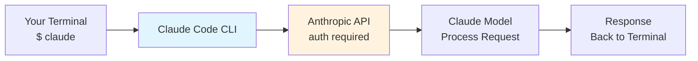

# Module 1.1: Installation & Configuration

> **Estimated time**: ~20 minutes
>
> **Prerequisite**: None
>
> **Outcome**: After this module, you will be able to install Claude Code,
> authenticate, and run your first command

---

## 1. WHY — Why This Matters

Setting up a new development tool should be straightforward, but many AI coding
assistants create friction: version mismatches, unclear authentication, outdated
docs, or confusing setup paths. You end up with a broken installation three
months later because your package manager didn't auto-update. Claude Code offers
multiple installation methods, but only if you know which one fits your workflow.
This module gets you to "ready to code" quickly instead of wrestling with package
managers.

---

## 2. CONCEPT — Core Ideas

Claude Code is a command-line interface (CLI) that connects your local terminal
to Anthropic's Claude AI backend. When you type a command, Claude Code sends
your code context to the API, processes the response, and returns results
directly to your terminal.

The installation flow follows a three-step pattern:

1. **Install the CLI** — Get the `claude` command available globally
2. **Authenticate** — Connect to your Anthropic account (OAuth or API key)
3. **Configure** — Set preferences like default model and project settings

Here's how the architecture flows:



---

## 3. DEMO — Step by Step

**Step 0: Check Node.js Version (Prerequisite)**

Before installing, verify you have Node.js 18 or higher:

```bash
$ node --version
```

Expected output:
```
v18.0.0   # or higher
```

If Node.js is not installed or is below version 18, install it from
https://nodejs.org (LTS version recommended).

**Step 1: Install Claude Code**

There are multiple installation methods. Choose the one that fits your system.

**Option A: npm (Node.js required)**
```bash
$ npm install -g @anthropic-ai/claude-code
```

Expected output:
```
# Output may vary
added 1 package in Xs
```

⚠️ Requires Node.js 18+. Check Anthropic's official documentation for the
current recommended installation method, as this may change.

**Option B: Homebrew (macOS)** ⚠️ Needs verification
```bash
$ brew install claude-code
```

⚠️ The exact Homebrew formula name needs verification. Check `brew search claude`
for available options.

**Option C: Native installer** ⚠️ Needs verification

Anthropic may offer a native installer script. Check the official Claude Code
documentation at https://docs.anthropic.com for current installation instructions.

**Step 2: Verify Installation**

Check that the `claude` command is available:

```bash
$ claude --version
```

Expected output:
```
# Output may vary
claude version X.Y.Z
```

If you see a version number, installation succeeded.

**Step 3: Run Claude Code for the First Time**

Execute the `claude` command without arguments to start an interactive session:

```bash
$ claude
```

On first run, Claude Code will prompt you to authenticate. Follow the prompts
to connect your Anthropic account. Authentication methods include:
- OAuth login (browser-based)
- API key via environment variable: `export ANTHROPIC_API_KEY="your-key"`

You can also start with a specific model:
```bash
$ claude --model sonnet    # Fast and capable (recommended for most work)
$ claude --model opus      # Most capable (complex reasoning)
```

**Step 4: Verify Authentication**

Once authenticated, verify your setup by running the help command inside the
session:

```bash
/help
```

This displays all available slash commands. You should see commands like
`/compact`, `/clear`, `/cost`, and others.

**Step 5: Run Your First Query**

Inside the Claude Code session, ask a simple question to verify everything
works:

```
> What's the best practice for error handling in Go?
```

Claude will respond with a detailed answer. You're ready to code.

---

## 4. PRACTICE — Try It Yourself

### Exercise 1: Install and Verify

**Goal**: Complete the installation and confirm the `claude` command works.

**Instructions**:
1. Open a terminal
2. Install using npm: `npm install -g @anthropic-ai/claude-code`
3. Verify installation: `claude --version`
4. Check that output shows a version number

**Expected result**: The `claude` command is available globally and shows a
version number without errors.

<details>
<summary>💡 Hint</summary>

If the command is not found after installation, you may need to reload your
shell. Try `source ~/.bashrc` (bash) or `source ~/.zshrc` (zsh), or just open
a new terminal window.

</details>

<details>
<summary>✅ Solution</summary>

```bash
$ npm install -g @anthropic-ai/claude-code
$ claude --version
# Output may vary - you should see a version number like X.Y.Z
```

If you see a version number, installation succeeded.

</details>

---

### Exercise 2: Authenticate, Explore Commands, and Check Cost

**Goal**: Log in to Claude Code, explore available commands, and monitor usage.

**Instructions**:
1. Run `claude` to start an interactive session
2. Follow the authentication prompts (OAuth or API key)
3. Inside the session, type `/help` and review available commands
4. Ask Claude a simple question: `What is dependency injection?`
5. After receiving the response, run `/cost` to see your token usage

**Expected result**: You see a list of commands from `/help`, get an answer to
your question, and `/cost` shows the tokens used for that query.

<details>
<summary>💡 Hint</summary>

If OAuth doesn't open a browser automatically, you can set an API key instead:
`export ANTHROPIC_API_KEY="your-key"` before running `claude`.

The `/cost` command shows input tokens, output tokens, and estimated cost for
the current session.

</details>

<details>
<summary>✅ Solution</summary>

```bash
$ claude
# Follow authentication prompts
# Then inside the session:
/help
# Review the list of commands

> What is dependency injection?
# Claude explains the concept

/cost
# Output shows token usage, e.g.:
# Input: 150 tokens, Output: 420 tokens
# Session cost: $0.002 (may vary)
```

</details>

---

### Exercise 3: Run a Query

**Goal**: Run your first Claude Code query.

**Instructions**:
1. Inside the Claude Code session, ask a question
2. Example: `What is the difference between REST and GraphQL?`
3. Wait for the full response

**Expected result**: Claude responds with a detailed explanation.

<details>
<summary>💡 Hint</summary>

If you're not in a session, type `claude` first to start one.

</details>

<details>
<summary>✅ Solution</summary>

```bash
$ claude
# Inside the session:
> What is the difference between REST and GraphQL?

# Claude provides a detailed comparison
```

</details>

---

## 5. CHEAT SHEET

| Task | Command | Notes |
|------|---------|-------|
| **Install (npm)** | `npm install -g @anthropic-ai/claude-code` | Requires Node.js 18+ |
| **Install (Homebrew)** | `brew install claude-code` | ⚠️ Verify formula name |
| **Check Version** | `claude --version` | Verify installation works |
| **Start Session** | `claude` | Opens interactive mode |
| **One-shot Mode** | `claude -p "prompt"` | Single query, no session |
| **View Help** | `/help` | Inside session; lists all commands |
| **Compress Context** | `/compact` | Inside session; reduces token usage |
| **Clear Context** | `/clear` | Inside session; resets conversation |
| **Show Cost** | `/cost` | Inside session; shows token usage |
| **Init Project** | `/init` | Inside session; creates CLAUDE.md |
| **Exit Session** | `/exit` or Ctrl+C | Leave Claude Code |
| **Set API Key** | `export ANTHROPIC_API_KEY="sk-..."` | Alternative to OAuth |
| **Configuration** | `claude config` | Manage settings |

**Commands needing verification:**
- `/status` — ⚠️ May or may not exist
- `/model` — ⚠️ Model selection method unclear; check `/help` output

---

## 6. PITFALLS — Common Mistakes

| ❌ Mistake | ✅ Correct Approach |
|-----------|-------------------|
| Not checking Node.js version | npm install requires Node.js 18+. Run `node --version` first. |
| Assuming commands without checking | Always run `/help` inside a session to see actual available commands. |
| Not reloading shell after install | After installation, run `source ~/.zshrc` (or `~/.bashrc`) or open a new terminal window. |
| Putting API key in code | Store API key in environment variables: `export ANTHROPIC_API_KEY="..."` in your shell profile, never in source files. |
| Using outdated documentation | Installation methods may change. Always check official Anthropic docs for current instructions. |

---

## 7. REAL CASE — Production Story

**Scenario**: Susan, a backend engineer at a fintech startup in Hanoi, just
joined a new team building a payment processing service in Go. On day one, her
new MacBook Pro arrives and she needs to set up Claude Code to help with code
reviews and architecture decisions.

**Problem**: Susan found multiple installation methods online but wasn't sure
which one was current. She was worried about version drift causing issues with
her team's standardized setup.

**Solution**: Susan checked the official Anthropic documentation first, then
installed via npm:
```bash
npm install -g @anthropic-ai/claude-code
```

She authenticated using her company's Anthropic account, then ran `/help` to
see all available commands. She created a project `CLAUDE.md` file using `/init`
to standardize context across her team.

**Result**: Within 15 minutes, Susan was reviewing Go code with Claude Code,
getting architectural suggestions for the payment service's error handling, and
asking about best practices for the `context` package. By documenting the exact
installation steps in her team's wiki, she ensured everyone used the same setup
process.

---

> **Next**: [Module 1.2: Interfaces & Modes](../02-interfaces-modes/) →
