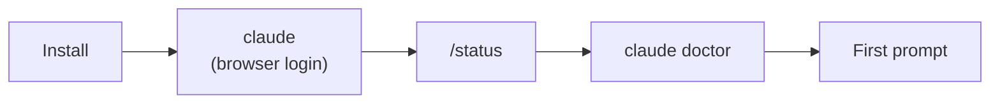

# Module 1.1: Installation & Configuration

> **Estimated time**: ~25 minutes
>
> **Prerequisite**: None
>
> **Outcome**: After this module, you will be able to install Claude Code with the native
> installer (or Homebrew/WinGet/apt), sign in with a subscription, Console key or cloud
> provider, and verify the install with `claude doctor` and `/status`

---

## 1. WHY — Why This Matters

A senior dev on your team follows a two-year-old blog post: `npm install -g
@anthropic-ai/claude-code`. Node is 18, so npm prints an `EBADENGINE` warning and installs
anyway — landing on what Anthropic now calls "Advanced installation options," not the default
path. Months later a teammate's install auto-updates in the background while this one doesn't,
`which -a claude` lists two binaries, and nobody can say which one a fresh terminal runs. The
native installer avoids all three problems — installed on purpose, not by habit.

---

## 2. CONCEPT — Core Ideas

Claude Code ships four install channels, with npm as a documented fallback (docs: `setup`):

| Channel | Command | Auto-update |
|---|---|---|
| Native (recommended) | `curl -fsSL https://claude.ai/install.sh \| bash` (macOS/Linux/WSL) | Background, on every launch |
| Homebrew | `brew install --cask claude-code` (or `claude-code@latest` for the newest build) | None — run `brew upgrade` |
| WinGet | `winget install Anthropic.ClaudeCode` | None — run `winget upgrade` |
| apt / dnf / apk | Anthropic's own signed repo, then `apt`/`dnf install claude-code` or `apk add claude-code` | Through your system's package upgrade |
| npm ("Advanced installation options") | `npm install -g @anthropic-ai/claude-code` | Manual: `npm install -g …@latest` |

The native installer places a launcher at `~/.local/bin/claude`, symlinked into
`~/.local/share/claude/versions/` — that binary skips Node.js at runtime. npm still works, but
"as of v2.1.198, the npm package requires Node.js 22 or later" (older Node: `EBADENGINE`
warning, install still finishes). System requirements: macOS 13.0+, Windows 10 1809+, Ubuntu
20.04+, Debian 10+, or Alpine 3.19+; 4 GB+ RAM, x64/ARM64.


```mermaid
graph LR
    A[Install] --> B["claude<br/>(browser login)"] --> C["/status"] --> D["claude doctor"] --> E[First prompt]
```

Seven credential sources compete, checked in this order (docs:
`authentication#authentication-precedence`): cloud provider env vars
(`CLAUDE_CODE_USE_BEDROCK`/`_VERTEX`/`_FOUNDRY`) → `ANTHROPIC_AUTH_TOKEN` →
`ANTHROPIC_API_KEY` → `apiKeyHelper` output → `CLAUDE_CODE_OAUTH_TOKEN` → Anthropic
profile/federation credentials → subscription OAuth from `/login` (default for
Pro/Max/Team/Enterprise).

| Account type | Sign in |
|---|---|
| Pro/Max/Team/Enterprise | `claude` → browser login, or `/login` |
| Claude Console (API billing) | `claude auth login --console` |
| Amazon Bedrock | `CLAUDE_CODE_USE_BEDROCK=1` |
| Google Vertex AI (Google Cloud's Agent Platform) | `CLAUDE_CODE_USE_VERTEX=1` + `CLOUD_ML_REGION` + `ANTHROPIC_VERTEX_PROJECT_ID` |
| Microsoft Foundry | `CLAUDE_CODE_USE_FOUNDRY=1` |

Credentials land in the macOS Keychain, or `~/.claude/.credentials.json` (mode `0600`) on
Linux/Windows. `claude update` applies one on demand; `autoUpdatesChannel` in `settings.json`
(or `/config`) picks `"latest"` (default) or `"stable"` (~1 week behind, skips regressions);
`DISABLE_AUTOUPDATER=1` stops only the background check, `DISABLE_UPDATES` blocks every path.

---

## 3. DEMO — Step by Step

*Tested with: Claude Max subscription, v2.1.283, macOS 27.0.*

**Step 1: Find every `claude` on your PATH**

```bash
# docs: troubleshoot-install#check-for-conflicting-installations
which -a claude
claude --version
```

```text
# Output may vary
/Users/you/.local/bin/claude
/Users/you/.local/bin/claude
/Users/you/.local/bin/claude
2.1.283 (Claude Code)
```

Three identical lines usually mean duplicate `PATH` entries for one native binary, not three
installs. Also check `~/.claude/local/` (legacy local npm install) and
`npm -g ls @anthropic-ai/claude-code` (global npm) before assuming one copy is stale.

**Step 2: Install (native)**

```bash
# docs: setup#install-claude-code
curl -fsSL https://claude.ai/install.sh | bash
```

Windows PowerShell: `irm https://claude.ai/install.ps1 | iex`. Windows CMD:
`curl -fsSL https://claude.ai/install.cmd -o install.cmd && install.cmd && del install.cmd`.
This same command is also the documented fix for the `Raw mode is not supported` install error
some organizations hit when installing from a pipe (docs:
`troubleshoot-install#raw-mode-is-not-supported-during-install`). Verify with **Step 1**'s
command:

```text
# Output may vary
2.1.283 (Claude Code)
```

**Step 3: Run diagnostics** — `claude doctor` prints read-only install/settings diagnostics
without starting a session (docs: `cli-reference`).

```bash
# docs: setup#verify-your-installation
claude doctor
```

```text
# Output may vary
Claude Code doctor

Running: native (2.1.283)
Commit: 4631ccd7cfe4
Platform: darwin-arm64
Path: /Users/you/.local/share/claude/versions/2.1.283
Config install method: native
Search: OK (bundled)
Auto-updates: enabled
Auto-update channel: latest
Last update attempt: success → 2.1.283 (2026-09-26)
Managed settings (remote): not fetched — requires an Enterprise or Team subscription
Organization policy: not applicable to Pro and Max accounts

No installation issues found.

For a full setup checkup that can also fix issues, run /doctor in a Claude Code session.
```

**Step 4: Check who you're signed in as**

```bash
# docs: cli-reference
claude auth status --text
```

```text
# Output may vary
Login method: Claude Max account
Organization: you@example.com's Organization
Email: you@example.com
```

**Step 5: Same thing, inside a session** — run `/status` and read the **Login** and
**Setting sources** rows.

```text
# Output may vary
Login method:       Claude Max account
Organization:       …
Email:              you@example.com
Setting sources:    User settings, Project local settings
```

**Step 6: Update on demand**

```bash
# docs: setup#update-manually
claude update
```

```text
# Example from docs: https://code.claude.com/docs/en/setup#update-manually
Successfully updated from <old version> to version <new version>
```

Already current: `Claude Code is up to date (<version>)`. Homebrew/WinGet/apk report
`Claude is up to date!` instead — they update through their own package manager.

**Step 7: Prove it can answer, headlessly**

```bash
# docs: cli-reference
claude -p "Reply with exactly: INSTALL OK" --output-format json | jq -r .result
```

```text
# Output may vary
INSTALL OK
```

**Other surfaces** (Module 1.4 has full walkthroughs): **VS Code**'s extension bundles its own
CLI and "does not put `claude` on your shell PATH" — install the standalone CLI too.
**JetBrains** (Beta) needs the CLI on `PATH` first; file reference `Cmd+Option+K`/`Alt+Ctrl+K`.
**Desktop**'s Code tab runs the same engine and shares `~/.claude/settings.json`.
`claude --cloud "<task>"` starts a managed cloud session.

---

## 4. PRACTICE — Try It Yourself

### Exercise 1: Install on a second machine with a different channel

**Goal**: install on a machine that has nothing yet, via Homebrew (macOS) or WinGet (Windows),
then confirm with `claude doctor`.

**Instructions**: `brew install --cask claude-code` or `winget install Anthropic.ClaudeCode`, then
`claude --version` and `claude doctor`.

**Expected result**: a version number, and `Config install method` reading something other than
`native`.

<details>
<summary>💡 Hint</summary>

Read `Config install method` and `Auto-updates`, not just "no issues found."

</details>

<details>
<summary>✅ Solution</summary>

```bash
brew install --cask claude-code
claude --version
claude doctor
```

Homebrew and WinGet never auto-update in the background — expected, not an error. Run
`brew upgrade claude-code` (or `winget upgrade Anthropic.ClaudeCode`) yourself, or set
`CLAUDE_CODE_PACKAGE_MANAGER_AUTO_UPDATE=1` to have Claude Code do it for you.

</details>

---

### Exercise 2: Migrate from npm to the native installer

**Goal**: remove an npm install and replace it with the native one, ending with exactly one
`claude` on `PATH`.

**Instructions**: `npm uninstall -g @anthropic-ai/claude-code`, then
`curl -fsSL https://claude.ai/install.sh | bash`, then `which -a claude`.

**Expected result**: `which -a claude` prints one line, at `~/.local/bin/claude`.

<details>
<summary>💡 Hint</summary>

Still two lines? Check `~/.claude/local/` too — a legacy local npm install, separate from `-g`.

</details>

<details>
<summary>✅ Solution</summary>

```bash
npm uninstall -g @anthropic-ai/claude-code
curl -fsSL https://claude.ai/install.sh | bash
which -a claude
```

```text
# Output may vary
/Users/you/.local/bin/claude
```

One line confirms there's no leftover npm install competing for `PATH` priority.

</details>

---

### Exercise 3: Pin the release channel to stable

**Goal**: set `autoUpdatesChannel` so this machine stays about a week behind, and confirm it.

**Instructions**: add `{"autoUpdatesChannel": "stable"}` to `~/.claude/settings.json`; run
`claude`; check `/config` → **Auto-update channel**.

**Expected result**: `/config` shows **Auto-update channel: stable**.

<details>
<summary>✅ Solution</summary>

```bash
mkdir -p ~/.claude
cat > ~/.claude/settings.json << 'EOF'
{
  "autoUpdatesChannel": "stable"
}
EOF
claude
# then inside the session: /config
```

`autoUpdatesChannel` is a top-level `settings.json` key, not nested under `permissions`. Managed
settings can enforce the same key organization-wide.

</details>

---

## 5. CHEAT SHEET

| Task | Command |
|---|---|
| Install (macOS/Linux/WSL) | `curl -fsSL https://claude.ai/install.sh \| bash` |
| Install (Windows PowerShell) | `irm https://claude.ai/install.ps1 \| iex` |
| Install (Homebrew) | `brew install --cask claude-code` |
| Install (WinGet) | `winget install Anthropic.ClaudeCode` |
| Update now | `claude update` |
| Diagnose from the shell | `claude doctor` |
| Sign in (Console) | `claude auth login --console` |
| Sign out (shell) | `claude auth logout` |
| Auth status (JSON / text) | `claude auth status` / `claude auth status --text` |
| One-year CI token | `claude setup-token` |
| Sign in / out (in-session) | `/login` / `/logout` |
| Full status (in-session) | `/status` |
| In-session checkup + fixes | `/doctor` |
| Exit session | `/exit`, or `Ctrl+D` twice |
| Interrupt / then exit | `Ctrl+C` once interrupts (or clears input); twice exits |

---

## 6. PITFALLS — Common Mistakes

| ❌ Mistake | ✅ Correct Approach |
|---|---|
| `sudo npm install -g @anthropic-ai/claude-code` | Use the native installer; never `sudo` an npm install |
| `brew install claude-code` | Missing `--cask` — it ships as a Homebrew cask, not a formula |
| `npm update -g` to refresh an npm install | Docs say avoid it; run `npm install -g @anthropic-ai/claude-code@latest` |
| Assuming Homebrew/WinGet auto-updates like native | They don't — run `brew upgrade` / `winget upgrade`, or set `CLAUDE_CODE_PACKAGE_MANAGER_AUTO_UPDATE=1` |
| A leftover `ANTHROPIC_API_KEY` in your shell profile | Outranks subscription login in `-p` mode; `env \| grep ANTHROPIC` if login looks wrong |
| Confusing `claude doctor` with `/doctor` | `claude doctor`: shell command for an install that won't start. `/doctor`: in-session, can apply fixes |
| Assuming the VS Code extension puts `claude` on `PATH` | It bundles a private CLI for its own panel; install the standalone CLI too |
| Expecting `/logout` to work on Bedrock or Vertex | Unavailable there — auth is via AWS/Google Cloud credentials |

---

## 7. REAL CASE — Production Story

**Scenario**: a 6-developer mobile team in Vietnam building a Kotlin Multiplatform (KMP) app —
half on macOS, half on Windows — kept hitting "works on my machine" install drift: some had npm
installs from a year-old wiki page, others a Homebrew install missing `--cask`.

**Problem**: onboarding a new hire took a whole morning of Slack messages before Claude Code
even started, and a bug report was as likely to be a stale local install as a real issue.

**Solution**: onboarding now requires the native installer on both platforms, a shared
`~/.claude/settings.json` pinning `autoUpdatesChannel: "stable"`, and `claude doctor` as the
last step — done only once it prints "No installation issues found."

**Result**: `which -a claude` on every machine resolves to one binary, everyone tracks the same
release channel, and "reproduce this bug" stopped starting with "what version are you on?"

---

> **Next**: [Module 1.2: Interfaces & Modes](../02-interfaces-modes/) →
