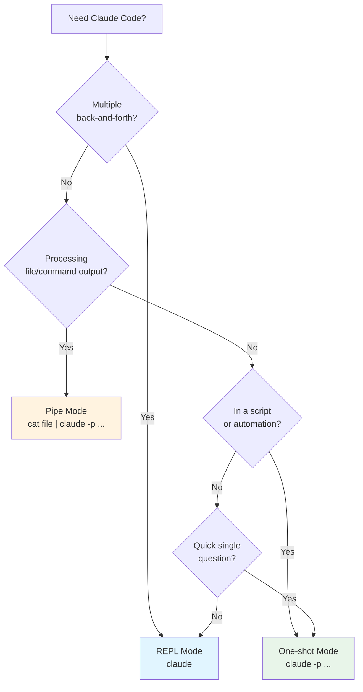

# Module 1.2: Interfaces & Modes

> **Estimated time**: ~25 minutes
>
> **Prerequisite**: Module 1.1 (Installation & Configuration)
>
> **Outcome**: After this module, you will be able to choose the right
> interaction mode for any task and combine modes for powerful workflows

---

## 1. WHY — Why This Matters

You've installed Claude Code and run your first query. But you're using it
like a chatbot — typing questions one at a time. Meanwhile, your colleague
pipes entire git diffs through Claude and gets instant PR summaries. Another
team member has Claude integrated into their CI pipeline, catching bugs before
code even gets merged. The difference? They understand the three interaction
modes. Knowing when to use interactive sessions versus one-shot commands versus
piped input transforms Claude Code from a chat window into a powerful
development automation tool.

---

## 2. CONCEPT — Core Ideas

Claude Code offers three distinct ways to interact, each optimized for
different workflows:

### The Three Modes

| Mode | Command | Best For | Session State |
|------|---------|----------|---------------|
| **REPL (Interactive)** | `claude` | Exploration, debugging, complex multi-step tasks | Persistent conversation |
| **One-shot** | `claude -p "prompt"` | Quick questions, scripts, automation | Single request/response |
| **Pipe** | `cat file \| claude -p "prompt"` | Unix pipelines, processing file content | Single request with stdin |

### Key Differences

**REPL Mode** maintains conversation context across multiple turns. You can
refine your questions, reference previous answers, and use slash commands.
Think of it as a working session with a collaborator.

**One-shot Mode** executes a single prompt and exits immediately. There's no
conversation history — each command is independent. Perfect for scripts and
automation where you need predictable, stateless behavior.

**Pipe Mode** feeds external data (files, command output) directly to Claude
as context. Combined with one-shot mode, it enables powerful Unix-style
workflows where Claude becomes just another tool in your pipeline.

### Session Continuation

Claude Code saves your conversations. You can resume any previous session:

- **`claude --continue`** / **`claude -c`** — resumes the most recent conversation instantly
- **`claude --resume`** / **`claude -r`** — shows a session picker or resumes by ID/name
- **`claude --resume "auth-refactor"`** — resume a specific named session directly
- **`claude -c -p "follow-up"`** — continue the last session in headless mode (great for scripts)

This means you never lose context when you close your terminal or switch tasks. Sessions persist across restarts.

### REPL Keyboard Shortcuts

When inside an interactive REPL session, these shortcuts speed up your workflow:

- **Multi-line input**: `\` + Enter, or `Shift+Enter` (run `/terminal-setup` first)
- **Cancel generation**: `Escape`
- **Exit**: `Ctrl+C` or `/exit`
- **Paste image**: `Ctrl+V` (NOT `Cmd+V` on macOS)
- **Switch model**: `Option+P` / `Alt+P`
- **Toggle thinking**: `Option+T` / `Alt+T`

### Decision Flowchart



---

## 3. DEMO — Step by Step

### Mode 1: REPL (Interactive) Mode

**Step 1: Start an interactive session**

```bash
$ claude
```

You enter the Claude Code REPL. The prompt changes to indicate you're in a
session.

**Step 2: Have a multi-turn conversation**

```
> What's the best way to handle errors in TypeScript?

Claude explains try/catch, Result types, error boundaries, etc.

> Can you show me a concrete example with async/await?

Claude builds on the previous answer with specific code.

> Now refactor that to use a Result type instead

Claude refactors the previous example, maintaining context.
```

**Step 3: Use slash commands**

```
/help
```

Output shows available commands:
```
# Output may vary
Available commands:
  /help     - Show this help
  /clear    - Clear conversation
  /compact  - Compress context
  /cost     - Show token usage
  /init     - Initialize CLAUDE.md
  ...
```

**Step 4: Resume a previous session**

```bash
# Continue the most recent session
$ claude --continue

# Show session picker to choose which session to resume
$ claude --resume

# Resume a specific named session
$ claude --resume "auth-refactor"
```

This is powerful when you close your terminal mid-task — your entire conversation is preserved. No need to re-explain context.

**When to use REPL mode:**
- Exploring a new codebase
- Debugging complex issues
- Iterative development where you refine your approach
- Learning sessions where you want to ask follow-up questions

---

### Mode 2: One-shot Mode

**Step 1: Run a single query**

```bash
$ claude -p "What is the difference between let and const in JavaScript?"
```

Expected output:
```
# Output may vary
In JavaScript, `let` and `const` both declare block-scoped variables, but:

- `const` cannot be reassigned after initialization
- `let` can be reassigned

Use `const` by default, `let` when you need to reassign.
```

The command exits immediately after the response.

**Step 2: Use in a script**

Create a simple script that uses Claude:

```bash
#!/bin/bash
# quick-explain.sh
claude -p "Explain this error in one sentence: $1"
```

Usage:
```bash
$ ./quick-explain.sh "TypeError: Cannot read property 'map' of undefined"
```

**Step 3: Combine with shell features**

```bash
# Save output to a file
$ claude -p "Write a README template for a TypeScript project" > README.md
```

**When to use one-shot mode:**
- Quick questions that don't need follow-up
- Shell scripts and automation
- CI/CD pipelines
- Generating files or snippets programmatically

---

### Mode 3: Pipe Mode

Pipe mode feeds stdin to Claude as context. Combined with `-p`, it enables powerful Unix-style workflows.

**Step 1: Pipe file contents**

```bash
$ cat src/utils.ts | claude -p "Review this code for potential bugs"
```

**Step 2: Pipe command output**

```bash
$ git diff HEAD~1 | claude -p "Summarize these changes"
```

Expected output:
```
# Output may vary
This diff shows:
1. Added error handling to the fetchUser function
2. Updated the return type from Promise<User> to Promise<User | null>
3. Added a new test case for the null scenario
```

**Step 3: Chain with other tools**

```bash
$ git log --oneline -10 | claude -p "Which of these commits are bug fixes?"
```

**When to use pipe mode:**
- Code reviews (pipe diffs or files)
- Log analysis (pipe error logs)
- Batch processing multiple files
- Integrating Claude into Unix pipelines

---

## 4. PRACTICE — Try It Yourself

### Exercise 1: Master REPL Mode

**Goal**: Use REPL mode for an iterative debugging conversation.

**Instructions**:
1. Start a Claude Code session with `claude`
2. Describe a bug: "I have a function that should return the sum of an array,
   but it returns NaN for empty arrays"
3. Ask Claude for a fix
4. Ask a follow-up: "How would I add TypeScript types to this?"
5. Run `/cost` to see your token usage
6. Exit with `/exit` or Ctrl+C

**Expected result**: You have a multi-turn conversation where each response
builds on previous context, and you see the accumulated token cost.

<details>
<summary>💡 Hint</summary>

The key difference from one-shot mode is that Claude remembers your previous
messages. You can say "the function" without re-explaining what function.

</details>

<details>
<summary>✅ Solution</summary>

```bash
$ claude

> I have a function that should return the sum of an array, but it returns
> NaN for empty arrays

# Claude explains the issue (likely reduce without initial value)

> How would I add TypeScript types to this?

# Claude adds proper typing to the previous solution

/cost
# Shows tokens used across the entire conversation

/exit
```

</details>

---

### Exercise 2: Master One-shot Mode

**Goal**: Use one-shot mode in a practical shell workflow.

**Instructions**:
1. Use `claude -p` to ask: "What does the -r flag do in rm command?"
2. Verify the command exits immediately (you're back at your shell prompt)
3. Create a simple shell alias:
   `alias explain='claude -p "Explain this command:"'`
4. Test it: `explain "tar -xzf archive.tar.gz"`

**Expected result**: Each command returns a response and exits. The alias
makes it easy to get quick explanations.

<details>
<summary>💡 Hint</summary>

The alias works because one-shot mode exits after each response. If it opened
an interactive session, the alias would leave you stuck in a Claude session.

</details>

<details>
<summary>✅ Solution</summary>

```bash
$ claude -p "What does the -r flag do in rm command?"
# Output explains recursive deletion
# You're immediately back at your shell prompt

$ alias explain='claude -p "Explain this command:"'
$ explain "tar -xzf archive.tar.gz"
# Output explains: extract, gzip, file flags
```

</details>

---

### Exercise 3: Master Pipe Mode ⚠️

**Goal**: Use pipe mode to analyze code or diffs.

**Instructions**:
1. Navigate to any project with a git history
2. Run: `git diff HEAD~1 | claude -p "What changed in this commit?"`
3. Try with a file: `cat package.json | claude -p "What dependencies does
   this project use?"`
4. Experiment with other combinations

**Expected result**: Claude analyzes the piped content and responds based on
that context.

⚠️ If the pipe syntax doesn't work, check `claude --help` for correct usage.

<details>
<summary>💡 Hint</summary>

The piped content becomes the context for your prompt. You don't need to
paste the file contents — the pipe operator handles it.

</details>

<details>
<summary>✅ Solution</summary>

```bash
$ cd my-project
$ git diff HEAD~1 | claude -p "What changed in this commit?"
# Claude summarizes the diff

$ cat package.json | claude -p "What dependencies does this project use?"
# Claude lists and briefly explains each dependency
```

⚠️ Syntax may vary by version. If this doesn't work, try:
```bash
$ claude -p "What changed?" < <(git diff HEAD~1)
```

</details>

---

## 5. CHEAT SHEET

| Task | Command | Notes |
|------|---------|-------|
| **Start interactive session** | `claude` | Multi-turn, has slash commands |
| **One-shot query** | `claude -p "prompt"` | Single response, exits |
| **Pipe file to Claude** | `cat file \| claude -p "prompt"` | ⚠️ Verify syntax |
| **Pipe command output** | `cmd \| claude -p "prompt"` | ⚠️ Verify syntax |
| **Save output to file** | `claude -p "..." > file.md` | ⚠️ Verify behavior |
| **Show help in session** | `/help` | Lists available commands |
| **Clear conversation** | `/clear` | Resets context in REPL |
| **Compress context** | `/compact` | Reduces token usage |
| **Show token usage** | `/cost` | Shows usage for session |
| **Exit REPL** | `/exit` or Ctrl+C | Ends interactive session |

### Mode Selection Quick Reference

| Scenario | Mode | Why |
|----------|------|-----|
| "Help me debug this" | REPL | Need back-and-forth |
| "What does X mean?" | One-shot | Quick answer, no follow-up |
| "Review this diff" | Pipe | External content as input |
| "Explain these logs" | Pipe | External content as input |
| CI/CD integration | One-shot | Stateless, scriptable |
| Learning/exploring | REPL | Iterative conversation |
| Resume last session | `claude -c` | Continue where you left off |
| Resume specific session | `claude -r "name"` | Pick a named session |
| Resume + headless | `claude -c -p "query"` | Follow-up in script mode |

---

## 6. PITFALLS — Common Mistakes

| ❌ Mistake | ✅ Correct Approach |
|-----------|-------------------|
| Using REPL for simple one-off questions | Use `claude -p "question"` for quick answers — faster and doesn't require exiting a session. |
| Forgetting `-p` flag in scripts | Without `-p`, `claude` enters interactive mode and your script hangs waiting for input. Always use `-p` in automation. |
| Piping huge files without considering token limits | Large files consume many tokens. Pipe only relevant sections: `head -100 file \| claude -p "..."` or use specific line ranges. |
| Not checking `/cost` in long sessions | REPL sessions accumulate tokens. Run `/cost` periodically to avoid surprise bills. |
| Expecting pipe mode to maintain state | Each piped command is independent. For multi-step analysis, use REPL mode instead. |

---

## 7. REAL CASE — Production Story

**Scenario**: Huy, a mobile developer at a Vietnamese e-commerce company, works
on a Kotlin Multiplatform (KMP) project. The team shares business logic between
Android and iOS apps through a shared module. Before submitting PRs, Huy needs
quick code reviews, but the senior reviewer is often in meetings.

**Problem**: Huy finished a significant refactoring of the shared networking
module. He wanted a preliminary review before the formal PR review to catch
obvious issues early. The diff was 400+ lines across multiple files.

**Solution**: Huy used pipe mode to get instant feedback on his changes:

```bash
# Review the entire diff
$ git diff main...feature/network-refactor | claude -p "Review this KMP code
change. Focus on: 1) Kotlin idioms 2) Coroutine usage 3) Error handling
4) iOS/Android compatibility issues"
```

For specific files, he used targeted reviews:

```bash
# Review just the shared module
$ git diff main -- shared/src/commonMain/kotlin/network/ | claude -p \
  "Check this Kotlin networking code for coroutine scope issues"
```

**Result**: Claude identified three issues before the PR was even created:
1. A missing `supervisorScope` that could crash the iOS app if a child
   coroutine failed
2. A non-idiomatic `if-else` chain that should be a `when` expression
3. A potential memory leak from an unclosed `HttpClient`

Huy fixed these issues in 10 minutes. When the senior reviewer looked at the
PR, it was already clean. The formal review took 5 minutes instead of the
usual 30. Huy now runs `git diff | claude -p "review"` before every PR
submission — it's become part of his workflow, like running tests.

---

> **Next**: [Module 1.3: Context Window Basics](../03-context-basics/) →
