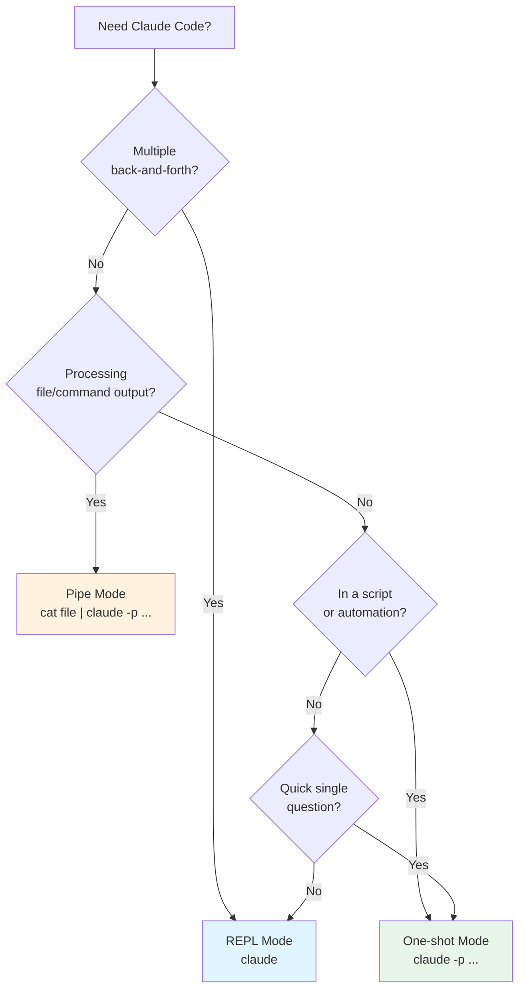

# Module 1.2: Interfaces & Modes

> **Estimated time**: ~25 minutes
>
> **Prerequisite**: Module 1.1 (Installation & Configuration)
>
> **Outcome**: Choose the right interaction mode for any task and combine modes in workflows

---

## 1. WHY — Why This Matters

You've installed Claude Code — but you're using it like a chatbot, one question at a time.
Meanwhile a colleague pipes git diffs through Claude for instant PR summaries, and another has it
wired into CI, catching bugs before merge. The difference is knowing the three interaction modes:
interactive, one-shot, and pipe. Pick the right one and Claude Code stops being a chat window and
becomes part of your automation.

---

## 2. CONCEPT — Core Ideas

### The Three Modes

| Mode | Command | Best For | Session State |
|------|---------|----------|---------------|
| **REPL (Interactive)** | `claude` | Exploration, debugging, complex multi-step tasks | Persistent conversation |
| **One-shot** | `claude -p "prompt"` | Quick questions, scripts, automation | Single request/response |
| **Pipe** | `cat file \| claude -p "prompt"` | Unix pipelines, processing file content | Single request with stdin |

### Key Differences

**REPL Mode** keeps context across turns — refine questions, reference earlier answers, use slash
commands. A working session, not a one-off query.

**One-shot Mode** runs one prompt and exits — no history, each call independent. Built for
stateless, predictable scripts and automation.

**Pipe Mode** feeds external data — files, command output — to Claude as context. Paired with
`-p`, Claude becomes another tool in a Unix pipeline.

### Session Continuation

Claude Code saves your conversations. You can resume any previous session:

- **`claude --continue`** / **`claude -c`** — resume the most recent conversation
- **`claude --resume`** / **`claude -r`** — session picker, or resume by ID/name
- **`claude --resume "auth-refactor"`** — resume a specific named session
- **`claude -c -p "follow-up"`** — continue the last session headless (great for scripts)

### Starting Permission Mode

REPL and one-shot start in different permission modes. On v2.1.283+, **auto mode** (a classifier
reviews actions instead of you) is the built-in starting mode for interactive REPL sessions.
`claude -p` always starts in Manual mode "on every plan" — pass `--permission-mode acceptEdits` (or
`auto`) or `--allowedTools "Edit,Write"` to let it edit files. `dontAsk` alone isn't enough: it
auto-denies anything that would still need approval, it doesn't grant it. Without one of these, a
script that edits files will hang or get denied.

### REPL Keyboard Shortcuts

- **Multi-line input**: `\` + Enter, or `Shift+Enter` (run `/terminal-setup` first)
- **Interrupt current turn**: `Esc` — stops the response or tool call, keeps the session
- **Clear input / rewind**: `Esc Esc` — clears your draft, or (empty input) opens the rewind menu
- **Exit**: `/exit`, or `Ctrl+D` twice. `Ctrl+C` interrupts a running operation just like `Esc`; "if
  nothing is running, the first press clears the prompt input and a second press exits Claude
  Code" — prefer `Esc` to interrupt, since it never exits the session
- **Paste image**: `Ctrl+V` (`Cmd+V` on iTerm2, `Alt+V` on Windows/WSL)
- **Switch model**: `Option+P` / `Alt+P`
- **Toggle thinking**: `Option+T` / `Alt+T` — no effect on always-on-thinking models

### Decision Flowchart


```mermaid
graph TD
    A["Need Claude Code?"] --> B{"Multiple<br/>back-and-forth?"}
    B -->|Yes| C["REPL Mode<br/>claude"]
    B -->|No| D{"Processing<br/>file/command output?"}
    D -->|Yes| E["Pipe Mode<br/>cat file | claude -p ..."]
    D -->|No| F{"In a script<br/>or automation?"}
    F -->|Yes| G["One-shot Mode<br/>claude -p ..."]
    F -->|No| H{"Quick single<br/>question?"}
    H -->|Yes| G
    H -->|No| C
    style C fill:#e1f5ff
    style E fill:#fff3e0
    style G fill:#e8f5e9
```

---

## 3. DEMO — Step by Step

### Mode 1: REPL (Interactive) Mode

**Step 1: Start an interactive session**

```bash
$ claude
```

You enter the Claude Code REPL.

**Step 2: Have a multi-turn conversation**

```text
> What's the best way to handle errors in TypeScript?
# Claude explains try/catch, Result types, error boundaries

> Can you show me a concrete example with async/await?
# Builds on the previous answer with specific code

> Now refactor that to use a Result type instead
# Refactors the previous example, keeping full context
```

**Step 3: Check context and usage**

Inside the REPL, `/context` renders a colored grid. Checked headless here (`claude -p` prints a
table instead):

```bash
$ claude -p "/context"
```

```text
# Output may vary — depends on your installed plugins/skills; rows trimmed with …
Context Usage
Model: claude-opus-5-5 · Tokens: 26.7k / 1m (3%)

Category | Tokens | Percentage
System prompt | 2.2k | 0.2%
Memory files | 7.1k | 0.7%
…
Free space | 940.3k | 94.0%
```

For spend, run `claude -p "/usage"` (`/cost` is an alias, works inside the REPL too):

```text
# Output may vary — subscriber-plan view; an API-key account sees a Session cost block instead
You are currently using your subscription to power your Claude Code usage
Current session: 4% used · resets … (local time)
  ...
```

**Step 4: Resume a previous session**

```bash
# Continue the most recent session
$ claude --continue

# Show session picker to choose which session to resume
$ claude --resume

# Resume a specific named session
$ claude --resume "auth-refactor"
```

---

### Mode 2: One-shot Mode

**Step 1: Run a single query**

```bash
$ claude -p "What is the difference between let and const in JavaScript?"
```

Expected output:
```text
# Output may vary
In JavaScript, `let` and `const` both declare block-scoped variables, but:

- `const` cannot be reassigned after initialization
- `let` can be reassigned

Use `const` by default, `let` when you need to reassign.
```

**Step 2: Use in a script**

```bash
#!/bin/bash
# quick-explain.sh
claude -p "Explain this error in one sentence: $1"
```

```bash
$ ./quick-explain.sh "TypeError: Cannot read property 'map' of undefined"
```

**Step 3: Combine with shell features**

```bash
# Save output to a file
$ claude -p "Print only the markdown for a TypeScript project's README, no commentary" > README.md
```

---

### Mode 3: Pipe Mode

**Step 1: Pipe file contents**

```bash
$ cat src/utils.ts | claude -p "Review this code for potential bugs"
```

**Step 2: Pipe command output**

```bash
$ git diff HEAD~1 | claude -p "Summarize these changes"
```

Expected output:
```text
# Output may vary
This diff shows:
1. Added error handling to the fetchUser function
2. Updated the return type from Promise<User> to Promise<User | null>
3. Added a new test case for the null scenario
```

**Step 3: Chain with other tools**

```bash
$ git log --oneline -10 | claude -p "Which of these commits are bug fixes?"
```

---

## 4. PRACTICE — Try It Yourself

### Exercise 1: Master REPL Mode

**Goal**: An iterative debugging conversation in REPL mode.

**Instructions**:
1. Start a Claude Code session with `claude`
2. Describe a bug: "I have a function that should return the sum of an array,
   but it returns NaN for empty arrays"
3. Ask Claude for a fix
4. Ask a follow-up: "How would I add TypeScript types to this?"
5. Run `/usage` to see your token/cost usage
6. Exit with `/exit`, or `Ctrl+D` twice

**Expected result**: A multi-turn conversation that builds on prior context, plus a visible
token/cost total.

<details>
<summary>💡 Hint</summary>

The key difference from one-shot mode is that Claude remembers your previous
messages. You can say "the function" without re-explaining what function.

</details>

<details>
<summary>✅ Solution</summary>

```bash
$ claude
> I have a function that should return the sum of an array, but it returns
> NaN for empty arrays
# Claude explains the issue (likely reduce without initial value)

> How would I add TypeScript types to this?
# Claude adds proper typing to the previous solution

/usage   # tokens/cost for the whole conversation
/exit
```

</details>

---

### Exercise 2: Master One-shot Mode

**Goal**: One-shot mode in a shell workflow.

**Instructions**:
1. Use `claude -p` to ask: "What does the -r flag do in rm command?"
2. Verify the command exits immediately (you're back at your shell prompt)
3. Create a simple shell alias:
   `alias explain='claude -p "Explain this command:"'`
4. Test it: `explain "tar -xzf archive.tar.gz"`

**Expected result**: Each command returns and exits immediately.

<details>
<summary>💡 Hint</summary>

One-shot mode exits after each response — an interactive session would leave the alias stuck.

</details>

<details>
<summary>✅ Solution</summary>

```bash
$ claude -p "What does the -r flag do in rm command?"
# Explains recursive deletion, then returns to the shell prompt immediately

$ alias explain='claude -p "Explain this command:"'
$ explain "tar -xzf archive.tar.gz"
```

</details>

---

### Exercise 3: Master Pipe Mode

**Goal**: Pipe mode to analyze code or diffs.

**Instructions**:
1. Navigate to any project with a git history
2. Run: `git diff HEAD~1 | claude -p "What changed in this commit?"`
3. Try with a file: `cat package.json | claude -p "What dependencies does
   this project use?"`
4. Experiment with other combinations

**Expected result**: Claude responds using the piped content.

<details>
<summary>💡 Hint</summary>

Piped content becomes the prompt's context — no need to paste file contents.

</details>

<details>
<summary>✅ Solution</summary>

```bash
$ cd my-project
$ git diff HEAD~1 | claude -p "What changed in this commit?"
$ cat package.json | claude -p "What dependencies does this project use?"
```

Piped stdin is capped at 10MB — for larger diffs, filter first:
`git diff HEAD~1 -- src/ | claude -p ...`

</details>

---

## 5. CHEAT SHEET

| Task | Command | Notes |
|------|---------|-------|
| **Start interactive session** | `claude` | Multi-turn, has slash commands |
| **One-shot query** | `claude -p "prompt"` | Single response, exits |
| **Pipe file to Claude** | `cat file \| claude -p "prompt"` | stdin capped at 10MB |
| **Pipe command output** | `cmd \| claude -p "prompt"` | Core, documented behavior |
| **Save output to file** | `claude -p "..." > file.md` | Shell redirects the printed response |
| **Clear conversation** | `/clear` | Resets context in REPL |
| **Compress context** | `/compact` | Summarizes and reduces context |
| **Show context usage** | `/context` | Colored grid of what fills the window |
| **Show token/cost usage** | `/usage` (`/cost` alias) | Session spend and limits |
| **Exit REPL** | `/exit`, or `Ctrl+D` twice | Ends interactive session |

### Mode Selection Quick Reference

| Scenario | Mode | Why |
|----------|------|-----|
| "Help me debug this" | REPL | Need back-and-forth |
| "What does X mean?" | One-shot | Quick answer, no follow-up |
| "Review this diff" | Pipe | External content as input |
| "Explain these logs" | Pipe | External content as input |
| CI/CD integration | One-shot | Stateless, scriptable |
| Learning/exploring | REPL | Iterative conversation |

---

## 6. PITFALLS — Common Mistakes

| ❌ Mistake | ✅ Correct Approach |
|-----------|-------------------|
| Using REPL for one-off questions | Use `claude -p "question"` — faster, no session to exit. |
| Forgetting `-p` in scripts | Without it, `claude` enters interactive mode and the script hangs waiting for input. |
| Piping huge files | Pipe only relevant sections: `head -100 file \| claude -p "..."` |
| Not checking `/usage` in long sessions | Run `/usage` periodically; `/context` shows what's filling the window. |
| Assuming `-p` inherits your REPL permission mode | `-p` always starts in Manual mode — pass `--permission-mode acceptEdits` or `--allowedTools` to edit/write files. |
| Expecting pipe mode to keep state | Each piped command is independent — use REPL for multi-step analysis. |

---

## 7. REAL CASE — Production Story

**Scenario**: Huy, a mobile developer at a Vietnamese e-commerce company, shares business logic
between Android and iOS on a Kotlin Multiplatform (KMP) project. The senior reviewer is often in
meetings, so PRs sit.

**Problem**: Huy refactored the shared networking module — a 400+ line diff — and wanted a quick
review before the formal one.

**Solution**: Pipe mode for instant feedback:

```bash
# Review the entire diff
$ git diff main...feature/network-refactor | claude -p "Review this KMP code
change. Focus on: 1) Kotlin idioms 2) Coroutine usage 3) Error handling
4) iOS/Android compatibility issues"
```

```bash
# Review just the shared module
$ git diff main -- shared/src/commonMain/kotlin/network/ | claude -p \
  "Check this Kotlin networking code for coroutine scope issues"
```

**Result**: Claude found three issues before the PR existed: a missing `supervisorScope` that could
crash iOS on a child-coroutine failure, a non-idiomatic `if-else` that should be a `when`
expression, and a memory leak from an unclosed `HttpClient`.

Huy fixed all three in 10 minutes. The formal review then took 5 minutes instead of the usual 30.
`git diff | claude -p "review"` is now part of his workflow, like running tests.

---

> **Next**: [Module 1.3: Context Window Basics](../03-context-basics/) →
