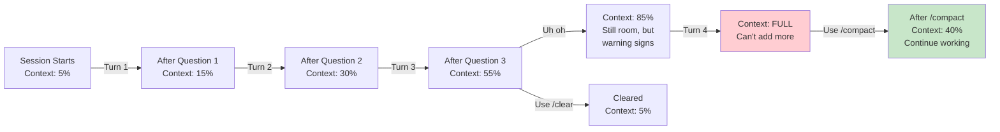

# Module 1.3: Context Window Basics

> **Estimated time**: ~20 minutes
>
> **Prerequisite**: Module 1.2 (Interfaces & Modes)
>
> **Outcome**: After this module, you will understand what context is, track token
> usage, manage context effectively, and recognize when context limits affect your
> work

---

## 1. WHY — Why This Matters

You're in the middle of a complex debugging session. You've asked Claude five
follow-up questions and the explanations are getting vaguer. You mention your
earlier architecture decision, and Claude doesn't seem to remember it. You start
repeating yourself. What happened? Your context window filled up. Claude Code
stopped "remembering" earlier messages because every conversation has a memory
limit — your context window. Understanding this limit, tracking how full it is,
and knowing how to free space is the difference between frustrating sessions that
degrade mid-stream and smooth workflows that stay sharp for hours.

---

## 2. CONCEPT — Core Ideas

A **context window** is the total amount of conversation "memory" available to
Claude at any moment. Think of it like RAM — more context means Claude can see
and reference more of your conversation history, your code files, and previous
instructions. Every token counts: your prompts, Claude's responses, file
contents you paste, and even system instructions all consume context.

### What Gets Counted?

When you're in an active Claude Code session, the context window includes:

- **Your prompts** — Everything you type
- **Claude's responses** — Every word of every answer
- **File contents** — Any code or text you've pasted or had Claude read
- **System instructions** — Project context from CLAUDE.md
- **Conversation history** — All previous turns in the session
- **Metadata** — Formatting, tokens for special characters

### Context Capacity

⚠️ **Context window size depends on your model.** Most modern Claude models offer
around 200,000 tokens of context, but this may change. To verify your model's
limit, check the official Anthropic documentation at
https://docs.anthropic.com.

**Token Estimate**: One token ≈ 4 English characters (2 words on average). If you
paste a 10KB file, that's roughly 2,500 tokens. A full conversation across
multiple turns might consume 30,000–50,000 tokens before hitting warnings.

### The Context Lifecycle

Different modes handle context differently:

**REPL Mode**: Context grows with each turn. Your conversation history
accumulates. Eventually, the window fills. Once it's full, you can't add new
information without either clearing (losing history) or compressing (summarizing
old messages).

**One-shot Mode**: Fresh context every time. You send a prompt, get a response,
and exit. No accumulation because there's no session state.

**Pipe Mode**: Single-use context. Input file + prompt consume context once. The
session ends after the response.

Here's the context lifecycle visualized:



---

## 3. DEMO — Step by Step

**Step 1: Start a REPL session and track context growth**

```bash
$ claude
```

You're now in an interactive session. Let's watch context grow with each turn.

**Step 2: Ask a question and check the token cost**

```
> What is the Observer pattern in software design?
```

Claude responds with a detailed explanation (maybe 300–400 words).

**Step 3: View token usage**

```
/cost
```

Expected output (output may vary):

```
# Output may vary
Session tokens used:
  Input tokens: 45
  Output tokens: 380
  Total session: 425 tokens
  Estimated cost: $0.001
```

Note the total. This is how much context your session has consumed so far.

**Step 4: Ask a follow-up question**

```
> Can you show me a concrete example in Python?
```

Claude responds with Python code implementing the Observer pattern.

**Step 5: Check cost again**

```
/cost
```

Expected output:

```
# Output may vary
Session tokens used:
  Input tokens: 120
  Output tokens: 820
  Total session: 940 tokens
  Estimated cost: $0.003
```

Notice the cost roughly doubled (or more). Your context window is now 940 tokens
used. If your limit is 200k, you're using less than 1%, but the pattern is
clear: each turn adds to the total.

**Step 6: Continue asking questions**

Ask a few more questions about different topics:

```
> What's the difference between design patterns and architectural patterns?
> How do I choose which pattern to use?
> Can you explain the Strategy pattern in contrast to Observer?
```

Run `/cost` after each to see the cumulative growth.

**Step 7: Use `/compact` to free space**

Once you've had enough conversation that context is taking up noticeable space,
compress:

```
/compact
```

Expected output:

```
# Output may vary
Compacting context...
Old context: 15,400 tokens
New context: 8,200 tokens
Freed: 7,200 tokens
```

The `/compact` command summarizes old conversation turns, keeping the essence
while reducing token count. You lose granular history but retain key decisions
and answers.

**Step 8: Verify space freed**

```
/cost
```

Expected output:

```
# Output may vary
Session tokens used:
  Input tokens: 45
  Output tokens: 120
  Total session: 8,245 tokens
  Estimated cost: $0.002
```

The total dropped from 15,400 to ~8,245. You're back to around half context
usage and can continue the session smoothly.

**Step 9: Exit**

```
/exit
```

---

## 4. PRACTICE — Try It Yourself

### Exercise 1: Track Context Growth Across Turns

**Goal**: Observe how context accumulates in a REPL session and recognize the
warning signs.

**Instructions**:

1. Start a Claude Code REPL session: `claude`
2. Ask Claude a detailed question: `"Explain the concept of dependency
   injection in software architecture"`
3. Run `/cost` and write down the token count
4. Ask a follow-up question: `"Can you show me an example in Java?"`
5. Run `/cost` again and compare
6. Repeat this 3 more times with different follow-up questions
7. After each turn, note whether responses seem slower or less detailed

**Expected result**: You see context tokens grow with each turn. After several
turns, you may notice responses take slightly longer or seem slightly less
detailed (early warning of context pressure).

<details>
<summary>💡 Hint</summary>

If responses don't seem to degrade much, that's fine — context still has room.
The purpose of this exercise is to see the growth pattern, not necessarily to
hit the limit. Watch the `/cost` output carefully and notice the cumulative
effect.

</details>

<details>
<summary>✅ Solution</summary>

```bash
$ claude

> Explain the concept of dependency injection in software architecture
/cost
# First check - note the input/output/total tokens

> Can you show me an example in Java?
/cost
# Second check - should show higher total

> What's the difference between constructor and setter injection?
/cost
# Third check - continues to grow

> How does a dependency injection framework like Spring handle this?
/cost
# Fourth check - significant growth now

> What are some best practices?
/cost
# Fifth check - context is noticeably larger

/exit
```

Typical results: First query might be ~400 tokens total, but by the 5th turn,
you're at ~3,000–5,000 tokens. The growth accelerates because each response
adds more context for the next turn to reference.

</details>

---

### Exercise 2: Fill Context and Use `/compact`

**Goal**: Deliberately fill context to near-limit and practice using `/compact`
to recover space.

**Instructions**:

1. Start a REPL session: `claude`
2. Paste a large code file (500+ lines) — for example, a Python class with many
   methods
3. Ask Claude to review it: `"Please review this code and suggest improvements"`
4. Run `/cost` to see the jump in tokens (the file itself consumes lots of
   context)
5. Ask follow-up questions: `"What about error handling?"`, `"How would you
   refactor the X method?"`
6. Check `/cost` after each question
7. Once context is notably consumed (should be visible in `/cost`), run `/compact`
8. Run `/cost` again and observe the difference

**Expected result**: After pasting a large file, you see significant token jump
(files consume 1–5k tokens depending on size). After `/compact`, the total
reduces noticeably while you retain the ability to ask follow-up questions.

<details>
<summary>💡 Hint</summary>

If you don't have a large file handy, Claude can generate one for you:

```
> Create a Python file with a BankAccount class that has 15 methods (deposit,
> withdraw, transfer, interest calculation, etc.)
```

Then you can paste it back in the same session for the exercise.

</details>

<details>
<summary>✅ Solution</summary>

```bash
$ claude

> Create a Python file with a BankAccount class that has 15 methods for managing
> customer accounts with various features (deposit, withdraw, transfer, etc.)
# Claude generates the code

# Copy the code output and paste it

> Please review this BankAccount class for code quality, security, and best
> practices
/cost
# Note the high token count - likely 3,000–8,000+ due to the file

> What are the biggest security concerns in this code?
/cost
# Cost increased again

> How would you refactor the deposit and withdraw methods?
/cost
# Growing further

/compact
# Compress context

/cost
# Should show significant reduction - maybe 30–50% less tokens
```

After `/compact`, context might drop from 12,000 tokens to 5,000–6,000 tokens,
freeing up about half the space while preserving the essence of the code review.

</details>

---

### Exercise 3: Compare REPL vs One-shot Context Usage

**Goal**: Understand that one-shot mode always starts with fresh context, while
REPL accumulates.

**Instructions**:

1. **Part A (REPL):** Start a REPL session and ask 3 questions, checking `/cost`
   after each
2. **Part B (One-shot):** Exit, then run three separate `claude -p "..."` commands
   for the same questions
3. Compare: Notice that REPL's `/cost` grows, but one-shot commands each show
   similar token counts (not cumulative)

**Expected result**: REPL shows cumulative tokens growing across turns (e.g.,
400, 800, 1,200 tokens). One-shot runs show similar independent token counts
(e.g., 400, 400, 400 tokens each) because each is a fresh session.

<details>
<summary>💡 Hint</summary>

For consistency, use the same three questions in both parts:

1. "What is a closure in JavaScript?"
2. "Can you give me a practical example?"
3. "How do closures relate to function scope?"

In REPL, context will accumulate. In one-shot, each run is independent.

</details>

<details>
<summary>✅ Solution</summary>

```bash
# REPL MODE (context accumulates)
$ claude

> What is a closure in JavaScript?
/cost
# First output: ~500 tokens total

> Can you give me a practical example?
/cost
# Second output: ~1,000 tokens total (doubled)

> How do closures relate to function scope?
/cost
# Third output: ~1,500 tokens total (still growing)

/exit

# ONE-SHOT MODE (each is fresh)
$ claude -p "What is a closure in JavaScript?"
# Output: ~500 tokens

$ claude -p "Can you give me a practical example?"
# Output: ~500 tokens (similar, not doubled)

$ claude -p "How do closures relate to function scope?"
# Output: ~500 tokens (similar, not doubled)
```

Notice REPL grows to 1,500 tokens by turn 3, but one-shot stays around 500 per
invocation. That's the fundamental difference.

</details>

---

## 5. CHEAT SHEET

### Token Usage Commands

| Command | Purpose | When to Use |
|---------|---------|------------|
| `/cost` | Show current session token usage | Check context before big files or after many turns |
| `/compact` | Compress old conversation, free space | Context is 50%+ full and you want to continue |
| `/clear` | Reset context completely | Start fresh, discard conversation history |
| `/help` | List all available commands | Unsure which command exists |

### Token Estimates (Approximate)

| Content Type | Rough Cost | Notes |
|---|---|---|
| English prose | ~250 tokens per 1,000 words | Varies by complexity |
| Code (average) | ~400 tokens per 1,000 chars | Dense, more than prose |
| Code (verbose) | ~300 tokens per 1,000 chars | Comments, whitespace reduce density |
| Small file (< 5KB) | 1,000–2,000 tokens | Quick to paste |
| Medium file (5–20KB) | 2,000–5,000 tokens | Noticeable context usage |
| Large file (> 50KB) | 10,000+ tokens | Significant context hit |
| JSON data | ~400 tokens per 1,000 chars | Structure adds overhead |

### Warning Signs Your Context is Full

| Sign | Explanation |
|---|---|
| `/cost` shows > 80% of limit | Rapidly approaching the wall |
| Claude "forgets" early instructions | Older messages compressed or dropped |
| Responses become repetitive | Less "room" to explore new ideas |
| Response speed decreases | API processes slower with larger context |
| Quality drops (hallucinations increase) | Less context for reasoning; more guessing |
| Slash commands behave oddly | Internal state affected by tight space |

---

## 6. PITFALLS — Common Mistakes

| ❌ Mistake | ✅ Correct Approach |
|-----------|-------------------|
| Pasting entire large files when you only need one function | Use `/read path/to/file` or manually extract the relevant function first. Context is expensive — be surgical about what you paste. |
| Ignoring `/cost` in long sessions | Check `/cost` every 5–10 turns. Many developers don't realize they're at 70%+ context until quality degrades noticeably. Run it regularly. |
| Assuming one token = one character in all languages | Vietnamese, Japanese, Chinese (CJK) use 1.5–2x more tokens per character than English. A Vietnamese doc is more expensive than the same English document. |
| Using `/clear` when `/compact` would suffice | `/clear` destroys your conversation. Try `/compact` first — it preserves context while freeing 30–50% of space. Only `/clear` if you truly need to start over. |
| Expecting context to persist after session ends | REPL context dies when you exit or disconnect. If you'll resume work later, save your CLAUDE.md or conversation summary in a file before exiting. |
| Mixing large files with many conversation turns | Pasting a 10KB file + 20 conversation turns can consume 20k+ tokens quickly. Either work with small excerpts or use one-shot mode for file processing instead of REPL. |

---

## 7. REAL CASE — Production Story

**Scenario**: Susan, a backend engineer at Mangala (a Vietnamese fintech company
similar to an expense management platform), was refactoring a Kotlin monorepo to
migrate from a 10-year-old payment processor API to a new one. The codebase has
500+ files and multiple interrelated microservices.

**Problem**: On day three of the refactoring, Susan had been in a single Claude
Code REPL session for hours, asking questions about different modules. She
pasted a 2,000-line payment service file, asked Claude to identify all
API-specific code. Claude provided good answers. Then she asked about error
handling. The response was helpful but shorter than expected. She asked about
retry logic. Claude's answer seemed to contradict something from 20 minutes
earlier. Frustrated, she asked about the architectural decision she'd discussed
at the start of the session. Claude didn't remember it — or only vaguely did.

Susan checked `/cost` out of curiosity:

```
Session tokens used:
  Input tokens: 89,000
  Output tokens: 72,000
  Total: 161,000 tokens
```

She was at 80% of her context limit. Her session was suffocating.

**Solution**: Susan used `/compact` immediately:

```
/compact
```

The response freed 45,000 tokens, dropping her to 116,000 (58% context usage).
She could continue safely. But to prevent this next time, she made structural
changes:

1. She split the work into **multiple sessions**, each focused on one service
2. She **saved key decisions to her project CLAUDE.md** instead of relying on
   session memory
3. She used **one-shot mode** (`claude -p "..."`) for file analysis tasks that
   didn't need conversation history, reserving REPL for iterative design
   decisions

Over the next week, refactoring was smooth. Susan finished the API migration on
time, with fewer context-induced "forgetting" moments and better-documented
decisions that the team could reference.

---

> **Next**: [Module 2.1: Threat Model — Understanding Risks](../../phase-02-security/01-threat-model/) →
