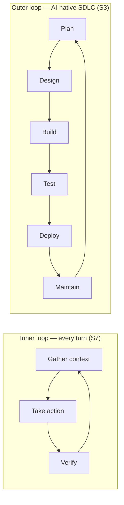

# Module 1.3: Context Window Basics

> **Estimated time**: ~25 minutes
>
> **Prerequisite**: Module 1.2 (Interfaces & Modes)
>
> **Outcome**: After this module, you will be able to read `/context`, reference files with `@`,
> steer compaction with `/compact <instructions>`, and decide between `/compact`, `/clear`, and a
> new session

---

## 1. WHY — Why This Matters

You're mid debugging session, five follow-up questions in, and you mention the architecture
decision you agreed on at the start — Claude doesn't seem to remember it. Auto-compact ran and
summarized the early conversation. That's not a bug; it's how Claude Code keeps long sessions
inside a fixed context window. Knowing what's in that window, how to check it, and how to steer
what compaction keeps is the difference between a session that quietly loses your decisions and
one where you stay in control.

---

## 2. CONCEPT — Core Ideas

A **context window** is everything the model sees on a request: system prompt, tool definitions,
`CLAUDE.md`/memory files, the conversation so far, and every tool call's output. A large MCP
server's tool list, a long memory file, and a 500-turn conversation all compete for that space.

Don't estimate size from a words-per-token ratio — Vietnamese, code, and JSON tokenize
differently, so any fixed ratio you memorize is wrong for some content. Measure the file you
care about instead: `@path/to/file`, then `/context` (# docs: context, common-workflows) — the
grid shows exactly what that file cost.

**Window size** depends on the model. Sonnet 5 always runs a native 1M-token window, no suffix,
no usage credits needed, any plan. Other models need `[1m]`, e.g. `/model opus[1m]`.
`CLAUDE_CODE_DISABLE_1M_CONTEXT=1` reverts a native-1M model to 200K (# docs: model-config).

**Auto-compact** is on by default, compacting a native-1M session at roughly **967K tokens**;
change the threshold with `/autocompact 500k` or `CLAUDE_CODE_AUTO_COMPACT_WINDOW`.
`CLAUDE_AUTOCOMPACT_PCT_OVERRIDE` can only lower that percentage — no setting disables
auto-compact outright (# docs: costs). After compaction, project-root `CLAUDE.md` is re-read
from disk, so project instructions survive even though history doesn't (# docs: memory).

Three tools, not interchangeable:

- **`/compact <instructions>`** — summarize now. `/compact Keep the decisions about divide()
  error handling` tells Claude what to preserve.
- **`/clear`** — drop the conversation, start fresh in the same terminal.
- **A new session** — `claude --continue` or `/resume` picks up a transcript kept on disk for
  **30 days** by default; closing the terminal does not delete it (# docs: sessions).

Anthropic frames this as finding "the smallest set of high-signal tokens that maximize the
likelihood of your desired outcome" (S6) — compaction, `@`, and `/clear` are three tools for
hitting that target.

This module's inner loop — gather context, act, verify (S7) — runs inside a single context
window, turn after turn:


```mermaid
graph LR
    subgraph "Inner loop — every turn (S7)"
        G[Gather context] --> A[Take action] --> V[Verify] --> G
    end
    subgraph "Outer loop — AI-native SDLC (S3)"
        P[Plan] --> D[Design] --> B[Build] --> T[Test] --> Dp[Deploy] --> M[Maintain] --> P
    end
```

The outer loop spans many sessions and is covered starting in Phase 6; this module is about
staying in control of the inner one.

---

## 3. DEMO — Step by Step

One real interactive session in `~/cc-lab`; the grid below is the actual colored-square render,
reproduced as text (`⛁`/`⛀` = used, `⛶` = free, `⛝` = reserved buffer).

**Step 1: Start a session and check the baseline**

```bash
$ claude
```

```text
> /context
```

```text
# Output may vary — /context, docs: context
  ⎿  Context Usage
     ⛁ ⛁ ⛁ ⛁ ⛀ ⛀ ⛁ ⛁ ⛁ ⛁ ⛀ ⛶ ⛶ ⛶ ⛶ ⛶ ⛶ ⛶ ⛶ ⛶   Opus 5.5 (1M context)
     ⛶ ⛶ ⛶ ⛶ ⛶ ⛶ ⛶ ⛶ ⛶ ⛶ ⛶ ⛶ ⛶ ⛶ ⛶ ⛶ ⛶ ⛶ ⛶ ⛶   claude-opus-5-5[1m]
     ⛶ ⛶ ⛶ ⛶ ⛶ ⛶ ⛶ ⛶ ⛶ ⛶ ⛶ ⛶ ⛶ ⛶ ⛶ ⛶ ⛶ ⛶ ⛶ ⛶   42.6k/1m tokens (4%)
     ⛶ ⛶ ⛶ ⛶ ⛶ ⛶ ⛶ ⛶ ⛶ ⛶ ⛶ ⛶ ⛶ ⛶ ⛶ ⛶ ⛶ ⛶ ⛶ ⛶
     ⛶ ⛶ ⛶ ⛶ ⛶ ⛶ ⛶ ⛶ ⛶ ⛶ ⛶ ⛶ ⛶ ⛶ ⛶ ⛶ ⛶ ⛶ ⛶ ⛶   Estimated usage by category
     ⛶ ⛶ ⛶ ⛶ ⛶ ⛶ ⛶ ⛶ ⛶ ⛶ ⛶ ⛶ ⛶ ⛶ ⛶ ⛶ ⛶ ⛶ ⛶ ⛶   ⛁ System prompt: 3.8k tokens (0.4%)
     ⛶ ⛶ ⛶ ⛶ ⛶ ⛶ ⛶ ⛶ ⛶ ⛶ ⛶ ⛶ ⛶ ⛶ ⛶ ⛶ ⛶ ⛶ ⛶ ⛶   ⛁ System tools: 14.2k tokens (1.4%)
     ⛶ ⛶ ⛶ ⛶ ⛶ ⛶ ⛶ ⛶ ⛶ ⛶ ⛶ ⛶ ⛶ ⛶ ⛶ ⛶ ⛶ ⛶ ⛶ ⛶   ⛁ MCP tools: … tokens (…)
     ⛶ ⛶ ⛶ ⛶ ⛶ ⛶ ⛶ ⛶ ⛶ ⛶ ⛶ ⛶ ⛶ ⛝ ⛝ ⛝ ⛝ ⛝ ⛝ ⛝   ⛁ Custom agents: … tokens (…)
                                               ⛁ Memory files: 7.1k tokens (0.7%)
                                               ⛁ Skills: … tokens (…)
                                               ⛁ Messages: 1.3k tokens (0.1%)
                                               ⛶ Free space: 924.4k (92.4%)
                                               ⛝ Autocompact buffer: 33k tokens (3.3%)
     Auto-compact window: 1m tokens
     MCP tools · /mcp (loaded on-demand)
     └ … tools · … tokens
     Custom agents · .claude/agents/
     └ … agents · … tokens
     Memory files · /memory
     └ 1 file · 7.1k tokens
     Skills · /skills
     └ … skills · … tokens
     /context all to expand
```

MCP tools, custom agents, and skills rows depend on what you have installed — redacted here.

> In a script or CI job, `claude -p "/context"` prints this same data as a Markdown table
> instead of a grid — same numbers, plain-text form (# docs: context).

**Step 2: Reference a file and check the cost**

```text
> @src/math.js explain this file in one short paragraph
```

```text
# Output may vary
  ⎿  Read src/math.js (3 lines)
⏺ src/math.js is a small ES module that exports two arithmetic helpers. add(a, b) returns a + b,
  and divide(a, b) returns a / b. Neither function checks its inputs. Dividing by zero gives
  Infinity, -Infinity, or NaN without an error.
```

```text
> /context
```

```text
# Output may vary — /context, docs: context
     ⛶ ⛶ ⛶ ⛶ ⛶ ⛶ ⛶ ⛶ ⛶ ⛶ ⛶ ⛶ ⛶ ⛶ ⛶ ⛶ ⛶ ⛶ ⛶ ⛶   60.5k/1m tokens (6%)
     …
                                               ⛁ Messages: 19.3k tokens (1.9%)
                                               ⛶ Free space: 906.5k (90.6%)
```

Messages went from 1.3k to 19.3k tokens for that file-plus-explanation — the "measure it" habit:
`@file` then `/context`, not a memorized ratio.

**Step 3: Check `/usage` — and see it's not the same gauge**

```text
> /usage
```

```text
# Output may vary — /usage (subscription view), docs: costs
You are currently using your subscription to power your Claude Code usage

Current session: 36% used · resets 5pm (local time)
Current week (all models): 47% used · resets Oct 1
…
```

Docs: *"The Session block in `/usage` shows API token usage and is intended for API users…
Subscribers see plan usage bars, activity stats, and a usage breakdown"* (# docs: costs) — a
subscription shows the percentage view above; an API key shows a dollar-cost table instead.
Either way, `/usage` (alias `/cost`) reports spend, **not** context occupancy.

**Step 4: Steer compaction with `/compact <instructions>`**

```text
> /compact Keep the decisions about divide() error handling
```

```text
# Output may vary — /compact, docs: costs
· Compacting conversation… (9s · ↓ 682 tokens)
  ⎿  Tip: Continue your session in Claude Code Desktop with /desktop
```

A `/context` check right before/after confirms the drop: **62.6k/1m (6%), Messages 21.4k** →
**55.2k/1m (6%), Messages 14.7k**. Too little conversation instead prints `Not enough messages
to compact.`

**Step 5: `/clear` — no confirmation, straight back to baseline**

```text
> /clear
```

```text
# Output may vary
```

`/clear` prints nothing and asks nothing.

```text
> /context
```

```text
# Output may vary — /context, docs: context
                                               42.7k/1m tokens (4%)
…
                                               ⛁ Messages: 1.5k tokens (0.1%)
                                               ⛶ Free space: 924.3k (92.4%)
```

Back to baseline — the divide() discussion is gone from this session.

**Step 6: Prove the session isn't dead after you exit**

Two headless calls show this cleanly — same as a closed-and-reopened terminal (# docs: sessions):

```bash
$ claude -p "We're discussing src/math.js. I'm leaning toward making divide() throw a RangeError when the divisor is zero, instead of returning Infinity."
```

```bash
$ claude -p --continue "What change were we considering for divide(), and in which file?"
```

```text
# Output may vary — claude -p --continue, docs: sessions
We were considering having divide() in src/math.js throw a RangeError when the
divisor is zero, instead of returning Infinity. I haven't made the change yet;
I'm waiting for your go-ahead.
```

The session survived the exit — `/clear` or an un-compacted full window loses context, not
closing the terminal.

---

## 4. PRACTICE — Try It Yourself

### Exercise 1: Measure a real file's context cost

**Goal**: find out what your biggest dependency file actually costs.

**Instructions**: in a project, run `claude`, `@package-lock.json` (or your largest generated
file) with a one-line prompt, then `/context`. Compare Messages before/after.

**Expected result**: a concrete token number, not a guess.

<details>
<summary>💡 Hint</summary>

Generated files (lockfiles, migrations, minified bundles) are often the priciest thing to
`@`-reference. Check before pasting one into a long session.

</details>

<details>
<summary>✅ Solution</summary>

`/context`'s Messages row before/after the `@file` reference is the file's exact cost — no
estimate needed.

</details>

---

### Exercise 2: Write a focused `/compact` instruction

**Goal**: keep the decisions from a long refactor, drop the exploration.

**Instructions**: you've spent an hour exploring three approaches to a migration and settled on
one. Write the `/compact` instruction you'd run next.

<details>
<summary>✅ Solution</summary>

`/compact Keep the decision to use approach B and why we rejected A and C. Drop the exploration
itself.` — name what to keep, not just what to drop; compaction otherwise summarizes everything
evenly.

</details>

---

### Exercise 3: Compact, clear, or new session?

**Goal**: pick the right tool for four situations.

| Situation | Your call |
|---|---|
| Context filling up mid-task, decisions matter | ? |
| Switching to unrelated work right now | ? |
| Try a risky approach without losing the thread | ? |
| Resuming tomorrow, same task | ? |

<details>
<summary>✅ Solution</summary>

`/compact <instructions>` (keep decisions, drop exploration); `/clear` (unrelated work, stale
context is pure cost); `/branch` (new session for the risky attempt, original intact);
`claude --continue`/`/resume` (transcript still on disk).

</details>

---

## 5. CHEAT SHEET

| Command / Flag | Purpose |
|---|---|
| `/context` | Grid of what's using the window now |
| `/usage` (alias `/cost`) | Spend, not occupancy |
| `/compact [instructions]` | Summarize now; instructions steer what's kept |
| `/autocompact <size>` | Change the auto-compact trigger size |
| `/clear` | Drop conversation, fresh session, same terminal |
| `@path/to/file` | Include a file's contents |
| `@path/to/dir/` | Directory listing only |
| `claude --continue` | Resume the most recent session here |
| `claude --resume [id]` | Resume a specific session |
| `/resume` | Session picker |
| `CLAUDE_CODE_AUTO_COMPACT_WINDOW` | Override trigger token count |
| `CLAUDE_AUTOCOMPACT_PCT_OVERRIDE` | Lower (never raise) trigger percentage |
| `CLAUDE_CODE_DISABLE_1M_CONTEXT=1` | Revert native-1M model to 200K |

---

## 6. PITFALLS — Common Mistakes

| ❌ Mistake | ✅ Correct Approach |
|---|---|
| Checking `/cost` for a full context window | Aliases `/usage` — spend, not occupancy. Use `/context`. |
| Typing a `/read` command | Doesn't exist. Use `@path/to/file`. |
| "I compact every 30 minutes just in case" | Auto-compact runs on its own; use `/compact <focus>` on phase change, not a timer. |
| Expecting a `DISABLE_AUTO_COMPACT` env var | Doesn't exist. `CLAUDE_AUTOCOMPACT_PCT_OVERRIDE` only lowers the threshold. |
| "Closing the terminal loses my conversation" | Transcripts persist ~30 days. `claude --continue`/`/resume` picks up where you left off. |
| Assuming a fixed token-per-word ratio | Tokenization varies by language, code, format. Measure with `@file` + `/context`. |

---

## 7. REAL CASE — Production Story

**Scenario**: a backend team at a Vietnamese fintech company was migrating a Kotlin payment
service — 500+ files, heavy Vietnamese-language docs.

**Problem**: an engineer had been in one session for hours, referencing module after module. Late
in the afternoon he asked about a decision from that morning. Claude's answer was vague —
auto-compact had run, keeping general context but dropping the specific reasoning.

**Solution**: not avoiding compaction — it's automatic and necessary — but steering it. Before
switching modules the team ran `/compact Keep the decisions about <topic>, drop exploration of
rejected approaches` at natural breakpoints, and moved settled decisions into `CLAUDE.md` so they
survived as project instructions, not conversation history. They also measured instead of
guessing: a long Vietnamese onboarding doc referenced with `@` cost more than expected, confirmed
with `/context` — moved into a skill (Module 15.3), loaded on demand instead of every session.

**Result**: fewer "Claude forgot" moments, and a `CLAUDE.md` reflecting what the team actually
decided.

---

> `(S3)`, `(S6)`, `(S7)`: `docs/references/anthropic-sources.md`.

> **Next**: [Module 2.1: Threat Model — Understanding Risks](../../phase-02-security/01-threat-model/) →
