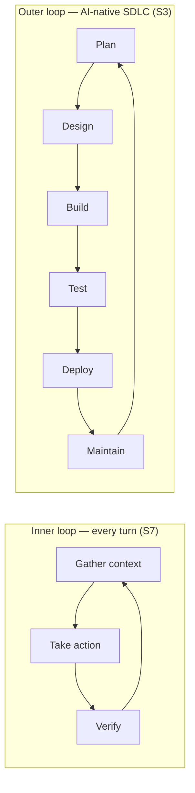

# Module 1.3: Context Window Basics

> **Estimated time**: ~25 minutes
>
> **Prerequisite**: Module 1.2 (Interfaces & Modes)
>
> **Outcome**: After this module, you will be able to read `/context`, reference files with `@`,
> steer compaction with `/compact <instructions>`, and decide between `/compact`, `/clear`, and a
> new session

---

## 1. WHY — Why This Matters

You're mid debugging session, five follow-up questions in, and you mention the architecture
decision you agreed on at the start — Claude doesn't seem to remember it. Auto-compact ran
somewhere in there and summarized the early conversation. That's not a bug; it's how Claude Code
keeps long sessions inside a fixed context window. Knowing what's in that window, how to check
it, and how to steer what compaction keeps is the difference between a session that quietly loses
your decisions and one where you stay in control.

---

## 2. CONCEPT — Core Ideas

A **context window** is everything the model sees on a request: system prompt, tool definitions,
`CLAUDE.md` and memory files, the conversation so far, and every tool call's output. A large MCP
server's tool list, a long memory file, and a 500-turn conversation all compete for the same
space.

Don't estimate size from a words-per-token ratio — Vietnamese, code, and JSON tokenize
differently, so any fixed ratio you memorize will be wrong for some content. Measure the file you
care about instead: reference it with `@path/to/file`, then run `/context` (# docs: context,
common-workflows). The grid shows exactly what that file cost.

**Window size** depends on the model. Sonnet 5 always runs a native 1M-token window, no suffix and
no usage credits needed, on any plan. Other models need `[1m]`, e.g. `/model opus[1m]`.
`CLAUDE_CODE_DISABLE_1M_CONTEXT=1` reverts a native-1M model to 200K (# docs: model-config).

**Auto-compact** is on by default and compacts a native-1M session at roughly **967K tokens**;
change the threshold with `/autocompact 500k` or `CLAUDE_CODE_AUTO_COMPACT_WINDOW`.
`CLAUDE_AUTOCOMPACT_PCT_OVERRIDE` can only lower that percentage — there is no setting that
disables auto-compact outright (# docs: costs). After compaction, project-root `CLAUDE.md` is
re-read from disk, so project instructions survive even though conversation history doesn't
(# docs: memory).

Three tools, not interchangeable:

- **`/compact <instructions>`** — summarize now. `/compact Keep the decisions about divide()
  error handling` tells Claude what to preserve.
- **`/clear`** — drop the conversation, start fresh in the same terminal.
- **A new session** — `claude --continue` or `/resume` picks up a transcript kept on disk for
  **30 days** by default; closing the terminal does not delete it (# docs: sessions).

Anthropic frames this as finding "the smallest set of high-signal tokens that maximize the
likelihood of the desired outcome" (S6) — compaction, `@`, and `/clear` are three tools for
hitting that target.

This module's inner loop — gather context, act, verify (S7) — runs inside a single context
window, turn after turn:


```mermaid
graph LR
    subgraph "Inner loop — every turn (S7)"
        G[Gather context] --> A[Take action] --> V[Verify] --> G
    end
    subgraph "Outer loop — AI-native SDLC (S3)"
        P[Plan] --> D[Design] --> B[Build] --> T[Test] --> Dp[Deploy] --> M[Maintain] --> P
    end
```

The outer loop spans many sessions and is covered starting in Phase 6; this module is about
staying in control of the inner one.

---

## 3. DEMO — Step by Step

**Step 1: Start a session and check the baseline**

```bash
$ claude
```

```text
> /context
```

```markdown
# Output may vary — /context, docs: context
## Context Usage

**Model:** claude-opus-5-5[1m]
**Tokens:** 26.7k / 1m (3%)

### Estimated usage by category

| Category | Tokens | Percentage |
|----------|--------|------------|
| System prompt | 2.2k | 0.2% |
| System tools (deferred) | 14.1k | 1.4% |
| Memory files | 7.1k | 0.7% |
| Skills | 9.9k | 1.0% |
| Messages | 1.3k | 0.1% |
| Free space | 940.3k | 94.0% |
| Autocompact buffer | 33k | 3.3% |
…
```

`/context` also lists loaded MCP tools, agents, and skills by name below this table — trimmed
here (`…`), since that list is machine-specific.

**Step 2: Reference a file and check the cost**

```text
> @src/math.js explain this file
```

Claude reads `src/math.js` and explains `add()`/`divide()`, including that dividing by zero
returns `Infinity`/`NaN` instead of throwing.

```text
> /context
```

```text
# Output may vary — /context, docs: context
**Tokens:** 54.7k / 1m (5%)
…
| Messages | 30k | 3.0% |
| Free space | 912.3k | 91.2% |
…
```

Messages jumped from 1.3k to 30k tokens — that's the "measure it" habit: `@file` then
`/context`, not a memorized ratio.

**Step 3: Check `/usage` — and see it's not the same gauge**

```text
> /usage
```

```text
# Output may vary — /usage, docs: costs
You are currently using your subscription to power your Claude Code usage

Current session: 36% used · resets 5pm (local time)
Current week (all models): 47% used · resets Oct 1
…
```

`/usage` (alias `/cost`) reports spend against your plan or budget — **not** how full the
context window is. That's `/context`'s job.

**Step 4: Steer compaction with `/compact <instructions>`**

```text
> What would happen if divide() received a string like "10"?
> Should divide() throw on division by zero instead of returning Infinity?
> /compact Keep the decisions about divide() error handling
```

A still-short session refuses instead of summarizing almost nothing:

```text
# Output may vary — /compact, docs: costs
⎿ Not enough messages to compact.
```

With real conversation to summarize, `/compact` runs — headless mode prints no banner, so verify
with `/context` before/after:

```text
# Output may vary — /context, docs: context
before: **Tokens:** 54.7k / 1m (5%)  | Messages 30k
after:  **Tokens:** 37.9k / 1m (4%)  | Messages 12.6k
```

**Step 5: `/clear` — no confirmation, straight back to baseline**

```text
> /clear
```

`/clear` prints nothing and asks nothing; it starts a new session in the same terminal.

```text
> /context
```

```text
# Output may vary — /context, docs: context
**Tokens:** 26.8k / 1m (3%)
…
| Messages | 1.5k | 0.1% |
| Free space | 940.2k | 94.0% |
…
```

Back to baseline — the divide() discussion is gone from this session.

**Step 6: Exit, then prove the session isn't dead**

```bash
$ claude
```

```text
> We're discussing src/math.js. I'm leaning toward making divide() throw a
> RangeError when the divisor is zero, instead of returning Infinity.
```

Close the terminal, come back later:

```bash
$ claude --continue
```

```text
> What change were we considering for divide(), and in which file?
```

```text
# Output may vary — claude --continue, docs: sessions
We were considering having divide() in src/math.js throw a RangeError when the
divisor is zero, instead of returning Infinity. I haven't made the change yet;
I'm waiting for your go-ahead.
```

The session survived the exit. `/clear` or an un-compacted full window loses context — not
closing the terminal.

---

## 4. PRACTICE — Try It Yourself

### Exercise 1: Measure a real file's context cost

**Goal**: find out what your biggest dependency file actually costs.

**Instructions**: in one of your projects, run `claude`, `@package-lock.json` (or your largest
generated file) with a one-line prompt, then `/context`. Compare Messages before/after.

**Expected result**: a concrete token number, not a guess.

<details>
<summary>💡 Hint</summary>

Generated files (lockfiles, migrations, minified bundles) are often the most expensive thing you
can `@`-reference. Check before pasting one into a long session.

</details>

<details>
<summary>✅ Solution</summary>

`/context`'s Messages row before and after the `@file` reference is the file's exact context
cost — no estimate needed.

</details>

---

### Exercise 2: Write a focused `/compact` instruction

**Goal**: keep the decisions from a long refactor, drop the exploration.

**Instructions**: you've spent an hour with Claude exploring three possible approaches to a
migration and settled on one. Write the `/compact` instruction you'd run next.

<details>
<summary>✅ Solution</summary>

`/compact Keep the decision to use approach B and why we rejected A and C. Drop the exploration
of A and C themselves.` — name what to keep, not just what to drop; compaction defaults to
summarizing everything evenly otherwise.

</details>

---

### Exercise 3: Compact, clear, or new session?

**Goal**: pick the right tool for four situations.

| Situation | Your call |
|---|---|
| Context is getting full mid-task, decisions matter | ? |
| Switching to a completely unrelated task right now | ? |
| Want to try a risky approach without losing the current thread | ? |
| Resuming tomorrow, exact same task | ? |

<details>
<summary>✅ Solution</summary>

`/compact <instructions>` (keep decisions, drop exploration); `/clear` (unrelated work, stale
context is pure cost); `/branch` (new session ID for the risky attempt, original stays intact);
`claude --continue` or `/resume` (transcript is still on disk).

</details>

---

## 5. CHEAT SHEET

| Command / Flag | Purpose |
|---|---|
| `/context` | Grid of what's using the window now |
| `/usage` (alias `/cost`) | Spend, not occupancy |
| `/compact [instructions]` | Summarize now; instructions steer what's kept |
| `/autocompact <size>` | Change the auto-compact trigger size |
| `/clear` | Drop conversation, fresh session, same terminal |
| `@path/to/file` | Include a file's full contents |
| `@path/to/dir/` | Directory listing only |
| `claude --continue` | Resume the most recent session here |
| `claude --resume [id]` | Resume a specific session |
| `/resume` | Session picker |
| `CLAUDE_CODE_AUTO_COMPACT_WINDOW` | Override the trigger token count |
| `CLAUDE_AUTOCOMPACT_PCT_OVERRIDE` | Lower (never raise) the trigger percentage |
| `CLAUDE_CODE_DISABLE_1M_CONTEXT=1` | Revert a native-1M model to 200K |

---

## 6. PITFALLS — Common Mistakes

| ❌ Mistake | ✅ Correct Approach |
|---|---|
| Checking `/cost` for a full context window | `/cost` aliases `/usage` — spend, not occupancy. Use `/context`. |
| Typing a `/read` command | Doesn't exist. Use `@path/to/file`. |
| "I compact every 30 minutes just in case" | Auto-compact runs on its own; use `/compact <focus>` when you change phase, not on a timer. |
| Expecting a `DISABLE_AUTO_COMPACT` env var | Doesn't exist. `CLAUDE_AUTOCOMPACT_PCT_OVERRIDE` can only lower the threshold. |
| "Closing the terminal loses my conversation" | Transcripts persist ~30 days. `claude --continue` or `/resume` picks up where you left off. |
| Assuming a fixed token-per-word ratio everywhere | Tokenization varies by language, code, format. Measure with `@file` + `/context`. |

---

## 7. REAL CASE — Production Story

**Scenario**: a backend team at a Vietnamese fintech company was migrating a Kotlin payment
service — 500+ files, heavy Vietnamese-language internal docs.

**Problem**: an engineer had been in one session for hours, referencing module after module. Late
in the afternoon he asked about an architectural decision from that morning. Claude's answer was
vague — auto-compact had already run and kept general context but dropped the specific reasoning.

**Solution**: the fix wasn't avoiding compaction — it's automatic and necessary — it was steering
it. Before switching modules the team ran `/compact Keep the decisions about <topic>, drop
exploration of rejected approaches` at natural breakpoints, and moved settled decisions into
`CLAUDE.md` so they survived as project instructions, not conversation history. They also
measured instead of guessing: a long Vietnamese onboarding doc referenced with `@` cost more
than expected, confirmed with `/context` — they moved it into a skill (Module 15.3), loaded on
demand instead of every session.

**Result**: fewer "Claude forgot" moments, and a `CLAUDE.md` that reflected what the team had
actually decided.

---

> `(S3)`, `(S6)`, `(S7)`: `docs/references/anthropic-sources.md`.

> **Next**: [Module 2.1: Threat Model — Understanding Risks](../../phase-02-security/01-threat-model/) →
