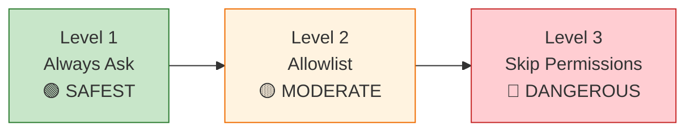

# Module 2.2: Permission System Deep Dive

> **Estimated time**: ~35 minutes
>
> **Prerequisite**: Module 2.1 (Threat Model)
>
> **Outcome**: After this module, you will understand Claude Code's permission system, know how to configure safety levels appropriately, and recognize when to approve or deny command requests

---

## 1. WHY — Why This Matters

You've read Module 2.1. You now know that Claude Code runs with YOUR permissions on YOUR machine. It can read your SSH keys, delete files, push to production. That's terrifying. But here's the thing: Claude Code isn't completely reckless. It has a permission system that prompts you before running dangerous commands. This module shows you exactly how that system works, what it protects you from, and — critically — where it fails. The permission prompt is your last line of defense. Understanding it is not optional.

---

## 2. CONCEPT — Core Ideas

### Default Permission Behavior

By default, Claude Code asks for permission before executing shell commands. When it wants to run something like `git push` or `npm install`, it shows you a prompt with the full command and waits for your approval. You can approve, deny, or approve once vs. always for that type of command.

**What triggers prompts**: ⚠️ Needs verification
- Shell commands via the Bash tool
- File writes that modify code outside safe paths
- Network operations (curl, wget, API calls)

**What does NOT trigger prompts**: ⚠️ Needs verification
- Reading files (Claude Code can silently read anything you have access to)
- Using language tools like `lsp_diagnostics`
- Internal operations like searching with Grep

**The approval flow**: You see the command, its description, and buttons to approve or deny. If you deny, Claude Code stops and reports the denial. If you approve, it runs immediately.

### Trust Levels Spectrum

The permission system operates on a spectrum from "maximum safety" to "no safety at all":



**Level 1 (Always Ask)**: Every shell command triggers a prompt. This is the default and safest mode for local development. You remain in control.

**Level 2 (Allowlist)**: You pre-approve specific safe commands (like `ls`, `cat`, `grep`) so Claude Code doesn't ask every single time. Moderate risk — depends entirely on what you allowlist.

**Level 3 (Skip Permissions)**: Run Claude Code with `--dangerously-skip-permissions` flag. No prompts. No safety net. Claude Code executes whatever it wants. Maximum risk.

### The --dangerously-skip-permissions Flag

The flag name is not hyperbole. It is ACTUALLY dangerous.

**What it does**: Removes ALL permission checks. Claude Code runs every command it generates without asking you. File deletions, git pushes, network requests, system modifications — all automatic.

**When it's acceptable**:
- Inside Docker containers (isolated, disposable)
- CI/CD pipelines (ephemeral environments, no secrets)
- Automated testing environments (destroyed after each run)

**When it's NOT acceptable**:
- Your local development machine
- Any environment with access to real credentials
- Shared servers or staging environments
- "Just to save time clicking approve"

**Real consequences**:
- Claude Code misinterprets your intent and runs `rm -rf src/` instead of `rm -rf src/temp/`
- Claude Code "helps" by running `git push --force origin main` during a refactoring task
- Claude Code executes `curl` with your API keys in the URL, logging them to third-party services
- Claude Code runs `npm install malicious-package` after misreading dependency names

### Allowlist Configuration ⚠️ Needs verification

You can configure a list of pre-approved commands that won't trigger prompts. This reduces "approval fatigue" for common safe operations.

**Recommended safe allowlist**:
- `ls`, `pwd`, `cat`, `head`, `tail` (read-only file operations)
- `grep`, `find` (search operations)
- `git status`, `git log`, `git diff` (read-only git commands)
- `npm list`, `pip list` (read-only package checks)

**NEVER allowlist**:
- `rm` (file deletion)
- `git push`, `git push --force` (remote modifications)
- `curl`, `wget` (network requests)
- `npm install`, `pip install` (package installation)
- `chmod`, `chown` (permission changes)
- Any command that writes to disk or network

**How to configure**: ⚠️ Needs verification — Configuration location and syntax need verification. Check Claude Code documentation for current allowlist configuration method.

### Reading Permission Prompts

Before you click "approve", ALWAYS check:

1. **The full command**: Read every word. Look for flags like `--force`, `-r`, `-f`
2. **File paths**: Is it operating inside your project directory? Or /etc/? Or ~/.ssh/?
3. **Network targets**: If it's curl/wget, where is it sending data?
4. **Destructive operations**: Does it delete, overwrite, or push?
5. **The description**: Does Claude Code's explanation match what the command actually does?

**Red flags** — STOP and investigate before approving:
- Paths outside your project directory
- Commands you don't recognize
- Network operations (unless you explicitly asked for them)
- `rm`, `mv`, `chmod` without clear justification
- `git push` when you didn't ask to publish changes
- Any command operating on dotfiles (`~/.bashrc`, `~/.ssh/config`)

**Approval fatigue is real**: When Claude Code asks permission 20 times in a session, you'll be tempted to click "yes" without reading. This is how mistakes happen. Combat it by:
- Using an allowlist for truly safe commands ⚠️
- Taking a break when you catch yourself auto-approving
- Asking Claude Code to explain WHY it needs to run a command
- Denying aggressive commands and asking for alternatives

---

## 3. DEMO — Step by Step

⚠️ The exact format of permission prompts may vary by Claude Code version. The following demonstrates the conceptual flow.

**Step 1: Start Claude Code with Default Permissions**
```bash
$ claude
```
Expected: Claude Code starts in interactive mode with permission system active (default behavior).

**Step 2: Trigger a Permission Prompt**
Prompt Claude Code with: "Run git status to show me the current repository state"

Expected output (conceptual):
```
Claude Code wants to run a command:

  git status

Description: Show working tree status

[ Approve Once ] [ Approve Always ] [ Deny ]
```

Claude Code pauses and waits for your decision.

**Step 3: Practice Approving**
Click "Approve Once" (or equivalent in your interface).

Expected: Claude Code runs `git status` and shows you the output. If you ask it to run `git status` again, it will ask permission again (because you chose "once").

**Step 4: Practice Denying**
Prompt: "Delete all files in the src directory"

Expected permission prompt (conceptual):
```
Claude Code wants to run a command:

  rm -rf src/

Description: Remove directory recursively

[ Approve Once ] [ Approve Always ] [ Deny ]
```

Click "Deny".

Expected: Claude Code stops and responds with something like "I was unable to complete that action because permission was denied."

**Step 5: Understand "Approve Always"**
Prompt: "Show me the first 10 lines of README.md"

Expected permission prompt:
```
Claude Code wants to run a command:

  head -n 10 README.md

Description: Display first 10 lines of file

[ Approve Once ] [ Approve Always ] [ Deny ]
```

Click "Approve Always" (for demonstration only — be careful with this in real usage).

Expected: Claude Code runs the command. Next time it wants to run `head`, it won't ask (you've approved this command type permanently for this session or project ⚠️ exact scope needs verification).

**Step 6: Check Permission Settings** ⚠️ Needs verification
```bash
$ claude config show
```
Expected: Configuration output showing current permission settings, allowlist, and trust level. ⚠️ The exact command and output format need verification.

---

## 4. PRACTICE — Try It Yourself

### Exercise 1: Trigger and Deny Permissions

**Goal**: Experience the permission prompt for different command types and practice making approval decisions.

**Instructions**:
1. Start Claude Code in a test project
2. Ask it to perform these actions (one at a time):
   - Read a file: "Show me the contents of package.json"
   - Write a file: "Create a new file called test.txt with the word 'hello'"
   - Run a shell command: "List all files in the current directory"
   - Run a network request: "Download the latest version info from npmjs.com" ⚠️
3. For each prompt, identify:
   - What is the exact command?
   - Is it operating inside the project directory?
   - Is it read-only or does it modify state?
   - Would you approve this in a real scenario?
4. Deny at least one request and observe Claude Code's response

**Expected result**: You've seen permission prompts for different operation types and practiced reading them before approving.

<details>
<summary>💡 Hint</summary>

File read operations may not trigger prompts (Claude Code can read files silently via the Read tool). Focus on shell commands and write operations.

If Claude Code doesn't trigger a prompt for network requests, that's important information — it means you need external controls (firewall, network monitoring) to protect against data exfiltration.

</details>

<details>
<summary>✅ Solution</summary>

**Read file**: Likely no prompt — Claude Code uses Read tool directly.

**Write file**: Should trigger prompt like:
```
echo 'hello' > test.txt
```
Approve if inside project directory.

**List files**: Should trigger prompt:
```
ls -la
```
Safe to approve — read-only operation.

**Network request**: ⚠️ Behavior varies. May trigger prompt like:
```
curl https://registry.npmjs.com/...
```
This is a READ operation but involves network. Approve only if you trust the target and explicitly requested this action.

**Key lesson**: ALWAYS read the full command. "List files" could be `ls` (safe) or `ls /etc/passwd` (suspicious). Context matters.

</details>

---

### Exercise 2: Configure a Safe Allowlist ⚠️ Needs verification

**Goal**: Set up pre-approved commands for your project to reduce approval fatigue without compromising security.

**Instructions**:
1. Identify commands you run frequently via Claude Code (check your session history if available)
2. Filter for read-only operations: `ls`, `cat`, `grep`, `git status`, `git log`, `git diff`
3. ⚠️ Locate Claude Code's allowlist configuration (check documentation for current method)
4. Add these safe commands to your allowlist
5. Test: Ask Claude Code to run an allowlisted command — it should execute without prompting
6. Test: Ask Claude Code to run a non-allowlisted command — it should still prompt

**Expected result**: Reduced approval fatigue for safe operations while maintaining protection for dangerous ones.

<details>
<summary>💡 Hint</summary>

Start with a minimal allowlist: `ls`, `pwd`, `cat`, `git status`. Expand only as needed. Never add write operations or network commands.

If you can't find allowlist configuration, that feature may not exist yet — use Level 1 (Always Ask) and accept the approval overhead.

</details>

<details>
<summary>✅ Solution</summary>

⚠️ Configuration method needs verification. Conceptual approach:

**Safe allowlist**:
```json
{
  "allowlist": [
    "ls",
    "ls -la",
    "pwd",
    "cat",
    "head",
    "tail",
    "grep",
    "git status",
    "git log",
    "git diff"
  ]
}
```

**Test**: "Show me git status" → should run without prompt
**Test**: "Delete temp.txt" → should still prompt (rm not allowlisted)

</details>

---

### Exercise 3: Document Your Team Permission Policy

**Goal**: Create a written permission policy for your team to follow when using Claude Code.

**Instructions**:
1. Create a document: `CLAUDE_PERMISSIONS.md` in your project root
2. Define three approval categories:
   - ✅ Auto-approve (safe, read-only)
   - ⚠️ Review carefully (context-dependent)
   - ❌ Always deny (dangerous)
3. List example commands for each category
4. Document the approval decision process
5. Specify when --dangerously-skip-permissions is allowed (hint: almost never)

**Expected result**: A team reference that reduces security incidents and inconsistent permission decisions.

<details>
<summary>💡 Hint</summary>

Think about your worst-case scenarios from Module 2.1. What commands could cause those scenarios? Put them in the "Always deny" category.

</details>

<details>
<summary>✅ Solution</summary>

**CLAUDE_PERMISSIONS.md**:

```markdown
# Claude Code Permission Policy

## Approval Categories

### ✅ Auto-Approve (Safe)
- `ls`, `pwd`, `cat`, `head`, `tail`
- `grep`, `find`
- `git status`, `git log`, `git diff`
- `npm list`, `pip list`

### ⚠️ Review Carefully
- `git commit` (check commit message)
- `git checkout` (verify branch name)
- `npm install <package>` (verify package name is correct)
- File writes inside `src/` (verify path and content)

### ❌ Always Deny
- `rm -rf` anywhere
- `git push --force`
- `curl` or `wget` (unless explicitly requested and target verified)
- Any command operating on `~/.ssh/`, `~/.aws/`, `/etc/`
- `chmod`, `chown` without clear justification

## Approval Process
1. Read the FULL command before approving
2. Check file paths — must be inside project directory
3. Verify the command matches Claude Code's description
4. If unsure, DENY and ask Claude Code to explain
5. Never use "Approve Always" for write operations

## --dangerously-skip-permissions
- ❌ NEVER use on local development machines
- ✅ ONLY use in Docker containers or CI/CD pipelines
- Document every exception in team chat
```

</details>

---

## 5. CHEAT SHEET

| Permission Level | Risk | When to Use | Example |
|---|---|---|---|
| **Always Ask** (default) | 🟢 Low | Local development | Every command prompts for approval |
| **Allowlist** ⚠️ | 🟡 Moderate | High-frequency safe commands | `ls`, `git status` pre-approved |
| **--dangerously-skip-permissions** | 🔴 MAXIMUM | CI/CD, Docker only | No prompts, all commands auto-run |

### Quick Approval Decision Guide

| Command Type | Approve? | Why |
|---|---|---|
| `ls`, `pwd`, `cat` | ✅ Yes | Read-only, safe |
| `git status`, `git log`, `git diff` | ✅ Yes | Read-only git operations |
| `git commit -m "message"` | ⚠️ Check message first | Verify accuracy |
| `git push` | ⚠️ Check branch and remote | Ensure correct target |
| `git push --force` | ❌ DENY | Destructive, rewrites history |
| `npm install <package>` | ⚠️ Verify package name | Typosquatting risk |
| `rm <file>` | ⚠️ Verify path | Deletion is permanent |
| `rm -rf` | ❌ DENY unless 100% certain | Catastrophic if wrong path |
| `curl`, `wget` | ⚠️ Verify target URL | Data exfiltration risk |
| Commands on `~/.ssh/`, `~/.aws/` | ❌ DENY | Credential theft risk |

### Red Flags — Investigate Before Approving

| Red Flag | Why It's Dangerous | Action |
|---|---|---|
| Path outside project directory | May access secrets or system files | Deny and ask why |
| Flags: `--force`, `-f`, `-r` | Bypasses safety checks | Read extra carefully |
| Network commands you didn't request | Data exfiltration | Deny and ask for explanation |
| Operations on dotfiles (`~/.bashrc`, etc.) | System corruption | Deny unless you explicitly requested |
| Multiple `&&` in one command | Hides second command | Break it down into separate prompts |

---

## 6. PITFALLS — Common Mistakes

| ❌ Mistake | ✅ Correct Approach |
|---|---|
| Clicking "Approve" without reading the command | ALWAYS read the full command. Look for paths, flags, and targets. If it takes 5 seconds to read, that's faster than recovering from a disaster. |
| Using `--dangerously-skip-permissions` locally "to save time" | NEVER skip permissions on your local machine. Use allowlist ⚠️ for safe commands instead. Save --dangerously-skip-permissions for Docker/CI only. |
| Allowlisting `rm`, `curl`, `git push` | Allowlist is for READ-ONLY operations only. Write, delete, and network operations must ALWAYS require approval. |
| Trusting Claude Code's description without checking the actual command | Descriptions can be wrong or incomplete. The command is ground truth. If description says "list files" but command is `rm -rf`, the command wins. |
| Assuming permission prompts will catch everything | Permission system protects against SHELL COMMANDS. Claude Code can still READ any file you have access to without prompting. Permissions are not a substitute for sandboxing. |
| Approving commands on paths you don't recognize | If you see `/etc/`, `~/.ssh/`, or paths outside your project, STOP. Deny and ask Claude Code why it's accessing that location. |
| Developing "approval fatigue" and auto-clicking yes | Combat this by: (1) allowlisting truly safe commands ⚠️, (2) taking breaks, (3) questioning why Claude Code needs so many shell commands — maybe your prompts need improvement. |

---

## 7. REAL CASE — Production Story

**Scenario**: Susan, a Vietnamese DevOps engineer at a Hanoi-based fintech startup, uses Claude Code to automate deployment scripts. She correctly uses `--dangerously-skip-permissions` in the CI/CD pipeline running inside Docker containers. This works great — deployments are fast and reliable.

**Problem**: Susan starts using `--dangerously-skip-permissions` on her local laptop to "avoid the annoying approval popups" during development. She gets used to Claude Code just running everything instantly. One afternoon, she asks Claude Code to "clean up the feature branches I've been working on."

**What Happened**: Claude Code generates this command:
```bash
git push --force origin main
```

It runs immediately. No prompt. No approval. Susan's local main branch was 3 days behind the remote. The force push overwrites the remote with her outdated local branch. Three days of team work — gone.

**Solution**: Susan spends an entire day coordinating with the team to recover commits from local clones. They eventually restore most of the work from a teammate's machine. Susan removes `--dangerously-skip-permissions` from her local development workflow. She creates a team policy document (like Exercise 3 above) mandating that the flag is ONLY for CI/CD and Docker environments.

**Result**: The team establishes a rule: `--dangerously-skip-permissions` triggers a code review discussion. If someone wants to use it, they must document WHERE (which environment) and WHY in the project's CLAUDE.md file. Local development usage is forbidden. The flag is renamed in team documentation to "the nuclear option" as a reminder.

**Lesson**: The permission system exists for a reason. Convenience is not worth catastrophic data loss. Your local machine is not disposable.

---

> **Next**: [Module 2.3: Sandbox Environments](../03-sandbox/) →
