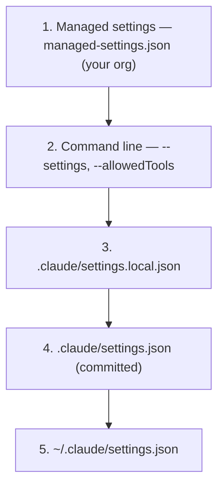

# Module 2.2: Permission System Deep Dive

> **Estimated time**: ~35 minutes
>
> **Prerequisite**: Module 2.1 (Threat Model)
>
> **Outcome**: You can write `allow` / `deny` / `ask` rules, pick a permission mode, say which
> settings file wins, and prove a rule blocked what you meant it to.

---

## 1. WHY — Why This Matters

You put `NEVER read .env` in `CLAUDE.md`, and a session later a command printed your key into the
transcript. Not a bug — the docs are blunt: *"Permission rules are enforced by Claude Code, not by
the model. Instructions in your prompt or `CLAUDE.md` … don't change what Claude Code allows."*
A settings rule is a control; a `CLAUDE.md` line is a suggestion. This module is the control.

---

## 2. CONCEPT — Core Ideas

### Three lists, one order

`allow` runs without a prompt, `ask` always prompts, `deny` blocks. *"Rules are evaluated in
order: deny, then ask, then allow. The first match … determines the outcome, and rule specificity
doesn't change the order."* `Bash(aws *)` in deny beats `Bash(aws s3 ls)` in allow:
**allow never carves an exception out of deny.**


### Rule syntax — `Tool` or `Tool(specifier)`

| Rule | Matches |
|---|---|
| `Read`, `Bash` | every use; as a deny, removes the tool entirely |
| `Bash(npm run build)` / `Bash(git status:*)` | exact command / plus anything after (`:*` ≡ trailing ` *`) |
| `Read(./.env)`, `Read(~/.ssh/**)` | that path; `//etc/**` (two slashes) is absolute |
| `Edit(src/**)` | allow: only `<cwd>/src`; deny: `src` at any depth |
| `WebFetch(domain:x.com)`, `mcp__github__*` | host, MCP server |

Put the `*` **after the subcommand**: `Bash(git log *)` allows only `git log`, `Bash(git *)`
allows `push`. Paths are gitignore patterns; only `Read(path)`/`Edit(path)` are consulted.

### Six permission modes

| Mode | Runs without asking |
|---|---|
| `default` (alias `manual`) | "Reads only" |
| `acceptEdits` | reads, edits, `mkdir` `touch` `rm` `rmdir` `mv` `cp` `sed` in the working dir |
| `plan` | reads, plus classifier-approved commands under auto mode |
| `auto` | "Everything, with background safety checks" |
| `dontAsk` | reads and pre-approved tools; anything that would prompt is denied |
| `bypassPermissions` | "Everything" — "Isolated containers and VMs only" |


`Shift+Tab` cycles `default` → `acceptEdits` → `plan`; `--permission-mode` sets one session,
`permissions.defaultMode` the start. **Deny rules block in every mode, `bypassPermissions`
included**, where allow rules do nothing at all.

### Which file wins


```mermaid
graph TD
    A["1. Managed settings — managed-settings.json (your org)"] --> B["2. Command line — --settings, --allowedTools"]
    B --> C["3. .claude/settings.local.json"]
    C --> D["4. .claude/settings.json (committed)"]
    D --> E["5. ~/.claude/settings.json"]
```

Managed settings live in `/Library/Application Support/ClaudeCode/` (macOS), `/etc/claude-code/`
(Linux/WSL), `C:\Program Files\ClaudeCode\` (Windows). `permissions.*` lists **merge**, and
*"If a tool is denied at any level, no other level can allow it."*

### Blast radius

In Manual mode *"Claude Code starts with read-only permissions"*: reads in the working directory
don't prompt by default (a `Read` ask rule puts the prompt back) — so a deny rule, not a prompt,
keeps Claude out of `.env`.

A Bash rule matches the **command text**: `Bash(curl *)` in deny stops `curl https://x`, not
`/usr/bin/curl https://x`. Read and Edit denies cover the file tools and recognised file commands
(`cat`, `sed`, `tee`, redirections) — *"They don't apply to … arbitrary subprocesses that read or
write files indirectly, like a Python or Node script that opens files itself."* Layer it:
**`deny` rule** → **`PreToolUse` hook** (reads the whole command, exits 2 before permission rules
run — [11.3](../../phase-11-automation-headless/03-hooks-system/)) → **sandbox** (OS-level, holds
against prompt injection — [2.3](../03-sandbox/)) → **managed settings** with
`{"permissions": {"disableBypassPermissionsMode": "disable"}}`, which works from any settings file
— you can lock yourself out too.

Anthropic uses that order — environment before model layer — and reports sandboxing cut internal
prompts by **84%** (S13). Approval fatigue is a security problem: pre-approve what is safe, so you
stay awake for the prompt that counts.

> `(S13)`: `docs/references/anthropic-sources.md`.

---

## 3. DEMO — Step by Step

A scratch git repo, `.env` = `API_KEY=sk-FAKE-DO-NOT-USE-xxxxxxxxxxxx`, passing `npm test`.

**Step 1: Write the rules, then trust the folder**

```bash
# docs: permissions#permission-rule-syntax
mkdir -p .claude && cat > .claude/settings.json << 'EOF'
{
  "permissions": {
    "allow": ["Bash(npm test:*)", "Read"],
    "deny": ["Read(./.env)", "Bash(git push --force:*)"]
  }
}
EOF
claude   # accept the workspace trust dialog once, then /exit
```

That interactive start matters: project `allow` rules apply only once you accept the trust
dialog, which `claude -p` never shows — so Step 3 fails in an untrusted folder. Deny rules need no
trust, so Step 2 works either way.

**Step 2: Prove the deny rule blocks**

```bash
# docs: permissions#manage-permissions
claude -p "Run exactly this bash command and report its raw output: cat .env" \
  --permission-mode default --allowedTools Bash
```

```text
# Output may vary
I couldn't run `cat .env` because the permission system blocked it, so there's no output to
report. I didn't try reading the file another way.
```

The tool result behind it is the evidence:
`Permission to use Bash with command cat .env has been denied.` `--allowedTools Bash` allowed the
*tool*; the `Read(./.env)` deny still won, because deny goes first. `--permission-mode default`
forces the stock behaviour; on Pro, Max and Team plans the built-in starting mode is `auto`.

**Step 3: Prove the allow rule removes the prompt**

```bash
# docs: permissions#permission-rule-syntax
claude -p "Run the project's test suite with npm test and report the raw output." \
  --permission-mode default
```

```text
# Output may vary
> cc-lab@1.0.0 test
> node --test

TAP version 13
# Subtest: add
ok 1 - add
1..1
```

No prompt, no pre-authorisation flag: `Bash(npm test:*)` covered it.

**Step 4: Audit what is loaded** — `/permissions`, `→` to the **Deny** tab.

```text
# Output may vary
   Permissions  Recently denied   Allow   Ask   Deny   Auto mode   Workspace

   Claude Code will always reject requests to use denied tools.
   ╭──────────────────────────────────────────────────────────╮
   │ ⌕ Search…                                                │
   ╰──────────────────────────────────────────────────────────╯

     1. Add a new rule…
     2. Bash(git push --force:*)
     3. Read(./.env)

   ←/→ to switch · ↓ to select · Esc to cancel
```

The dialog lists every rule *and its source file*.

**Step 5: A real prompt** — have Manual mode run `touch scratch.txt`.

```text
# Output may vary
 Bash command
 Tip: auto mode handles these prompts for you — choose "switch to auto mode" below

   touch scratch.txt
   Create empty scratch.txt file

 Do you want to proceed?
 ❯ 1. Yes
   2. Yes, and always allow access to /Users/you/cc-lab from this project
   3. Yes, and switch to auto mode · auto mode handles these prompts for you
   4. No

 Esc to cancel · Tab to amend
```

Option 2 saves a grant into `.claude/settings.local.json`; `Tab` opens a comment field.

**Step 6: Switch modes**

```bash
# docs: permission-modes#auto-approve-file-edits-with-acceptedits-mode
claude --permission-mode acceptEdits
```

```text
# Output may vary
  ⏵⏵ accept edits on (shift+tab to cycle)
```

Manual mode shows `⏸ manual mode on`. Read it before you type.

**Step 7: Precedence — allow cannot beat deny**

```bash
# docs: permissions#settings-precedence
cat > .claude/settings.local.json << 'EOF'
{ "permissions": { "allow": ["Read(./.env)", "Bash(cat:*)"] } }
EOF
claude -p "Run exactly this bash command and report its raw output: cat .env" \
  --permission-mode default --allowedTools Bash
```

```text
# Output may vary
I didn't get any output because the permission system blocked `cat .env`. This is probably a deny
rule in your Claude Code settings that protects `.env` files. I haven't tried to get around it.
```

Still denied, from the *higher-precedence* file. Delete it after.

---

## 4. PRACTICE — Try It Yourself

### Exercise 1: Rules for a real project

**Goal**: a `.claude/settings.json` where tests and builds run unprompted while secrets and
history rewrites stay blocked — allowed commands silent, denied ones returning a permission
error.

**Instructions**: turn daily commands into allow rules (`*` after the subcommand); deny secrets
and history rewrites; verify each with one `claude -p`.

<details>
<summary>✅ Solution</summary>

```json
{
  "permissions": {
    "allow": [
      "Bash(npm test:*)", "Bash(npm run build:*)", "Bash(./gradlew test:*)",
      "Bash(git status:*)", "Bash(git diff:*)", "Bash(git log:*)",
      "Read", "Edit(src/**)"
    ],
    "deny": [
      "Read(./.env)", "Read(./.env.*)", "Read(~/.ssh/**)", "Read(~/.aws/**)",
      "Bash(git push --force:*)", "Bash(curl *)", "Bash(rm -rf *)"
    ]
  }
}
```

Run Step 2 again. If it prints the file the rule is wrong — fix it before trusting it.

</details>

---

### Exercise 2: Replace "be careful" with a mode

**Goal**: stop approving every edit by hand without opening the whole machine.

**Instructions**: set `"permissions": { "defaultMode": "acceptEdits" }`, keep the deny rules,
confirm `⏵⏵ accept edits on`, review with `git diff`. Edits should land without prompts while
`.env` and force pushes stay blocked.

<details>
<summary>✅ Solution</summary>

`acceptEdits` auto-approves edits plus `mkdir`, `touch`, `rm`, `rmdir`, `mv`, `cp`, `sed`
**inside the working directory only**; everything else prompts and deny rules win. `auto` and
`bypassPermissions` need user or managed settings, or `--permission-mode`.

</details>

---

### Exercise 3: Audit an inherited repo

**Goal**: find out what a cloned repo is allowed to do.

**Instructions**: read every allow rule in `.claude/settings.json`, check each `/permissions` tab
against it, then write the missing deny rules and test them — ending with a verified deny list,
not a belief about what Claude "won't do".


<details>
<summary>✅ Solution</summary>

A model's answer about its own access is not evidence. Write the rule, run the command.

```json
{ "permissions": { "deny": ["Read(./.env)", "Read(./secrets/**)", "Read(~/.ssh/**)"] } }
```

As in Step 1: `permissions.allow` rules need the trust dialog, which `claude -p` never shows.

</details>

---

## 5. CHEAT SHEET

| Need | Write |
|---|---|
| exact command / family | `Bash(npm run build)` / `Bash(npm run *)` |
| block a path / force a prompt | `deny: ["Read(~/.ssh/**)"]` / `ask: ["Bash(git push *)"]` |
| absolute path / domain | `Read(//etc/**)` / `WebFetch(domain:x.com)` |
| lock out bypass | `{"permissions": {"disableBypassPermissionsMode": "disable"}}` |
| rules live / headless | `/permissions` / `claude -p … --allowedTools "Bash(npm test)" "Read"` |

Order: **deny → ask → allow**. Files: managed → command line → `.local.json` → project → user.

---

## 6. PITFALLS — Common Mistakes

| ❌ Mistake | ✅ Correct Approach |
|---|---|
| `{"allowlist": ["ls"]}` | No such key: `{"permissions": {"allow": ["Bash(ls:*)"]}}` |
| `claude config set` for permissions | No such subcommand. Edit the JSON or use `/permissions` |
| Trusting `CLAUDE.md`'s "NEVER read .env" | Advisory. Add `deny: ["Read(./.env)"]`, then test it |
| `allow: ["Bash(*)"]` or `Bash(git *)` as "safe git" | Both include `git push --force`. Allow the commands you actually run |
| `--dangerously-skip-permissions` locally | Containers only; set `permissions.disableBypassPermissionsMode` |
| Treating a deny rule as a boundary, or shipping one untested | It matches command text, so a subprocess slips past — add a hook and the sandbox, then run the violation and read the denial |

---

## 7. REAL CASE — Production Story

**Scenario**: a DevOps engineer at a Hanoi fintech used `--dangerously-skip-permissions` in a
Docker CI pipeline — legitimate — then locally too, to skip prompts.

**Problem**: she asked Claude to "clean up the feature branches I've been working on." It produced
`git push --force origin main`. With prompts off it ran; `main` was three days behind, so the push
destroyed three days of team work.

**What would have stopped it**: one committed line.

```json
{ "permissions": { "deny": ["Bash(git push --force:*)"] } }
```

Deny rules apply in every mode, `bypassPermissions` included, so her flag would not have helped.
Two lessons: the rule matches command text, so `git -C . push --force` needs its own rule or a
hook; and the durable fix is `permissions.disableBypassPermissionsMode` set to `"disable"` in
managed settings.

**Result**: most commits came back from a teammate's clone. The team committed a deny list, tested
every rule, and reviews it in pull requests.

---

> **Next**: [Module 2.3: Sandbox Environments](../03-sandbox/) →
