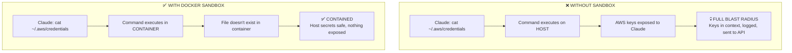

# Module 2.3: Sandbox Environments — Containing the Blast Radius

> **Estimated time**: ~40 minutes
>
> **Prerequisite**: Module 2.2 (Permission System)
>
> **Outcome**: After this module, you will be able to run Claude Code in an isolated Docker environment that limits the blast radius of any mistake or malicious action

---

## 1. WHY — Why This Matters

You now understand the blast radius (Module 2.1) and permission prompts (Module 2.2). But permissions are reactive — you must catch every dangerous request and say "no." That requires perfect discipline every single time. One moment of distraction, one misleading prompt from Claude, one permission you approve thinking it's safe — and the damage is done.

Sandboxing is proactive defense. Instead of relying on you to block bad actions, sandboxing makes dangerous actions impossible by design. Permissions are your seatbelt. Sandbox is the airbag. Even if you make a mistake — even if Claude tricks you into approving `rm -rf ~/.ssh` — the sandbox contains the blast radius. The host system stays safe.

If you work with client code, handle sensitive data, or simply value your machine's integrity, sandboxing is not optional. It's the difference between "I hope I catch every mistake" and "mistakes can't escape this box."

---

## 2. CONCEPT — Core Ideas

### Why Sandbox Over Permissions Alone

| Approach | Model | Failure Mode |
|----------|-------|--------------|
| **Permissions only** | Reactive — you must catch every bad request | One approval mistake = full compromise |
| **Sandbox** | Proactive — bad requests can't reach outside the box | Damage contained to sandbox environment |
| **Both (defense in depth)** | Layered security | Mistake must bypass multiple barriers |

Permissions require human vigilance. Sandboxes enforce isolation automatically. Best practice: use **both**.

### How Sandboxing Works

A sandbox is an isolated environment where Claude Code runs. It can only access what you explicitly give it. Everything else — your home directory, SSH keys, AWS credentials, other projects — doesn't exist from Claude's perspective.



### Docker as Primary Sandbox

Docker containers provide excellent isolation for development work:

- **Mount ONLY the project directory** — Claude sees only your project code
- **No network by default** — prevents data exfiltration (`--network=none`)
- **Resource limits** — prevents resource exhaustion attacks
- **Disposable** — destroy container after session (`--rm`)
- **No persistence** — secrets in container context disappear on exit

Critical rule: **Never mount your home directory, ~/.ssh, ~/.aws, or any parent directory containing secrets.**

### Devcontainers (VS Code Integration)

Devcontainers (`.devcontainer/devcontainer.json`) provide team-sharable sandbox configurations:

- Same isolation as Docker, but integrated with VS Code
- Team members get identical, secure environments
- Configuration lives in version control
- Still requires careful mount configuration

### Cloud Sandboxes

⚠️ Needs verification — check current GitHub Codespaces / Gitpod support for Claude Code.

Cloud sandboxes (GitHub Codespaces, Gitpod) offer zero-setup isolation:

- Your machine is never exposed — environment is remote
- Credentials managed by cloud platform
- Disposable by design
- Tradeoff: cost and network dependency

### Sandbox Levels

| Level | Description | What Claude Can Access | Recommended For |
|-------|-------------|------------------------|-----------------|
| **0** | No sandbox | Everything on your system | ❌ Never recommended |
| **1** | Discipline only | Everything (relies on you saying "no") | ❌ Quick tasks only, high risk |
| **2** | Docker + project mount | Project files only | ✅ Daily development |
| **3** | Docker + no network + project mount | Project files, no internet | ✅ Sensitive projects |
| **4** | Cloud sandbox | Nothing on your machine | ✅ Client work, untrusted code |

---

## 3. DEMO — Step by Step

Let's build a Docker sandbox for Claude Code from scratch. This sandbox will isolate Claude to a single project directory with no network access.

### Step 1: Create Dockerfile

Create a file named `Dockerfile` in an empty directory:

```dockerfile
# Dockerfile for Claude Code sandbox
FROM node:20-slim

# Install system dependencies
RUN apt-get update && apt-get install -y \
    git \
    curl \
    build-essential \
    && rm -rf /var/lib/apt/lists/*

# ⚠️ Needs verification - actual Claude Code installation method may differ
# This is a placeholder - check official docs for correct installation
RUN npm install -g @anthropic-ai/claude-code || echo "Installation method needs verification"

# Create non-root user for additional safety
RUN useradd -m -s /bin/bash developer
USER developer
WORKDIR /workspace

# Default command
CMD ["bash"]
```

**Why this matters**: We use a minimal base image (node:20-slim), create a non-root user, and set /workspace as the working directory. This is where we'll mount the project.

Expected output when building:
```
Successfully built abc123def456
Successfully tagged claude-sandbox:latest
```

### Step 2: Build the Image

```bash
docker build -t claude-sandbox .
```

**Why this matters**: The `-t` flag tags the image with a name you can reference later. Building takes 2-5 minutes on first run.

Expected output:
```
[+] Building 145.2s (8/8) FINISHED
 => [internal] load build definition from Dockerfile
 => => transferring dockerfile: 512B
 => [internal] load .dockerignore
 => ...
 => exporting to image
 => => naming to docker.io/library/claude-sandbox
```

### Step 3: Run with Correct Mounts (CRITICAL)

This is the most security-critical step. The `-v` flag controls what Claude can access.

```bash
docker run -it --rm \
  -v "$(pwd)":/workspace \
  --network=none \
  --memory=4g \
  --cpus=2 \
  claude-sandbox
```

**Breaking down each flag**:
- `-it` — interactive terminal
- `--rm` — **CRITICAL** — destroy container on exit (no secret persistence)
- `-v "$(pwd)":/workspace` — mount current directory ONLY, not home or parent
- `--network=none` — **CRITICAL** — no internet = no data exfiltration
- `--memory=4g` — limit memory usage
- `--cpus=2` — limit CPU usage

Expected output:
```
developer@a1b2c3d4e5f6:/workspace$
```

You're now inside the container. Your prompt shows you're the `developer` user in `/workspace`.

### Step 4: Verify Isolation — Try to Access Host Secrets

Inside the container, attempt to access common secret locations:

```bash
# Try to read AWS credentials
cat ~/.aws/credentials
```

Expected output:
```
cat: /home/developer/.aws/credentials: No such file or directory
```

```bash
# Try to read SSH keys
cat ~/.ssh/id_rsa
```

Expected output:
```
cat: /home/developer/.ssh/id_rsa: No such file or directory
```

```bash
# List home directory
ls -la ~
```

Expected output:
```
total 8
drwxr-xr-x 1 developer developer 4096 Feb  1 12:00 .
drwxr-xr-x 1 root      root      4096 Feb  1 12:00 ..
-rw-r--r-- 1 developer developer  220 Feb  1 12:00 .bash_logout
-rw-r--r-- 1 developer developer 3526 Feb  1 12:00 .bashrc
-rw-r--r-- 1 developer developer  807 Feb  1 12:00 .profile
```

**Why this matters**: No `.aws`, no `.ssh`, no secrets. The container home directory is empty except for default shell configs. Host secrets are invisible.

### Step 5: Verify Network Isolation

Attempt to reach the internet:

```bash
curl https://google.com
```

Expected output:
```
curl: (6) Could not resolve host: google.com
```

**Why this matters**: Even if Claude manages to execute a malicious command that tries to exfiltrate data via HTTP, it fails. No network = no data leaves the container.

### Step 6: Verify Project Access

Your project files should be visible:

```bash
ls /workspace
```

Expected output:
```
Dockerfile  README.md  src/  package.json
```

**Why this matters**: Claude can read and modify project files (as intended), but nothing else. Blast radius is contained to this project only.

### Step 7: Exit and Verify Cleanup

```bash
exit
```

The container is destroyed (because of `--rm`). Any secrets that entered Claude's context during the session are gone. Start fresh next time with a clean environment.

---

## 4. PRACTICE — Try It Yourself

### Exercise 1: Build Your First Sandbox

**Goal**: Create a working Docker sandbox for Claude Code and verify it runs.

**Instructions**:
1. Create a new directory: `mkdir ~/claude-sandbox-test && cd ~/claude-sandbox-test`
2. Create the Dockerfile from Step 1 of the DEMO section
3. Build the image: `docker build -t my-claude-sandbox .`
4. Run the container: `docker run -it --rm -v "$(pwd)":/workspace my-claude-sandbox`
5. Inside the container, run: `pwd` and `ls -la ~`

**Expected result**: You should see `/workspace` as your working directory, and the home directory should contain only default shell config files (no `.aws`, `.ssh`, etc.).

<details>
<summary>💡 Hint</summary>

If the build fails, check:
- Is Docker installed and running? (`docker --version`)
- Are you in the directory with the Dockerfile?
- Does the Dockerfile have correct syntax (no tabs, proper indentation)?

</details>

<details>
<summary>✅ Solution</summary>

```bash
# Step by step solution
mkdir ~/claude-sandbox-test
cd ~/claude-sandbox-test

# Create Dockerfile (copy from DEMO section above)
cat > Dockerfile << 'EOF'
FROM node:20-slim

RUN apt-get update && apt-get install -y \
    git \
    curl \
    build-essential \
    && rm -rf /var/lib/apt/lists/*

RUN useradd -m -s /bin/bash developer
USER developer
WORKDIR /workspace

CMD ["bash"]
EOF

# Build
docker build -t my-claude-sandbox .

# Run
docker run -it --rm -v "$(pwd)":/workspace my-claude-sandbox

# Inside container, verify:
pwd                  # Should show: /workspace
ls -la ~             # Should show: only .bashrc, .profile, .bash_logout
cat ~/.ssh/id_rsa    # Should fail: No such file or directory
```

Success looks like this:
- Build completes without errors
- Container starts and drops you into a bash prompt
- `pwd` shows `/workspace`
- No secrets visible in home directory

</details>

---

### Exercise 2: Test the Blast Radius

**Goal**: Prove that secrets on your host are invisible to the container.

**Instructions**:
1. On your HOST machine, create a fake secret: `echo "SECRET_KEY=fake-api-key-12345" > ~/.fake-secret`
2. Start your sandbox container: `docker run -it --rm -v "$(pwd)":/workspace my-claude-sandbox`
3. Inside the container, try to read the secret: `cat ~/.fake-secret`
4. Exit the container
5. Verify the secret still exists on host: `cat ~/.fake-secret`

**Expected result**: Step 3 should fail with "No such file or directory". Step 5 should succeed and show the secret. This proves the container cannot access host files outside the mount.

<details>
<summary>💡 Hint</summary>

The container's home directory (`~` inside container) is `/home/developer`, which is separate from your host home directory. Files in your host's `~` are NOT visible unless you mount them with `-v`.

</details>

<details>
<summary>✅ Solution</summary>

```bash
# On HOST
echo "SECRET_KEY=fake-api-key-12345" > ~/.fake-secret

# Start container
docker run -it --rm -v "$(pwd)":/workspace my-claude-sandbox

# INSIDE CONTAINER - this should FAIL
cat ~/.fake-secret
# Output: cat: /home/developer/.fake-secret: No such file or directory

# Exit container
exit

# Back on HOST - this should SUCCEED
cat ~/.fake-secret
# Output: SECRET_KEY=fake-api-key-12345
```

**What this proves**: The container's `~/.fake-secret` is a different file than the host's `~/.fake-secret`. Container home (`/home/developer`) is isolated from host home. Secrets are safe.

</details>

---

### Exercise 3: Verify Network Isolation

**Goal**: Confirm that `--network=none` actually prevents network access.

**Instructions**:
1. Run container WITH network: `docker run -it --rm -v "$(pwd)":/workspace my-claude-sandbox`
2. Inside container, test network: `curl -I https://google.com`
3. Exit container
4. Run container WITHOUT network: `docker run -it --rm -v "$(pwd)":/workspace --network=none my-claude-sandbox`
5. Inside container, test network again: `curl -I https://google.com`

**Expected result**: Step 2 should succeed (you'll see HTTP headers). Step 5 should fail with "Could not resolve host". This proves `--network=none` works.

<details>
<summary>💡 Hint</summary>

The `-I` flag makes curl fetch only HTTP headers (faster test). If curl isn't installed in your container, install it first: `apt-get update && apt-get install -y curl` (requires running container as root or rebuilding Dockerfile).

</details>

<details>
<summary>✅ Solution</summary>

```bash
# WITH network (default)
docker run -it --rm -v "$(pwd)":/workspace my-claude-sandbox

# Inside container
curl -I https://google.com
# Output: HTTP/2 200 (success - network works)

exit

# WITHOUT network
docker run -it --rm -v "$(pwd)":/workspace --network=none my-claude-sandbox

# Inside container
curl -I https://google.com
# Output: curl: (6) Could not resolve host: google.com (FAIL - network blocked)

exit
```

**What this proves**: `--network=none` actually blocks network access. Even if Claude Code (or malicious code) tries to exfiltrate data via HTTP, it fails silently.

</details>

---

## 5. CHEAT SHEET

### Essential Docker Sandbox Commands

| Command | Purpose | Security Note |
|---------|---------|---------------|
| `docker build -t name .` | Build sandbox image | One-time setup |
| `docker run -it --rm` | Run interactive, auto-cleanup | `--rm` prevents secret persistence |
| `-v "$(pwd)":/workspace` | Mount current directory | ⚠️ ONLY mount project, never `~` |
| `--network=none` | Disable networking | Prevents data exfiltration |
| `--memory=4g` | Limit RAM to 4GB | Prevents resource exhaustion |
| `--cpus=2` | Limit to 2 CPU cores | Prevents resource exhaustion |
| `-u $(id -u):$(id -g)` | Match host user UID/GID | Fixes file permission issues |

### What to Mount vs. What to NEVER Mount

| Path | Mount? | Reason |
|------|--------|--------|
| `$(pwd)` (current project) | ✅ YES | This is your working directory |
| `~/project-name` (specific project) | ✅ YES | Explicit, isolated project |
| `~` (home directory) | ❌ NEVER | Contains all your secrets |
| `~/.ssh` | ❌ NEVER | SSH keys exposed |
| `~/.aws` | ❌ NEVER | AWS credentials exposed |
| `~/.config` | ❌ NEVER | Contains API keys, tokens |
| `/var/run/docker.sock` | ❌ NEVER | Docker socket = root on host |
| Parent directory with secrets | ❌ NEVER | Siblings might have `.env` files |

### Quick Sandbox Levels Reference

| Use Case | Command |
|----------|---------|
| **Daily dev** (Level 2) | `docker run -it --rm -v "$(pwd)":/workspace sandbox` |
| **Sensitive project** (Level 3) | `docker run -it --rm -v "$(pwd)":/workspace --network=none sandbox` |
| **Client work** (Level 4) | Use GitHub Codespaces or Gitpod (zero host exposure) |

---

## 6. PITFALLS — Common Mistakes

| ❌ Mistake | ✅ Correct Approach |
|-----------|---------------------|
| Mounting home directory: `-v ~:/home` | Mount ONLY project: `-v "$(pwd)":/workspace` — home contains all secrets |
| Forgetting `--rm` flag | Always use `--rm` — prevents containers with secrets from persisting on disk |
| Using `--privileged` flag | NEVER use `--privileged` — gives container root on host, defeats all isolation |
| Mounting Docker socket: `-v /var/run/docker.sock:/var/run/docker.sock` | NEVER mount Docker socket — equivalent to root access on host |
| Forgetting `--network=none` for sensitive work | Always use `--network=none` for client work or sensitive data — prevents exfiltration |
| Mounting parent directory: `-v ~/projects:/workspace` | Mount specific project only: `-v ~/projects/client-a:/workspace` — siblings might have secrets |
| Running as root user in container | Create non-root user in Dockerfile (see DEMO) — limits damage from container escape |
| Hardcoding secrets in Dockerfile | NEVER put secrets in Dockerfile — they persist in image layers forever |
| Assuming `--rm` deletes image layers | `--rm` deletes container, not image — rebuild image if secrets leaked during build |

---

## 7. REAL CASE — Production Story

**Scenario**: TechViet Solutions, a software outsourcing company in Ho Chi Minh City, works on multiple client projects simultaneously. Their team structure has developers working on 2-3 client projects per week. Each client has separate repositories, separate `.env` files, and strict NDA requirements.

**Problem**: Developer Susan is working on Client A's banking app codebase (`~/projects/client-a/`). She asks Claude Code: "Find all API endpoints that aren't using authentication middleware." Claude Code, being thorough, searches broadly. It reads not just Client A's code, but accidentally traverses up to `~/projects/` and reads Client B's `.env` file in the sibling directory (`~/projects/client-b/.env`).

Client B's `.env` contains their payment gateway API key. This key is now in Claude Code's context. It may be:
- Logged to Anthropic's servers (for debugging)
- Included in Claude's response if it thinks it's relevant
- Cached in terminal scrollback
- Visible in screenshots Susan takes for documentation

This is an **NDA violation**. TechViet must report to Client B that their credentials were exposed to an AI system and third-party servers. Client B demands a full security audit and threatens contract termination.

**How Sandbox Would Have Prevented This**:

If Susan had used Docker sandbox:

```bash
# Client A work session
cd ~/projects/client-a
docker run -it --rm \
  -v "$(pwd)":/workspace \
  --network=none \
  claude-sandbox
```

From inside this container:
- Working directory is `/workspace` (which is Client A's code only)
- `~/projects/client-b/` does not exist in the container
- Claude Code's search commands (`find`, `grep`, `cat`) can only see Client A's files
- Even if Claude tries `cat ~/projects/client-b/.env`, it fails: "No such file or directory"

The blast radius is **contained to Client A only**. Cross-contamination is impossible by design, not by discipline.

**Solution Implemented**:

TechViet Solutions mandated Docker sandboxes for all client work:

1. Each client project gets a pre-built sandbox image (Dockerfile in repo)
2. Developers must use `./scripts/sandbox.sh` script that enforces correct mounts
3. CI/CD checks verify no `.env` files are committed
4. Weekly audit: `docker ps -a` to check for containers without `--rm` flag

**Result**: No cross-client contamination incidents in 6 months. Developers initially complained about "extra steps," but after one audit where a competitor was breached due to AI-assisted coding exposure, the team embraced it. Client confidence increased, and TechViet now markets "AI-safe development practices" as a competitive advantage.

**Key lesson**: Sandboxing isn't paranoia. It's professional practice when handling client data. The 30 seconds to start a container is worth avoiding the career-ending mistake of leaking client secrets.

---

> **Next**: [Module 2.4: Secret Management](../04-secret-management/) →
