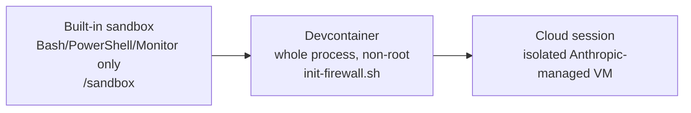

# Module 2.3: Sandbox Environments — Containing the Blast Radius

> **Estimated time**: ~35 minutes
>
> **Prerequisite**: Module 2.2 (Permission System)
>
> **Outcome**: Turn on the built-in sandbox, restrict Bash filesystem/network with `sandbox.*`
> settings, run the devcontainer firewall, and verify each control blocks.

---

## 1. WHY — Why This Matters

Module 2.2's deny rules match **command text** — they don't stop a subprocess a script spawns, and
don't cover Read/Edit/Write. A tool reading `~/.aws/credentials` directly slips past a rule never
designed to catch it.

Sandboxing moves containment down a layer: the OS enforces what a process can touch, regardless of
what the model decided to run — environment layer first, model layer second (S13). This module
covers three options: built-in sandbox, devcontainer, cloud session.

---

## 2. CONCEPT — Core Ideas

### VERIFIED vs. RECOMMENDED vs. ASSUMED RISK

| Status | Claim |
|---|---|
| **VERIFIED** | Sandbox: macOS (Seatbelt), Linux/WSL2 (bubblewrap); **"Native Windows is not supported. On Windows, run Claude Code inside a WSL2 distribution."** |
| **VERIFIED** | "Applies only to Bash, PowerShell, and Monitor commands." Read/Edit/WebFetch are gated by permission rules instead; MCP servers and hooks "run unconstrained on the host" |
| **VERIFIED** | Default read access is "the entire computer, except certain denied directories… this default still allows reading credential files such as `~/.aws/credentials` and `~/.ssh/`" unless you add `denyRead` |
| **VERIFIED** | `network.allowedDomains` alone doesn't deny: "the first time a command needs a new domain, Claude Code prompts for approval." Hard deny needs `strictAllowlist: true` (user/managed/`--settings` only, v2.1.219+) |
| **RECOMMENDED** | Filesystem *and* network restrictions together — see below |
| **ASSUMED RISK** | Any egress can leak whatever the agent can read; a sandbox shrinks blast radius, it doesn't remove it |

### Sandboxing needs both layers

> "Effective sandboxing requires both filesystem and network isolation. Without network isolation,
> a compromised agent could exfiltrate sensitive files like SSH keys. Without filesystem
> isolation… a compromised agent could backdoor system resources to gain network access."

### Three containment layers


```mermaid
graph LR
    A["Built-in sandbox<br/>Bash/PowerShell/Monitor only<br/>/sandbox"] --> B["Devcontainer<br/>whole process, non-root<br/>init-firewall.sh"] --> C["Cloud session<br/>isolated Anthropic-managed VM"]
```

1. **Built-in sandbox** (`/sandbox`) — OS-enforced, Bash-only, zero install on macOS.
2. **Devcontainer** — the whole process, MCP servers, hooks run inside Docker as non-root; the
   reference container adds a default-deny firewall.
3. **Cloud session** (`claude --cloud`) — isolated, Anthropic-managed VM; "network access is
   limited by default and can be configured to be disabled or allow only specific domains."

### Documented limitations

- **No TLS inspection**: broad domains "can create paths for data exfiltration… via domain
  fronting"; `allowUnixSockets` + `/var/run/docker.sock` "effectively grants access to the host
  system through the Docker socket."
- **Escape hatch**: Claude may retry blocked commands "outside the sandbox" via
  `dangerouslyDisableSandbox`; `"allowUnsandboxedCommands": false` makes Claude Code ignore it.
- **Devcontainer + `--dangerously-skip-permissions`**: still exfiltrates "the Claude Code
  credentials stored in `~/.claude`."

### Data handling — no overclaim

Isolation isn't retention: files Claude reads "are transmitted to the Anthropic API … with or
without a sandbox." After that: commercial plans aren't trained on unless you opt in (30-day
retention); consumer plans choose — 5 years opted in, 30 days if not.

---

## 3. DEMO — Step by Step

Lab: macOS, Claude Code v2.1.283, `~/cc-lab`. Merge into `.claude/settings.local.json`:

```json
// docs: sandboxing#configure-sandboxing
{
  "permissions": { "defaultMode": "default" },
  "sandbox": {
    "enabled": true,
    "allowUnsandboxedCommands": false,
    "network": { "allowedDomains": ["registry.npmjs.org"] },
    "filesystem": { "denyRead": ["~/cc-lab-fake-ssh"] }
  }
}
```

`denyRead` points at a throwaway `~/cc-lab-fake-ssh/config` (fake string
`sk-FAKE-DO-NOT-USE-xxxxxxxxxxxx`), not real `~/.ssh` — list `~/.ssh` and `~/.aws` in your own
settings.

**Step 1**: run `/sandbox`.

```text
# Output may vary
  Sandbox  Mode   Overrides   Config
  Configure mode
    1. Sandbox BashTool, with auto-allow ✔
    2. Sandbox BashTool, with regular permissions
    3. No Sandbox
  ←/→ to switch · ↑/↓ to navigate · Enter to select · Esc to close
```

Overrides confirms `allowUnsandboxedCommands: false` as **"Strict sandbox mode (current)"**;
Config lists `Network Restrictions: Allowed: registry.npmjs.org` and `Filesystem Read
Restrictions: Denied: … ~/cc-lab-fake-ssh` (plus internal protected paths).

**Step 2 — network block**: `allowedDomains` alone only pre-approves listed hosts — an unlisted one
still prompts, so a scripted run just hangs. For a deterministic deny, start with `--settings` (no
effect from `.claude/settings.local.json`):

```bash
# docs: sandboxing#network-isolation
claude --settings '{"sandbox": {"network": {"strictAllowlist": true}}}'
```

Then ask Claude to run `curl -sI --max-time 5 https://example.com`.

```text
# Output may vary
⏺ Bash(curl -sI --max-time 5 https://example.com)
  ⎿  Error: Exit code 56
     HTTP/1.1 403 Forbidden
     X-Proxy-Error: blocked-by-allowlist
The sandbox also reported this violation:
deny network-outbound example.com:443 (host is not on the allow list)
```

The proxy denies it outright, instead of curl timing out.

**Step 3 — network allow**: ask for `npm view left-pad version --cache "$TMPDIR/npm-cache-demo"`
(plain `npm view` fails first on an unrelated sandbox *write* restriction — only the working dir
and `$TMPDIR` are writable, not `~/.npm/_cacache`).

```text
# Output may vary
⏺ Bash(npm view left-pad version --cache "$TMPDIR/npm-cache-demo")
  ⎿  1.3.0
```

Same session: `registry.npmjs.org` is listed, so it goes through.

**Step 4 — filesystem block**: `cat ~/cc-lab-fake-ssh/config`.

```text
# Output may vary
⏺ Bash(cat ~/cc-lab-fake-ssh/config)
  ⎿  Error: Exit code 1
     cat: /Users/you/cc-lab-fake-ssh/config: Operation not permitted
```

**Step 5 — prove the boundary**: ask Claude to use the **Read tool** (not Bash) on the same file.

```text
# Output may vary
 Read file
  Read(/Users/you/cc-lab-fake-ssh/config)
 Do you want to proceed?
 ❯ 1. Yes
   2. Yes, allow reading from /Users/you/cc-lab-fake-ssh during this session
   3. No
```

Approve it — Claude explains why: "This session's sandbox blocks Bash from reading that
directory... The Read tool isn't covered by that sandbox rule." Live proof of scope: Bash only.
(The prompt appears because the lab pins Manual mode; under auto mode — default since v2.1.283 —
the classifier decides instead.)

Close the gap with a 2.2 permission rule on the same path — "paths and domains from both sandbox
settings and permission rules are merged":

```json
{ "permissions": { "deny": ["Read(~/cc-lab-fake-ssh/**)"] } }
```

Ask again: Read refuses outright, "File is in a directory that is denied by your permission
settings."

**Step 6 — devcontainer firewall** (real run, Docker was on for this lab):

```bash
# docs: devcontainer#restrict-network-egress
git clone --depth 1 https://github.com/anthropics/claude-code /tmp/cc && cd /tmp/cc/.devcontainer
docker build -t cc-devcontainer-demo .
docker run --rm --cap-add=NET_ADMIN --cap-add=NET_RAW cc-devcontainer-demo bash -c \
  'sudo /usr/local/bin/init-firewall.sh; claude --version; curl -sI --max-time 5 https://example.com; echo exit:$?'
```

```text
# Output may vary
Firewall verification passed - unable to reach https://example.com as expected
Firewall verification passed - able to reach https://api.github.com as expected
2.1.283 (Claude Code)
exit:7
```

The script's self-test confirms the block; `claude --version` only confirms the binary runs in the
locked-down container — it makes no API call, so it doesn't prove the allowlist reaches
`api.anthropic.com`. Fixed allowlist: `registry.npmjs.org`, `api.anthropic.com`, five more named
domains, plus live GitHub IP ranges and the host's `/24`.

Clean up: `docker rmi cc-devcontainer-demo`, `rm -rf /tmp/cc`, delete `~/cc-lab-fake-ssh`, restore
`.claude/settings.local.json` to `{"permissions": {"defaultMode": "default"}}`.

---

## 4. PRACTICE — Try It Yourself

### Exercise 1: Allowlist for an Android project

**Goal**: let Gradle/Maven resolve, deny everything else outright.

**Instructions**: add `allowedDomains` for `dl.google.com`, `repo.maven.apache.org`,
`*.gradle.org`, a write grant for Gradle's cache, and `strictAllowlist` (project settings can't set
it — use `--settings` or user settings). Expected: `./gradlew dependencies` succeeds; `curl -sI
https://example.com` gets a 403.

<details>
<summary>✅ Solution</summary>

```json
{ "sandbox": { "enabled": true, "network": {
  "allowedDomains": ["dl.google.com", "repo.maven.apache.org", "*.gradle.org"],
  "strictAllowlist": true },
  "filesystem": { "allowWrite": ["~/.gradle"] } } }
```

Gradle's cache lives under `~/.gradle`, hence the grant.

</details>

---

### Exercise 2: Block AWS credentials

**Goal**: stop sandboxed Bash *and* the Read tool from reading `~/.aws/credentials` (default read
policy allows it). Expected: `cat ~/.aws/credentials` fails under Bash; Read on the same path is
refused outright, not just prompted.

<details>
<summary>✅ Solution</summary>

```json
{ "sandbox": { "enabled": true, "credentials": {
  "files": [{ "path": "~/.aws/credentials", "mode": "deny" }] } },
  "permissions": { "deny": ["Read(~/.aws/credentials)"] } }
```

Without `permissions.deny`, Read still reaches a prompt — one distracted "Yes" and the key is in
context and the transcript.

</details>

---

### Exercise 3: Managed enforcement

**Goal**: require the sandbox org-wide.

<details>
<summary>✅ Solution</summary>

```json
{ "sandbox": { "enabled": true, "failIfUnavailable": true, "allowUnsandboxedCommands": false } }
```

Deploy via managed settings (macOS: `/Library/Application Support/ClaudeCode/managed-settings.json`;
Linux/WSL: `/etc/claude-code/managed-settings.json`), not a project file — managed `enabled`
overrides local settings (Module 10.5).

</details>

---

## 5. CHEAT SHEET

| Key / command | Effect | Verify |
|---|---|---|
| `/sandbox` | Open panel (Mode/Overrides/Config) | Config tab shows resolved rules |
| `sandbox.enabled` | Turn sandbox on | Config tab non-empty |
| `allowUnsandboxedCommands: false` | Disable escape hatch | Overrides → "Strict sandbox mode" |
| `network.allowedDomains` | Pre-approve domains; others prompt | Allowed reaches; others prompt |
| `network.strictAllowlist: true` | Hard-deny unlisted (user/managed/`--settings`) | `403` / `blocked-by-allowlist` |
| `filesystem.denyRead` + `permissions.deny: ["Read(path/**)"]` | Block a path for Bash *and* Read | `Operation not permitted`; Read refused, no prompt |
| `failIfUnavailable` | Refuse unsandboxed start | Missing dep on Linux blocks startup |
| `init-firewall.sh` | Default-deny iptables + allowlist | Self-test prints "verification passed" |
| `disableBypassPermissionsMode: "disable"` | Block `--dangerously-skip-permissions` | `/status` → managed source |

---

## 6. PITFALLS — Common Mistakes

| ❌ Mistake | ✅ Correct Approach |
|---|---|
| Cutting Docker's network (`--network` set `none`) | Claude Code needs `api.anthropic.com` — allowlist egress instead |
| Assuming `allowedDomains` denies unlisted hosts, or the sandbox covers Read/Edit | It only pre-approves; add `strictAllowlist` for a real deny. Sandbox = Bash/PowerShell/Monitor — Read/Edit/WebFetch use permission rules, MCP/hooks run unconstrained |
| Allowlisting `github.com` broadly, or adding `/var/run/docker.sock` to `allowUnixSockets` | No TLS inspection enables domain fronting; the socket "effectively grants access to the host system" |
| Mounting `~/.ssh` into a devcontainer | Docs: "prefer repository-scoped or short-lived tokens" instead |
| "Anthropic logs and trains on your code" | Depends on account: commercial isn't trained on unless opted in |

---

## 7. REAL CASE — Production Story

A Vietnamese fintech runs an unattended overnight agent (dependency bumps, changelog drafts) in
the reference devcontainer with `--dangerously-skip-permissions` — safe only because it's non-root.
Its firewall allowlist is the reference defaults plus one addition: an internal GitHub Enterprise
host.

**Blast radius, and the firewall doesn't need to fail**: "Only use dev containers when developing
with trusted repositories, and monitor Claude's activities" — because "dev containers do not
prevent a malicious project from exfiltrating anything accessible inside the container, including
the Claude Code credentials stored in `~/.claude`." The allowlist resolves every GitHub IP range
live, so a *working* firewall still lets a compromised dependency push data to any public repo or
gist on `github.com` — the exfiltration path, not a misconfiguration. The team reviews the script
on every base-image bump and never mounts `~/.ssh` — cloud credentials go in as scoped, short-lived
env vars.

**Result**: jobs run unattended on trusted repos only; a monthly allowlist review is the real
control, not a hope the agent "wouldn't do that."

---

> **Next**: [Module 2.4: Secret Management](../04-secret-management/) →
