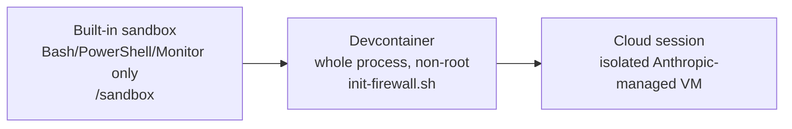

# Module 2.3: Sandbox Environments — Containing the Blast Radius

> **Estimated time**: ~35 minutes
>
> **Prerequisite**: Module 2.2 (Permission System)
>
> **Outcome**: Turn on the built-in sandbox, restrict Bash filesystem/network access with
> `sandbox.*` settings, run the official devcontainer firewall, and verify each control blocks.

---

## 1. WHY — Why This Matters

Module 2.2's deny rules match **command text** — they don't stop a subprocess a script spawns on
its own, and they don't cover Read/Edit/Write at all. A prompt-injected script that shells out, or
a tool that reads `~/.aws/credentials` directly, slips past a rule never designed to catch it.

Sandboxing moves containment down a layer: the operating system enforces what a process can
touch, regardless of what the model decided to run. Anthropic's containment work puts this order
plainly — environment layer first, model layer second (S13). This module covers the three
environment-layer options Claude Code ships: the built-in sandbox, the official devcontainer, and
cloud sessions.

---

## 2. CONCEPT — Core Ideas

### VERIFIED vs. RECOMMENDED vs. ASSUMED RISK

| Status | Claim |
|---|---|
| **VERIFIED** | Sandbox runs on macOS (Seatbelt), Linux/WSL2 (bubblewrap); **"Native Windows is not supported. On Windows, run Claude Code inside a WSL2 distribution."** |
| **VERIFIED** | "Applies only to Bash, PowerShell, and Monitor commands and their child processes" — Read, Edit, Write, WebFetch, MCP servers, hooks are **not** covered; they use the ordinary permission system |
| **VERIFIED** | Default read access is "the entire computer, except certain denied directories… this default still allows reading credential files such as `~/.aws/credentials` and `~/.ssh/`" unless you add `denyRead` |
| **RECOMMENDED** | Use filesystem *and* network restrictions together — see below |
| **ASSUMED RISK** | Any environment with egress can still leak whatever the agent can read; a sandbox shrinks the blast radius, it doesn't remove it |

### Sandboxing needs both layers

> "Effective sandboxing requires both filesystem and network isolation. Without network isolation,
> a compromised agent could exfiltrate sensitive files like SSH keys. Without filesystem
> isolation… a compromised agent could backdoor system resources to gain network access."

### Three containment layers


```mermaid
graph LR
    A["Built-in sandbox\nBash/PowerShell/Monitor only\n/sandbox"] --> B["Devcontainer\nwhole process, non-root\ninit-firewall.sh"] --> C["Cloud session\nisolated Anthropic-managed VM"]
```

1. **Built-in sandbox** (`/sandbox`) — OS-enforced, Bash-only, zero install on macOS. **Auto-allow**
   skips the prompt; **regular permissions** still prompts. Both still respect explicit deny rules
   and `rm`/`rmdir` on critical paths.
2. **Devcontainer** — the whole process, MCP servers, and hooks run inside Docker as a non-root
   user. The reference container adds a default-deny firewall.
3. **Cloud session** (`claude --cloud`) — an isolated, Anthropic-managed VM; network access is
   "limited by default and can be disabled."

### Documented limitations (quote directly, don't soften)

- **TLS isn't inspected by default**: the proxy "does not terminate or inspect TLS traffic," so
  "allowing broad domains such as `github.com` can create paths for data exfiltration… via domain
  fronting."
- **Unix sockets bypass the boundary**: "allowing access to `/var/run/docker.sock` effectively
  grants access to the host system through the Docker socket."
- **The escape hatch can be disabled**: Claude "may retry the command with the
  `dangerouslyDisableSandbox` parameter," running "outside the sandbox." Set
  `"allowUnsandboxedCommands": false` and Claude Code "ignores" that parameter.
- **Devcontainer + `--dangerously-skip-permissions` still exfiltrates**: "dev containers do not
  prevent a malicious project from exfiltrating anything accessible inside the container,
  including the Claude Code credentials stored in `~/.claude`."

### Data handling — no overclaim

Isolation isn't a retention control: "the files Claude reads are transmitted to the Anthropic API
… with or without a sandbox." What happens after depends on your account: commercial plans (Team,
Enterprise, API) aren't used to train models unless you opt in (30-day retention); consumer plans
choose, 5-year retention if opted in, 30 days if not.

---

## 3. DEMO — Step by Step

Lab: macOS, Claude Code v2.1.283, project `~/cc-lab`. Merge this into `.claude/settings.local.json`
so it never leaves the lab:

```json
// docs: sandboxing#configure-sandboxing
{
  "permissions": { "defaultMode": "default" },
  "sandbox": {
    "enabled": true,
    "allowUnsandboxedCommands": false,
    "network": { "allowedDomains": ["registry.npmjs.org"] },
    "filesystem": { "denyRead": ["~/cc-lab-fake-ssh"] }
  }
}
```

We point `denyRead` at a throwaway `~/cc-lab-fake-ssh/config` (fake string
`sk-FAKE-DO-NOT-USE-xxxxxxxxxxxx`), not real `~/.ssh` — in your own settings, list `~/.ssh` and
`~/.aws` there instead.

**Step 1 — inspect the panel**: run `/sandbox`.

```text
# Output may vary
  Sandbox  Mode   Overrides   Config
  Configure mode
    1. Sandbox BashTool, with auto-allow ✔
    2. Sandbox BashTool, with regular permissions
    3. No Sandbox
  ←/→ to switch · ↑/↓ to navigate · Enter to select · Esc to close
```

Overrides confirms `allowUnsandboxedCommands: false` as **"Strict sandbox mode (current)"**;
Config lists `Network Restrictions: Allowed: registry.npmjs.org` and `Filesystem Read
Restrictions: Denied: … ~/cc-lab-fake-ssh` (plus internal protected paths — depends on your OS).

**Step 2 — network block**: ask Claude to run `curl -sI --max-time 5 https://example.com`.

```text
# Output may vary
⏺ Bash(curl -sI --max-time 5 https://example.com)
  ⎿  Error: Exit code 28
```

Exit 28 is curl's timeout: the sandbox proxy never forwarded the connection since `example.com`
isn't allowlisted.

**Step 3 — network allow**: ask for `npm view left-pad version --cache "$TMPDIR/npm-cache-demo"`
(plain `npm view` fails first on an unrelated sandbox *write* restriction — only the working
directory and `$TMPDIR` are writable, not npm's default `~/.npm/_cacache`).

```text
# Output may vary
⏺ Bash(npm view left-pad version --cache "$TMPDIR/npm-cache-demo")
  ⎿  1.3.0
```

The same sandbox lets this through: `registry.npmjs.org` is allowlisted.

**Step 4 — filesystem block**: `cat ~/cc-lab-fake-ssh/config`.

```text
# Output may vary
⏺ Bash(cat ~/cc-lab-fake-ssh/config)
  ⎿  Error: Exit code 1
     cat: /Users/you/cc-lab-fake-ssh/config: Operation not permitted
```

**Step 5 — prove the boundary**: ask Claude to use the **Read tool** (not Bash) on the same file.

```text
# Output may vary
 Read file
  Read(/Users/you/cc-lab-fake-ssh/config)
 Do you want to proceed?
 ❯ 1. Yes
   2. Yes, allow reading from /Users/you/cc-lab-fake-ssh during this session
   3. No
```

Approve it — Claude reads the file and explains why: "This session's sandbox blocks Bash from
reading that directory... The Read tool isn't covered by that sandbox rule." Live proof of scope:
Bash only.

**Step 6 — devcontainer firewall**. No Docker running? Read this as docs output. If it's running,
build the reference image and run its firewall:

```bash
# docs: devcontainer#restrict-network-egress
git clone --depth 1 https://github.com/anthropics/claude-code /tmp/cc && cd /tmp/cc/.devcontainer
docker build -t cc-devcontainer-demo .
docker run --rm --cap-add=NET_ADMIN --cap-add=NET_RAW cc-devcontainer-demo bash -c \
  'sudo /usr/local/bin/init-firewall.sh; claude --version; curl -sI --max-time 5 https://example.com; echo exit:$?'
```

```text
# Output may vary
Firewall verification passed - unable to reach https://example.com as expected
Firewall verification passed - able to reach https://api.github.com as expected
2.1.283 (Claude Code)
exit:7
```

The script's self-test confirms the block; `claude --version` proves the CLI still runs. Its fixed
allowlist: `registry.npmjs.org`, `api.anthropic.com`, `sentry.io`, `statsig.com`,
`marketplace.visualstudio.com`, `vscode.blob.core.windows.net`, `update.code.visualstudio.com`,
plus live-fetched GitHub IP ranges and the host's `/24`.

Clean up: `docker rmi cc-devcontainer-demo`, delete `~/cc-lab-fake-ssh`, restore
`.claude/settings.local.json` to `{"permissions": {"defaultMode": "default"}}`.

---

## 4. PRACTICE — Try It Yourself

### Exercise 1: Allowlist for an Android project

**Goal**: let Gradle/Maven resolve while everything else stays blocked.

**Instructions**: add `allowedDomains` for `dl.google.com`, `repo.maven.apache.org`,
`*.gradle.org`; verify with a Gradle sync and a blocked domain.

<details>
<summary>✅ Solution</summary>

```json
{ "sandbox": { "enabled": true, "network": { "allowedDomains":
  ["dl.google.com", "repo.maven.apache.org", "*.gradle.org"] } } }
```

Confirm with a command that must fail: `curl -sI https://example.com` still times out; `./gradlew
dependencies` reaches its repositories.

</details>

---

### Exercise 2: Block AWS credentials

**Goal**: stop sandboxed Bash from reading `~/.aws/credentials` (default read policy allows it).

<details>
<summary>✅ Solution</summary>

```json
{ "sandbox": { "enabled": true, "credentials": {
  "files": [{ "path": "~/.aws/credentials", "mode": "deny" }] } } }
```

`denyRead: ["~/.aws"]` works too; `credentials.files` keeps credential rules grouped. Verify: Bash
`cat ~/.aws/credentials` is blocked; the Read tool on the same path is still a permission prompt,
not a sandbox block (same lesson as Step 5).

</details>

---

### Exercise 3: Managed enforcement

**Goal**: require the sandbox org-wide, no local opt-out.

<details>
<summary>✅ Solution</summary>

```json
{ "sandbox": { "enabled": true, "failIfUnavailable": true, "allowUnsandboxedCommands": false } }
```

Deploy through managed settings — `/Library/Application Support/ClaudeCode/managed-settings.json`
(macOS) or `/etc/claude-code/managed-settings.json` (Linux/WSL), not a project file: managed
`enabled` overrides anything set locally (Module 10.5).

</details>

---

## 5. CHEAT SHEET

| Key / command | Effect | Verify |
|---|---|---|
| `/sandbox` | Open panel (Mode/Overrides/Config) | Config tab shows resolved rules |
| `sandbox.enabled` | Turn sandbox on | Config tab non-empty |
| `allowUnsandboxedCommands: false` | Disable escape hatch | Overrides → "Strict sandbox mode" |
| `network.allowedDomains` | Egress allowlist for Bash | Allowed domain reaches; others time out |
| `filesystem.denyRead` / `credentials.files` | Block reads of a path | `cat <path>` → `Operation not permitted` |
| `failIfUnavailable` | Refuse unsandboxed start | Missing dep on Linux blocks startup |
| `init-firewall.sh` | Default-deny iptables + allowlist | Self-test prints "verification passed" |
| `permissions.disableBypassPermissionsMode` | Block `--dangerously-skip-permissions` | `/status` → managed settings source |

---

## 6. PITFALLS — Common Mistakes

| ❌ Mistake | ✅ Correct Approach |
|---|---|
| Cutting Docker's network (`--network` set `none`) | Claude Code needs `api.anthropic.com`; that breaks the session |
| Assuming the sandbox covers Read/Edit | Bash, PowerShell, Monitor only — Read/Edit/Write/WebFetch/MCP use the permission system |
| Allowlisting `github.com` broadly for "convenience" | No TLS inspection, so a broad domain "can create paths for data exfiltration" via domain fronting |
| Adding `/var/run/docker.sock` to `allowUnixSockets` | "Effectively grants access to the host system through the Docker socket" |
| Mounting `~/.ssh` into a devcontainer | Docs: "prefer repository-scoped or short-lived tokens" instead |
| "Anthropic logs and trains on your code" | Depends on account: commercial isn't trained on unless opted in. Cite data-usage, not a blanket claim |

---

## 7. REAL CASE — Production Story

A Vietnamese fintech runs an unattended overnight agent (dependency bumps, changelog drafts) in
the reference devcontainer with `--dangerously-skip-permissions`, since it runs as a non-root user.
Its `init-firewall.sh` allowlist adds only `registry.npmjs.org` and an internal GitHub Enterprise
host on top of the defaults.

**Blast radius if the firewall fails**: "dev containers do not prevent a malicious project from
exfiltrating anything accessible inside the container, including the Claude Code credentials
stored in `~/.claude`." A compromised dependency reaching an unlisted host exposes the mounted
workspace and any credentials the container can see — the firewall is the only thing between
"contained to this repo" and "host reachable." The team pins `NET_ADMIN`/`NET_RAW` via `runArgs`,
reviews `init-firewall.sh` on every base-image bump, and never mounts `~/.ssh` — cloud credentials
go in as scoped, short-lived env vars instead.

**Result**: jobs run unattended; a monthly review of the allowlist and mounted volumes is the
actual control, not a hope that the agent "wouldn't do that."

---

> **Next**: [Module 2.4: Secret Management](../04-secret-management/) →
