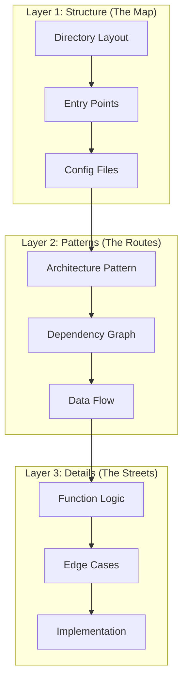

<!-- Note: This module exceeds standard word count (2802 vs 800-1500) due to
     comprehensive 7-step DEMO required to demonstrate the 3-layer reading
     strategy. Each step shows realistic Claude output. Approved by architect
     review 2026-02-01. -->

# Module 3.1: Reading & Understanding Codebases

> **Estimated time**: ~30 minutes
>
> **Prerequisite**: Module 1.3 (Context Window Basics)
>
> **Outcome**: After this module, you will be able to use Claude Code to rapidly understand any unfamiliar codebase — its architecture, key files, patterns, and dependencies.

---

## 1. WHY — Why This Matters

You just joined a new team. There's 200K+ lines of code, sparse documentation, and the previous tech lead left two weeks ago. Your manager expects you to ship a critical bug fix by Friday. Reading every file is impossible — you'd spend three weeks just understanding the basics. Traditional approaches like grepping through files or following imports manually are slow and error-prone. You need a codebase navigator that can answer "What does this do?" and "Where should I look?" in seconds, not days. Claude Code can be that navigator, but only if you know how to ask the right questions in the right order.

---

## 2. CONCEPT — Core Ideas

Understanding an unfamiliar codebase is about **strategic reading, not exhaustive reading**. You can't dump 200K lines into Claude's context window — you need a layered approach.

### The 3-Layer Reading Strategy

Think of a codebase like a city. You don't memorize every street before navigating — you learn the map first, then the main routes, then specific streets as needed.

**Layer 1: Structure (The Map)**
Start with the high-level layout. What directories exist? What's the entry point? What config files define the project? This gives you orientation — you know where things are before understanding what they do.

**Layer 2: Patterns (The Routes)**
Identify the architecture pattern (MVC, Clean Architecture, microservices?). Map dependencies and data flow. Understand how requests move through the system. This reveals the "highways" of your codebase — the critical paths data takes.

**Layer 3: Details (The Streets)**
Only now do you dive into specific function logic, edge cases, and implementation details. This is targeted reading based on what you learned in Layer 1 and 2.

### Context Budget Strategy

Claude's context window is large but finite. Don't waste it on irrelevant files. Use breadth-first exploration (scan many files shallowly) at Layer 1, then switch to depth-first (deep dive on specific modules) at Layer 3.



**Key principle**: Always establish context before drilling down. Never ask "how does login work?" before knowing where the auth module even lives.

---

## 3. DEMO — Step by Step

Let's explore a realistic Node.js/Express REST API project. Assume you've just cloned a repository and know nothing about it.

**Step 1: Start a Claude Code session in the project**
```bash
$ cd my-unfamiliar-project
$ claude
```
Claude starts an interactive session. No output yet — just the prompt.

**Step 2: Get project overview (Layer 1 start)**

Inside the Claude session, type:
```
What does this project do? Explain the directory structure.
```

Expected output:
```
This is a Node.js/Express REST API for managing e-commerce orders.

Directory structure:
├── src/
│   ├── controllers/   # HTTP request handlers (business logic entry points)
│   ├── models/        # Mongoose schemas for MongoDB
│   ├── routes/        # Express route definitions
│   ├── middleware/    # Auth, validation, error handling
│   ├── services/      # Business logic layer
│   ├── utils/         # Helper functions
│   └── index.js       # Application entry point
├── tests/             # Jest test suites
├── config/            # Environment-specific configs
├── package.json       # Dependencies and scripts
└── README.md

Key technologies: Express 4.x, MongoDB, JWT authentication, Jest for testing.
```

**Why this matters**: You now have the map. You know there's a services layer (business logic is separated from controllers), MongoDB is used, and tests exist.

**Step 3: Identify entry points (Layer 1 continued)**
```
Where is the main entry point? Trace the startup flow.
```

Expected output:
```
Entry point: src/index.js

Startup flow:
1. src/index.js loads environment variables from config/
2. Connects to MongoDB via mongoose.connect()
3. Initializes Express app
4. Registers middleware: body-parser, CORS, auth middleware
5. Registers routes from src/routes/ (mapped to controllers)
6. Starts HTTP server on port 3000

Critical file: src/routes/index.js — this is where all API endpoints are defined.
```

**Why this matters**: You know the bootstrap sequence. If the app fails to start, you check config → database connection → routes in that order.

**Step 4: Map dependencies (Layer 1 → Layer 2 transition)**
```
What are the key dependencies and what role does each play?
```

Expected output:
```
Production dependencies:
- express (4.18.x): Web framework
- mongoose (7.x): MongoDB ODM
- jsonwebtoken (9.x): JWT token generation/validation
- bcrypt (5.x): Password hashing
- dotenv (16.x): Environment variable management
- express-validator (7.x): Request validation

Dev dependencies:
- jest (29.x): Testing framework
- supertest (6.x): HTTP assertion library for API tests
- eslint (8.x): Code linting

Key insight: This is a standard REST API stack. Authentication is JWT-based.
```

**Why this matters**: You know the tech stack. If you see a JWT error, you look at the jsonwebtoken configuration.

**Step 5: Understand architecture (Layer 2)**
```
What architecture pattern does this project follow? Show me the data flow for a typical API request.
```

Expected output:
```
Architecture: Layered architecture with separation of concerns

Layers:
1. Routes (src/routes/) — Define endpoints, map to controllers
2. Controllers (src/controllers/) — Handle HTTP concerns (req/res)
3. Services (src/services/) — Business logic
4. Models (src/models/) — Data access

Data flow for POST /api/orders:
1. Request hits src/routes/orders.js → routes to OrderController.create
2. Middleware chain runs: auth verification → request validation
3. OrderController.create calls OrderService.createOrder(data)
4. OrderService.createOrder performs business logic (stock check, price calc)
5. OrderService calls Order.create() (Mongoose model) to persist
6. Response bubbles back up: Model → Service → Controller → Client

This pattern keeps business logic testable and decoupled from HTTP.
```

**Why this matters**: Now you know where to make changes. Need to add a discount feature? That's business logic — add it in services/, not controllers/.

**Step 6: Dive into a specific module (Layer 3)**
```
Explain the authentication module. How does the login flow work end to end?
```

Expected output:
```
Authentication module: src/middleware/auth.js + src/controllers/AuthController.js

Login flow (POST /api/auth/login):
1. Client sends { email, password }
2. AuthController.login receives request
3. Calls UserService.findByEmail(email)
4. Compares password using bcrypt.compare(password, user.hashedPassword)
5. If valid: generates JWT via jsonwebtoken.sign({ userId: user.id }, SECRET, { expiresIn: '7d' })
6. Returns { token, user } to client

Protected route flow:
1. Client sends request with header: Authorization: Bearer <token>
2. auth.js middleware intercepts
3. Extracts token, verifies with jsonwebtoken.verify(token, SECRET)
4. If valid: attaches decoded userId to req.user, calls next()
5. If invalid: returns 401 Unauthorized

Security note: Tokens expire after 7 days. Refresh token mechanism not implemented.
```

**Why this matters**: You now understand exactly how auth works. If you need to add role-based access control, you know to modify the middleware and add role checks.

**Step 7: Find patterns and conventions (Layer 2 refinement)**
```
What coding conventions does this project follow? What patterns are used consistently?
```

Expected output:
```
Conventions:
- Naming: Controllers end with "Controller", Services with "Service"
- Error handling: All errors thrown in services are caught by global error middleware
- Async/await: Used throughout (no raw promises)
- Validation: express-validator schemas defined in routes/
- File structure: One file per controller/service/model

Patterns:
- Repository pattern: Models act as repositories
- Dependency injection: Services are imported and called (not instantiated)
- Middleware chain: Auth → Validation → Controller
- Test structure: Each controller has a corresponding .test.js file

Anti-patterns detected:
- Business logic leaking into some controllers (e.g., OrderController has price calculations)
- No logging framework (uses console.log)
```

**Why this matters**: You now code like the team. New endpoint? Follow the same patterns. You also spotted tech debt to address later.

---

## 4. PRACTICE — Try It Yourself

### Exercise 1: Codebase Speed Run

**Goal**: Map an unfamiliar codebase in under 10 minutes.

**Instructions**:
1. Clone a public repository:
   ```bash
   $ git clone https://github.com/fastify/fastify.git
   $ cd fastify
   $ claude
   ```
2. Using Claude Code, answer these 5 questions:
   - What does this project do?
   - What's the architecture pattern?
   - Where would you add a new plugin?
   - What testing framework is used?
   - What's the most complex module?
3. Time yourself. Stop at 10 minutes.

**Expected result**: You should have high-confidence answers to all 5 questions within 10 minutes.

<details>
<summary>💡 Hint</summary>

Start with Layer 1. Ask: "What does this project do? Explain directory structure." Then ask: "What's the plugin system architecture?" Don't dive into code yet — get the map first.

</details>

<details>
<summary>✅ Solution</summary>

**Recommended prompt sequence**:

1. "What does this project do? Explain the directory structure."
   - Expected: Fastify is a web framework, focused on speed. Directory has lib/ (core), test/, docs/, etc.

2. "What architecture pattern is used? How does the plugin system work?"
   - Expected: Plugin-based architecture. Plugins register via fastify.register(). Encapsulation model prevents plugin pollution.

3. "Where would I add a new plugin? Show me an example."
   - Expected: Create a file in lib/plugins/ or external package. Use fastify.decorate() to add functionality.

4. "What testing framework is used? What's the test structure?"
   - Expected: tap (not Jest). Tests in test/ directory. Each core feature has a corresponding test file.

5. "What's the most complex module? Why?"
   - Expected: Likely lib/reply.js or lib/request.js — handle HTTP lifecycle, serialization, hooks.

**Time check**: This should take 6-8 minutes if you follow Layer 1 → Layer 2 → Layer 3.

</details>

### Exercise 2: New Team Member Onboarding Document

**Goal**: Generate a reusable onboarding document for a codebase.

**Instructions**:
1. Navigate to any project you're actively working on (or use a sample project)
2. Start Claude Code:
   ```bash
   $ cd your-project
   $ claude
   ```
3. Ask: "Generate a new team member onboarding guide for this codebase. Include: architecture overview, key files to read first, development setup, common workflows, and gotchas."
4. Review the generated document. Refine by asking: "Add a section on where to find X" (e.g., where API routes are defined, where database migrations live, etc.)
5. Save the output to `ONBOARDING.md` in your project

**Expected result**: A 2-3 page document that reduces new developer onboarding time from days to hours.

<details>
<summary>💡 Hint</summary>

Be specific about what "onboarding" means for your team. If your team works on features end-to-end, ask Claude to include "how to add a new feature from API to UI." If your team is backend-focused, ask for "how to add a new API endpoint with tests."

</details>

<details>
<summary>✅ Solution</summary>

**Example prompt**:
```
Generate a new team member onboarding guide for this codebase. Structure:

1. What does this project do? (2 paragraphs)
2. Architecture overview (diagram if possible)
3. Key files to read first (top 10)
4. Development setup (commands to run)
5. Common workflows:
   - How to add a new feature
   - How to run tests
   - How to debug issues
6. Gotchas and conventions
7. Who to ask for help (if info available in docs)

Format as Markdown.
```

**Expected output**: A structured document you can commit to your repository. Review it for accuracy — Claude might hallucinate details if your project lacks documentation. Correct any errors before sharing with the team.

</details>

---

## 5. CHEAT SHEET

| Prompt | What It Does | When to Use |
|--------|--------------|-------------|
| `What does this project do? Explain the directory structure.` | High-level overview + file layout | First thing when exploring any codebase |
| `Where is the main entry point? Trace the startup flow.` | Identifies bootstrap sequence | Understanding initialization and app lifecycle |
| `What are the key dependencies and their roles?` | Maps external libraries to purposes | Assessing tech stack and potential risks |
| `What architecture pattern is used here?` | Identifies MVC, Clean, layered, etc. | Understanding design decisions and where to add features |
| `Trace the data flow for [specific feature]` | Shows request → response lifecycle | Understanding how a feature works end-to-end |
| `Explain the [module name] module end to end` | Deep dive into one area | Before modifying code in that module |
| `What conventions does this project follow?` | Reveals patterns, naming, structure | Before writing new code to match team style |
| `What are the potential issues or code smells?` | Identifies tech debt, anti-patterns | Assessing code quality or planning refactors |
| `Generate an onboarding doc for this codebase` | Creates structured documentation | Team knowledge sharing and new hire onboarding |
| `Where should I add [specific feature]?` | Suggests location based on architecture | Planning where new code should live |

---

## 6. PITFALLS — Common Mistakes

| ❌ Mistake | ✅ Correct Approach |
|------------|---------------------|
| Asking "explain this code" without context | Establish project context first: "What does this project do?" THEN ask about specific code |
| Dumping entire repo into context at once | Start with structure (Layer 1), then patterns (Layer 2), then details (Layer 3) |
| Trusting Claude's answers without verification | Cross-check responses by asking Claude to show file paths and snippets you can verify |
| Reading files linearly (file by file) | Follow the data flow — trace how a request moves through the system |
| Ignoring test files | Tests are living documentation — ask "Show me tests for [feature]" to understand expected behavior |
| Asking vague questions like "how does auth work?" | Be specific: "Trace the login flow from POST /login to JWT generation" |
| Skipping Layer 2 (patterns) and jumping to code | Always identify the architecture before diving into implementation details |
| Not using `/compact` when context fills up | Run `/compact` periodically to compress conversation history and free up context |
| Asking about everything in one prompt | Ask one layer at a time. Let Claude build understanding progressively |

---

## 7. REAL CASE — Production Story

**Scenario**: Susan, a senior Android developer in Ho Chi Minh City, joins a fintech startup building a KMP (Kotlin Multiplatform) mobile banking app. The codebase is 3 years old with 150,000 lines of code across shared Kotlin, Android-specific, and iOS-specific modules. The previous tech lead left suddenly — no handover, no architecture docs. The CEO expects Susan to ship a critical payment bug fix by Friday (4 days away). Traditional onboarding would take 2 weeks.

**Problem**: How do you understand a 150K-line codebase in 4 days when you've never seen Kotlin Multiplatform Mobile before?

**Solution**: Susan used the 3-layer reading strategy with Claude Code.

**Day 1 — Layer 1 (Structure)**:
- Asked: "What does this project do? Explain the module structure."
- Learned: 47 modules organized by feature (payments, accounts, loans, etc.). Shared business logic in `shared/`, platform code in `androidApp/` and `iosApp/`.
- Asked: "Where is the payment feature? Show me the directory structure for payments."
- Identified: `shared/src/commonMain/kotlin/payments/` contains core logic.

**Day 1 — Layer 2 (Patterns)**:
- Asked: "What architecture pattern is used? How does data flow in this app?"
- Learned: Clean Architecture with MVVM. Repository → UseCase → ViewModel → UI.
- Asked: "Trace the payment flow from user tapping 'Pay' to transaction completion."
- Claude mapped the entire flow through 12 files.

**Day 2 — Layer 3 (Details)**:
- Asked: "Explain the PaymentRepository class. What does processPayment() do?"
- Deep-dived into the payment processing logic.
- Asked: "What are potential race conditions in the payment queue?"
- Claude identified a threading issue: `PaymentQueue.enqueue()` wasn't synchronized.

**Day 3 — Bug Fix**:
- Used Claude to generate the fix: "Add thread-safe queueing to PaymentQueue using a mutex."
- Reviewed generated code, tested locally.

**Day 4 — Documentation**:
- Asked: "Generate an architecture document for the payment module."
- Created a 15-page onboarding doc with diagrams, data flow charts, and key file references.

**Result**:
- **Full codebase mapped in 2 hours** instead of 2 weeks
- **47 modules documented** with their responsibilities and dependencies
- **Bug traced and fixed** in 3 days — shipped Thursday, a day ahead of schedule
- **Onboarding doc saved** — now used by all new hires, reducing onboarding from 2 weeks to 3 days
- **Team velocity increased** — other developers started using the same technique

**Key insight**: The 3-layer strategy works because it mirrors how experienced developers actually learn codebases — structure first, patterns second, details last. Claude Code accelerates each layer from hours to minutes.

---

> **Next**: [Module 3.2: Writing & Editing Code](../02-writing-code/) →
