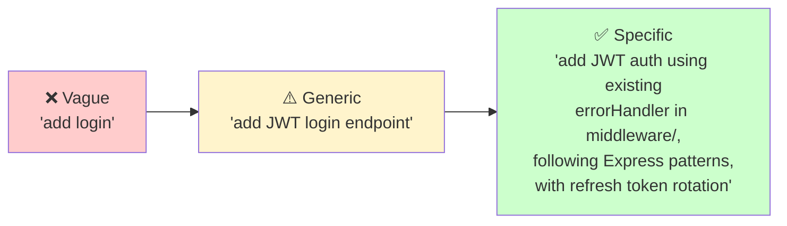

# Module 3.2: Writing & Editing Code

> **Estimated time**: ~35 minutes
>
> **Prerequisite**: Module 3.1 (Reading & Understanding Codebases)
>
> **Outcome**: After this module, you will be able to use Claude Code to write new code, edit existing code, and refactor with confidence — while maintaining project conventions and quality.

---

## 1. WHY — Why This Matters

You understand the codebase now (thanks to Module 3.1). Time to write code. But here's the trap — most developers just say "write me a function that does X" and get generic, context-free code that doesn't fit their project. It compiles, but it feels foreign. Different naming conventions. Unfamiliar error handling. New utilities when you already have perfectly good ones.

The real skill is getting Claude Code to write code that BELONGS in your project — matching your conventions, using your existing utilities, following your established patterns. That's the difference between "AI-assisted copy-paste" and "AI-powered development."

---

## 2. CONCEPT — Core Ideas

### The Specification Spectrum

The quality of generated code directly correlates with the specificity of your prompt:



**Vague prompts** = generic code that doesn't fit your project.
**Specific prompts** = code that belongs.

### Edit Modes — The 3 Approaches

1. **Generate**: Create new files/functions from scratch
2. **Edit-in-place**: Modify existing code while preserving context
3. **Refactor**: Restructure without changing behavior

Each mode requires different prompting strategies. Generating is about constraints. Editing is about surgical precision. Refactoring is about preserving behavior.

### The Context Sandwich

Before asking Claude to write code, provide three layers:

| Layer | What It Contains | Example |
|-------|-----------------|---------|
| **TOP** | Project context + conventions | "This is an Express API using TypeScript, following Clean Architecture" |
| **MIDDLE** | The specific task with constraints | "Add POST /auth/forgot-password using existing emailService" |
| **BOTTOM** | Examples of similar existing code | "Follow the pattern in src/routes/auth/login.ts" |

**Pro tip**: Your CLAUDE.md file should handle the TOP layer automatically.

### Iterative Refinement

Never accept the first output blindly:

1. **First draft** → Generate initial code
2. **Review** → Ask Claude to self-review for issues
3. **Refine** → Fix identified problems
4. **Verify** → Ensure it works with existing code

---

## 3. DEMO — Step by Step

**Scenario**: Add a "forgot password" endpoint to an existing Express/TypeScript auth module.

**Step 1: Set context first**

Inside your Claude session, reference existing patterns:

```
Look at src/routes/auth/login.ts and src/middleware/errorHandler.ts. I need to add a forgot-password flow following the same patterns.
```

Expected response:
```
I've analyzed the patterns:
- Routes use asyncHandler wrapper for error handling
- Responses follow { success: boolean, data?: T, error?: string } format
- Validation uses express-validator middleware
- Services are injected via req.services

I'm ready to generate the forgot-password endpoint following these conventions.
```

**Why this matters**: Claude now knows YOUR patterns, not generic ones.

---

**Step 2: Generate new code with constraints**

```
Create POST /auth/forgot-password. Requirements:
- Use existing emailService from src/services/email.ts
- Follow the same error handling as login route
- Return standardized API response format
- Add rate limiting: max 3 requests per email per hour
```

Expected output:
```typescript
// src/routes/auth/forgotPassword.ts
import { asyncHandler } from '../../middleware/errorHandler';
import { body, validationResult } from 'express-validator';

export const forgotPasswordValidation = [
  body('email').isEmail().normalizeEmail()
];

export const forgotPassword = asyncHandler(async (req, res) => {
  const errors = validationResult(req);
  if (!errors.isEmpty()) {
    return res.status(400).json({
      success: false,
      error: 'Invalid email format'
    });
  }

  const { email } = req.body;
  const { emailService, userService } = req.services;

  // Don't reveal if user exists (security)
  const user = await userService.findByEmail(email);
  if (user) {
    const resetToken = await userService.generateResetToken(user.id);
    await emailService.sendPasswordReset(email, resetToken);
  }

  return res.json({
    success: true,
    data: { message: 'If the email exists, a reset link has been sent.' }
  });
});
```

**Why this matters**: The code uses YOUR services, YOUR patterns, YOUR response format.

---

**Step 3: Edit existing code**

```
Add the forgot-password route to src/routes/auth/index.ts following the existing route registration pattern.
```

Expected output:
```typescript
// Add to src/routes/auth/index.ts
import { forgotPassword, forgotPasswordValidation } from './forgotPassword';

// Add with other routes:
router.post('/forgot-password',
  rateLimiter({ max: 3, windowMs: 60 * 60 * 1000 }),
  forgotPasswordValidation,
  forgotPassword
);
```

---

**Step 4: Refactor while adding**

```
The current auth routes have duplicated email validation. Extract a shared validateEmail middleware and use it in both login and forgot-password.
```

Expected output:
```typescript
// src/middleware/validators.ts
export const validateEmail = [
  body('email')
    .isEmail()
    .withMessage('Valid email required')
    .normalizeEmail()
];

// Then update both routes to use validateEmail instead of inline validation
```

---

**Step 5: Generate tests**

```
Write tests for forgot-password following the same structure as login.test.ts. Use existing test helpers and mock patterns.
```

Expected output:
```typescript
// src/routes/auth/__tests__/forgotPassword.test.ts
import { createTestApp, mockServices } from '../../../test/helpers';

describe('POST /auth/forgot-password', () => {
  it('returns success even for non-existent email (security)', async () => {
    const app = createTestApp();
    mockServices.userService.findByEmail.mockResolvedValue(null);

    const res = await request(app)
      .post('/auth/forgot-password')
      .send({ email: 'nonexistent@example.com' });

    expect(res.status).toBe(200);
    expect(res.body.success).toBe(true);
    expect(mockServices.emailService.sendPasswordReset).not.toHaveBeenCalled();
  });

  // ... more tests following same pattern
});
```

---

**Step 6: Self-review**

```
Review the code you just wrote. Does it follow the project conventions? Any edge cases missed? Any security concerns?
```

Expected response:
```
Review findings:
✅ Follows asyncHandler pattern
✅ Uses standardized response format
✅ Doesn't leak user existence (security)
⚠️ Missing: Token expiration check in reset flow
⚠️ Missing: Logging for audit trail
⚠️ Consider: Adding CSRF protection for this endpoint

Shall I add these improvements?
```

---

## 4. PRACTICE — Try It Yourself

### Exercise 1: Convention-Aware Coding

**Goal**: Generate code that perfectly matches your project's style.

**Instructions**:
1. Open any project you're working on
2. Start Claude Code:
   ```bash
   $ cd your-project
   $ claude
   ```
3. Ask Claude to identify conventions:
   ```
   Analyze this project's coding conventions. Look at:
   - Naming patterns (camelCase, snake_case?)
   - Error handling approach
   - File/folder structure
   - Import organization
   - Comment style
   ```
4. Ask Claude to generate a new module:
   ```
   Create a new UserPreferences module following the exact conventions you identified.
   ```
5. Compare the generated code with existing modules. Does it "belong"?

<details>
<summary>💡 Hint</summary>

Be specific about which existing files Claude should use as reference. Instead of "follow the conventions," say "follow the exact patterns in src/services/UserService.ts."

</details>

<details>
<summary>✅ Solution</summary>

**Effective prompt sequence**:

1. "Analyze the coding conventions in src/services/. Show me examples of: naming, error handling, logging, and exports."

2. "Using those exact conventions, create src/services/PreferencesService.ts with methods: getPreferences(userId), updatePreferences(userId, prefs), resetToDefaults(userId)."

3. "Compare what you wrote with UserService.ts. List any differences in style."

4. "Fix any style inconsistencies."

The key is the comparison step — it catches deviations.

</details>

---

### Exercise 2: Refactor Relay

**Goal**: Safely refactor a complex function while preserving behavior.

**Instructions**:
1. Find a function in your project that's 50+ lines
2. Ask Claude to analyze it:
   ```
   Analyze this function. What does it do? What are its responsibilities?
   ```
3. Ask for a refactoring plan:
   ```
   This function has too many responsibilities. Propose a step-by-step refactoring plan.
   ```
4. Execute one step at a time
5. After each step, verify: "Does this change preserve the original behavior?"

<details>
<summary>💡 Hint</summary>

Before refactoring, ask Claude to generate tests for the current behavior. This gives you a safety net.

</details>

<details>
<summary>✅ Solution</summary>

**Safe refactoring workflow**:

1. "Generate tests for this function based on its current behavior." (Safety net)

2. "Analyze: What are the distinct responsibilities in this function?"

3. "Refactor step 1: Extract the validation logic into a separate function. Show me the change."

4. "Do the tests still pass with this change?"

5. "Refactor step 2: Extract the data transformation logic..."

6. Continue until each responsibility is in its own function.

Never skip the "do tests pass" verification between steps.

</details>

---

## 5. CHEAT SHEET

| Prompt Pattern | What It Does | Example |
|---------------|--------------|---------|
| `Follow the pattern in [file]` | Matches existing conventions | "Follow the pattern in src/services/UserService.ts" |
| `Create [X] using existing [Y]` | Reuses project utilities | "Create upload handler using existing fileService" |
| `Add [feature] to [file]` | Edit-in-place modification | "Add caching to the getUser method in UserService" |
| `Refactor [X] into [Y]` | Restructure code | "Refactor this 100-line function into smaller units" |
| `Extract [X] from [Y]` | Create reusable code | "Extract validation logic into shared middleware" |
| `Generate tests following [file]` | Convention-matching tests | "Generate tests following auth.test.ts structure" |
| `Review for [concerns]` | Targeted self-review | "Review for security issues and edge cases" |
| `What edge cases should this handle?` | Discover missing logic | Prompts Claude to identify gaps |
| `Explain why you chose [approach]` | Understand decisions | Prevents blind copy-paste |
| `Update all files that import [X]` | Coordinated changes | "Update all files that import the old validateEmail" |

---

## 6. PITFALLS — Common Mistakes

| ❌ Mistake | ✅ Correct Approach |
|-----------|---------------------|
| "Write me a login function" (no context) | "Write a login function following the pattern in src/auth/register.ts" |
| Accepting generated code without review | Always ask Claude to self-review, then YOU review |
| Generating entire files at once | Generate incrementally: skeleton → logic → error handling → tests |
| Not mentioning existing utilities | "Use the existing logger from src/utils/logger.ts" |
| Letting Claude invent new patterns | "Follow the existing pattern, don't introduce new approaches" |
| Forgetting edge cases | "What edge cases should this handle? Add them." |
| Copy-pasting without understanding | Ask Claude to explain WHY each design decision was made |
| Not using `/compact` during long sessions | Run `/compact` periodically to free context for new code generation |

---

## 7. REAL CASE — Production Story

**Scenario**: A team building a KMP (Kotlin Multiplatform) expense tracker app needs to add receipt scanning. The sole developer, Susan, is unfamiliar with the OCR library but needs to ship by Friday.

**Day 1 — Understanding (Module 3.1)**:
- Used Claude Code to map the existing camera module patterns
- Identified: MVVM architecture, Repository pattern, existing ImageProcessor utility

**Day 1 — Generating**:
```
Create ReceiptScannerViewModel following the pattern in CameraViewModel.kt.
Use existing ImageProcessor for preprocessing.
Add state for: scanning, processing, result, error.
```

**Day 2 — Editing**:
```
Add OCR result data classes to shared/models/ following existing Receipt.kt pattern.
Include: rawText, extractedAmount, extractedDate, confidence score.
```

**Day 2 — Refactoring**:
```
The image processing pipeline in CameraViewModel duplicates compression logic.
Extract into ImageProcessor.prepareForOCR() and use in both camera and receipt scanner.
```

**Day 3 — Platform-specific**:
```
Generate iOS implementation of ReceiptScanner following the existing
expect/actual pattern in shared/platform/. Use Vision framework for OCR.
```

**Result**:
- **Feature completed in 3 days** instead of estimated 5 days
- **Code review passed on first attempt** — every file matched existing conventions
- **Zero rework** — Claude was instructed to follow patterns, not invent new ones
- **Shared utilities increased** — refactoring created reusable ImageProcessor methods

**Key insight**: The speed came not from Claude writing more code, but from Claude writing the RIGHT code — code that fit the project perfectly because it was given explicit pattern references.

---

> **Next**: [Module 3.3: Git Integration](../03-git-integration/) →
