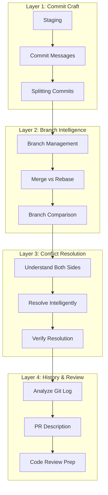

# Module 3.3: Git Integration

> **Estimated time**: ~30 minutes
>
> **Prerequisite**: Module 3.2 (Writing & Editing Code)
>
> **Outcome**: After this module, you will be able to use Claude Code to streamline your entire Git workflow — from writing commit messages to resolving merge conflicts, reviewing diffs, and managing branches intelligently.

---

## 1. WHY — Why This Matters

You've just finished a 2-hour coding session with Claude Code. Changes across 15 files. New features, bug fixes, refactored code, updated tests. Now comes the part most developers dread: the git workflow. Stage the right files. Write meaningful commit messages. Handle that merge conflict from your colleague's branch. Prepare a clean PR.

Most developers take one of two paths: dump everything in one commit ("fix stuff and add features") or spend 30 minutes manually crafting git history. Neither is good. Claude Code can handle your entire git workflow — writing precise commit messages, splitting changes into logical commits, resolving merge conflicts with full code context — if you know how to direct it.

---

## 2. CONCEPT — Core Ideas

### Claude Code as Git Co-pilot

Claude Code doesn't just generate commit messages from templates. It understands WHAT changed and WHY because it has your code context. When you ask for a commit message, Claude reads the actual diff, understands the purpose of each change, and writes messages that future developers (including you) will thank you for.

### The 4 Layers of Git Workflow



### Atomic Commits with AI

Large changesets are hard to review and harder to revert. Claude Code can analyze your changes and suggest how to split them into logical, atomic commits — each with a clear purpose. "Add payment validation" is one commit. "Refactor error handling" is another. "Update tests" is a third.

### Convention Enforcement

Add your commit message format to CLAUDE.md:

```markdown
## Git Conventions
- Use Conventional Commits: feat:, fix:, chore:, docs:, refactor:
- Format: <type>(<scope>): <description>
- Example: feat(payment): add Stripe webhook handler
```

Now every commit message Claude generates follows your team's standard.

---

## 3. DEMO — Step by Step

**Scenario**: You're on a feature branch `feature/payment-processing`. You've added payment validation, refactored error handling, updated config, and added tests. Time to commit and prepare a PR.

---

**Step 1: Review what changed**

```
What files have I changed? Summarize what each change does.
```

Expected output:
```
Modified files (7):

1. src/payment/validator.ts
   - Added credit card validation using Luhn algorithm
   - Added expiry date validation

2. src/payment/processor.ts
   - Refactored error handling to use Result type
   - Extracted retry logic into separate function

3. src/payment/types.ts
   - Added PaymentError enum
   - Added ValidationResult interface

4. src/config/payment.ts
   - Added Stripe API configuration
   - Added retry limits and timeout settings

5. tests/payment/validator.test.ts
   - Added 12 test cases for card validation

6. tests/payment/processor.test.ts
   - Updated tests for new Result type error handling

7. package.json
   - Added stripe dependency
```

---

**Step 2: Split into logical commits**

```
Help me split these changes into logical atomic commits. Group related changes together.
```

Expected output:
```
Recommended commit structure:

Commit 1: Add payment validation
- src/payment/validator.ts
- src/payment/types.ts (ValidationResult interface)
- tests/payment/validator.test.ts

Commit 2: Refactor payment processor error handling
- src/payment/processor.ts
- src/payment/types.ts (PaymentError enum)
- tests/payment/processor.test.ts

Commit 3: Add Stripe configuration
- src/config/payment.ts
- package.json

Shall I stage and commit each group?
```

---

**Step 3: Generate commit messages**

After staging the first group:
```bash
$ git add src/payment/validator.ts src/payment/types.ts tests/payment/validator.test.ts
```

Then ask:
```
Write a commit message for these staged changes. Use Conventional Commits format.
```

Expected output:
```
feat(payment): add credit card validation with Luhn algorithm

- Implement card number validation using Luhn checksum
- Add expiry date validation with future date check
- Add CVV format validation (3-4 digits)
- Create ValidationResult type for structured error reporting
- Add 12 test cases covering valid/invalid card scenarios

Refs: PAY-123
```

---

**Step 4: Handle a merge conflict**

After pulling, you have a conflict:
```bash
$ git merge origin/develop
CONFLICT (content): Merge conflict in src/payment/processor.ts
```

Ask Claude:
```
I have a merge conflict in src/payment/processor.ts. Show me both sides and help resolve it. Keep our new Result type error handling but integrate their updated PaymentGateway interface.
```

Expected output:
```
Conflict analysis:

OURS (feature/payment-processing):
- Uses Result<PaymentResult, PaymentError> return type
- Has retry logic extracted to retryWithBackoff()

THEIRS (develop):
- Updated PaymentGateway interface with new timeout parameter
- Added gateway.setConfig() call in initialization

Resolution strategy:
Keep our Result type pattern AND integrate their interface updates.

[Shows resolved code merging both changes]

Run tests to verify: npm test src/payment/
```

---

**Step 5: Pre-push review**

```
Review all commits on this branch compared to main. Is the history clean? Any commits that should be squashed?
```

Expected output:
```
Branch: feature/payment-processing (3 commits ahead of main)

Commit history:
1. feat(payment): add credit card validation with Luhn algorithm
2. refactor(payment): migrate processor to Result type error handling
3. chore(payment): add Stripe configuration and dependency

Assessment:
✅ Each commit is atomic and focused
✅ Commit messages follow Conventional Commits
✅ Logical progression: validation → error handling → config
✅ No fixup commits or WIP commits to squash

Ready for PR.
```

---

**Step 6: Generate PR description**

```
Write a PR description for this branch. Include: summary, changes breakdown, testing done, and deployment notes.
```

Expected output:
```markdown
## Summary
Adds payment processing foundation with credit card validation, improved error handling, and Stripe integration.

## Changes
- **Validation**: Luhn algorithm for card numbers, expiry date validation, CVV format check
- **Error Handling**: Migrated to Result type pattern for type-safe error handling
- **Configuration**: Added Stripe API config with retry and timeout settings

## Testing
- 12 new unit tests for card validation (100% coverage)
- Updated processor tests for Result type
- Manual testing with Stripe test cards

## Deployment Notes
- Requires STRIPE_API_KEY environment variable
- No database migrations
- Backwards compatible — no breaking changes

## Checklist
- [x] Tests pass
- [x] Linting passes
- [x] Documentation updated
```

---

## 4. PRACTICE — Try It Yourself

### Exercise 1: Commit Surgeon

**Goal**: Split a large changeset into clean atomic commits.

**Instructions**:
1. Make changes to 5+ files in any project (add features, fix bugs, update tests)
2. Start Claude Code: `$ claude`
3. Ask Claude to analyze your changes
4. Have Claude split them into 3+ logical commits
5. Generate Conventional Commits messages for each
6. Run `git log --oneline` — does the history tell a story?

<details>
<summary>💡 Hint</summary>

Ask Claude: "Group these changes by purpose, not by file. What are the distinct logical units of work?"

</details>

<details>
<summary>✅ Solution</summary>

**Effective sequence**:

1. `git status` — see all changed files
2. Ask: "Analyze my changes and group them by purpose into atomic commits"
3. For each group, stage only those files: `git add [specific files]`
4. Ask: "Write a Conventional Commits message for these staged changes"
5. Commit: `git commit -m "[message]"`
6. Repeat for each group
7. Verify: `git log --oneline -5`

**Success criteria**: Each commit can be reverted independently without breaking the others.

</details>

---

### Exercise 2: Conflict Commander

**Goal**: Resolve a merge conflict intelligently using Claude Code.

**Instructions**:
1. Create a test branch: `git checkout -b conflict-test`
2. Modify a function in any file, commit
3. Checkout main/develop, modify the SAME function differently, commit
4. Merge conflict-test into current branch: `git merge conflict-test`
5. Use Claude Code to understand both sides and resolve

<details>
<summary>💡 Hint</summary>

Be specific: "Keep the algorithm from our side but use the function signature from theirs."

</details>

<details>
<summary>✅ Solution</summary>

**Conflict resolution sequence**:

1. `git merge conflict-test` — triggers conflict
2. Ask Claude: "Show me the merge conflict in [file]. Explain what each side changed."
3. Specify intent: "Resolve by keeping our [X] but using their [Y]"
4. Review Claude's resolution
5. Test: `npm test` or compile
6. Stage: `git add [file]`
7. Commit: `git commit` (uses auto-generated merge commit message)

**Success criteria**: Both intended changes are preserved, code compiles, tests pass.

</details>

---

## 5. CHEAT SHEET

| Prompt | What It Does | When to Use |
|--------|--------------|-------------|
| `What files have I changed? Summarize each change.` | Analyzes current diff | Before committing |
| `Split these changes into logical atomic commits` | Groups changes by purpose | Large changesets |
| `Write a Conventional Commits message for staged changes` | Generates commit message | After staging |
| `Show me the merge conflict in [file]. Explain both sides.` | Conflict analysis | After merge fails |
| `Resolve conflict: keep our X, integrate their Y` | Intelligent merge | During conflict resolution |
| `Review commits on this branch vs main` | History analysis | Before PR |
| `Write a PR description for this branch` | Generates PR summary | Before submitting PR |
| `What would happen if I rebase onto main?` | Rebase preview | Before rebasing |
| `I need to undo the last commit but keep changes` | Soft reset guidance | After bad commit |
| `What should I add to .gitignore for [framework]?` | Ignore file suggestions | Project setup |
| `Show me commits that touched [file] in the last month` | File history | Debugging/archaeology |
| `Squash the last 3 commits with a new message` | History cleanup | Before PR |

---

## 6. PITFALLS — Common Mistakes

| ❌ Mistake | ✅ Correct Approach |
|-----------|---------------------|
| Letting Claude commit without reviewing | Always read the generated message before confirming |
| One giant commit for all changes | Ask Claude to split into atomic commits by purpose |
| "Fix the merge conflict" with no guidance | Specify: "Keep our X but integrate their Y" |
| Blindly accepting conflict resolution | Always compile and run tests after resolution |
| Not encoding conventions in CLAUDE.md | Add your team's commit format: `feat:`, `fix:`, etc. |
| Force push without understanding | Ask Claude to explain before any destructive operation |
| Skipping the diff review | Always ask Claude to review changes before committing |
| Committing generated code without testing | Run tests between staging and committing |

---

## 7. REAL CASE — Production Story

**Scenario**: An outsourcing company in Da Nang maintains 3 client projects simultaneously. Eight developers work on feature branches throughout the week. Every Friday was "merge hell" — 3-4 hours of manual conflict resolution, inconsistent commit messages, and PRs that took forever to review.

**Before Claude Code**:
- Commit messages: "fix bug", "update", "wip", "asdf"
- Merge conflicts: manual line-by-line resolution without understanding context
- PR descriptions: copy-paste from Jira tickets
- Friday merge: 3-4 hours, often requiring senior developer intervention

**After adopting Claude Code Git workflow**:
1. **During development**: Each developer uses Claude Code to write Conventional Commits. Messages are clear: `fix(auth): prevent session timeout during OAuth flow`
2. **Before merge**: Claude Code reviews branch against develop, flags files likely to conflict
3. **During conflict**: Claude resolves with full context — knows which changes are bug fixes vs features
4. **PR generation**: Auto-generated descriptions with accurate change summaries

**Results**:
- **Friday merge**: 3-4 hours → 45 minutes
- **PR review time**: Reduced by 60% (reviewers understand changes faster)
- **Onboarding**: New developers understand project history without asking seniors
- **Rollbacks**: Atomic commits make reverting specific changes trivial

**Team Lead's quote**: "Our git log used to be a mystery novel where everyone dies and no one knows why. Now it reads like documentation."

---

> **Next**: [Module 3.4: Terminal & Shell Operations](../04-terminal-shell/) →
