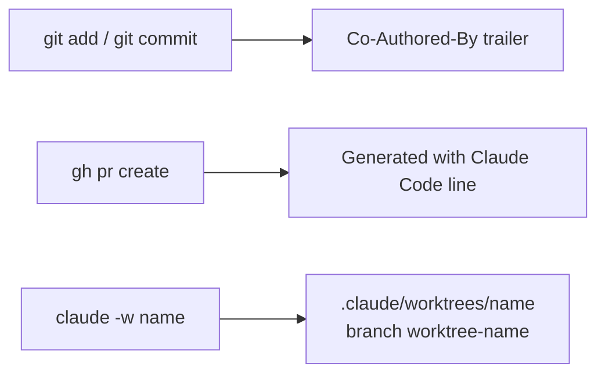

# Module 3.3: Git Integration

> **Estimated time**: ~30 minutes
>
> **Prerequisite**: Module 3.2 (Writing & Editing Code)
>
> **Outcome**: After this module, you will be able to have Claude Code commit and open pull
> requests itself with correct attribution, find PR review comments without `/pr-comments`, and
> run parallel branches in isolated worktrees.

---

## 1. WHY — Why This Matters

You've just finished a 2-hour coding session with Claude Code. Changes across 7 files. Now comes
the part most developers dread: stage the right files, write a message that isn't "fix stuff", and
open a clean PR. Most people either dump everything into one commit or spend 30 minutes crafting
history by hand.

Claude Code doesn't just draft a message for you to paste — it can run `git commit` and
`gh pr create` itself, tag the commit with who actually wrote it, and open a worktree so a second
branch never touches your main checkout. This module shows the real mechanics, not the theory.

---

## 2. CONCEPT — Core Ideas

### Claude commits and opens PRs itself

Ask directly — `create a pr for my changes` — and Claude drafts the summary, runs
`gh pr create` (or `glab mr create` on GitLab), and prints the URL. Claude Code then links the
session to that PR, so `claude --from-pr 1234` reopens the session picker filtered to it.


```mermaid
graph LR
    A[git add / git commit] --> B[Co-Authored-By trailer]
    C[gh pr create] --> D["Generated with Claude Code" line]
    E[claude -w name] --> F[.claude/worktrees/name<br/>branch worktree-name]
```

### Attribution is a default, not a guess

Every commit gets a trailer; every PR gets a footer. Both are **defaults you can change**, not
something Claude invents per commit:

- Commit trailer: `Co-Authored-By: <model> <noreply@anthropic.com>` — "the name is the model in
  use when the commit is made, such as `Claude Sonnet 5`."
- PR footer: `🤖 Generated with [Claude Code](https://claude.com/claude-code)`.
- `attribution.commit` / `attribution.pr` in settings override each line — set them team-wide from
  [Module 10.2](../../phase-10-team-collaboration/02-git-conventions/). `attribution: false`
  (v2.1.281+) hides both. `includeCoAuthoredBy` is **deprecated since v2.0.62** — honored until you
  set `attribution.commit` or `attribution.pr`, then ignored.

Claude Code tells Claude your own CLAUDE.md or memory instructions about attribution take
precedence — **unless** an admin fixed them in managed settings. That's the rule for every
convention in CLAUDE.md: advisory, not enforced. A rule that must hold every time belongs in a
hook or managed settings (Module 2.2), not prose.

### Atomic commits, by prompt

Large changesets are hard to review and harder to revert. Ask Claude to split a diff into atomic
commits — "add payment validation" is one, "refactor error handling" is another — and stage each
group before asking for the message. Encode your team's format once, and every generated message
follows it:

```markdown
## Git Conventions
- Conventional Commits: feat:, fix:, chore:, docs:, refactor:
- Format: <type>(<scope>): <description>
```

### Finding PR comments without `/pr-comments`

`/pr-comments` was **removed in v2.1.91**. Ask Claude directly instead — "what did the reviewer
say on PR 42" — or reopen the linked session with `claude --from-pr 42`, which accepts a PR
number or a full GitHub/GitLab/Bitbucket URL.

### Worktrees for parallel branches

`claude --worktree <name>` (or `-w`) creates an isolated checkout at
`.claude/worktrees/<name>/` on a new branch `worktree-<name>`, sharing history with your main
repo. It needs **at least one commit** to resolve a base branch — an empty repo fails with
`Failed to resolve base branch "HEAD": git rev-parse failed`. A `.worktreeinclude` file (gitignore
syntax) copies gitignored files like `.env` into every new worktree automatically. Point
`/install-github-app` (Module 11.4) at a real GitHub repo once you want Claude responding to
`@claude` mentions on PRs, not just running locally.

---

## 3. DEMO — Step by Step

**Step 1: Ask Claude to commit for you**

```bash
# docs: en/common-workflows — "create a pr for my changes"
claude -p "Stage src/math.js and commit it with a conventional commit message." \
  --permission-mode acceptEdits \
  --allowedTools "Bash(git add:*),Bash(git commit:*),Bash(git status:*),Bash(git diff:*)"
```

```text
# Output may vary
I committed `src/math.js` as `2967e45`:

fix(math): throw on division by zero

The change makes `divide(a, b)` throw `Error('divide by zero')` when `b === 0` instead of
returning `Infinity` or `NaN`.
```

**Step 2: Check the trailer Claude actually wrote**

```bash
git log -1
```

```text
# Output may vary
commit 2967e45db706822654d3dfa844ba81f61b8d082e
Author: … <…>
Date:   Sun Sep 27 23:48:05 2026 +0700

    fix(math): throw on division by zero

    Co-Authored-By: Claude Opus 5.5 <noreply@anthropic.com>
```

The name matches whatever model ran the session — expect `Claude Sonnet 5` if you're on Sonnet.

**Step 3: Ask for a PR (no repo required to see the pattern)**

```bash
# docs: en/common-workflows — Claude links the session when it runs gh pr create/glab mr create
claude -p "Summarize my changes, then create a pr." --permission-mode acceptEdits
```

Without a pushed remote, `gh pr create` — even with the real `--dry-run` flag (verified with
`gh pr create --help`) — refuses with `no git remotes found`. On a real repo, expect the PR URL
back, and `claude --from-pr <number>` to reopen this session later.

**Step 4: Open an isolated worktree, non-interactively**

```bash
# docs: en/worktrees — non-interactive runs with -p skip the trust check
claude -p --worktree fix-divide "What is your current working directory? Just the path." \
  --permission-mode acceptEdits
```

```text
# Output may vary
`/Users/you/cc-lab/.claude/worktrees/fix-divide`
```

```bash
git worktree list
```

```text
# Output may vary
/Users/you/cc-lab                              2967e45 [main]
/Users/you/cc-lab/.claude/worktrees/fix-divide  2967e45 [worktree-fix-divide] locked
```

**Step 5: Clean up** — `-p` runs don't get an exit prompt, so the worktree stays locked until you
remove it:

```bash
# docs: en/worktrees — "To remove one, run git worktree remove"
git worktree unlock .claude/worktrees/fix-divide
git worktree remove .claude/worktrees/fix-divide
git branch -D worktree-fix-divide
```

---

## 4. PRACTICE — Try It Yourself

### Exercise 1: Commit Surgeon

**Goal**: Split a large changeset into clean atomic commits with correct attribution.

**Instructions**:
1. Change 3+ files in a scratch repo.
2. Ask Claude: "Group these changes by purpose, then stage and commit each group with a
   Conventional Commits message."
3. Run `git log --oneline -5` and `git log -1 --format=%B` on the last commit.

**Expected result**: One commit per logical unit, each carrying a `Co-Authored-By` trailer.

<details>
<summary>💡 Hint</summary>

Ask for the plan first ("what are the distinct units of work here?") before telling Claude to
stage and commit — reviewing the split costs you nothing and catches wrong groupings early.

</details>

<details>
<summary>✅ Solution</summary>

1. `git status` — see all changed files.
2. Ask: "Analyze my changes and group them by purpose into atomic commits."
3. For each group: "Stage and commit these with a Conventional Commits message."
4. Verify: `git log --oneline -5`, then `git log -1 --format=%B` to confirm the trailer.

**Success criteria**: each commit reverts independently; every one has the attribution trailer,
not a hand-written co-author line.

</details>

---

### Exercise 2: Find a PR Comment the New Way

**Goal**: Practice the `/pr-comments` replacement on a real PR you have access to.

**Instructions**:
1. Pick an open PR number you can `gh pr view` locally.
2. Ask Claude: "What did reviewers say on PR &lt;number&gt;?"
3. Run `claude --from-pr <number>` in a second terminal.

**Expected result**: Claude answers from `gh pr view --comments` or similar, and `--from-pr` opens
the session picker filtered to that PR.

<details>
<summary>💡 Hint</summary>

If Claude never worked on that PR before, `--from-pr` finds nothing to filter to — expected.

</details>

<details>
<summary>✅ Solution</summary>

Claude reads comments through `gh`/`glab`, the same CLI it used to open the PR — no separate
comments API. `--from-pr` only surfaces sessions Claude Code already linked to that PR.

</details>

---

## 5. CHEAT SHEET

| Command / Prompt | What It Does |
|---|---|
| `create a pr for my changes` | Claude runs `gh pr create` / `glab mr create` |
| `claude --from-pr <n>` | Reopen the session linked to PR/MR `<n>` |
| `what did reviewers say on PR <n>` | Replaces removed `/pr-comments` |
| `claude --worktree <name>` / `-w` | Isolated checkout at `.claude/worktrees/<name>/` |
| `.worktreeinclude` | Copies gitignored files (`.env`) into new worktrees |
| `attribution.commit` / `attribution.pr` | Change or empty-string the commit/PR line |
| `attribution: false` | Hide all attribution (v2.1.281+) |
| `git reset --soft HEAD~N` + ask Claude for one message | Squash without an interactive editor |
| `git worktree remove` / `git worktree unlock` | Clean up a `-p`-created worktree |

---

## 6. PITFALLS — Common Mistakes

| ❌ Mistake | ✅ Correct Approach |
|---|---|
| Letting Claude commit without reading the message | Always read the generated message before the next prompt |
| Assuming CLAUDE.md commit conventions are enforced | They're advisory; put hard rules in a hook or managed settings |
| Asking Claude to `git rebase -i` to squash | Interactive rebase needs an editor Claude can't drive — use `git reset --soft HEAD~N` then ask Claude to write one message |
| Expecting `/pr-comments` to still work | Removed in v2.1.91 — ask Claude directly, or `claude --from-pr <n>` |
| Running `claude --worktree` in a repo with zero commits | Make one commit first, or the base-branch lookup fails |
| Forgetting a `-p --worktree` session leaves its worktree locked | `git worktree unlock` then `git worktree remove` |
| Trusting a bare "Generated with Claude Code" PR without review | Ask Claude to highlight risks before you submit |

---

## 7. REAL CASE — Production Story

**Scenario**: An outsourcing company in Da Nang maintains 3 client projects. Eight developers push
feature branches all week; Friday used to mean 3-4 hours of manual conflict resolution and commit
messages like "fix", "update", "wip".

**Solution**: Each developer asks Claude to stage, group, and commit with Conventional Commits;
the `Co-Authored-By` trailer flags which commits went through Claude. Before merge, someone runs
`claude -w` to test the merge in an isolated worktree without touching their in-progress branch.
PRs go out with `create a pr for my changes`, then a human read before submit.

**Result**: Friday merge dropped from 3-4 hours to 45 minutes; PR review time fell about 60%,
since reviewers trust the generated summaries enough to skim instead of re-deriving intent.

**Team Lead's quote**: "Our git log used to be a mystery novel where everyone dies and no one
knows why. Now it reads like documentation — and I can tell from the trailer which commits I
should look at twice."

---

> **Next**: [Module 3.4: Terminal & Shell Operations](../04-terminal-shell/) →
