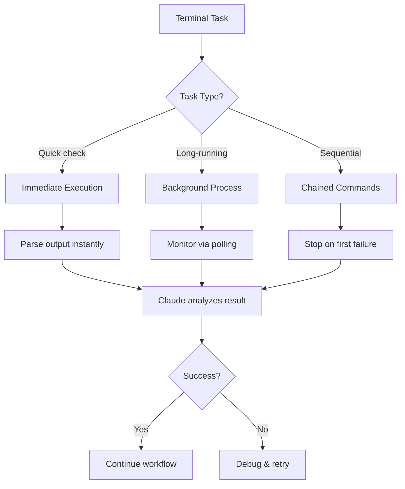

# Module 3.4: Terminal & Shell Operations

> **Estimated time**: ~30 minutes
>
> **Prerequisite**: Module 3.3 (Git Integration)
>
> **Outcome**: After this module, you will be able to execute, monitor, and chain terminal commands through Claude Code intelligently

---

## 1. WHY — Why This Matters

You're deploying a Node.js microservice. You need to build the Docker image, run tests in a container, push to registry, update the deployment config, and verify the pod is healthy. That's at least 8 terminal commands, each with different output to parse, different error conditions to handle, and some need to run in sequence while others can run in parallel.

Typing each command manually, waiting for each to finish, copying error logs, pasting them into Claude's context to debug — this is death by a thousand terminal switches. Claude Code can execute commands directly, parse their output, detect errors, chain operations intelligently, and even run long-running processes in the background while continuing other work. You stay in conversation mode. Claude handles the shell.

---

## 2. CONCEPT — Core Ideas

Claude Code has **direct terminal access** through its Bash tool. This isn't just a convenience wrapper — it's a fundamental capability that transforms how you interact with development environments.

### Mental Model: Claude as Terminal Orchestrator

Think of Claude Code as having three modes of terminal interaction:



### Key Concepts

1. **Command Execution Context**: Claude Code runs commands in a **persistent working directory** but **non-persistent shell state**. `cd` into a directory? That sticks. Export an environment variable? Gone after command completes. Use `&&` to chain commands that need shared state.

2. **Output Parsing**: Claude doesn't just run commands blindly — it reads stdout/stderr, detects error patterns, and can extract specific information (version numbers, file paths, test counts) from output.

3. **Background vs Foreground**: Long-running tasks (builds, tests, installs) should run in background. Quick commands (status checks, file lists) run blocking. Claude manages the difference automatically but you can override.

4. **Error Propagation**: When a command fails, Claude sees the exit code AND the error output. It can automatically suggest fixes or re-run with corrections.

5. **Interactive Command Limitation**: Commands requiring user input (interactive prompts, password entry, TUI interfaces) won't work. Claude Code needs non-interactive, scriptable operations.

---

## 3. DEMO — Step by Step

Let's walk through a realistic scenario: setting up and testing a new microservice.

**Context**: You're starting a new Express.js API service. You need to initialize it, install dependencies, add tests, and verify everything works.

**Step 1: Create project structure**

Ask Claude:
```
"Create a new Express API project called user-service with TypeScript,
install dependencies, and show me the package.json"
```

Claude will execute:
```bash
mkdir -p user-service && cd user-service && npm init -y
```

Expected output:
```
Wrote to /Users/you/projects/user-service/package.json:
{
  "name": "user-service",
  "version": "1.0.0",
  ...
}
```

Why it matters: Claude used `&&` to chain commands because the later commands depend on the directory existing. Single command execution.

---

**Step 2: Install dependencies in background**

Claude automatically detects this is a long-running task:
```bash
npm install express typescript @types/express @types/node ts-node
```

This runs in **background mode**. Claude continues the conversation while npm downloads packages. You'll see:
```
⏳ Running in background: npm install...
```

Why it matters: You don't wait for npm. Claude can continue answering questions or preparing the next steps while installation happens.

---

**Step 3: Check installation status**

While install runs, ask Claude:
```
"Is the installation done? Show me the installed packages."
```

Claude checks background task status, then runs:
```bash
npm list --depth=0
```

Expected output:
```
user-service@1.0.0
├── express@4.18.2
├── typescript@5.3.3
├── @types/express@4.17.21
├── @types/node@20.10.4
└── ts-node@10.9.2
```

Why it matters: Claude can query intermediate state without blocking the workflow.

---

**Step 4: Create and run tests**

Ask Claude:
```
"Create a simple test for a /health endpoint and run it with jest"
```

Claude executes multiple commands in sequence:
```bash
npm install --save-dev jest @types/jest ts-jest && \
npx ts-jest config:init && \
npm test
```

Expected output:
```
> user-service@1.0.0 test
> jest

 PASS  src/__tests__/health.test.ts
  ✓ GET /health returns 200 (15 ms)

Test Suites: 1 passed, 1 total
Tests:       1 passed, 1 total
```

Why it matters: Sequential operations with `&&` ensure each step completes before the next. If test fails, Claude sees the failure output immediately and can debug.

---

**Step 5: Run development server in background**

Ask Claude:
```
"Start the dev server and verify it's responding"
```

Claude runs:
```bash
npm run dev &
```

Then immediately verifies:
```bash
sleep 2 && curl http://localhost:3000/health
```

Expected output:
```
{"status":"ok","timestamp":"2026-02-02T10:30:00.000Z"}
```

Why it matters: Background process (`&`) + verification command. Claude chains them intelligently.

---

**Step 6: Parse logs for errors**

Ask Claude:
```
"Check the last 20 lines of application logs for any errors"
```

Claude runs:
```bash
tail -n 20 logs/app.log | grep -i error
```

Expected output (if clean):
```
(no output = no errors)
```

Why it matters: Claude can parse structured output, extract patterns, and interpret "no output" as success.

---

**Step 7: Environment-aware commands**

Ask Claude:
```
"Build the Docker image for production"
```

Claude detects the environment context and runs:
```bash
docker build -t user-service:latest \
  --build-arg NODE_ENV=production \
  --build-arg BUILD_DATE=$(date -u +'%Y-%m-%dT%H:%M:%SZ') \
  .
```

Expected output:
```
[+] Building 45.2s (12/12) FINISHED
 => [internal] load build definition from Dockerfile
 => => transferring dockerfile: 432B
 => [stage-1 3/5] COPY package*.json ./
 => [stage-1 4/5] RUN npm ci --only=production
 => exporting to image
 => => naming to docker.io/library/user-service:latest
```

Why it matters: Claude constructs commands with appropriate flags and arguments based on context. Note the `$(date)` subshell — Claude handles command substitution correctly.

---

**Step 8: Multi-stage pipeline**

Ask Claude:
```
"Run the full CI pipeline: lint, test, build, and verify the Docker image runs"
```

Claude executes a complex pipeline:
```bash
npm run lint && \
npm test && \
docker build -t user-service:test . && \
docker run --rm -d -p 3001:3000 --name user-service-test user-service:test && \
sleep 3 && \
curl http://localhost:3001/health && \
docker stop user-service-test
```

Expected output (abbreviated):
```
> eslint . --ext .ts
✓ No linting errors

> jest
Tests: 5 passed, 5 total

[+] Building 12.3s (12/12) FINISHED
=> exporting to image

a3f9c8d1e0b2
{"status":"ok"}
user-service-test
```

Why it matters: This demonstrates **chained commands with proper error handling**. If any step fails (lint errors, test failures, build errors), the chain stops. Claude sees exactly where it failed.

---

**Step 9: Error recovery**

Suppose the test failed at step 8. Claude sees:
```
FAIL src/__tests__/auth.test.ts
  ✕ POST /login validates credentials (23 ms)

Expected: 200
Received: 401
```

Claude automatically:
1. Identifies the failing test
2. Reads the test file
3. Reads the route handler
4. Proposes a fix
5. Asks: "Should I update the auth middleware to fix this?"

Why it matters: Claude doesn't just execute — it **monitors, detects failures, and initiates debugging** without you needing to copy-paste error logs.

---

**Step 10: Cleanup and verification**

Ask Claude:
```
"Clean up all test containers and verify nothing is still running"
```

Claude runs:
```bash
docker ps -a --filter "name=user-service-test" --format "{{.Names}}" | \
xargs -r docker rm -f && \
docker ps --filter "name=user-service"
```

Expected output:
```
user-service-test
CONTAINER ID   IMAGE   COMMAND   CREATED   STATUS   PORTS   NAMES
(empty = cleanup successful)
```

Why it matters: Claude can construct complex pipelines with `xargs`, filters, and format strings. It verifies cleanup by checking the result is empty.

---

## 4. PRACTICE — Try It Yourself

### Exercise 1: Background Process Management
**Goal**: Practice running long tasks in background while continuing work

**Instructions**:
1. Create a new Python project directory
2. Ask Claude to install dependencies from a `requirements.txt` (with at least 5 packages) in background
3. While installation runs, ask Claude to create a FastAPI app skeleton
4. Verify installation completed successfully
5. Run the FastAPI dev server and test the `/docs` endpoint

**Expected result**: You should see the Swagger UI JSON response from `/docs` while installation ran in background

<details>
<summary>💡 Hint</summary>

Use explicit language: "Install these in the background" or "run in background while you...". Claude will automatically detect long-running commands like `pip install`, but being explicit helps.

For FastAPI dev server, the command is `uvicorn main:app --reload`. You can test with `curl http://localhost:8000/docs`.

</details>

<details>
<summary>✅ Solution</summary>

**Conversation flow**:

You: "Create a Python project called api-service with a requirements.txt containing fastapi, uvicorn, pydantic, sqlalchemy, and pytest. Install dependencies in background."

Claude runs:
```bash
mkdir api-service && cd api-service
echo -e "fastapi\nuvicorn\npydantic\nsqlalchemy\npytest" > requirements.txt
pip install -r requirements.txt  # (runs in background)
```

You: "While that installs, create a basic FastAPI app with a health check endpoint"

Claude creates `main.py` while pip runs in background.

You: "Is pip done? Start the dev server and test the /docs endpoint"

Claude:
```bash
# Check if background task finished
ps aux | grep "pip install"  # (empty = done)

# Start server in background
uvicorn main:app --reload &

# Wait for startup and test
sleep 2 && curl http://localhost:8000/docs
```

Output:
```json
{"openapi":"3.1.0","info":{"title":"FastAPI","version":"0.1.0"},...}
```

</details>

---

### Exercise 2: Error Detection and Recovery
**Goal**: Practice letting Claude detect and fix command errors

**Instructions**:
1. Ask Claude to run a deliberately broken Docker build (misspell a Dockerfile instruction or reference nonexistent file)
2. Observe how Claude detects the error
3. Ask Claude to fix it
4. Verify the build succeeds

**Expected result**: Claude should identify the exact error line, explain what's wrong, propose a fix, and re-run the build

<details>
<summary>💡 Hint</summary>

Create a Dockerfile with an error like `FRON node:18` (misspelled FROM) or `COPY nonexistent.txt /app/`. Claude will see the Docker build error output and can identify the syntax or file issue.

</details>

<details>
<summary>✅ Solution</summary>

**Conversation**:

You: "Create a Dockerfile for a Node app but make it broken on purpose — I want to practice debugging"

Claude creates:
```dockerfile
FRON node:18
WORKDIR /app
COPY package.json .
RUN npm install
```

You: "Try to build this"

Claude runs:
```bash
docker build -t test-app .
```

Output:
```
Error response from daemon: Dockerfile parse error line 1: unknown instruction: FRON
```

Claude responds:
"The build failed because line 1 has a typo: `FRON` should be `FROM`. This is the base image instruction. Should I fix this?"

You: "Yes"

Claude fixes the Dockerfile and re-runs:
```bash
docker build -t test-app .
```

Output:
```
[+] Building 8.2s (8/8) FINISHED
=> exporting to image
```

**Key insight**: You didn't have to copy-paste the error. Claude saw it, diagnosed it, and offered a fix.

</details>

---

### Exercise 3: Complex Pipeline Construction
**Goal**: Practice building multi-command pipelines with proper error handling

**Instructions**:
1. Create a scenario where you need to: clone a repo, check out a specific branch, install dependencies, run tests, and generate a coverage report
2. Ask Claude to do this in a **single command chain** that stops on first error
3. Deliberately introduce a failure (e.g., nonexistent branch) and observe how Claude handles it
4. Fix the issue and re-run

**Expected result**: A properly constructed pipeline using `&&`, clear error identification when a step fails, and successful completion after fix

<details>
<summary>💡 Hint</summary>

Use `&&` to chain commands. The chain will stop at the first failing command. For example:
```bash
git clone URL && cd repo && git checkout branch && npm install && npm test && npm run coverage
```

If `git checkout branch` fails (branch doesn't exist), the chain stops there. Claude will see the "branch not found" error.

</details>

<details>
<summary>✅ Solution</summary>

You: "Clone the repo https://github.com/example/demo-api, check out the 'feature/auth' branch, install dependencies, run tests, and generate coverage. Do this in one command chain."

Claude runs:
```bash
git clone https://github.com/example/demo-api && \
cd demo-api && \
git checkout feature/auth && \
npm install && \
npm test && \
npm run coverage
```

If the branch doesn't exist, output shows:
```
Cloning into 'demo-api'...
error: pathspec 'feature/auth' did not match any file(s) known to git
```

Claude responds:
"The checkout failed because the branch 'feature/auth' doesn't exist. Let me check available branches."

Claude runs:
```bash
cd demo-api && git branch -r
```

Output:
```
origin/main
origin/develop
origin/feature/authentication
```

Claude: "The branch is named 'feature/authentication', not 'feature/auth'. Should I re-run with the correct branch name?"

You: "Yes"

Claude re-runs the full chain with the correct branch name. All steps complete successfully.

</details>

---

## 5. CHEAT SHEET

| Task | Command Pattern | Notes |
|------|----------------|-------|
| **Sequential commands** | `cmd1 && cmd2 && cmd3` | Stops on first failure |
| **Background process** | `cmd &` | Returns immediately |
| **Background with verification** | `cmd & sleep 2 && verify-cmd` | Wait then check |
| **Conditional execution** | `cmd1 || cmd2` | Run cmd2 if cmd1 fails |
| **Ignore errors** | `cmd1 ; cmd2` | Always run cmd2 |
| **Capture output** | `result=$(cmd)` | Use in other commands |
| **Suppress output** | `cmd > /dev/null 2>&1` | Silent execution |
| **Check exit code** | `cmd && echo "success" \|\| echo "fail"` | Explicit success/fail |
| **Timeout command** | `timeout 30s cmd` | Kill after 30 seconds |
| **Retry on failure** | `cmd \|\| cmd \|\| cmd` | Try 3 times |
| **Parse JSON output** | `cmd \| jq '.key'` | Extract JSON fields |
| **Filter logs** | `tail -n 100 log \| grep ERROR` | Find errors in logs |
| **Count results** | `cmd \| wc -l` | Count output lines |
| **Multi-line command** | `cmd1 && \`<br>`cmd2 && \`<br>`cmd3` | Readable chaining |
| **Environment variable** | `VAR=value cmd` | Set for single command |
| **Shared env state** | `export VAR=value && cmd` | Persist in chain |
| **Check process running** | `ps aux \| grep process-name` | Find running process |
| **Kill background task** | `pkill -f process-name` | Stop by name |
| **Docker cleanup** | `docker ps -aq \| xargs docker rm -f` | Remove all containers |
| **Port check** | `lsof -i :3000` | See what's on port 3000 |

**Operators Quick Reference**:
- `&&` = AND (run next only if previous succeeded)
- `||` = OR (run next only if previous failed)
- `;` = SEQUENCE (always run next, ignore previous exit code)
- `&` = BACKGROUND (run in background, return immediately)
- `|` = PIPE (send output of cmd1 to input of cmd2)

---

## 6. PITFALLS — Common Mistakes

| ❌ Mistake | ✅ Correct Approach |
|---|---|
| Using `cd` alone and expecting it to persist for next command | Chain with `&&`: `cd dir && npm install` |
| Running long builds/installs in foreground, blocking conversation | Explicitly request background: "install in background" |
| Trying to run interactive commands (`vim`, `top`, `npm init` without `-y`) | Use non-interactive alternatives: `npm init -y`, `echo "text" > file` |
| Assuming environment variables persist across commands | Use `export VAR=value && cmd1 && cmd2` to share state |
| Not checking if background process finished before next step | Ask Claude: "Is the build done?" or use `wait` command |
| Chaining with `;` when you need error detection | Use `&&` to stop on first failure |
| Forgetting to cleanup background processes | Explicitly ask Claude to stop/kill processes when done |
| Not quoting paths with spaces | Always quote: `cd "/path/with spaces"` |
| Using `sudo` commands without permission setup | Claude can't enter passwords; configure passwordless sudo or use Docker |
| Running commands that require GUI | Use headless/CLI alternatives: `chrome` → `curl`, `git` GUI → `git` CLI |
| Expecting real-time streaming output from long commands | Claude sees output after command completes; use periodic checks for long tasks |
| Not specifying timeout for potentially hanging commands | Use `timeout` wrapper: `timeout 60s long-running-cmd` |

**Special Case — Docker Compose**:

❌ Wrong:
```bash
docker-compose up
# This blocks forever
```

✅ Correct:
```bash
docker-compose up -d  # Detached mode
sleep 3
docker-compose ps     # Verify containers started
```

**Special Case — npm/yarn Scripts**:

❌ Wrong:
```bash
npm run dev
# Blocks in foreground
```

✅ Correct:
```bash
npm run dev &        # Background
sleep 2
curl http://localhost:3000  # Verify running
```

---

## 7. REAL CASE — Production Story

**Scenario**: Deploying a microservice update to Kubernetes staging cluster at 2 AM (production deploy window). The deployment requires building a new Docker image, running smoke tests in a temp container, pushing to registry, updating the K8s deployment, and verifying pod health. Normally this takes 15 minutes of manual terminal work.

**Problem**: During the deploy, the smoke test failed with a cryptic error:
```
Error: connect ECONNREFUSED 10.0.0.45:5432
```

The developer (working solo at 2 AM) needed to:
1. Identify which service couldn't connect (database connection)
2. Check if the database pod was running
3. Verify network policies
4. Check service DNS resolution
5. Examine recent config changes

Normally this would mean switching between terminal, kubectl commands, log files, and Slack/Notion to check deployment docs.

**Solution**: The developer used Claude Code to orchestrate the entire debug process:

**Conversation**:

Dev: "Smoke test failed with ECONNREFUSED to 10.0.0.45:5432. Debug this."

Claude executed automatically:
```bash
# Check if database pod is running
kubectl get pods -l app=postgres -n staging

# Check service endpoints
kubectl get endpoints postgres-service -n staging

# Check network policies
kubectl get networkpolicies -n staging

# Test DNS resolution from app pod
kubectl exec -it $(kubectl get pod -l app=user-service -n staging -o jsonpath='{.items[0].metadata.name}') \
  -- nslookup postgres-service

# Check recent config changes
kubectl rollout history deployment/user-service -n staging
```

Output revealed:
```
NAME                        READY   STATUS    RESTARTS   AGE
postgres-6d8f9c4b5b-7x2n4   0/1     Pending   0          45s
```

Claude: "The database pod is in Pending state. Let me check why."

```bash
kubectl describe pod postgres-6d8f9c4b5b-7x2n4 -n staging | grep -A 5 Events
```

Output:
```
Events:
  Warning  FailedScheduling  30s   default-scheduler  0/3 nodes available:
  insufficient memory.
```

Claude: "The database pod can't schedule due to insufficient memory. Recent deployments might have increased memory usage. Let me check resource requests."

```bash
kubectl top nodes
kubectl get pods -n staging -o jsonpath='{range .items[*]}{.metadata.name}{"\t"}{.spec.containers[*].resources.requests.memory}{"\n"}{end}'
```

Claude identified that a recent deployment increased memory requests, leaving no room for the database pod.

**Result**: Claude constructed a complete diagnostic pipeline, executed 8 different kubectl commands, parsed outputs, correlated information across commands, and identified the root cause in **under 2 minutes**. The developer didn't need to remember kubectl syntax, grep patterns, or jsonpath queries. They stayed in natural language, asking follow-up questions as Claude surfaced information.

The fix: temporarily reduce memory request for a non-critical service, let database pod schedule, complete deployment, then rebalance resources. Total deploy time: 12 minutes instead of the usual 15, despite hitting a critical issue. Without Claude Code, debugging alone would have taken 30+ minutes of manual kubectl/grep/jq work.

**Key Takeaway**: Terminal operations through Claude Code aren't just about running commands — it's about **intelligent orchestration, automatic error detection, and contextual debugging**. Claude doesn't just execute; it monitors, analyzes, and guides you through complex command sequences.

---

> **Next**: [Module 4.1: Prompting Techniques](../../phase-04-prompt-memory/01-prompting-techniques/) →
