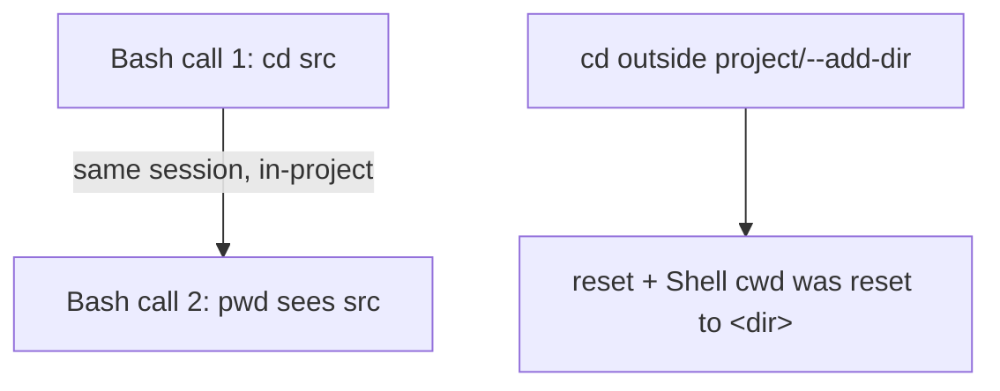

# Module 3.4: Terminal & Shell Operations

> **Estimated time**: ~30 minutes
>
> **Prerequisite**: Module 3.3 (Git Integration)
>
> **Outcome**: After this module, you will know exactly what persists between Bash calls, how
> Claude Code decides to background a command, and how to write permission rules that actually
> hold.

---

## 1. WHY — Why This Matters

You ask Claude to install dependencies, run a build, then start a dev server to check it. Some of
that takes seconds, some takes minutes, and a server never returns at all. If you don't know what
the Bash tool actually does with a slow command — wait, time out, background it — you'll either
sit there blocked or repeat myths about how backgrounding works.

This module replaces guesswork with the documented mechanism: timeout, output limits,
`run_in_background`, `/tasks`, and the permission-rule syntax that decides what runs without
asking.

---

## 2. CONCEPT — Core Ideas

### What persists between commands, what doesn't

`cd` **does** carry over to later Bash calls in the running session — but only while it stays
inside the project directory or an `--add-dir` path, and only within that one process. Landing
outside those bounds resets it and Claude Code appends `Shell cwd was reset to <dir>`. Set
`CLAUDE_BASH_MAINTAIN_PROJECT_WORKING_DIR=1` to force a return to the start directory after every
command instead. `export VAR=value` does **not** persist, but shell aliases and functions from
`~/.zshrc`/`~/.bashrc`/`~/.profile` load once at session start and apply to every command.


```mermaid
graph TD
    A[Bash call 1: cd src] -->|same session, in-project| B[Bash call 2: pwd sees src]
    C[cd outside project/--add-dir] --> D["reset + Shell cwd was reset to &lt;dir&gt;"]
```

### Timeout and backgrounding are tool-level, not `&`

Claude sets a `timeout` on the call when it expects a command to run long; the default is
**120,000 ms**, and Claude can ask for up to **600,000 ms** (`BASH_DEFAULT_TIMEOUT_MS`,
`BASH_MAX_TIMEOUT_MS`). If a command outruns its timeout with no estimate given, Claude Code moves
it to the background automatically unless the command starts with `sleep`. There's no
`BashOutput`/`KillShell` tool anymore: a backgrounded command is managed with
`run_in_background: true` on the call and inspected or stopped from `/tasks` (alias `/bashes`), or
by pressing **Ctrl+B** on a running command (tmux: twice). A bare `cmd &` still backgrounds within
one OS shell — it doesn't make Claude Code treat the call as a managed background task.

### Output limits

A successful command reads back roughly **30,000 characters** inline by default
(`BASH_MAX_OUTPUT_LENGTH`, max 150,000; `bashOutputMaxChars` supersedes it up to 128,000) — past
that, Claude gets a saved file path and a 2,000-character preview. A failing command reads back
about 10,000 characters as a head-and-tail excerpt. Output over 5 GB kills the command outright.

### `!` shell mode runs outside the sandbox

Typing `!command` runs it directly and folds the output into context — but it runs **outside**
Claude Code's sandbox even when sandboxing is on, since sandboxing wraps commands Claude runs, not
ones you type. Claude auto-responds to the output like a normal turn unless
`respondToBashCommands: false`.

### Bash permission rules aren't a security boundary

`Bash(npm run build)` matches only that literal string. `Bash(npm run *)` (or `Bash(npm run:*)`)
matches anything starting with `npm run ` — the space before the wildcard is part of the rule, so
`Bash(ls *)` doesn't match `lsof` but `Bash(ls*)` does. Wrappers like `timeout`, `time`, `nice`,
and `nohup` are stripped before matching, so `Bash(npm test *)` still catches `timeout 30 npm
test`. But a **deny** rule for `Bash(rm *)` does not stop `/bin/rm -rf` or `bash -c 'rm -rf ...'`
— Claude Code says plainly this "isn't a security boundary around the program." Treat deny rules
as a speed bump; put real enforcement in a `PreToolUse` hook or the sandbox (Module 2.3).

---

## 3. DEMO — Step by Step

**Step 1: `cd` persists across Bash calls in one session**

```bash
# docs: en/tools-reference — "carries over to later Bash commands"
claude -p "First, run 'cd src && ls -la' as one Bash call. Then, as a SEPARATE Bash call, run \
'pwd'. Show both outputs." --permission-mode acceptEdits
```

```text
# Output may vary
**1. `cd src && ls -la`**
total 8
drwxr-xr-x@ 4 you staff 128 … .
-rw-r--r--@ 1 you staff 143 … math.js

**2. `pwd`** (separate call)
/Users/you/cc-lab/src

The `cd src` from the first call carried over to the second.
```

**Step 2: Shell mode (`!`) folds real output into context**

```text
# Output may vary — captured interactively, ! prefix typed at the prompt
! git status
  ⎿  On branch main
     nothing to commit, working tree clean

⏺ Your working tree is clean on main. What would you like to work on?
```

**Step 3: A command Claude expects to run long goes to the background on its own**

```text
# Output may vary — auto permission mode
❯ Run this in the background: node -e "setTimeout(()=>{},200000)". Do not wait for it.

⏺ Bash(node -e "setTimeout(()=>{},200000)")
  ⎿  Running in the background (↓ to manage)
  ⎿  Allowed by auto mode classifier

⏺ The Node process is running in the background as task bs75gee9e. It will sit idle for about
  200 seconds and then exit. I'm not waiting on it, but I'll get a notification when it finishes.
```

When Claude doesn't estimate duration and the command hits the wall unassisted, the message
differs:

```text
# Example from docs: https://code.claude.com/docs/en/tools-reference
Command did not complete within its 120s timeout and was moved to the background
```

**Step 4: Check on it with `/tasks`**

```text
# Output may vary
  Shell details

  Status:   running
  Runtime:  28s
  Command:  node -e "setTimeout(()=>{},200000)"

  Output:
  No output available

  ← to go back · Esc/Enter/Space to close · x to stop
```

**Step 5: Ctrl+B backgrounds the running command.** Mid-run, the hint appears on the status line:

```text
# Output may vary
⏺ Bash(npm test 2>&1 | tail -40)
  ⎿  Running… (7s · timeout 5m)
     (ctrl+b to run in background)
```

<!-- AUTHOR-CAPTURE: press Ctrl+B once (tmux: twice) during that "Running…" state in a real TTY
     and capture the frame that follows — the nested pexpect session used for this module's other
     captures could not deliver a raw Ctrl+B keystroke reliably. -->

**Step 6: A permission rule that looks safe but isn't**

```json
{ "permissions": { "deny": ["Bash(rm *)"] } }
```

```bash
bash -c 'rm -rf /tmp/scratch'   # not matched — deny rule never sees "rm" as the command name
```

Use a hook (Module 2.3) if `rm` must actually be blocked.

---

## 4. PRACTICE — Try It Yourself

### Exercise 1: Watch a Real Timeout

**Goal**: Trigger the background transition and confirm it with `/tasks`.

**Instructions**:
1. In a scratch repo, ask Claude to run a ~3-minute command without saying how long it'll take
   (a script, not `sleep`).
2. Watch what happens after roughly 120 seconds.
3. Run `/tasks` and read the shell's status.

**Expected result**: either Claude sets its own longer timeout and backgrounds proactively, or the
command auto-backgrounds with the "moved to the background" message — both are correct.

<details>
<summary>💡 Hint</summary>

Don't use `sleep` — it's excluded from auto-backgrounding.

</details>

<details>
<summary>✅ Solution</summary>

`node -e "setTimeout(()=>{}, 180000)"` works. Check Claude's message: did it set `timeout` itself,
or did the 120-second wall trigger the transition?

</details>

---

### Exercise 2: Write a Rule, Then Break It

**Goal**: Confirm a Bash deny rule is a speed bump, not a wall.

**Instructions**:
1. Add `{"permissions": {"deny": ["Bash(rm *)"]}}` to `.claude/settings.local.json`.
2. Ask Claude to run `rm somefile` — confirm it's blocked.
3. Ask Claude to run `bash -c "rm somefile"` instead.

**Expected result**: step 2 is denied; step 3 runs, since the rule matches command text, not
intent.

<details>
<summary>✅ Solution</summary>

Documented limitation, not a bug. Real enforcement needs a `PreToolUse` hook inspecting the actual
command string, not a Bash allow/deny rule.

</details>

---

## 5. CHEAT SHEET

| Task | How | Notes |
|---|---|---|
| Run long task without blocking | "run it in the background" | Sets `run_in_background: true` |
| Check background tasks | `/tasks` (`/bashes`) | Replaces retired `BashOutput`/`KillShell` |
| Background the current command | `Ctrl+B` | Tmux: press twice |
| Run outside the sandbox | `!command` | Not classifier-checked |
| Default timeout | `BASH_DEFAULT_TIMEOUT_MS` | 120000 ms |
| Max timeout Claude can request | `BASH_MAX_TIMEOUT_MS` | 600000 ms |
| Read back more output | `BASH_MAX_OUTPUT_LENGTH` / `bashOutputMaxChars` | ~30,000 default; max 150,000 / 128,000 |
| Always return to start dir | `CLAUDE_BASH_MAINTAIN_PROJECT_WORKING_DIR=1` | Opposite of default carry-over |
| Exact-match rule | `Bash(npm run build)` | Only that literal command |
| Wildcard rule | `Bash(npm run *)` ≡ `Bash(npm run:*)` | Space before `*` matters |

**Shell operators** (still real syntax — just not how Claude Code backgrounds a *tool call*):

- `&&` = run next only if previous succeeded · `||` = run next only if previous failed
- `;` = always run next · `|` = pipe · `cmd &` = background within that one OS shell, not a
  Claude-managed task

---

## 6. PITFALLS — Common Mistakes

| ❌ Mistake | ✅ Correct Approach |
|---|---|
| Teaching `npm run dev &` as "how Claude backgrounds things" | Ask Claude to run it in the background — it sets `run_in_background` on the call |
| Looking for `BashOutput`/`KillShell` tools | Retired — use `/tasks` (`/bashes`) |
| Assuming a Bash deny rule stops `rm` everywhere | Matches command text only; `bash -c`, `/bin/rm` bypass it — use a hook instead |
| Assuming `cd` survives a fresh `--continue` process | Persists within one running session, not across a restarted process |
| Piping install output through `--only=production` | Flag is gone; use `npm ci --omit=dev` |
| Basing an image on `node:18` | Move to a maintained LTS, e.g. `node:22` |
| Writing `docker-compose` (old standalone binary) | Use `docker compose` (the v2 plugin) |
| Assuming `sleep 300` auto-backgrounds at 120s | `sleep` is explicitly excluded — it just blocks |

---

## 7. REAL CASE — Production Story

**Scenario**: Deploying a microservice update to a Kubernetes staging cluster at 2 AM — new image,
smoke test in a temp container, registry push, deployment update, pod-health check. Normally 15
minutes of manual terminal work.

**Problem**: The smoke test failed:

```text
Error: connect ECONNREFUSED 10.0.0.45:5432
```

**Solution**: Working solo, the developer asked Claude to debug it. Claude ran a diagnostic chain —
`kubectl get pods`, `kubectl get endpoints`, `kubectl get networkpolicies`, an `nslookup` from
inside the app pod, `kubectl rollout history` — and found the database pod stuck `Pending`.
`kubectl describe pod … | grep -A 5 Events` showed `FailedScheduling: insufficient memory`; a
recent deployment had raised memory requests elsewhere.

**Result**: Root cause in under 2 minutes, across 8 kubectl commands the developer didn't have to
remember. Lowering a non-critical service's memory request let the database pod schedule; total
deploy time was 12 minutes despite the incident.

**Key Takeaway**: Terminal work through Claude Code isn't about typing faster — it's Claude reading
exit codes and stderr correctly, and knowing when to background instead of blocking the
conversation.

---

> **Next**: [Module 4.1: Prompting Techniques](../../phase-04-prompt-memory/01-prompting-techniques/) →
