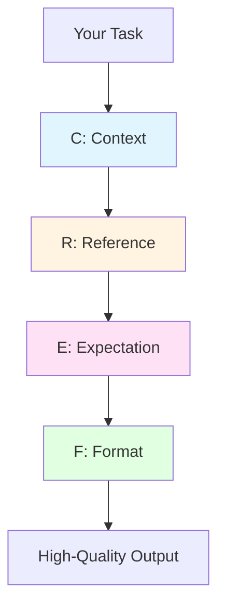

# Module 4.1: Prompting Techniques

> **Estimated time**: ~35 minutes
>
> **Prerequisite**: Module 3.4 (Terminal & Shell Operations)
>
> **Outcome**: After this module, you will master the art of writing prompts that get Claude Code to produce exactly what you want — first time, every time — by leveraging context, constraints, references, and iterative refinement.

---

## 1. WHY — Why This Matters

You tell Claude Code "add auth to this project" and get 200 lines of generic JWT boilerplate that doesn't match your architecture. Your colleague types a 3-sentence prompt and gets production-ready code that passes code review. The difference isn't luck — it's technique. In Claude Code, prompting matters more than in ChatGPT because Claude can ACT — read files, write code, run commands. A vague prompt doesn't just give bad text, it creates bad code in your actual project files. Master prompting and you control the output quality.

---

## 2. CONCEPT — Core Ideas

Traditional prompt engineering focuses on getting better text responses. With Claude Code, you're engineering **actions** — file creation, code edits, git operations, terminal commands. This requires a different mental model.

### The CREF Framework

Every high-quality Claude Code prompt should have these four elements:



- **Context**: Set project context first ("This is a KMP project using Clean Architecture with MVVM...")
- **Reference**: Point to existing code ("Follow the pattern in `src/auth/LoginViewModel.kt`")
- **Expectation**: State what success looks like ("Output should pass ktlint and compile without warnings")
- **Format**: Specify output format ("Create file at `src/features/payment/PaymentViewModel.kt`")

### Constraint Stacking

Adding constraints narrows the solution space, paradoxically improving output quality. Think of it like photo editing: "make it better" is vague, but "increase contrast by 20%, warm the tones, crop to 16:9" is precise.

### Reference-Driven Prompting

"Do it like X" is THE most powerful Claude Code pattern. Claude can read your existing code instantly. Instead of describing your architecture in prose, point to a file that already embodies it.

### Iterative Refinement Chains

Professional developers don't write perfect code in one shot. Don't expect Claude to either. Break complex tasks into rounds:
- Round 1: Skeleton structure
- Round 2: Core logic
- Round 3: Error handling
- Round 4: Tests and edge cases

Each round builds on verified output from the previous round.

---

## 3. DEMO — Step by Step

**Task**: Add a caching layer to an existing user service in a Kotlin backend project.

**Step 1: The Bad Prompt**
```bash
$ claude
```
```
Add caching to the user service.
```

**What happens**:
```
I'll add caching to the user service using a simple in-memory cache...

[Claude creates generic CacheManager.kt with HashMap-based caching,
ignores your existing Redis setup, doesn't follow your naming conventions]
```

**Why it failed**: Zero context, zero reference to existing patterns.

---

**Step 2: Better Prompt — Adding Context + Reference**
```
This is a Kotlin Spring Boot backend using Clean Architecture.
We already have Redis configured in infrastructure/cache/.

Add a caching layer to UserService, following the pattern used in
infrastructure/cache/ProductCacheService.kt.
```

**What happens**:
```
I'll examine the ProductCacheService pattern first.

[Reads ProductCacheService.kt]
[Creates UserCacheService.kt following the same structure]
[Integrates with UserService correctly]
```

**Better**: Claude now follows your project's patterns.

---

**Step 3: Best Prompt — Full CREF**
```
CONTEXT: Kotlin Spring Boot backend, Clean Architecture, existing Redis setup

REFERENCE:
- Cache pattern: infrastructure/cache/ProductCacheService.kt
- Service pattern: domain/service/ProductService.kt
- Naming: infrastructure/cache/*CacheService.kt

EXPECTATION:
- Must pass ktlint (project uses ktlint.yml config)
- Cache TTL should be configurable via application.yml
- Include unit tests in test/infrastructure/cache/

FORMAT:
- Create infrastructure/cache/UserCacheService.kt
- Modify domain/service/UserService.kt (inject cache service)
- Add cache config to application.yml
- Create test/infrastructure/cache/UserCacheServiceTest.kt

CONSTRAINTS:
- Do NOT change UserService's public API
- Do NOT add new dependencies (use existing Spring Cache + Redis)
```

**What happens**:
```
I'll implement the caching layer following your project patterns.

[Reads ProductCacheService.kt and ProductService.kt]
[Creates UserCacheService.kt with identical structure]
[Modifies UserService.kt with minimal changes]
[Adds cache.user.ttl to application.yml]
[Creates comprehensive test file]

All files created. Running ktlint...
✓ All checks passed
```

**Perfect**: Production-ready code, first attempt.

---

**Step 4: Iterative Refinement**
```
Review your implementation for edge cases:
- What happens if Redis is down?
- Are there race conditions in cache invalidation?
- Is cache warming needed for critical users?
```

**What happens**:
```
Good catches. I'll add:
1. Fallback to database if Redis fails
2. Distributed lock for cache invalidation
3. Startup cache warming for admin users

[Updates implementation with circuit breaker pattern]
```

---

**Step 5: Negative Constraints**
```
One more thing: ensure the public API of UserService remains unchanged.
Other services depend on it.
```

**What happens**:
```
Verified: UserService public methods unchanged.
Caching is internal implementation detail only.
```

---

## 4. PRACTICE — Try It Yourself

### Exercise 1: Prompt Upgrade Challenge

Upgrade these vague prompts to CREF-quality. Assume a React + TypeScript + Vite project with existing logging in `src/utils/logger.ts`, tests in `src/__tests__/`, and Supabase for the database.

**Vague Prompt 1:**
```
Add logging to the app
```

**Vague Prompt 2:**
```
Write tests for the payment module
```

**Vague Prompt 3:**
```
Refactor the database layer
```

<details>
<summary>💡 Hint</summary>

For each prompt, identify:
- What context is missing? (tech stack, architecture, existing patterns)
- What should you reference? (existing files that show the pattern)
- What's the success criteria? (tests pass, linter pass, specific behavior)
- What's the exact output format? (which files, where)

</details>

<details>
<summary>✅ Solution</summary>

**Upgraded Prompt 1:**
```
CONTEXT: React + TypeScript project, logging exists in src/utils/logger.ts

REFERENCE: Follow the pattern in src/features/auth/LoginForm.tsx (uses logger.info, logger.error)

EXPECTATION: All user actions and API calls should be logged

FORMAT: Add logging to:
- src/features/dashboard/DashboardPage.tsx
- src/features/profile/ProfileForm.tsx
- src/api/client.ts

CONSTRAINTS: Do NOT log sensitive data (passwords, tokens, PII)
```

**Upgraded Prompt 2:**
```
CONTEXT: React + TypeScript + Vitest, payment module in src/features/payment/

REFERENCE:
- Test pattern: src/__tests__/auth/LoginForm.test.tsx
- Mock pattern: src/__tests__/__mocks__/api.ts

EXPECTATION: 80%+ coverage, all edge cases (success, failure, timeout, validation errors)

FORMAT:
- Create src/__tests__/payment/PaymentForm.test.tsx
- Create src/__tests__/payment/PaymentService.test.tsx

Run tests after creation to verify they pass.
```

**Upgraded Prompt 3:**
```
CONTEXT: React app using Supabase, current DB layer in src/api/supabase.ts (400 lines, mixed concerns)

REFERENCE: Clean separation like src/api/auth.ts (single responsibility)

EXPECTATION:
- Each domain gets its own service file
- Shared Supabase client in src/api/client.ts
- All existing functionality preserved

FORMAT:
- Create src/api/users.ts
- Create src/api/posts.ts
- Create src/api/comments.ts
- Refactor src/api/supabase.ts → src/api/client.ts

CONSTRAINTS:
- Do NOT change API surface (other components import these)
- Do NOT require migration (schema unchanged)

After refactor, run: npm run typecheck && npm run test
```

</details>

---

### Exercise 2: Reference Olympics

Write a prompt to add error handling to a feature using ONLY references to existing code (no prose description of how error handling should work).

**Scenario**: Add error handling to `src/features/checkout/CheckoutForm.tsx`. Your project already has error handling in `src/features/auth/LoginForm.tsx` and `src/features/profile/ProfileForm.tsx`.

<details>
<summary>💡 Hint</summary>

Don't describe error handling. Just point Claude to files that already do it right.

</details>

<details>
<summary>✅ Solution</summary>

```
Add error handling to src/features/checkout/CheckoutForm.tsx.

REFERENCE:
- Error display pattern: src/features/auth/LoginForm.tsx (lines 45-52, toast notifications)
- Error state management: src/features/profile/ProfileForm.tsx (useState for errors, clear on retry)
- Error types: src/types/errors.ts

Follow the exact same pattern. Include all error types: network, validation, timeout.
```

The power move: Claude reads those files and mimics the pattern perfectly.

</details>

---

## 5. CHEAT SHEET

| Technique | Template | Example |
|-----------|----------|---------|
| **CREF Framework** | `CONTEXT: [project info]`<br>`REFERENCE: [file paths]`<br>`EXPECTATION: [success criteria]`<br>`FORMAT: [output structure]` | See Demo Step 3 above |
| **Constraint Stacking** | `Do X following Y, ensuring Z, without W` | "Add logging following src/utils/logger.ts, ensuring no PII is logged, without adding dependencies" |
| **Reference-Driven** | `Follow the pattern in [file]` | "Follow the pattern in src/auth/LoginViewModel.kt" |
| **Iterative Refinement** | Round 1: `Create skeleton`<br>Round 2: `Add core logic`<br>Round 3: `Add error handling`<br>Round 4: `Add tests` | See Demo Step 4 |
| **Negative Constraints** | `Do NOT [unwanted action]` | "Do NOT change the public API", "Do NOT add new dependencies" |
| **Explain Then Implement** | `First explain your approach, then implement` | "Explain how you'll add caching without breaking existing tests, then implement it" |
| **Self-Review** | `Review your output for [concern]` | "Review for race conditions", "Review for edge cases" |
| **One-Shot Mode** | `claude -p "CONTEXT:... REFERENCE:... Do X"` | `claude -p "CONTEXT: Kotlin backend. REFERENCE: ProductService.kt. Create UserService.kt"` |

---

## 6. PITFALLS — Common Mistakes

| ❌ Mistake | ✅ Correct Approach |
|-----------|---------------------|
| **Zero context prompts**: "Add logging" | **CREF every time**: "CONTEXT: TypeScript React app. REFERENCE: src/utils/logger.ts. Add logging to DashboardPage.tsx following that pattern." |
| **Wall of text**: 500-word essay describing requirements | **Structured format**: Use CREF headings. Claude parses structure better than prose. |
| **Never referencing existing code**: Describing your architecture in words | **Always point to examples**: "Follow the pattern in X" is 10x clearer than describing it. |
| **Expecting perfection in one shot**: Frustrated when output isn't perfect | **Iterative refinement**: Round 1 skeleton, Round 2 logic, Round 3 polish. Professional workflow. |
| **Prompting in different language**: Code is English, prompt in Vietnamese | **Match the codebase language**: English codebase = English prompts. Reduces translation errors. |
| **No negative constraints**: Claude adds features you don't want | **Explicit boundaries**: "Do NOT add dependencies", "Do NOT change API surface" |
| **Describing instead of pointing**: "Use a service layer pattern with dependency injection..." | **Point to example**: "Follow the structure in ProductService.kt" — Claude reads it instantly |

---

## 7. REAL CASE — Production Story

**Scenario**: KMP mobile team at a Vietnamese fintech company building a super-app (e-wallet, loans, investments). Team of 8 developers, all using Claude Code for feature development.

**Problem**: Code review rejection rate was 35%. Common issues: inconsistent architecture, missing edge cases, skipped tests. Developers blamed Claude Code for "not understanding the project."

**Solution**: Tech lead ran a 1-hour workshop on CREF prompting. Created a `CLAUDE.md` file with reference examples for each layer (ViewModel, UseCase, Repository, UI). Rule: every prompt must reference at least one existing file.

**Tracked metrics for 2 weeks**:

| Metric | Week 1 (Before) | Week 2 (After CREF) |
|--------|-----------------|---------------------|
| Avg iterations per task | 3.4 | 1.6 |
| First-attempt success rate | 35% | 78% |
| Code review rejection | 35% | 12% |
| Time spent on prompt writing | ~10 seconds | ~40 seconds |
| Time saved per task | - | ~15 minutes |

**Key insight**: Developers initially resisted "spending more time on prompts." After seeing results, they became prompt perfectionists. One developer: "I used to spend 30 seconds typing a vague prompt, then 20 minutes fixing the output. Now I spend 60 seconds on a CREF prompt and get it right the first time."

**Bonus**: The team started building a library of "greatest hits" prompts in their project wiki. New hires copy-paste and adapt them. Onboarding time dropped from 2 weeks to 3 days.

---

> **Next**: [Module 4.2: CLAUDE.md — Project Memory](../02-claude-md/) →
