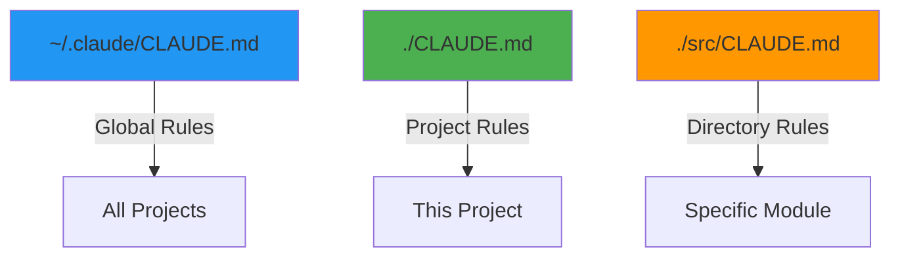

# Module 4.2: CLAUDE.md — Project Memory

> **Estimated time**: ~40 minutes
>
> **Prerequisite**: Module 4.1 (Prompting Techniques)
>
> **Outcome**: After this module, you will be able to write a CLAUDE.md file that makes Claude Code behave like a senior team member who deeply understands your project — its architecture, conventions, constraints, and tribal knowledge.

---

## 1. WHY — Why This Matters

You've just finished a productive coding session with Claude Code. The next day, you start fresh: "Remember we're using Prisma, not TypeORM?" "No, PUT endpoints return 200, not 204 in this API." "Our error handling wraps everything in Result<T, E>." Every session, you're re-explaining the same project decisions, conventions, and gotchas. It's like onboarding a new developer every single day.

**CLAUDE.md solves this permanently.** One well-crafted file at your project root eliminates 80% of repetitive context-setting. Claude Code reads it automatically every session — no prompting required. Your project's architecture, conventions, and tribal knowledge become persistent memory.

---

## 2. CONCEPT — Core Ideas

### What is CLAUDE.md?

**CLAUDE.md** is a Markdown file that lives in your project root and acts as Claude Code's persistent memory. It's automatically read at session start, giving Claude immediate context about your project without you saying a word.

Think of it as the difference between:
- **Without CLAUDE.md**: hiring a contractor who needs a 10-minute briefing every visit
- **With CLAUDE.md**: working with a senior team member who already knows your codebase, conventions, and business rules

### The CLAUDE.md Hierarchy

Claude Code reads multiple CLAUDE.md files in priority order:



| Location | Scope | Use For |
|----------|-------|---------|
| `~/.claude/CLAUDE.md` | Global (all projects) | Personal preferences, general conventions |
| `./CLAUDE.md` | Project root | **Main context** — architecture, tech stack, rules |
| `./src/CLAUDE.md` | Directory-level | Module-specific rules ⚠️ Needs verification |

**Priority**: More specific files override general ones. Project CLAUDE.md beats global CLAUDE.md.

### The 6 Essential Sections

Every production-grade CLAUDE.md should include:

| Section | Purpose | What to Include |
|---------|---------|-----------------|
| **1. Project Overview** | Tech stack snapshot | Languages, frameworks, database, key libraries |
| **2. Architecture Rules** | How code is organized | Directory structure, module boundaries, layering |
| **3. Coding Conventions** | How to write code | Naming patterns, error handling, async patterns |
| **4. Commands** | How to build/test/deploy | npm scripts, make targets, common workflows |
| **5. Constraints** | What NOT to do | Forbidden libraries, anti-patterns, edge cases |
| **6. Context** | Tribal knowledge | Business rules, gotchas, why decisions were made |

**Key principle**: CLAUDE.md is NOT documentation for humans — it's **instructions for Claude Code**. Write it like you're onboarding a new senior developer who learns by reading, not asking questions.

### Token Budget Reality

CLAUDE.md counts against your context window. A 2000-word CLAUDE.md eats ~2500 tokens every session. Keep it tight — aim for **500-800 words** (600-1000 tokens). Reference external docs instead of duplicating them.

---

## 3. DEMO — Step by Step

Let's build a production-grade CLAUDE.md for a real project: a Node.js/Express REST API with TypeScript, PostgreSQL (via Prisma), Redis caching, and JWT authentication.

### Step 1: Initialize CLAUDE.md

```bash
$ cd your-project
$ claude -p "Create initial CLAUDE.md with /init"
```

Expected output:
```
Created CLAUDE.md with basic template.
```

This generates a starter file. We'll replace it with production content.

### Step 2: Add Project Overview

Start with the tech stack snapshot — what someone needs to know in 30 seconds:

```markdown
# CLAUDE.md — Task Manager API

## Project Overview

Node.js REST API for task management with real-time notifications.

**Tech Stack:**
- Runtime: Node.js 20+, TypeScript 5.3
- Framework: Express 4.18
- Database: PostgreSQL 15 (via Prisma ORM)
- Cache: Redis 7
- Auth: JWT (jsonwebtoken + bcrypt)
- Testing: Jest + Supertest
- Deployment: Docker + Railway
```

### Step 3: Add Architecture Rules

Define how the code is organized — this prevents Claude from putting files in wrong places:

```markdown
## Architecture Rules

**Directory structure:**
```
src/
├── routes/          ← Express route handlers (thin, delegate to services)
├── services/        ← Business logic (fat, testable)
├── repositories/    ← Database access (Prisma queries only)
├── middleware/      ← Express middleware (auth, validation, error)
├── types/           ← TypeScript interfaces and types
└── utils/           ← Pure functions (no dependencies)
```

**Layering (enforced):**
- Routes → Services → Repositories → Database
- NEVER skip layers (e.g., routes calling repositories directly)
- Services are the ONLY place for business logic
```

### Step 4: Add Coding Conventions

This is where you encode your team's style — naming, patterns, error handling:

```markdown
## Coding Conventions

**Naming:**
- Files: `kebab-case.ts` (e.g., `task-service.ts`)
- Classes: `PascalCase` (e.g., `TaskService`)
- Functions: `camelCase` (e.g., `createTask`)
- Constants: `UPPER_SNAKE_CASE` (e.g., `MAX_RETRIES`)

**Error Handling:**
- All service methods return `Promise<Result<T, AppError>>`
- Use `Result` type from `src/types/result.ts` (no throwing in services)
- HTTP errors handled by `errorMiddleware` (converts Result to status codes)

**Async Patterns:**
- Use `async/await` (never raw Promises)
- Always handle errors with try/catch in route handlers
- Database transactions use Prisma `$transaction`

**Imports:**
- Absolute imports via `@/` (e.g., `import { TaskService } from '@/services/task-service'`)
- Group: stdlib → external → internal → types
```

### Step 5: Add Commands

List the commands Claude will run — build, test, lint, deploy:

```markdown
## Commands

```bash
npm run dev          # Start dev server (nodemon + ts-node)
npm run build        # Compile TypeScript → dist/
npm run test         # Run Jest tests
npm run test:watch   # Jest in watch mode
npm run lint         # ESLint + Prettier check
npm run db:migrate   # Run Prisma migrations
npm run db:seed      # Seed database with test data
docker-compose up    # Start PostgreSQL + Redis locally
```

**Deploy:** `git push` triggers Railway deploy (main branch only)
```

### Step 6: Add Constraints (DON'T Section)

Tell Claude what NOT to do — this prevents common mistakes:

```markdown
## Constraints

**DO NOT:**
- Use `any` type (enable `strict` mode, use `unknown` instead)
- Install new dependencies without asking (check bundle size impact)
- Modify Prisma schema without migration (`npx prisma migrate dev`)
- Put business logic in routes (routes delegate to services)
- Use `res.send()` (use `res.json()` for consistency)
- Return 204 No Content (this API always returns JSON, use 200 with `{ success: true }`)
- Store passwords unhashed (use bcrypt with 10 rounds)
- Commit `.env` (use `.env.example` template)

**Edge cases:**
- User deletion: soft-delete only (`deletedAt` timestamp, not actual DELETE)
- Pagination: max 100 items per page (return 400 if exceeded)
```

### Step 7: Add Context (Tribal Knowledge)

This is where you capture the "why" behind decisions and gotchas:

```markdown
## Context

**Why Prisma over TypeORM?**
We migrated in Q3 2024 after TypeORM's `synchronize` dropped tables in prod.
Prisma's migration system is safer (explicit SQL review).

**Why Result<T, E> pattern?**
Throwing exceptions in Node.js services makes error handling unpredictable.
Result types force explicit error handling at call sites.

**Gotchas:**
- Redis cache keys MUST include API version (e.g., `v1:task:123`) — we broke
  this during v2 rollout and served stale data for 2 hours
- JWT tokens expire in 15 minutes (short-lived for security). Refresh tokens
  are 7 days. Frontend handles refresh automatically
- PostgreSQL connection pool maxes at 10 (Railway free tier limit). If tests
  leak connections, you'll see ECONNREFUSED

**Business Rules:**
- Tasks can only be assigned to users in the same workspace
- Free tier limited to 50 tasks per workspace (enforced at service layer)
- Task titles must be unique within a project (database constraint)
```

### Step 8: Verify It Works

Save the file, start a fresh session, and test:

```bash
$ claude
```

Now try a task that requires project knowledge:

```
You: Add error handling to the task creation endpoint
```

If CLAUDE.md is working, Claude should:
- Put the code in `src/routes/` (not `src/handlers/`)
- Use `Result<T, AppError>` pattern (not throwing)
- Return `res.json()` (not `res.send()`)
- Check workspace membership (business rule)

**Complete Example: Production-Grade CLAUDE.md**

Here's the full file (~650 words):

```markdown
# CLAUDE.md — Task Manager API

## Project Overview

Node.js REST API for task management with real-time notifications.

**Tech Stack:**
- Runtime: Node.js 20+, TypeScript 5.3
- Framework: Express 4.18
- Database: PostgreSQL 15 (via Prisma ORM)
- Cache: Redis 7
- Auth: JWT (jsonwebtoken + bcrypt)
- Testing: Jest + Supertest
- Deployment: Docker + Railway

## Architecture Rules

**Directory structure:**
```
src/
├── routes/          ← Express route handlers (thin, delegate to services)
├── services/        ← Business logic (fat, testable)
├── repositories/    ← Database access (Prisma queries only)
├── middleware/      ← Express middleware (auth, validation, error)
├── types/           ← TypeScript interfaces and types
└── utils/           ← Pure functions (no dependencies)
```

**Layering (enforced):**
- Routes → Services → Repositories → Database
- NEVER skip layers (e.g., routes calling repositories directly)
- Services are the ONLY place for business logic

## Coding Conventions

**Naming:**
- Files: `kebab-case.ts` (e.g., `task-service.ts`)
- Classes: `PascalCase` (e.g., `TaskService`)
- Functions: `camelCase` (e.g., `createTask`)
- Constants: `UPPER_SNAKE_CASE` (e.g., `MAX_RETRIES`)

**Error Handling:**
- All service methods return `Promise<Result<T, AppError>>`
- Use `Result` type from `src/types/result.ts` (no throwing in services)
- HTTP errors handled by `errorMiddleware` (converts Result to status codes)

**Async Patterns:**
- Use `async/await` (never raw Promises)
- Always handle errors with try/catch in route handlers
- Database transactions use Prisma `$transaction`

**Imports:**
- Absolute imports via `@/` (e.g., `import { TaskService } from '@/services/task-service'`)
- Group: stdlib → external → internal → types

## Commands

```bash
npm run dev          # Start dev server (nodemon + ts-node)
npm run build        # Compile TypeScript → dist/
npm run test         # Run Jest tests
npm run test:watch   # Jest in watch mode
npm run lint         # ESLint + Prettier check
npm run db:migrate   # Run Prisma migrations
npm run db:seed      # Seed database with test data
docker-compose up    # Start PostgreSQL + Redis locally
```

**Deploy:** `git push` triggers Railway deploy (main branch only)

## Constraints

**DO NOT:**
- Use `any` type (enable `strict` mode, use `unknown` instead)
- Install new dependencies without asking (check bundle size impact)
- Modify Prisma schema without migration (`npx prisma migrate dev`)
- Put business logic in routes (routes delegate to services)
- Use `res.send()` (use `res.json()` for consistency)
- Return 204 No Content (this API always returns JSON, use 200 with `{ success: true }`)
- Store passwords unhashed (use bcrypt with 10 rounds)
- Commit `.env` (use `.env.example` template)

**Edge cases:**
- User deletion: soft-delete only (`deletedAt` timestamp, not actual DELETE)
- Pagination: max 100 items per page (return 400 if exceeded)

## Context

**Why Prisma over TypeORM?**
We migrated in Q3 2024 after TypeORM's `synchronize` dropped tables in prod.
Prisma's migration system is safer (explicit SQL review).

**Why Result<T, E> pattern?**
Throwing exceptions in Node.js services makes error handling unpredictable.
Result types force explicit error handling at call sites.

**Gotchas:**
- Redis cache keys MUST include API version (e.g., `v1:task:123`) — we broke
  this during v2 rollout and served stale data for 2 hours
- JWT tokens expire in 15 minutes (short-lived for security). Refresh tokens
  are 7 days. Frontend handles refresh automatically
- PostgreSQL connection pool maxes at 10 (Railway free tier limit). If tests
  leak connections, you'll see ECONNREFUSED

**Business Rules:**
- Tasks can only be assigned to users in the same workspace
- Free tier limited to 50 tasks per workspace (enforced at service layer)
- Task titles must be unique within a project (database constraint)
```

---

## 4. PRACTICE — Try It Yourself

### Exercise 1: Write Your CLAUDE.md

**Goal**: Create a production-grade CLAUDE.md for your current project (or a sample project).

**Instructions**:
1. Run `claude -p "Initialize CLAUDE.md"` in your project root
2. Fill in all 6 sections (Overview, Architecture, Conventions, Commands, Constraints, Context)
3. Keep it under 800 words
4. Start a fresh Claude session and test it: give Claude a task that requires project knowledge
5. Verify Claude follows your conventions without being reminded

**Expected result**: Claude should understand your project's structure, naming conventions, and constraints without additional prompting.

<details>
<summary>💡 Hint</summary>

Start with the Overview and Architecture sections first — these are the most important. You can always add Conventions and Context later as you discover what Claude gets wrong.

Think about the questions you answer most often in Claude sessions. Those answers belong in CLAUDE.md.

</details>

<details>
<summary>✅ Solution</summary>

Here's a minimal but complete CLAUDE.md for a Python/FastAPI project:

```markdown
# CLAUDE.md — Analytics API

## Project Overview
Python REST API for analytics dashboard.

**Tech Stack:** Python 3.11, FastAPI, PostgreSQL (SQLAlchemy), Redis, Pytest

## Architecture Rules
```
src/
├── api/        ← FastAPI routers (thin)
├── services/   ← Business logic
├── models/     ← SQLAlchemy models
└── schemas/    ← Pydantic schemas (request/response)
```
Routes → Services → Models → Database (never skip)

## Coding Conventions
- Files: `snake_case.py`
- Classes: `PascalCase`
- Functions: `snake_case`
- Use type hints everywhere (`def create_user(name: str) -> User:`)
- Async endpoints: `async def` + `await db.execute()`

## Commands
```bash
uvicorn src.main:app --reload   # Dev server
pytest                          # Run tests
alembic revision --autogenerate # Create migration
alembic upgrade head            # Apply migrations
```

## Constraints
**DO NOT:**
- Use `pip install` without updating `requirements.txt`
- Query database in routers (use services)
- Return SQLAlchemy models directly (convert to Pydantic schemas)
- Commit database passwords (use `.env`)

## Context
- All dates stored in UTC (convert to user timezone in frontend)
- Pagination default: 20 items, max 100
- Cache TTL: 5 minutes (analytics data updates every 5 min)
```

This is 200 words — minimal but effective. Expand as you discover what Claude needs to know.

</details>

---

### Exercise 2: Audit & Refine

**Goal**: If you already have a CLAUDE.md, audit it for completeness and effectiveness.

**Instructions**:
1. Review your existing CLAUDE.md against the 6 essential sections
2. Identify gaps (missing sections, vague rules, outdated info)
3. Add 3 items to the Constraints section (things Claude often gets wrong)
4. Add 2 items to the Context section (tribal knowledge or gotchas)
5. Test with a real task

**Expected result**: Your CLAUDE.md should be tighter, more specific, and prevent common mistakes.

<details>
<summary>💡 Hint</summary>

Look at your recent Claude sessions. What did you have to correct or clarify? Those corrections belong in CLAUDE.md.

Common gaps:
- Missing error handling conventions
- Vague architecture rules ("keep code clean" → useless)
- No constraints on what NOT to do
- Missing business rules or edge cases

</details>

<details>
<summary>✅ Solution</summary>

**Before (vague):**
```markdown
## Architecture
We use clean architecture. Keep concerns separated.
```

**After (specific):**
```markdown
## Architecture Rules

**Directory structure:**
```
src/
├── domain/     ← Business entities (no dependencies)
├── usecases/   ← Application logic (orchestrates domain + repos)
├── adapters/   ← Controllers, repositories (frameworks live here)
```

**Dependency rule:** domain ← usecases ← adapters (arrows point inward)
NEVER import adapters from domain or usecases.
```

The "after" version gives Claude actionable rules. The "before" version is too vague to enforce.

</details>

---

## 5. CHEAT SHEET

### The 6 Essential Sections

| Section | What to Include | Example |
|---------|-----------------|---------|
| **Project Overview** | Tech stack, languages, key frameworks | "Node.js 20, Express, PostgreSQL, Redis" |
| **Architecture Rules** | Directory structure, layering, boundaries | "Routes → Services → Repositories" |
| **Coding Conventions** | Naming, error handling, async patterns | "Files: kebab-case, use Result<T, E>" |
| **Commands** | Build, test, deploy scripts | `npm run dev`, `npm test` |
| **Constraints** | What NOT to do, forbidden patterns | "DO NOT use `any` type" |
| **Context** | Tribal knowledge, gotchas, business rules | "JWT expires in 15 min, cache keys include version" |

### CLAUDE.md Hierarchy

| File Location | Scope | Priority |
|---------------|-------|----------|
| `~/.claude/CLAUDE.md` | Global (all projects) | Lowest |
| `./CLAUDE.md` | Project root | **Main** |
| `./src/CLAUDE.md` | Directory-level | Highest ⚠️ Needs verification |

### What to Include vs Leave Out

| Include ✅ | Leave Out ❌ |
|-----------|--------------|
| Tech stack snapshot | Full technology explanations |
| Directory structure | File-by-file listings |
| Naming conventions | Code style debates |
| Common commands | Every possible script |
| "Don't do X" rules | "Maybe consider Y" suggestions |
| Gotchas and edge cases | Obvious best practices |
| Business rule rationale | Marketing copy |

### Token Budget Guidelines

| CLAUDE.md Size | Tokens Used | Quality |
|----------------|-------------|---------|
| 300-500 words | ~400-650 tokens | Minimal (starter projects) |
| 500-800 words | ~650-1000 tokens | **Sweet spot** (most projects) |
| 800-1200 words | ~1000-1500 tokens | Comprehensive (complex projects) |
| 1200+ words | ~1500+ tokens | Too large (refactor or reference docs) |

**Rule of thumb**: If your CLAUDE.md exceeds 1000 words, split it or link to external docs.

---

## 6. PITFALLS — Common Mistakes

| ❌ Mistake | ✅ Correct Approach |
|-----------|---------------------|
| **Dumping documentation** — copying README, API docs, or library tutorials into CLAUDE.md | **Focused instructions only** — write what Claude needs to *write code*, not what humans need to *understand* the project. Reference docs instead of duplicating them |
| **Only positive rules** — "Use async/await", "Follow clean code" | **Include negative constraints** — "DO NOT use callbacks", "DO NOT put logic in routes". Claude learns better from explicit don'ts |
| **Huge CLAUDE.md (2000+ words)** eating 2500+ tokens every session | **Keep under 800 words** — be ruthless. If something isn't preventing mistakes or saving prompts, cut it. Link to wiki for details |
| **Write once, never update** — CLAUDE.md becomes stale as project evolves | **Treat like code** — when conventions change, update CLAUDE.md. Add new gotchas as you discover them. Review quarterly |
| **Not testing it** — assume Claude will read and follow it | **Verify with real tasks** — start fresh session, give Claude a task, check if it follows conventions. If not, CLAUDE.md needs refinement |
| **Putting secrets in CLAUDE.md** — API keys, passwords, tokens | **NEVER include credentials** — CLAUDE.md is read automatically, often committed to git. Reference `.env` files, never paste secrets |
| **Duplicating README.md** — same content in both files | **Different audiences** — README is for humans (setup, usage), CLAUDE.md is for Claude (how to write code). Reference README when useful, don't copy it |

---

## 7. REAL CASE — Production Story

**Scenario**: A 5-developer team building a Kotlin Multiplatform (KMP) mobile banking app at a Vietnamese fintech startup. The codebase has shared business logic (commonMain), iOS UI (iosMain), Android UI (androidMain), plus strict security requirements (PIN encryption, biometric auth, audit logging).

**Problem**: Every Claude session started with 5-10 minutes of context-setting:
- "We use Ktor for networking, not Retrofit"
- "PIN must be hashed with SHA-256 before storage"
- "Biometric auth flows are in expect/actual pattern"
- "Don't touch `SecurityManager.kt` — it's audited, changes need security review"

With 3 Claude sessions per developer per day, that's **15 sessions × 7 minutes = 105 minutes (1.75 hours) wasted daily** just re-explaining the same rules.

**Solution**: The tech lead wrote a 720-word CLAUDE.md covering:
1. **Tech stack**: KMP 1.9.20, Compose Multiplatform, Ktor, SQLDelight, Koin
2. **Architecture**: MVVM + Repository pattern, expect/actual for platform APIs
3. **Security rules**: PIN hashing (SHA-256 + salt), biometric wrappers, audit logging
4. **Constraints**: "DO NOT modify SecurityManager.kt without security review", "DO NOT store PINs in plaintext", "DO NOT use kotlinx.serialization for sensitive data (use custom serializers)"
5. **KMP conventions**: shared code in commonMain, platform-specific in iosMain/androidMain
6. **Gotchas**: "iOS biometric auth requires `NSFaceIDUsageDescription` in Info.plist", "Android PIN encryption uses KeyStore API (API 23+)"

**Result**:
- **Context repetition dropped to near-zero** — Claude knew the architecture and security rules automatically
- **New team members productive on day 1** — CLAUDE.md served as onboarding doc + Claude instructions
- **Security compliance improved** — forbidden patterns (plaintext PINs, direct SecurityManager edits) were caught automatically by Claude refusing to generate non-compliant code
- **Time saved**: ~90 minutes/day across team (450 hours/year) — reinvested into features

**Key insight**: The best CLAUDE.md files are written by the person who's been explaining the same things over and over. If you find yourself typing the same corrections repeatedly, that content belongs in CLAUDE.md.

---

> **Next**: [Module 4.3: Slash Commands](../03-slash-commands/) →
