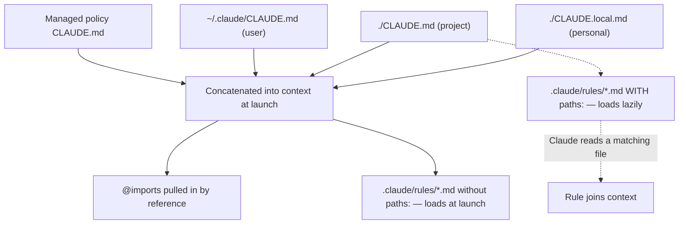

# Module 4.2: CLAUDE.md — Project Memory

> **Estimated time**: ~35 minutes
>
> **Prerequisite**: Module 4.1 (Prompting Techniques)
>
> **Outcome**: After this module, you will be able to write a lean CLAUDE.md with `/init`, split
> it with `@imports` and `.claude/rules/` (with `paths:`), and verify what loaded with `/memory`
> and `/context`.

---

## 1. WHY — Why This Matters

You start a new session and Claude asks the same question it should already know the answer to:
"Which ORM?" "Where do routes live?" A 600-line CLAUDE.md doesn't fix this — it makes it worse.
Every line loads into every session whether it's relevant or not, and past a point Claude starts
skipping the instructions that actually matter. Anthropic's own guidance is blunt about it:
"Bloated CLAUDE.md files cause Claude to ignore your actual instructions!" (S1). The fix isn't a
bigger file — it's the right file, plus two mechanisms most people never touch: `@imports` and
`.claude/rules/`.

---

## 2. CONCEPT — Core Ideas

### The hierarchy — concatenated, not overridden

Claude Code reads every CLAUDE.md it finds and **concatenates them into context — none of them
replaces another**. Order runs broadest to narrowest, with files closer to your working
directory read last:

| Level | Path(s) | Notes |
|---|---|---|
| Managed policy | Per-OS path (e.g. macOS `/Library/Application Support/ClaudeCode/CLAUDE.md`) or an inline `claudeMd` key in `managed-settings.json` | Loads first; admin-only; `claudeMdExcludes` can't touch it |
| User | `~/.claude/CLAUDE.md` | Applies to every project you open |
| Project | `./CLAUDE.md` or `./.claude/CLAUDE.md` | Checked in, shared with the team |
| Local | `./CLAUDE.local.md` | Personal, gitignored — still fully supported |
| Subdirectory | any `CLAUDE.md`/`CLAUDE.local.md` below the working directory | Loads lazily, only "when Claude reads files in those directories" |

If two files disagree, that's a contradiction to fix at the source — not something the hierarchy
resolves for you.

### Three ways to keep it lean

1. **CLAUDE.md** — loads every session. Keep only what applies broadly; target under 200 lines
   per file (S15).
2. **`@path/to/file` imports** — pull a doc in by reference instead of pasting it. Imports resolve
   relative to the *importing file*, recurse up to 4 hops, and skip anything inside a fenced code
   block. An import outside the working directory triggers a one-time approval.
3. **`.claude/rules/*.md`** — one topic per file, path-scoped with `paths:` frontmatter (the only
   field Claude Code reads there). A rule *without* `paths:` loads at launch like CLAUDE.md; a rule
   *with* `paths:` "trigger[s] when Claude reads files matching the pattern, not on every tool use."

Claude Code layers these by relevance instead of loading everything up front: CLAUDE.md every
session, a `paths:`-scoped rule only once a matching file is opened, a skill only when it's
relevant to the task at hand (Module 15.3) — the same progressive-disclosure pattern Anthropic
describes for agent skills (S8).


```mermaid
graph TD
    A[Managed policy CLAUDE.md] --> E[Concatenated into context at launch]
    B["~/.claude/CLAUDE.md (user)"] --> E
    C["./CLAUDE.md (project)"] --> E
    D["./CLAUDE.local.md (personal)"] --> E
    E --> F["@imports pulled in by reference"]
    E --> G[".claude/rules/*.md without paths: — loads at launch"]
    C -.-> H[".claude/rules/*.md WITH paths: — loads lazily"]
    H -. "Claude reads a matching file" .-> I[Rule joins context]
```

If a repo already has `AGENTS.md` (from another coding agent) and no CLAUDE.md family file,
Claude Code v2.1.277+ reads that instead, by default — `/config` can change the mode.

---

## 3. DEMO — Step by Step

Lab: a tiny Node.js repo (`src/math.js`, `tests/math.test.mjs`), no CLAUDE.md yet.

**Step 1: Generate a starting file with `/init`**

```bash
$ claude
```
```text
> /init
```

Expected output (interactive session, trimmed):
```text
# Output may vary
⏺ Write(CLAUDE.md)
  ⎿  Wrote 22 lines to CLAUDE.md
      1 # CLAUDE.md
      ...
      5 ## Overview
      7 A minimal Node.js scratch/lab project (ESM)...
      9 ## Commands
     11 - Run all tests: `npm test`
     ...
⏺ I created CLAUDE.md at the repo root... covers commands, a Node 22
  `node --test` gotcha pulled from your commit history, and test conventions.
```

`/init` explores the repo and writes the file directly — no `claude -p` needed, this only runs
interactively. Verify: `wc -l CLAUDE.md` → `22`. If a CLAUDE.md already exists, `/init` proposes
edits instead of overwriting it.

**Step 2: Split out a path-scoped rule and an import**

```bash
mkdir -p .claude/rules docs
cat > .claude/rules/tests.md <<'EOF'
---
paths: ["tests/**"]
---
# Test conventions
- Use `node:test` + `node:assert/strict`; no other test runner.
EOF
cat > docs/architecture.md <<'EOF'
# Architecture
`src/` holds pure functions. `tests/` mirrors `src/` one-to-one.
EOF
printf '\n## Architecture\n\n@docs/architecture.md\n' >> CLAUDE.md
```

**Step 3: Confirm with `/memory`**

```text
> /memory
```
```text
# Output may vary
Memory
❯ Auto-memory  true
❯ User instructions   Saved in ~/.claude/CLAUDE.md
  Project instructions   Checked in at ./CLAUDE.md
  L docs/architecture.md   @-imported
  Open auto-memory folder
```

`/memory` lists the CLAUDE.md family and confirms the import resolved — it does not list
`.claude/rules/`, which only shows up in `/context`.

**Step 4: Watch a path-scoped rule load lazily via `/context`**

```text
> /context
```
```text
# Output may vary — MCP/agent/skill counts depend on what you have installed locally
⎿  Context Usage
   43k/1m tokens (4%)
   Estimated usage by category
   ⛁ Memory files: 7.5k tokens (0.8%)
   ...
   Memory files · /memory
   └ 3 files · 7.5k tokens
```

Rules with `paths:` don't show up in that baseline — the docs say they trigger only when Claude
reads a matching file. Ask Claude to read one, and watch the tool transcript:
```text
> Read tests/math.test.mjs and reply with one sentence about what it tests.
```
```text
# Output may vary
  Read 1 file
  ⎿  Loaded .claude/rules/tests.md
⏺ It checks that add(1, 2) from src/math.js returns 3.
```

`⎿ Loaded .claude/rules/tests.md` is the proof: the rule was absent from context until this exact
moment, when a matching file was opened.

**Step 5: Personal notes with `CLAUDE.local.md`**

```bash
echo "- I prefer verbose commit messages on this machine." > CLAUDE.local.md
echo "CLAUDE.local.md" >> .gitignore
git check-ignore -v CLAUDE.local.md
```
```text
.gitignore:4:CLAUDE.local.md	CLAUDE.local.md
```
`CLAUDE.local.md` still loads (concatenated after `CLAUDE.md`) but never gets committed.

**Step 6: Clean up**

```bash
git checkout -- . && git clean -fd
```

---

## 4. PRACTICE — Try It Yourself

### Exercise 1: Prune a bloated CLAUDE.md

**Goal**: Apply the S1 prune test to a real (if exaggerated) offender.

A 120-line `CLAUDE.md` — full text in
[`templates/claude-md-project-example.md`](https://github.com/ShipWithAI/claude-code-mastery/blob/develop/templates/claude-md-project-example.md) — opens with a
"Welcome to our project!" preamble and spends whole sections explaining what Express and
PostgreSQL are. An excerpt:

```markdown
## About Express
Express is the most popular Node.js web framework. It was created by TJ Holowaychuk
and is now maintained by the OpenJS Foundation. It provides a thin layer of
fundamental web application features, without obscuring Node.js features...
```

**Instructions**:
1. For each section, ask: *"Would removing this cause Claude to make mistakes?"* (S1)
2. Delete anything Claude already knows or a human reads once and never needs again.
3. Move style/test conventions that only matter in specific directories into
   `.claude/rules/*.md` with `paths:`.
4. Target under 200 lines for what's left in `CLAUDE.md` itself.

**Expected result**: a CLAUDE.md a third the size, with the same or better instruction-following.

<details>
<summary>💡 Hint</summary>

The "About Express", "About PostgreSQL", and the AI-tools pep talk survive on zero lines — Claude
doesn't need a library's history to use it correctly.
</details>

<details>
<summary>✅ Solution</summary>

Full before/after and the two extracted rule files are in
[`templates/claude-md-project-example.md`](https://github.com/ShipWithAI/claude-code-mastery/blob/develop/templates/claude-md-project-example.md). The result:
a 28-line `CLAUDE.md` (stack, structure, commands, git, constraints, context) plus
`.claude/rules/style.md` (`paths: ["src/**/*.ts", "src/**/*.tsx"]`) and `.claude/rules/tests.md`
(`paths: ["tests/**"]`) — 45 lines total, none of it loaded unless the matching files are opened.
</details>

---

### Exercise 2: Monorepo layering

**Goal**: Scope instructions to one package without polluting the others.

**Instructions**:
1. In a monorepo with `apps/web/` and `apps/api/`, put shared conventions in the root `CLAUDE.md`.
2. Give `apps/web/` its own `CLAUDE.md` for frontend-only conventions.
3. Add `.claude/rules/api.md` with `paths: ["apps/api/**"]` for backend-only rules.
4. Open a file in `apps/web/` — does the `api.md` rule load?

**Expected result**: `apps/web/CLAUDE.md` loads (it's on the path to the file you opened); the
`api.md` rule does not, because its `paths:` glob doesn't match anything under `apps/web/`.

<details>
<summary>✅ Solution</summary>

Root `CLAUDE.md` holds only what both apps share (repo-wide commands, git workflow).
`apps/web/CLAUDE.md` holds frontend conventions and loads lazily once Claude touches a file
there. `.claude/rules/api.md` stays silent until Claude opens something under `apps/api/` — so a
frontend session never pays for backend-only instructions.
</details>

---

## 5. CHEAT SHEET

| Command / Setting | What it does |
|---|---|
| `/init` | Explores the repo, writes/updates `CLAUDE.md` (interactive only) |
| `/memory` | Lists the CLAUDE.md family + auto-memory, toggles auto-memory |
| `/context` | Shows what's actually loaded, incl. `Memory files` |
| `@path/to/file` | Import by reference, max 4 hops, skips fenced code |
| `.claude/rules/*.md` | `paths:` frontmatter = lazy load; no `paths:` = loads at launch |
| `CLAUDE.local.md` | Personal, gitignored, still concatenated in |
| `claudeMdExcludes` | Skip specific ancestor CLAUDE.md files (monorepos) |
| `CLAUDE_CODE_NEW_INIT=1` | Interactive multi-phase `/init` (choose CLAUDE.md/skills/hooks) |

---

## 6. PITFALLS — Common Mistakes

| ❌ Mistake | ✅ Correct Approach |
|---|---|
| Assuming a subdirectory CLAUDE.md **overrides** the project one | It's concatenated, not an override — fix contradictions at the source, don't rely on one file "winning" |
| Passing `/init` to headless mode via `-p` | `/init` is interactive-only; run it inside a normal session, not headless |
| Pasting a whole style guide into `CLAUDE.md` | Put it in `.claude/rules/` with `paths:`, or a skill, so it loads only when relevant |
| Trusting CLAUDE.md to block dangerous actions | It's advisory only (Principle 2) — use `permissions.deny` or a hook (Module 2.2, 11.3) for anything that must never happen |
| Typing `#` at the prompt expecting a quick memory add | Not confirmed in current docs — edit the file directly or use `/memory` |

---

## 7. REAL CASE — Production Story

A 5-developer KMP mobile-banking team kept a single 600-line `CLAUDE.md` covering architecture,
every naming convention, and a full API reference. Sessions were slow to start and Claude
regularly missed the one rule that mattered — audit logging in `SecurityManager.kt` — buried on
line 400. Running the S1 prune test line by line cut the root file to under 150 lines: stack,
layering, and the security constraints that actually prevent incidents. Naming conventions for
`commonMain`/`androidMain`/`iosMain` moved into three `.claude/rules/*.md` files scoped by
`paths:`, so an iOS-only session never loads Android naming rules. The team verified the move with
`/context` before and after: total "Memory files" tokens dropped, and Claude started catching the
`SecurityManager.kt` constraint again — because it was no longer competing with 450 lines of
things Claude already knew.

---

> **Next**: [Module 4.3: Slash Commands](../03-slash-commands/) →
