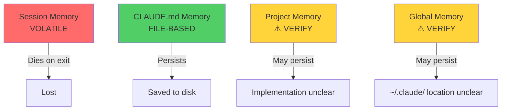

# Module 4.4: Memory System

> **Estimated time**: ~30 minutes
>
> **Prerequisite**: Module 4.3 (Slash Commands)
>
> **Outcome**: After this module, you will understand Claude Code's complete memory architecture — what persists, what doesn't, and how to design your workflow so Claude Code retains the right knowledge across sessions, projects, and team members.

---

## 1. WHY — Why This Matters

You've been using Claude Code for three weeks. Some days it feels like it remembers everything about your project. Other days you're re-explaining your architecture for the fifth time. You wonder: "What does Claude Code actually remember between sessions? Why does it sometimes know my conventions and sometimes forget them?" Understanding Claude Code's memory architecture is the difference between treating it like a stateless tool you constantly re-train versus a persistent coding partner that learns your workflow.

---

## 2. CONCEPT — Core Ideas

Claude Code's memory is not a single unified system — it's a **layered stack** where each layer has different persistence characteristics. Understanding this stack is critical to working efficiently.

### The Memory Stack (4 Layers)



**Layer 1: Session Memory (Volatile)**
Everything in the current conversation context. Managed by `/compact` and `/clear`. Dies when you exit the session. This includes your recent prompts, Claude's responses, file contents it has read, and the working mental model it has built.

**Layer 2: CLAUDE.md Memory (File-based)**
Content stored in `CLAUDE.md` (global or project-specific). This is the **only guaranteed persistent layer**. Lives on disk as a regular file. Loaded fresh each session. Covered in Module 4.2.

**Layer 3: Project Memory** ⚠️ Needs verification
Claude Code may maintain persistent memory for projects beyond what's in `CLAUDE.md`. Implementation details unclear. Treat this as uncertain until verified in your environment.

**Layer 4: Global User Memory** ⚠️ Needs verification
The `~/.claude/` directory may contain persistent memory beyond the global `CLAUDE.md`. Configuration files definitely persist, but whether Claude Code maintains learned patterns or user preferences beyond config is unverified.

### Persistence Matrix

| Memory Type | Persists Across Sessions? | How to Manage |
|-------------|---------------------------|---------------|
| Session context | ❌ No | `/compact`, `/clear` |
| CLAUDE.md content | ✅ Yes | Edit the file |
| Conversation history | ⚠️ Verify | Unknown |
| Config preferences | ✅ Yes | `claude config` |
| Learned patterns | ⚠️ Verify | Unknown |
| File contents read | ❌ No | Re-read each session |

**Key insight**: The only memory you can *guarantee* is CLAUDE.md. Everything else is either volatile or uncertain. Design your workflow around this reality.

---

## 3. DEMO — Step by Step

Let's test the memory boundaries and verify what persists.

**Step 1: Start fresh and check baseline knowledge**
```bash
$ claude
```
Expected interaction:
```
Claude: Hello! How can I help you today?

You: What do you know about this project?

Claude: I can see we're in /Users/you/myproject. [May or may not mention CLAUDE.md content depending on auto-loading behavior]
```

**Step 2: Build session memory through work**
```
You: Read src/auth.ts and remember: we use JWT with 24-hour expiry

Claude: [Reads file, acknowledges the pattern]

You: Our API base URL is https://api.example.com/v2

Claude: Noted. I'll use that URL for API-related code.
```
Now Claude's session context includes: file contents, JWT pattern, API URL.

**Step 3: Use /compact and observe**
```
You: /compact
```
Expected output:
```
Context compacted. Reduced from 45,000 to 12,000 tokens.
Preserved: Recent conversation, file contents, key facts.
```
Test: Ask Claude "What's our JWT expiry?" — it should still know.

**Step 4: End session, start new one**
```bash
$ exit
$ claude
```
Expected result:
```
Claude: Hello! How can I help you today?

You: What's our JWT expiry time?

Claude: I don't have that information in the current context. Could you remind me?
```
❌ Session memory is GONE. Claude doesn't remember the JWT detail.

**Step 5: Update CLAUDE.md with session discoveries**
Edit `CLAUDE.md`:
```markdown
## Authentication

- JWT tokens with 24-hour expiry
- API base: https://api.example.com/v2
- Refresh tokens stored in httpOnly cookies
```

**Step 6: Verify CLAUDE.md memory in new session**
Start a new session:
```bash
$ claude
```
```
You: What's our JWT expiry time?

Claude: According to CLAUDE.md, your JWT tokens have a 24-hour expiry.
```
✅ CLAUDE.md memory PERSISTS.

**Step 7: Check for persistent memory beyond CLAUDE.md** ⚠️
```bash
$ ls -la ~/.claude/
```
Expected output:
```
# Output may vary — implementation unclear
drwxr-xr-x  5 you  staff   160 Jan 15 10:30 .
-rw-r--r--  1 you  staff  1234 Jan 15 10:30 config.json
-rw-r--r--  1 you  staff   456 Jan 10 09:15 CLAUDE.md
# Additional files may exist — verify in your environment
```

Inside a Claude session:
```
You: Do you maintain any persistent memory about me or my projects beyond CLAUDE.md?

Claude: [Response will clarify implementation — observe carefully]
```

⚠️ If Claude mentions persistent learning or conversation history, note the mechanism. If not, assume only CLAUDE.md persists.

---

## 4. PRACTICE — Try It Yourself

### Exercise 1: Memory Audit

**Goal**: Map the exact persistence boundaries in your Claude Code installation.

**Instructions**:
1. Start Claude Code in an empty directory (no `CLAUDE.md`)
2. Tell Claude: "My preferred code style is: single quotes, 2-space indent, arrow functions"
3. Ask it to write a small TypeScript function
4. Verify it uses your style
5. Exit and restart Claude in the SAME directory
6. Ask it to write another function WITHOUT repeating your style preferences
7. Observe: Does it remember your style?
8. Now create `CLAUDE.md` with your style rules
9. Exit and restart again
10. Ask for a third function — does it use your style now?

**Expected result**:
- Steps 1-6: Claude forgets your style (proves session memory is volatile)
- Steps 7-10: Claude remembers via CLAUDE.md (proves file-based persistence works)

<details>
<summary>💡 Hint</summary>
Pay attention to whether Claude Code auto-loads CLAUDE.md at session start or you need to explicitly reference it. Behavior may vary by version.
</details>

<details>
<summary>✅ Solution</summary>

**What you should observe**:
- **Without CLAUDE.md**: Claude Code has ZERO memory between sessions. Every restart is a blank slate.
- **With CLAUDE.md**: Claude Code loads project rules at session start (or on first file operation). Memory persists perfectly.

**Key takeaway**: If you want Claude to remember something, PUT IT IN CLAUDE.md. Session memory is useless for persistence.

**Common surprise**: Some users expect Claude Code to "learn" their style over time. It doesn't. It's stateless between sessions. CLAUDE.md is your only persistence layer.
</details>

### Exercise 2: Memory Architecture Design

**Goal**: Design the ideal memory setup for a real project of yours.

**Instructions**:
1. Pick a project you're actively working on
2. Identify 3 types of knowledge Claude needs:
   - **Session-level**: Temporary context (current debugging session, recent changes)
   - **Project-level**: Persistent project rules (architecture, conventions, APIs)
   - **Global-level**: Your personal preferences (coding style, workflow habits)
3. Design a memory strategy:
   - What goes in project `CLAUDE.md`?
   - What goes in global `~/.claude/CLAUDE.md`?
   - What stays in session memory only?
4. Implement your strategy and test for one week

**Expected result**: Clear separation between ephemeral (session), project-persistent (CLAUDE.md), and global-persistent (global CLAUDE.md) knowledge.

<details>
<summary>💡 Hint</summary>
Global CLAUDE.md should contain ONLY preferences that apply to ALL your projects. Project CLAUDE.md should contain ONLY rules specific to that codebase. Session memory is for everything that becomes irrelevant after the task is done.
</details>

<details>
<summary>✅ Solution</summary>

**Example Memory Strategy** (for a Next.js + TypeScript project):

**Global `~/.claude/CLAUDE.md`**:
```markdown
# Personal Coding Preferences

- TypeScript strict mode always enabled
- Prefer functional programming patterns
- Use Prettier defaults, single quotes
- Test framework: Vitest (not Jest)
```

**Project `CLAUDE.md`**:
```markdown
# Project: E-commerce Dashboard

## Stack
- Next.js 14 (App Router)
- Prisma ORM with PostgreSQL
- Tailwind CSS for styling

## Architecture Rules
- Server components by default
- Client components marked with 'use client'
- API routes in app/api/
- Database schema defined in prisma/schema.prisma
```

**Session Memory** (never written down):
- "Currently debugging the checkout flow"
- "User reported issue with Safari browser"
- "Testing the payment webhook locally"

**Why this works**:
- Global rules apply to all 15 of your projects
- Project rules are specific to this codebase
- Session context is forgotten after you solve the bug — and that's fine

**Common mistake**: Putting temporary debugging context into CLAUDE.md. Don't pollute your project memory with ephemeral details.
</details>

---

## 5. CHEAT SHEET

### Memory Layer Reference

| Memory Type | Storage Location | Persists? | Managed Via | Best For |
|-------------|------------------|-----------|-------------|----------|
| Session context | In-memory | ❌ No | `/compact`, `/clear` | Current task focus |
| CLAUDE.md (project) | `./CLAUDE.md` | ✅ Yes | Edit file | Project-specific rules |
| CLAUDE.md (global) | `~/.claude/CLAUDE.md` | ✅ Yes | Edit file | Personal preferences |
| Config settings | `~/.claude/config.json` ⚠️ | ✅ Yes | `claude config` | CLI preferences |
| Conversation history | Unknown ⚠️ | ⚠️ Verify | Unknown | Unknown |

### Quick Memory Test

To verify what persists in YOUR Claude Code installation:

```bash
# Test 1: Session memory (should fail)
$ claude -p "Remember: my favorite color is blue"
$ claude -p "What's my favorite color?"
# Expected: "I don't have that information" (no persistence)

# Test 2: CLAUDE.md memory (should work)
$ echo "# User prefers blue" > CLAUDE.md
$ claude -p "What color do I prefer?"
# Expected: "According to CLAUDE.md, you prefer blue" (persists)
```

### Session → Permanent Workflow

```
1. Work in session → build context
2. Use /compact → preserve important parts
3. Identify patterns worth keeping
4. Update CLAUDE.md with those patterns
5. Exit session
6. Next session → Claude loads CLAUDE.md → knowledge persists
```

### Config Preferences (Verified Persistent)

```bash
# These settings persist across all sessions
$ claude config --help  # View available config options

# Example: Set preferred model (if supported)
$ claude config set model sonnet  # ⚠️ Needs verification

# Config stored in ~/.claude/config.json (or similar)
```

---

## 6. PITFALLS — Common Mistakes

| ❌ Mistake | ✅ Correct Approach |
|------------|---------------------|
| **Assuming Claude "learns" your style over time** | Claude Code is stateless between sessions. If you want it to remember, put it in CLAUDE.md. |
| **Re-explaining architecture every session** | Write your architecture in CLAUDE.md once. Reference it forever. Session memory is NOT designed for persistence. |
| **Cluttering CLAUDE.md with temporary context** | Session-level details ("currently debugging X") should stay in session memory. CLAUDE.md is for *persistent* project rules only. |
| **Forgetting to update CLAUDE.md after discovering patterns** | When you teach Claude something important mid-session, add it to CLAUDE.md before you exit. Otherwise you'll re-teach it tomorrow. |
| **Expecting /compact to persist across sessions** | `/compact` only affects the CURRENT session. It doesn't write anything to disk. Session ends = compacted context is lost. |
| **Not testing persistence boundaries** | Run the memory audit (Exercise 1) at least once. Don't assume — verify what your version of Claude Code actually persists. |

---

## 7. REAL CASE — Production Story

**Scenario**: Susan, a Vietnamese freelance developer in Ho Chi Minh City, manages four client projects simultaneously:
- Client A: Next.js + Supabase (e-commerce)
- Client B: React Native + Firebase (delivery app)
- Client C: Laravel + MySQL (legacy corporate system)
- Client D: Python + FastAPI (data pipeline)

**Problem**: Before understanding Claude Code's memory system, Susan started every coding session with a 10-minute "re-onboarding" ritual. She'd type out the project stack, architecture rules, and current task. Then she'd work for 2 hours. Next day? Same 10-minute ritual. Four projects = 40 minutes of daily context repetition. Frustrating and wasteful.

**Solution**: Susan implemented a two-tier memory architecture:

1. **Global `~/.claude/CLAUDE.md`** (her personal style):
   ```markdown
   # Susan's Coding Preferences
   - Always use TypeScript when possible
   - Prefer React hooks over class components
   - Follow Airbnb style guide
   - Comments in English, commit messages in Vietnamese
   ```

2. **Per-project `CLAUDE.md`** (client-specific):
   - Client A: Next.js conventions, Supabase schema, API routes structure
   - Client B: React Native navigation setup, Firebase collections, push notification flow
   - Client C: Laravel folder structure, legacy database quirks, deployment process
   - Client D: Python virtual env setup, data sources, cron schedule

**Workflow**:
```bash
# Switch to Client A project
$ cd ~/clients/clientA-ecommerce
$ claude  # Auto-loads global + project CLAUDE.md

# Claude immediately knows:
# - Susan's personal preferences (global)
# - Client A's Next.js setup (project)
# - No re-explanation needed

# Work for 2 hours, discover new pattern
# Before exiting:
You: Update CLAUDE.md — we've standardized on Zustand for state, not Redux

# Next day:
$ claude
Claude: [Knows about Zustand standard from CLAUDE.md]
```

**Result**:
- **Before**: 10 min/day/project × 4 projects = 40 min daily waste
- **After**: Zero re-onboarding. Instant context switching.
- **Bonus**: When Susan brings in a junior dev for Client B, she just sends them the project `CLAUDE.md`. The junior dev's Claude Code session starts with the same knowledge Susan has. Team synchronization for free.

**Key insight**: Susan treats CLAUDE.md as "the project brain" and session memory as "scratch paper." The brain persists. The scratch paper is thrown away daily. Once she internalized this distinction, her workflow became 3x faster.

---

> **Next**: [Module 5.1: Controlling Context](../../phase-05-context-mastery/01-controlling-context/) →
