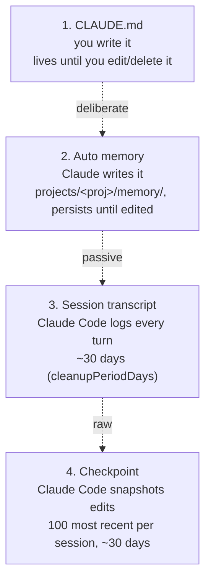

# Module 4.4: Memory System

> **Estimated time**: ~35 minutes
>
> **Prerequisite**: Module 4.3 (Slash Commands)
>
> **Outcome**: After this module, you can explain the four kinds of memory Claude Code keeps —
> CLAUDE.md, auto memory, session transcripts, and checkpoints — resume or branch a past session,
> rewind a bad turn, and find each one on disk.

---

## 1. WHY — Why This Matters

You close your laptop mid-task. Next morning you type `claude` and brace for a blank slate — but
it already knows the JWT quirk you mentioned yesterday, and you never wrote that down anywhere.
Then Claude runs `rm` on the wrong file, you mash Escape twice hoping for an undo, and the file is
still gone. Two systems, two outcomes, and most people never learn which is which. This module
maps the four places Claude Code keeps state, so you stop guessing and use the right one on purpose.

---

## 2. CONCEPT — Core Ideas

Claude Code keeps state in four separate places. Two you write, two it writes for you — and each
one lives for a different amount of time.


```mermaid
graph TB
    A["1. CLAUDE.md<br/>you write it<br/>lives until you edit/delete it"]
    B["2. Auto memory<br/>Claude writes it<br/>projects/&lt;proj&gt;/memory/, persists until edited"]
    C["3. Session transcript<br/>Claude Code logs every turn<br/>~30 days (cleanupPeriodDays)"]
    D["4. Checkpoint<br/>Claude Code snapshots edits<br/>100 most recent per session, ~30 days"]
    A -.deliberate.-> B -.passive.-> C -.raw.-> D
```

**1. CLAUDE.md — the note you leave yourself.** Covered in [Module 4.2](../02-claude-md/). You
write it, it sits in `./CLAUDE.md` or `~/.claude/CLAUDE.md`, and it survives forever until you
edit or delete it.

**2. Auto memory — the note Claude leaves itself.** On by default. Claude writes short files to
`~/.claude/projects/<project>/memory/` — a `MEMORY.md` index plus a topic file per memory, tagged
`user`, `feedback`, `project`, or `reference` — without you asking. "The first 200 lines of
`MEMORY.md`, or the first 25KB, whichever comes first, are loaded at the start of every
conversation"; topic files load only when referenced. Unlike the transcript, it isn't swept by
retention. Toggle it in `/memory`, per-project with `{"autoMemoryEnabled": false}`, or globally
with `CLAUDE_CODE_DISABLE_AUTO_MEMORY=1` ([docs/en/memory](https://code.claude.com/docs/en/memory)).

**3. Session transcript — the recording.** Every message and tool call you exchange is appended,
live, to `~/.claude/projects/<project>/<session-id>.jsonl`. This is what `--continue`, `--resume`,
`/resume`, `/branch`, `/rename`, and `/export` all read from. Kept for about 30 days by default,
configurable with the `cleanupPeriodDays` setting
([docs/en/sessions](https://code.claude.com/docs/en/sessions)).

**4. Checkpoint — the undo history.** Every prompt that starts a turn creates a checkpoint: a file
snapshot of whatever Claude's own tools changed. Claude Code "keeps file snapshots for the 100
most recent checkpoints in a session," restorable with `/rewind` or Esc Esc on an empty prompt.
**Checkpointing does not track files modified by Bash commands** — `rm`, `mv`, `cp` are invisible
to it and cannot be undone through rewind (S15) — and it is explicitly "not a replacement for
version control" ([docs/en/checkpointing](https://code.claude.com/docs/en/checkpointing)).

Only layers 1 and 2 are knowledge Claude *carries into new work*. Layers 3 and 4 just *get you
back to* work already done.

---

## 3. DEMO — Step by Step

Lab: `~/cc-lab` (a small git repo with `src/math.js`).

**Step 1: See where all four layers live**
```bash
# docs: en/settings, en/sessions
ls ~/.claude/
```
```text
# Output may vary — entries specific to installed plugins replaced with …
…
backups
cache
…
CLAUDE.md
…
debug
downloads
feedback
file-history
…
history.jsonl
…
jobs
…
mcp-needs-auth-cache.json
paste-cache
plans
plugins
projects
session-env
sessions
settings.json
shell-snapshots
skills
state
stats-cache.json
tasks
…
```
Exact entries vary by Claude Code version and installed plugins/features.

`projects/` holds layers 2 and 3, one folder per repo:
```bash
# docs: en/sessions — <project> = working directory path, non-alphanumeric chars become -
ls ~/.claude/projects | grep cc-lab
```
```text
# Output may vary
-Users-you-cc-lab
-Users-you-cc-lab--claude-worktrees-auto-demo
```

**Step 2: Watch auto memory write itself**
```bash
$ claude
> Remember that this lab uses node:test, never jest
```
```text
# Output may vary
⏺ Directory is empty — no existing memory to update.
  Wrote 2 memories (ctrl+o to expand)
⏺ I've saved this to memory: tests in this lab use node:test with node:assert/strict, and never jest.
```
```text
> /memory
```
```text
# Output may vary
  Memory
  ❯ Auto-memory  true
  ❯ User instructions   Saved in ~/.claude/CLAUDE.md
    Project instructions   Checked in at ./CLAUDE.md
    Open auto-memory folder
  Learn more: https://code.claude.com/docs/en/memory
```
On disk:
```bash
# docs: en/memory — MEMORY.md is the index; each memory also gets its own topic file
cat ~/.claude/projects/-Users-you-cc-lab/memory/MEMORY.md
```
```text
# Output may vary
- [Test runner: node:test](test-runner-node-test.md) — cc-lab uses node:test, never jest
```
The topic file carries a `type: feedback` frontmatter tag and the full explanation Claude wrote.

**Step 3: Resume a named session**
```bash
# docs: en/sessions — claude -n <name> names it; claude --resume <name> reopens it by that name
$ claude -n memory-demo
> The magic word for this session is grapefruit.
> /exit
$ claude --resume memory-demo
> What's the magic word from earlier in this session?
```
```text
# Output may vary
⏺ The magic word is grapefruit.
```
`--resume <name>` reopened the transcript by name — layer 3, not layer 2.

**Step 4: Rewind a bad edit**

Ask Claude to add a function to `src/math.js`, approve the edit, then press **Esc, Esc** on an
empty prompt:
```text
# Output may vary
  Rewind
  Restore the code and/or conversation to the point before…
    Add a subtract(a, b) function to src/math.js that returns a - b
    math.js +1
  ❯ (current)
```
Press Up, Enter. This confirm screen (full height, nothing cut off) tops out at 5 choices when
there's a code snapshot to restore — no "Never mind" row here, Esc cancels instead; Exercise 3
shows the 4-item version used when there's no code to restore:
```text
# Output may vary
  Confirm you want to restore to the point before you sent this message:
  The conversation will be forked.
  The code will be restored -1 in math.js.
  ❯ 1. Restore code and conversation
    2. Restore conversation
    3. Restore code
    4. Summarize from here
  ↓ 5. Summarize up to here
  ⚠ Rewinding does not affect files edited manually or via bash.
```
Choose **Restore code and conversation**, then verify:
```bash
# docs: en/checkpointing
git -C ~/cc-lab diff
```
```text
# Output may vary — empty, math.js is back to its pre-edit content
```

**Step 5: Branch instead of overwriting**
```text
> /branch try-alt
```
```text
# Output may vary
⎿  Branched conversation "try-alt". You are now in the new branch (session fd2adace-…). Use
   /resume 1c8dba65-… ("branch-demo") to return to the original, or run claude -r
   1c8dba65-… in a new terminal.
```
Both sessions share history up to the branch point, then diverge.

**Step 6: Clean up the memory you created**
```bash
# docs: en/memory — plain files, safe to delete directly
rm ~/.claude/projects/-Users-you-cc-lab/memory/MEMORY.md \
   ~/.claude/projects/-Users-you-cc-lab/memory/test-runner-node-test.md
```
Only delete files *you* just created — auto memory is shared across every worktree of that repo.

---

## 4. PRACTICE — Try It Yourself

### Exercise 1: Export yesterday's transcript

**Goal**: Find a past session for the current directory and export it to a file.

**Instructions**: Run `claude --resume` (no name) to open the session picker, find yesterday's
entry, resume it, then run `/export` and choose "Save to file."

<details>
<summary>💡 Hint</summary>
The picker also supports `Ctrl+A` to show sessions from every project, not just this one.
</details>

<details>
<summary>✅ Solution</summary>

```bash
claude --resume
# pick the session, press Enter
> /export
# choose "2. Save to file"
```
`/export <filename>` skips the menu entirely. The saved file is plain text, not the raw `.jsonl` —
useful for pasting into a ticket, not for scripting against.
</details>

### Exercise 2: Turn off auto memory for a sensitive repo

**Goal**: Confirm auto memory is off using `/memory`, not by asking Claude.

**Instructions**: Add `{"autoMemoryEnabled": false}` to that repo's `.claude/settings.json`, start
`claude`, run `/memory`, and check the "Auto-memory" row.

<details>
<summary>💡 Hint</summary>
The setting is per-project; `CLAUDE_CODE_DISABLE_AUTO_MEMORY=1` is the global equivalent.
</details>

<details>
<summary>✅ Solution</summary>

```text
# Output may vary
  Memory
  ❯ Auto-memory  false
  ❯ User instructions   Saved in ~/.claude/CLAUDE.md
    Project instructions   Checked in at ./CLAUDE.md
```
Note the "Open auto-memory folder" line is gone too — with it off, there's no folder to open.
</details>

### Exercise 3: Prove rewind can't undo a `rm`

**Goal**: Watch checkpointing's Bash limitation (S15) firsthand, then fix it the right way.

**Instructions**: Create a throwaway file, ask Claude to delete it with a Bash `rm`, then run
`/rewind` and pick "Restore conversation."

<details>
<summary>💡 Hint</summary>
Notice which restore options are even offered once the change was made by Bash.
</details>

<details>
<summary>✅ Solution</summary>

```text
# Output may vary
  Rewind
  Confirm you want to restore to the point before you sent this message:
  The code will be unchanged.
  ❯ 1. Restore conversation
    2. Summarize from here
    3. Summarize up to here
    4. Never mind
```
Notice "Restore code" isn't even an option — there's no snapshot to restore. The file stays
deleted. Recovery has to come from git: `git restore <path>` (tracked) or your own backup
(untracked — nothing brings it back).
</details>

---

## 5. CHEAT SHEET

| Layer | Lives at | Persists | Managed via |
|---|---|---|---|
| CLAUDE.md | `./CLAUDE.md`, `~/.claude/CLAUDE.md` | Until you edit/delete | Edit the file ([4.2](../02-claude-md/)) |
| Auto memory | `~/.claude/projects/<project>/memory/` | Until edited/deleted | `/memory`, `autoMemoryEnabled` |
| Session transcript | `~/.claude/projects/<project>/<id>.jsonl` | ~30 days, `cleanupPeriodDays` | `--continue`, `--resume`, `/export` |
| Checkpoint | Internal file snapshots | 100 most recent, ~30 days | `/rewind`, Esc Esc |

| Command | Effect |
|---|---|
| `claude -n <name>` | Start a named session |
| `claude --continue` | Reopen the most recent session here |
| `claude --resume [name\|id]` | Reopen a specific session, or open the picker |
| `claude --continue --fork-session` | Resume into a *new* session ID, no inherited grants |
| `/branch [name]` | Copy the conversation, keep both, same process/grants |
| `/rename <name>` | Name or rename the current session |
| `/export [file]` | Copy or save the transcript as plain text |
| `/rewind`, Esc Esc | Open the rewind menu |
| `CLAUDE_CODE_DISABLE_AUTO_MEMORY=1` | Turn off auto memory everywhere |
| `cleanupPeriodDays` (settings.json) | Change transcript/checkpoint retention |

---

## 6. PITFALLS — Common Mistakes

| ❌ Mistake | ✅ Correct Approach |
|---|---|
| Assuming Claude Code is stateless between sessions | Auto memory and the transcript both survive `/exit` — check `/memory` and `claude --resume` before re-explaining anything |
| `claude config set model sonnet` / editing `~/.claude/config.json` | Neither exists. Settings live in `~/.claude/settings.json` (or `.claude/settings.json` per project) |
| Asking Claude "do you remember me?" as proof of persistence | Ask the filesystem: `/memory`, or `cat` the files in `~/.claude/projects/<project>/memory/` |
| Trusting `/rewind` after Claude ran `rm`, `mv`, or `cp` | Checkpointing never tracked the Bash change (S15) — restore from git or a backup instead |
| Committing `CLAUDE.local.md` to the repo | It's the personal, gitignored layer — commit `CLAUDE.md`, keep `.local.md` out of version control |

---

## 7. REAL CASE — Production Story

**Scenario**: Nam, a freelance developer in Ho Chi Minh City, juggles four client repos: a KMP
banking app, a Next.js storefront, a Python data pipeline, and a Flutter social app.

**Problem**: Every morning he re-explained the previous day's debugging thread — which branch,
which theory he'd ruled out, what the client asked to change last.

**Solution**: He stopped fighting the four layers and started using each one for what it's for.
Project rules go in each repo's `CLAUDE.md` — deliberate, per client. Quirks Claude notices on its
own ("this repo's CI rejects `node --test` without explicit file globs") land in auto memory
without Nam typing anything. Every debugging session gets a name: `claude -n checkout-bug`. Next
morning, `claude --resume checkout-bug` puts him back exactly where he left off — no re-explaining
— and if a fix goes sideways, Esc Esc rewinds just that session, not the other three clients.

**Result**: The morning "catch me up" ritual is gone. A bad fix now costs seconds, not a manual
revert; a Bash deletion sends him straight to `git restore`, never `/rewind`. CLAUDE.md is the
brain he wrote on purpose; auto memory is the notebook Claude keeps quietly; the transcript is the
tape he can rewind or fork.

---

> **Next**: [Module 5.1: Controlling Context](../../phase-05-context-mastery/01-controlling-context/) →
