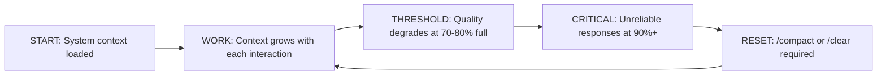

# Module 5.1: Controlling Context

> **Estimated time**: ~30 minutes
>
> **Prerequisite**: Module 4.4 (Memory System)
>
> **Outcome**: After this module, you will understand exactly what occupies Claude Code's context window, how to control what enters it, and how to maintain high-quality output throughout long sessions by managing context deliberately.

---

## 1. WHY — Why This Matters

You're 40 minutes into a refactoring session. Earlier, Claude Code gave you sharp, specific solutions. Now the responses are vague, repetitive, sometimes nonsensical. What changed? Your context window filled up. Think of it like RAM — you get a fixed amount, you can't buy more, and when it's full, everything slows down. The difference between casual Claude Code users and power users isn't skill. It's context discipline. Masters control what enters the context window. Beginners let it fill randomly until quality collapses.

---

## 2. CONCEPT — Core Ideas

### What is a Context Window?

The **context window** is Claude Code's working memory, measured in tokens (roughly 4 characters = 1 token). Everything Claude reads, writes, or processes lives here. It's a fixed-size whiteboard — when you reach the edges, either old content gets erased or new content gets rejected.

Current Claude models have context windows ranging from 100K to 200K tokens. Sounds huge. In practice, a medium-sized codebase tour burns through it in 20 minutes.

### What Occupies Your Context Budget?

Think of context as a budget you spend across five categories:

| Category | Description | Typical % of Budget |
|----------|-------------|---------------------|
| **System context** | CLAUDE.md, configuration, system instructions | 5-15% |
| **Conversation history** | Every message you send, every response Claude writes | 20-40% |
| **File contents** | Every file Claude reads (full content stored) | 30-50% |
| **Command outputs** | Terminal outputs from bash, grep, ls, etc. | 5-15% |
| **Claude's reasoning** | Internal processing (extended thinking mode) | 0-20% |

The danger zone: file contents and conversation history grow unchecked.

### Context Lifecycle

Here's what happens during a typical session:



### The Quality-Context Curve

Context impact on quality is NOT linear:

- **0-50%**: High quality, fast, accurate
- **50-70%**: Still good, slight slowdown
- **70-85%**: Noticeable degradation — vague answers, missed details
- **85-95%**: Poor quality — repetition, hallucination, losing thread
- **95%+**: Unreliable — may refuse tasks, produce nonsense

### What You CAN Control

- **File selection**: Read only relevant files, not entire directories
- **Command output filtering**: Use `head`, `tail`, `grep` to limit output
- **Compaction timing**: Use `/compact` before quality degrades
- **Prompt verbosity**: Short, precise prompts vs. essay-length explanations
- **File chunking**: Read large files in sections, not all at once

---

## 3. DEMO — Step by Step

Let's see context control in action using a real project.

**Step 1: Baseline measurement**
```bash
claude
```
Once inside the session:
```
/cost
```
Expected output:
```
Session cost: $0.02
Input tokens: 1,247 | Output tokens: 0
Context usage: 1,247 tokens (0.6%)
```
**Why this matters**: Establish your starting point. System context is loaded but minimal.

---

**Step 2: Read one file and measure impact**
```
Read src/auth/login.ts
```
Then:
```
/cost
```
Expected output:
```
Session cost: $0.08
Input tokens: 5,834 | Output tokens: 342
Context usage: 6,176 tokens (3.1%)
```
**Why this matters**: One medium file (~200 lines) added ~4,500 tokens. That's ~3% of your budget.

---

**Step 3: The WRONG way — flooding context**
```
Read all files in src/ recursively
```
```
/cost
```
Expected output:
```
Session cost: $1.47
Input tokens: 87,253 | Output tokens: 1,205
Context usage: 88,458 tokens (44.2%)
```
**Why this matters**: One careless command burned 44% of your budget. You're halfway to degradation after one request.

---

**Step 4: The RIGHT way — selective reading**
Start fresh:
```
/clear
```
Now ask strategically:
```
Show me only the function signatures in src/auth/ files
```
```
/cost
```
Expected output:
```
Session cost: $0.12
Input tokens: 7,429 | Output tokens: 856
Context usage: 8,285 tokens (4.1%)
```
**Why this matters**: Got the architectural overview using 10x less context. Save the full file reads for when you need to edit.

---

**Step 5: Command output control**
WRONG:
```bash
git log --all --oneline
```
Output: 2,500 commits flood the context.

RIGHT:
```bash
git log --oneline -20
```
Output: Last 20 commits only.

**Why this matters**: Most git/grep/find commands can produce massive output. Always limit.

---

**Step 6: Use /compact strategically**
After working for 15 minutes:
```
/cost
```
Expected output:
```
Context usage: 62,847 tokens (31.4%)
```
Before continuing:
```
/compact
```
Expected output:
```
✓ Context compacted
Reduced from 62,847 to 38,492 tokens
Preserved: Current task, recent context, key files
```
```
/cost
```
Expected output:
```
Context usage: 38,492 tokens (19.2%)
```
**Why this matters**: `/compact` removes conversation history but keeps important context. You bought yourself another 30 minutes of high-quality work.

---

**Step 7: Compare managed vs. unmanaged session**

**Unmanaged session** (no context control):
- 0-20 min: Great
- 20-35 min: Decent
- 35-45 min: Degrading
- 45+ min: Forced to restart

**Managed session** (disciplined control):
- 0-30 min: Great
- `/compact` at 30 min
- 30-60 min: Great
- `/compact` at 60 min
- 60-90+ min: Still great

---

## 4. PRACTICE — Try It Yourself

### Exercise 1: Context Budget Tracker
**Goal**: Track how different operations consume context
**Instructions**:
1. Start a fresh Claude Code session in a real project
2. Run `/cost` and record the baseline
3. Perform these operations, running `/cost` after each:
   - Read one small file (<100 lines)
   - Read one large file (500+ lines)
   - Run `git log --oneline -50`
   - Ask Claude to explain a function
   - Run `/compact`
4. Create a table showing token cost for each operation

**Expected result**: A clear picture of what's expensive vs. cheap in your context budget.

<details>
<summary>💡 Hint</summary>
File reads are expensive. Conversation is medium. /cost itself is nearly free.
</details>

<details>
<summary>✅ Solution</summary>

Your table should look like this:

| Operation | Tokens Added | % of 200K Budget |
|-----------|--------------|------------------|
| Baseline | 1,200 | 0.6% |
| Small file (80 lines) | +2,400 | +1.2% |
| Large file (600 lines) | +18,000 | +9.0% |
| git log -50 | +3,200 | +1.6% |
| Explain function (conversation) | +1,800 | +0.9% |
| /compact | -15,000 | -7.5% |

**Key lesson**: Large files are 7-8x more expensive than small ones. /compact can reclaim significant budget.
</details>

---

### Exercise 2: Selective Reading Challenge
**Goal**: Understand an authentication flow using less than 30% of context budget
**Instructions**:
1. Pick a project with an auth module (login, JWT, session management)
2. Goal: Understand how auth works without reading full files
3. Use strategies like:
   - Read only type definitions first
   - Use grep to find function signatures
   - Ask Claude to summarize based on signatures
   - Read full implementation only for key functions
4. Check `/cost` — stay under 30%

**Expected result**: You understand the auth flow and can explain it, using <30% context.

<details>
<summary>💡 Hint</summary>
Start with "Show me the exported functions and types in auth/". Then drill down selectively.
</details>

<details>
<summary>✅ Solution</summary>

**Efficient approach**:
1. `grep -r "export " src/auth/` — see all exports (cheap)
2. "List all files in src/auth/ with line counts" — understand scope
3. "Show me the type definitions for User and Session" — understand data model
4. "Explain the flow from login() to token validation based on function signatures" — get overview
5. Only THEN: "Read src/auth/jwt.ts" — read the critical file

**Result**: Full understanding at 22% context instead of 65%.
</details>

---

## 5. CHEAT SHEET

| Technique | How to Apply | Context Impact |
|-----------|--------------|----------------|
| **Selective file reading** | Ask for signatures/types first, full files later | -60% vs. reading all |
| **Filtered command output** | Use `head -20`, `tail -50`, `grep -A 5` | -80% vs. full output |
| **Strategic /compact** | Compact at 30%, 60%, 80% before degradation | Resets to ~50-60% |
| **/clear vs /compact** | Use `/compact` to keep context; `/clear` only for fresh start | `/compact` preserves work |
| **Prompt brevity** | "Fix the bug" not "I noticed there's a problem..." | -50% prompt cost |
| **File chunking** | "Read lines 1-100 of X" for large files | Read only needed sections |
| **/cost monitoring** | Check after major operations | Early warning system |
| **Avoid re-reads** | Trust Claude has context from earlier reads | -100% duplicate cost |

---

## 6. PITFALLS — Common Mistakes

| ❌ Mistake | ✅ Correct Approach |
|-----------|---------------------|
| "Read all files in src/" when exploring | "Show me the directory structure and file purposes in src/" — understand layout first, read selectively |
| Running `git log` without `-20` or `--since` | Always limit output: `git log --oneline -20` or `git log --since="1 week ago"` |
| Ignoring context until Claude starts hallucinating | Monitor `/cost` proactively — compact at 60-70%, not at 90% |
| Writing essay-length prompts with background stories | Be direct: "Add error handling to saveUser()" not "So I was thinking about how our users..." |
| Re-reading files Claude already has in context | Ask first: "Do you have the current auth.ts in context?" Claude will confirm |
| Never using /compact, only /clear | `/compact` preserves current task context. Use it liberally. `/clear` is a last resort |
| Letting commands dump thousands of lines | Pipe through filters: `npm test \| head -50` or ask Claude to "Run tests and show only failures" |

---

## 7. REAL CASE — Production Story

**Scenario**: Refactoring an e-commerce checkout flow across 80+ files (payment gateway, cart, inventory, shipping, promotions). Estimated 6-hour project.

**First attempt (no context control)**:
- Read 30 files immediately to "understand the system"
- Context hit 85% in 45 minutes
- Claude started giving generic advice instead of specific edits
- Had to `/clear` and restart — lost all progress
- Repeated 5 times over 6 hours
- Frustration level: maximum

**Second attempt (disciplined context control)**:
- Started with: "Show me checkout flow entry points and file dependencies"
- Read only 3 core files fully
- For others, used: "Show me the interface and public methods of X"
- Ran `/compact` every 25 minutes, before hitting 70%
- Context never exceeded 75%
- Completed in 3.5 hours, zero forced restarts
- Quality remained high throughout

**Key lesson**: "The fastest way to work with Claude Code is to give it LESS — but the RIGHT less." Reading 80 files gave Claude confusion. Reading 3 files deeply, plus interfaces for 20 others, gave Claude clarity.

Context mastery isn't about memorizing commands. It's about thinking like a memory allocator: what MUST be in working memory right now vs. what can stay on disk?

---

> **Next**: [Module 5.2: Context Optimization](../02-context-optimization/) →
