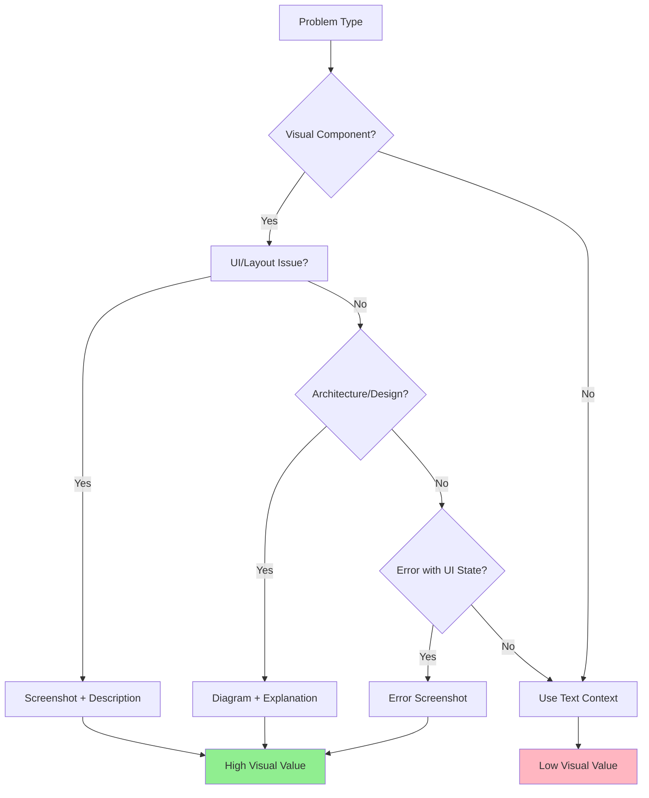

# Module 5.3: Image & Visual Context

> **Estimated time**: ~25 minutes
>
> **Prerequisite**: Module 5.2 (Context Optimization)
>
> **Outcome**: After this module, you will know how to use visual context with Claude Code — providing screenshots, UI mockups, diagrams, and error screenshots to get more precise, visually-informed responses.

---

## 1. WHY — Why This Matters

You're trying to describe a UI bug to Claude Code. "The button overlaps the text when the screen is narrow. The margin seems wrong. Maybe the flex container?" You type five sentences describing the layout. Claude suggests a CSS fix, but it doesn't match your actual issue — because it couldn't SEE what you're seeing. One screenshot would have been worth a thousand tokens. Visual context is the most underused capability in Claude Code. Most developers don't realize Claude can process images. When you show instead of tell, accuracy jumps dramatically. For UI bugs, architecture diagrams, or error screenshots, visual context is not optional — it's essential.

---

## 2. CONCEPT — Core Ideas

### What Claude Code Can "See"

Claude Code's vision capabilities allow it to analyze:

- **UI/UX screenshots** — layout bugs, styling issues, responsive design problems
- **Architecture diagrams** — system design, data flow, component relationships
- **Error screenshots** — terminal errors, browser dev tools, stack traces with context
- **Wireframes and mockups** — design-to-code conversion, implementation guidance
- **Database schema diagrams** — ERDs, table relationships, migration planning
- **Whiteboard photos** — hand-drawn architecture, brainstorming diagrams

### How to Provide Images

Claude Code supports three confirmed methods for providing images:

**Method 1: Clipboard Paste (Recommended)**

The fastest method. Take a screenshot, then paste it directly into Claude Code:
- **macOS**: `Cmd+Shift+Ctrl+4` to screenshot to clipboard, then **`Ctrl+V`** (NOT `Cmd+V`!) to paste
- **Windows**: `Win+Shift+S` to screenshot, then `Alt+V` to paste
- This is the PRIMARY method most developers should use

**Method 2: File Path Reference**

Simply mention the file path in your prompt — Claude auto-reads image files when referenced:
```
Look at screenshot.png and fix the layout issue
```
Supports: PNG, JPG, GIF, WebP

**Method 3: Drag and Drop**

Drag image files directly into your terminal window. Supported in iTerm2, Ghostty, WezTerm, and Kitty.

### Terminal Compatibility

| Terminal | Clipboard Paste | Drag & Drop | Shortcut |
|----------|----------------|-------------|----------|
| iTerm2 | Yes | Yes | `Ctrl+V` |
| Ghostty | Yes | Yes | `Ctrl+V` |
| WezTerm | Yes | Yes | `Ctrl+V` |
| Kitty | Yes | Yes | `Ctrl+V` |
| VS Code Terminal | Yes | Limited | `Ctrl+V` |
| macOS Terminal.app | No | No | N/A |

### When Visual Beats Text



**Use images when:**
- The problem has a visual component you can show
- Describing it in text would take >100 words
- Exact visual state matters (UI bugs, layout issues)
- Architecture is complex with many relationships

**Use text when:**
- The problem is purely logical (algorithm bugs)
- Performance issues (logs and metrics are better)
- Configuration problems (show config files as text)
- The visual would be unclear or ambiguous

### Image Context Cost

Images consume significant tokens. A typical screenshot can use 500-2000 tokens depending on resolution and complexity. Be strategic:

- **Crop tightly** — show only the relevant area
- **Reduce resolution** for diagrams and wireframes
- **Use text for code** — don't screenshot code, paste it as text
- **Monitor with /cost** — track your context budget

---

## 3. DEMO — Step by Step

### Step 1: UI Bug with Screenshot

**Scenario**: Button overlaps text on mobile viewport.

```bash
# Save screenshot as mobile-bug.png in your project, or use Ctrl+V to paste from clipboard
$ claude
```

**Your prompt:**
```
See mobile-bug.png — the "Submit" button overlaps
the form text when viewport is <400px wide.
Fix the CSS to prevent this overlap.
```

**What Claude sees**: The exact visual state — button position, text flow, container dimensions.

**Expected response pattern**:
```
I can see the button is using position: absolute
without accounting for the form height. Here's the fix:

[Provides targeted CSS that addresses the specific
visual issue, not a generic solution]
```

**Why it works**: Claude sees the EXACT problem, not your interpretation of it.

---

### Step 2: Architecture Diagram Analysis

**Scenario**: You have a system architecture diagram showing microservices.

```bash
$ claude
```

**Your prompt:**
```
See architecture.png — we're adding a new
"Notification Service". Where should it sit in
this architecture? Should it be behind the API
Gateway or talk to services directly?
```

**Expected response pattern**:
```
Looking at your diagram, I see:
- API Gateway → Auth Service → User Service
- Payment Service talks directly to external APIs
- ...

For Notification Service, I recommend:
[Specific architectural guidance based on
what it actually sees in your diagram]
```

---

### Step 3: Error Screenshot Diagnosis

**Scenario**: Browser console shows cryptic React error.

```bash
$ claude
```

**Your prompt:**
```
See console-error.png — this React error appears
when I click "Delete". The stack trace is cut off.
What's the likely cause and how do I debug it?
```

**What Claude sees**: The error message, component names in the stack, React DevTools state, network tab status.

**Expected response pattern**:
```
I can see this is a "Cannot read property 'id' of undefined"
error in your DeleteButton component. Looking at the
stack trace visible in your screenshot...

[Specific debugging steps based on the actual error]
```

---

### Step 4: Wireframe to Code

**Scenario**: Designer provides a wireframe for a new dashboard.

```bash
$ claude
```

**Your prompt:**
```
See dashboard-wireframe.png — implement this
in React with Tailwind CSS. Use the exact layout
shown: sidebar left, main content area with
3 cards across, header with search.
```

**Expected response pattern**:
```
Based on your wireframe, here's the component structure:

[Provides implementation that matches the visual
layout — correct grid, spacing, hierarchy]
```

**Accuracy improvement**: Instead of guessing layout details, Claude sees the exact design intent.

---

### Step 5: Cost Impact Measurement

After using visual context:

```bash
/cost
```

**Expected output:**
```
Total tokens: 8,234
├─ Input: 6,891 ($0.021)
│  ├─ Text: 4,123 tokens
│  └─ Images: 2,768 tokens  ← Track this
└─ Output: 1,343 ($0.004)
```

**Analysis**: The image used ~40% of input tokens. Was it worth it? If it prevented 3 rounds of back-and-forth (300+ tokens each), then yes.

---

## 4. PRACTICE — Try It Yourself

### Exercise 1: Screenshot vs Description

**Goal**: Compare accuracy and efficiency between text description and screenshot.

**Instructions**:
1. Find a UI bug in any app (or create a simple HTML page with an obvious layout issue)
2. **Round 1 — Text only**:
   - Describe the bug to Claude Code in text (don't mention you have a screenshot)
   - Note the solution it provides
   - Note the token cost with `/cost`
3. **Round 2 — With screenshot**:
   - Start a new session (`/clear` or restart)
   - Provide the screenshot with a brief description
   - Note the solution it provides
   - Note the token cost with `/cost`
4. Compare:
   - Which solution was more accurate?
   - Which required fewer clarifications?
   - Token cost difference
   - Time saved

**Expected result**: The screenshot version should provide a more accurate solution with fewer follow-up questions, even if token cost is slightly higher.

<details>
<summary>💡 Hint</summary>

For the text description, try to be detailed but not exhaustive. Describe the bug as you normally would to a colleague. For the screenshot, keep your text prompt brief — let the image do the talking.

</details>

<details>
<summary>✅ Solution Approach</summary>

**Round 1 — Text-only example:**
```
Prompt: "My navigation menu items are too close together
on mobile. They're hard to tap. I think the padding is
wrong. It's a flex container with space-between."

Tokens: ~150 input + likely follow-up questions
Accuracy: Depends on how well you described it
```

**Round 2 — Screenshot example:**
```
Prompt: "See nav-bug.png — menu items overlap on mobile.
Fix the spacing."

Tokens: ~50 text + 800 image = 850 input
Accuracy: High — Claude sees exact spacing issue
Follow-ups: Usually none needed
```

**Verdict**: Screenshot costs more tokens (~5x) but typically saves 2-3 rounds of clarification. Net saving in most cases.

</details>

---

### Exercise 2: Wireframe to Component

**Goal**: Use a visual mockup to generate accurate component code.

**Instructions**:
1. Create a simple wireframe (or find one online) — can be hand-drawn or from Figma/Sketch
   - Should show: layout structure, component hierarchy, basic content
2. Save as PNG/JPG
3. Prompt Claude Code:
   ```
   See wireframe.png — implement this component
   in [your framework: React/Vue/Svelte].
   Use [your styling: Tailwind/CSS-in-JS/plain CSS].
   Match the layout exactly.
   ```
4. Check the generated code against your wireframe:
   - Layout structure correct?
   - Spacing roughly matched?
   - Component hierarchy logical?
5. Run `/cost` to see token impact

**Expected result**: Generated component should structurally match the wireframe. Exact styling may need refinement, but the foundation should be solid.

<details>
<summary>💡 Hint</summary>

If the wireframe is hand-drawn or low-fidelity, add clarification in your prompt about what each box/section represents. For example: "The top box is the header, middle section is a card grid (3 across), bottom is pagination."

</details>

<details>
<summary>✅ Solution Pattern</summary>

**Good wireframe prompt structure:**
```
See [filename] — this is a [component type] for [purpose].

Layout details:
- [Top section description]
- [Middle section description]
- [Bottom section description]

Implement in [framework] with [styling approach].
Use semantic HTML. Make it responsive.
```

**What Claude delivers:**
- Component structure matching visual hierarchy
- Reasonable styling approximations
- Semantic HTML elements
- Basic responsiveness

**What you'll still need to adjust:**
- Exact spacing/margins
- Colors and fonts (unless specified)
- Animations/interactions
- Accessibility details

**Token cost**: Expect 600-1500 tokens for a wireframe, depending on complexity. Worth it if it saves 15+ minutes of describing layout in text.

</details>

---

## 5. CHEAT SHEET

### Visual Context Use Cases

| Use Case | What to Provide | Example Prompt | Token Cost |
|----------|----------------|----------------|------------|
| **UI Bug** | Screenshot of issue | "See bug.png — button overlaps on mobile. Fix CSS." | 500-1000 |
| **Architecture Review** | System diagram | "See arch.png — should Payment Service use the API Gateway?" | 800-1500 |
| **Error Diagnosis** | Console/terminal screenshot | "See error.png — this crashes on submit. Why?" | 600-1200 |
| **Wireframe to Code** | Mockup/wireframe | "See mockup.png — implement in React + Tailwind" | 700-2000 |
| **Database Design** | ERD or schema diagram | "See schema.png — optimize for read-heavy queries" | 800-1500 |
| **Code Review Visual** | Screenshot with annotations | "See review.png — red circles show performance issues" | 600-1200 |

### How to Provide Images

| Method | How | Best For |
|--------|-----|----------|
| **Clipboard paste** | `Ctrl+V` (macOS: NOT `Cmd+V`!) | Quick screenshots — fastest method |
| **File path reference** | Mention path in prompt: "See bug.png" | Saved images, team sharing |
| **Drag and drop** | Drag file into terminal | Quick one-off images |

**Recommended workflow**: `Cmd+Shift+Ctrl+4` (screenshot to clipboard) → `Ctrl+V` (paste into Claude Code).

### When NOT to Use Images

| Scenario | Why Text is Better |
|----------|-------------------|
| **Code snippets** | Text is searchable, copy-pasteable, uses fewer tokens |
| **Log files** | Text format preserves structure, easier to grep |
| **JSON/Config** | Text allows precise editing |
| **Performance data** | Numbers in text are easier to analyze |
| **Stack traces** | Text stack traces are fully copy-pasteable |

### Token Cost Guidelines

- **Simple screenshot**: 500-800 tokens
- **Complex UI screenshot**: 1000-1500 tokens
- **Detailed diagram**: 1200-2000 tokens
- **High-resolution image**: 2000+ tokens (avoid unless necessary)

**Budget rule**: If an image uses >2000 tokens, consider if a text description + smaller/cropped image would work.

---

## 6. PITFALLS — Common Mistakes

| ❌ Mistake | ✅ Correct Approach |
|-----------|-------------------|
| **Describing UI bugs verbosely** — "The button is 20px from the left, overlaps the text at 380px viewport, the container has flex..." | **Show, don't tell** — Screenshot + "Button overlaps text on mobile. Fix CSS." Uses fewer tokens, higher accuracy. |
| **Huge high-res screenshots** — Providing 4K screenshots that consume 3000+ tokens | **Crop and resize** — Show only the relevant area. Resize to 1200px max width for web UIs. Diagrams can be even smaller. |
| **Using images for text-based problems** — Screenshot of code instead of pasting text | **Use text for code** — Code as text is searchable, editable, uses 5-10x fewer tokens. Images only for visual context. |
| **Screenshot without context prompt** — Just "See this image" with no explanation | **Always add text context** — "See mobile-bug.png — this happens when viewport <400px. Fix the button overlap." Guides Claude's focus. |
| **Multiple screenshots without cost monitoring** — Adding 5-6 screenshots in one prompt | **Track with /cost** — Each image is 500-1500 tokens. 5 images = 2500-7500 tokens = significant budget. Use sparingly. |
| **Assuming Claude can read tiny text** — Screenshot with 8pt font or compressed terminal output | **Ensure readability** — If text in the image is important, make sure it's legible at normal viewing size. Zoom in before screenshot if needed. |
| **Using `Cmd+V` to paste images on macOS** — Nothing happens because `Cmd+V` is captured by the terminal as text paste | **Use `Ctrl+V`** (NOT `Cmd+V`) — this is the most common gotcha for macOS users. |
| **Sending full-screen screenshots** — Wastes tokens on irrelevant UI elements | **Crop to the relevant area** — Use `Cmd+Shift+Ctrl+4` and drag to select only the problem area. |

---

## 7. REAL CASE — Production Story

**Scenario**: Building a mobile banking app for a Vietnamese bank using Kotlin Multiplatform (KMP). The design team uses Figma for all screen mockups. Previously, developers would manually translate designs to code, often missing spacing and layout details.

**Problem**: Each screen took 10-15 minutes to describe to Claude Code in text, and the first implementation was only about 70% accurate to the design. This led to back-and-forth with designers and rework.

**Solution**: New workflow adopted:
1. Designer exports PNG from Figma at 2x resolution
2. Developer crops to show one screen at a time
3. Provides to Claude Code with framework context:
   ```
   See transaction-screen.png — implement this in
   Compose Multiplatform. Match the layout exactly.
   Use our design tokens from theme/tokens.kt.
   ```

**Implementation**:
```bash
# Example session
$ claude

> See screens/transaction-detail.png
>
> Implement this screen in Compose Multiplatform.
> Layout: Top app bar with back button, transaction
> amount (large text), detail rows below, action
> buttons at bottom.
>
> Use our design system: MaterialTheme + custom tokens
> in ui/theme/Tokens.kt

[Claude Code generates 90-95% accurate implementation]
```

**Results**:
- **Speed**: 3x faster per component (15 min → 5 min per screen)
- **Design accuracy**: 70% → 95% on first implementation
- **Designer-developer back-and-forth**: Reduced by 60%
- **Context cost**: ~5% of project token budget per screen
- **Quality**: Designers reported implementation "feels more faithful to design intent"

**Key insight**: The 5% token cost (typically 800-1200 tokens per screen) was easily worth the time saved and accuracy gained. One round of designer-developer back-and-forth costs more in time than the token cost of the screenshot.

**Team adoption**: Within 2 weeks, the entire 6-person team adopted this workflow. The practice spread to other visual tasks: error diagnosis (screenshots of crash logs), architecture discussions (whiteboard photos), and code reviews (annotated screenshots).

---

> **Next**: [Module 6.1: Think Mode (Extended Thinking)](../../phase-06-thinking-planning/01-think-mode/) →
