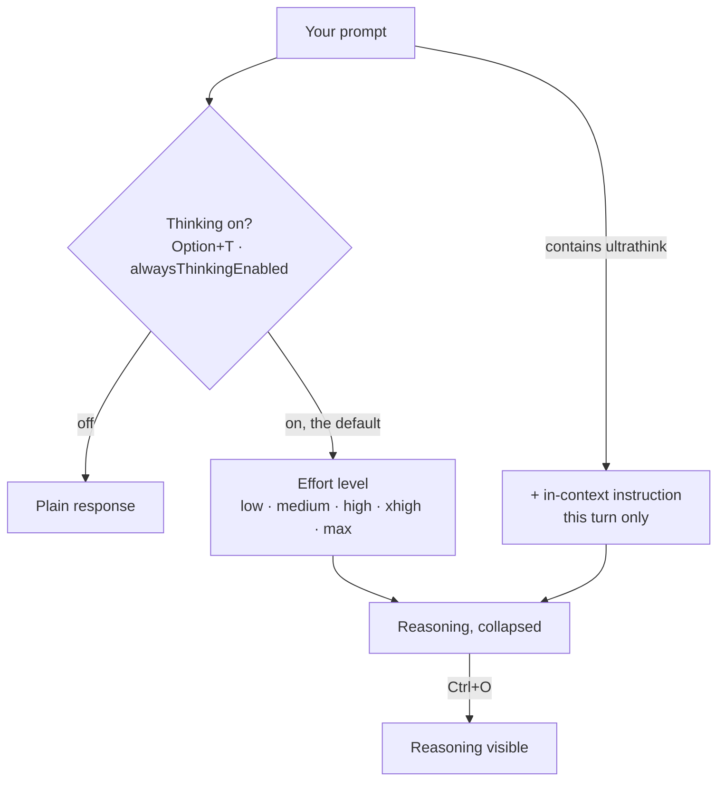

# Module 6.1: Think Mode (Extended Thinking)

> **Estimated time**: ~30 minutes
>
> **Prerequisite**: Module 5.3 (Image & Visual Context)
>
> **Outcome**: After this module, you will know that extended thinking is already on, how to
> raise or lower it with effort levels, when to reach for `ultrathink`, and how to read the
> reasoning Claude Code hides.

---

## 1. WHY — Why This Matters

Half the Claude Code advice on the internet tells you to type "think step by step" or "think
harder" to unlock a deeper mode. Those phrases do nothing. The docs are blunt about it:
Claude Code "passes other phrases such as 'think', 'think hard', and 'think more' through as
ordinary prompt text and doesn't recognize them as keywords."

So you paid for magic words while the controls that really move the dial — the **effort
level** and the **`ultrathink`** keyword — sat unused, and thinking was on the whole time.
This module replaces the folklore with the four real switches.

---

## 2. CONCEPT — Core Ideas

**Extended thinking is on by default.** There is no mode to enter. What you control is *how
much* reasoning Claude spends (the effort level, session-wide), whether one turn gets extra
(`ultrathink`), whether thinking happens at all (`Option+T`), and whether you see it
(`Ctrl+O`). The four are independent and do not overlap.

The effort level is the main dial: `low`, `medium`, `high`, `xhigh`, `max`, `ultracode`.
`high` is "the default on every model except Opus 4.7", which defaults to `xhigh`. `max` is
not a free upgrade — it "may show diminishing returns and is prone to overthinking".

`ultrathink` is the one keyword Claude Code actually recognizes, and it lasts a single turn:
"Include `ultrathink` anywhere in your prompt to request deeper reasoning on that turn without
changing your session effort setting… The effort level sent to the API is unchanged."



---

## 3. DEMO — Step by Step

All steps run in a small lab repo holding `src/math.js` and one test file.

**Step 1: Read the effort level you are already on**

Start `claude` and look at the line above the prompt box. {/* docs: model-config */}

```text
# Output may vary
 ▐▛███▛█   Claude Code v2.1.278
▝▜██████▀  Opus 5 (1M context) · Claude Max
  ▝▝ ▝▝    ~/cc-lab
                                                                                  ● high · /effort
────────────────────────────────────────────────────────────────────────────────────
❯
```

`● high · /effort` is your current level. You never turned thinking on — it already was.

**Step 2: Open the effort slider with `/effort`**

Type `/effort` and press Enter. {/* docs: model-config */}

```text
# Output may vary
   Effort
                   Faster                                                 Smarter
                   ────────────────────▲──────────────────────┆──────────────────
                   low     medium     high     xhigh      max       ultracode
                                                                xhigh + workflows
   ←/→ to adjust · Enter to confirm · s for this session only · Esc to cancel
```

Every documented level is on the slider. `/effort <level>` sets one directly; `/effort auto`
clears your saved level for the active model.

**Step 3: See the on/off switch with `Option+T`**

Press `Option+T` (macOS) or `Alt+T` (Windows/Linux). {/* docs: interactive-mode */}

```text
# Output may vary
  Toggle thinking mode
  Enable or disable thinking for this session.
  ❯ 1. Enabled ✔  Claude will think before responding
    2. Disabled   Claude will respond without extended thinking
  Enter to confirm · Esc to cancel
```

Enabled is already checked. `/config` saves the choice permanently as
`alwaysThinkingEnabled` in `~/.claude/settings.json`.

**Step 4: Use the one keyword that works**

```text
ultrathink: does the guard in divide() in src/math.js also reject -0? Answer in one sentence.
```

```text
# Output may vary
❯ ultrathink: does the guard in divide() in src/math.js also reject -0? …
⏺ I'll read the file.
  Thought for 2s, read 1 file
⏺ Yes — b === 0 is true for -0 as well (strict equality doesn't distinguish the two zeros,
  unlike Object.is), so divide(1, -0) also throws instead of returning -Infinity.
```

`Thought for 2s` is all you get by default: "Claude Code collapses thinking output by default."

**Step 5: Expand the reasoning with `Ctrl+O`**

Press `Ctrl+O` to toggle the transcript viewer. {/* docs: model-config, interactive-mode */}

```text
# Output may vary
                                                                  10:00 PM claude-opus-5
⏺ I'll read the file.
⏺ Read(/Users/luatnq/cc-lab/src/math.js)
  ⎿  Read 6 lines
∴ Since -0 equals 0 in the comparison, it correctly rejects -0 too.
────────────────────────────────────────────────────────────────────────────────────
  Showing detailed transcript · ctrl+o to toggle · ? for shortcuts          verbose
```

The `∴` line is the thinking summary. This capture used
`{ "showThinkingSummaries": true }` in `.claude/settings.json`, because "interactive sessions
on the Anthropic API receive redacted thinking blocks by default."

**Step 6: Measure the difference headlessly**

```bash
# docs: cli-reference
claude --effort low  -p "List the edge cases divide() in src/math.js does not handle." \
  --output-format json --permission-mode default --allowedTools "Read"
claude --effort high -p "List the edge cases divide() in src/math.js does not handle." \
  --output-format json --permission-mode default --allowedTools "Read"
```

Both runs are read-only, so `--allowedTools "Read"` is the whole permission budget they need.
The two JSON objects, same prompt and same repo: `result` was 1,399 characters at `low` and
2,494 at `high`; `num_turns` 2 vs 4; `duration_ms` 10,615 vs 40,056; `total_cost_usd`
0.381219 vs 0.479397. Output may vary — one pair of runs on one machine. Compare length,
turns and content, never a thinking-token count: Claude Code does not print one.

---

## 4. PRACTICE — Try It Yourself

### Exercise 1: Prove the ladder is dead

**Goal**: Confirm that "think step by step" is ordinary prompt text and `ultrathink` is not.

**Instructions**:
1. In a repo of yours, run `claude` and ask a question prefixed with `think step by step:`.
2. Press `Ctrl+O` and note the reasoning.
3. Ask the same question prefixed with `ultrathink:`. Press `Ctrl+O` again.
4. Compare the two transcripts.

**Expected result**: Both turns think, because thinking is on by default. Only the
`ultrathink` turn got an extra instruction.

<details>
<summary>💡 Hint</summary>
Do not look for a "mode" indicator. Compare reasoning length in the transcript viewer — step
1's phrase reached the model as plain text.
</details>

<details>
<summary>✅ Solution</summary>

The first prompt is indistinguishable from any other — Claude Code "passes other phrases such
as 'think', 'think hard', and 'think more' through as ordinary prompt text." The second is
recognized: Claude Code "adds an in-context instruction. The effort level sent to the API is
unchanged." `ultrathink` buys a deeper turn; the folk phrases buy nothing but tokens.
</details>

### Exercise 2: Find your own effort floor

**Goal**: Pick the cheapest effort level that still solves a task you actually run.

**Instructions**:
1. Choose a real, repeatable task (for example "summarize what changed in the last commit").
2. Run it with `--effort low`, `--effort medium` and `--effort high`, each with
   `--output-format json`, saving every result.
3. Compare the `result` fields for correctness, not length.
4. Pin the winner with `/effort <level>` or the `effortLevel` setting.

**Expected result**: A note saying which level you will use for this class of task.

<details>
<summary>💡 Hint</summary>
`low` is for work that is "not intelligence-sensitive". If `low` gets the one right answer,
`high` is wasted spend.
</details>

<details>
<summary>✅ Solution</summary>

For mechanical tasks `low` often ties `high`, so pin it per model with `modelSettings` rather
than raising the global default. Note that `effortLevel` "accepts `low`, `medium`, `high`, or
`xhigh`. `max` is not accepted here" — `max` has to come from `/effort` or `--effort`.
</details>

---

## 5. CHEAT SHEET

| Control | Where | What it does |
|---|---|---|
| `/effort` | Session | Opens the slider; `s` = this session only |
| `/effort <level>` | Session | `low`, `medium`, `high`, `xhigh`, `max`, `ultracode` |
| `/effort auto` | Session | Clears the saved level for the active model |
| `--effort <level>` | CLI | Same levels; does not persist |
| `effortLevel` | settings.json | Default for models with no saved level (no `max`) |
| `modelSettings` | settings.json | Saved effort level per model |
| `ultrathink` | Prompt | Deeper reasoning, that turn only |
| `Option+T` / `Alt+T` | Session | Toggle extended thinking |
| `alwaysThinkingEnabled` | settings.json | Thinking off for every session |
| `MAX_THINKING_TOKENS=0` | Env var | Thinking off on the Anthropic API |
| `Ctrl+O` | Session | Toggle the transcript viewer |
| `showThinkingSummaries` | settings.json | Full summaries instead of redacted blocks |

Defaults: thinking on; effort `high` except Opus 4.7 (`xhigh`). Thinking cannot be turned off
on Fable models.

---

## 6. PITFALLS — Common Mistakes

| ❌ Mistake | ✅ Correct Approach |
|---|---|
| Typing "think step by step" to unlock a deeper mode | Thinking is already on. Raise `/effort`, or use `ultrathink` |
| Quoting a "thinking tokens: 2,768" figure | Claude Code prints no such count. Compare output length, turns, cost |
| Assuming `ultrathink` raises your effort level | "The effort level sent to the API is unchanged" |
| Running everything at `max` | `max` "may show diminishing returns and is prone to overthinking" |
| `"effortLevel": "max"` in settings.json | Not accepted. Use `/effort max` or `--effort max` |
| Expecting `Option+T` to work on Fable | "You can't turn thinking off on Fable models" |
| Assuming collapsed reasoning is free | "You are charged for all thinking tokens generated, even when collapsed or redacted" |

---

## 7. REAL CASE — Production Story

**Scenario**: A Vietnam-based fintech team was building payment reconciliation for their
banking app: VND amounts (no decimals), three banks with different API response formats
(VietcomBank, Techcombank, MBBank), and State Bank of Vietnam (SBV) audit requirements.

**Problem**: They asked Claude Code to "implement payment reconciliation logic" at the default
effort, in a session that already held two unrelated tasks. The result assumed USD-style minor
units (`amount * 100`), assumed one uniform bank response shape, and skipped the SBV state
machine and audit trail. Five rounds of corrections followed, each piling up in the same
polluted context.

**Solution**: The team lead ran `/clear`, raised the session with `/effort xhigh`, and rewrote
the prompt to carry the constraints the first attempt had to guess at: VND is an integer
currency, each bank has its own field names, SBV requires a state machine plus an audit trail,
settlement windows differ per bank. The hardest sub-problem — reconciling mismatched
settlement windows — got its own turn prefixed with `ultrathink`.

**Result**: The second attempt produced integer VND handling, a per-bank adapter layer, and an
explicit state machine with audit events. The rule they wrote into their CLAUDE.md was not
"add think to your prompts" — it was: clear the context, put the constraints in the prompt,
and reach for effort and `ultrathink` deliberately.

---

> **Next**: [Module 6.2: Plan Mode](../02-plan-mode/) →
