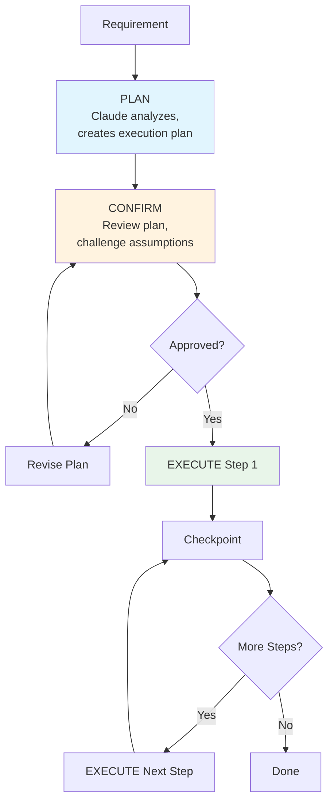

# Module 6.2: Plan Mode

> **Estimated time**: ~35 minutes
>
> **Prerequisite**: Module 6.1 (Think Mode)
>
> **Outcome**: After this module, you will be able to activate Plan Mode — making Claude Code create detailed execution plans before touching code, then implementing step by step with checkpoints. This eliminates the #1 mistake: letting Claude code before planning.

---

## 1. WHY — Why This Matters

PM drops a feature request: "Add multi-language support to the app." You type it into Claude Code. Claude immediately starts coding — touches 15 files, misses critical translation files, breaks existing tests. You're left with a half-working mess.

The problem? Claude CODED when it should have PLANNED.

Think Mode (6.1) made Claude reason deeper. But deeper reasoning without structure still leads to chaotic execution. Plan Mode adds STRUCTURE — Claude creates a battle plan with exact files, steps, dependencies, and checkpoints BEFORE writing a single line of code. This is the #1 mistake with AI coding tools: skipping the planning phase. Complex features need a battle plan first.

---

## 2. CONCEPT — Core Ideas

### What is Plan Mode?

Plan Mode is an operational pattern where you explicitly tell Claude to create an execution plan BEFORE writing any code. It's not a toggle or built-in command — it's a workflow discipline you enforce through prompts.

The core phrase: **"Do NOT write code. Give me the plan first."**

### The Plan-Confirm-Execute (PCE) Pattern



1. **PLAN**: Give Claude the requirement + constraints. Claude analyzes the codebase, identifies affected files, lists dependencies, creates step-by-step plan. NO CODE yet.
2. **CONFIRM**: Review the plan. Challenge: "What risks did you miss?" "What about X dependency?" Adjust scope.
3. **EXECUTE**: Implement step by step. Checkpoint every 3-5 steps with `/compact` to review progress.

**Why it works**: Bad assumptions are caught BEFORE they become bad code.

### The Planning Prompt Template

```
I need to [specific goal].
Current state: [what exists]
Constraints: [what can't change]

Before writing ANY code:
1. Analyze what needs to change
2. List ALL files that will be affected
3. Identify risks and dependencies
4. Create step-by-step execution plan

Do NOT write code. ONLY give me the plan.
```

### Task Decomposition Strategies

| Strategy | Best For | Example |
|----------|----------|---------|
| **Vertical Slicing** | User-facing features | Login → Register → Profile → Settings |
| **Horizontal Slicing** | Refactoring, migrations | DB schema → API → Service → UI |
| **Risk-First** | Uncertain technology | Prove WebSocket scaling → then build features |
| **Dependency-First** | Complex dependency chains | Auth system → User service → Notifications |

### Plan Granularity Rule

- Task **> 2 hours** → Needs a plan
- Task **< 30 minutes** → Just code directly

---

## 3. DEMO — Step by Step

**Scenario**: Add notification system (email + push) to Express/TypeScript API.

### Step 1: PLAN — Activate Plan Mode

```bash
$ claude
```

Prompt:
```
I need to add a notification system supporting email (SendGrid) and push
(Firebase). Include template system and rate limiting.

Current state: Express + TypeScript + Prisma
Constraints: Can't modify existing user table schema

Before writing ANY code:
1. Analyze what needs to change
2. List ALL files affected
3. Identify risks and dependencies
4. Create step-by-step execution plan

Do NOT write code. ONLY give me the plan.
```

Expected output:
```
## Execution Plan: Notification System

### Files Affected (12 files)
- src/services/notification/ (new directory)
- src/types/notification.ts (new)
- src/config/notification.config.ts (new)
- prisma/schema.prisma (modify - add NotificationLog)
- package.json (add @sendgrid/mail, firebase-admin)
...

### Dependencies
- SendGrid API key required
- Firebase service account
- Redis for rate limiting (optional)

### Risks
1. Firebase token expiry handling
2. SendGrid rate limits (100/sec)
3. Template variable injection security

### Execution Steps
1. Define notification interfaces and types
2. Create template system with variable substitution
3. Implement SendGrid email provider
4. Implement Firebase push provider
5. Add rate limiting middleware
6. Create NotificationService orchestrator
7. Add database logging (Prisma migration)
8. Write unit tests for providers
9. Integration test with test accounts
10. Documentation and config examples
```

### Step 2: CONFIRM — Challenge and Adjust

Prompt:
```
Good plan. Three adjustments:
1. Add SMS via Twilio as third channel
2. Move template system to step 2 (providers depend on it)
3. What's your solution for Firebase token expiry?

Update the plan.
```

Claude revises — issues caught BEFORE any code exists.

### Step 3: EXECUTE Step 1

Prompt:
```
Plan approved. Implement step 1: notification interfaces and types.
```

Claude generates focused, plan-aligned code:
```typescript
// src/types/notification.ts
export interface NotificationPayload {
  channel: 'email' | 'push' | 'sms';
  recipient: string;
  template: string;
  variables: Record<string, string>;
}
```

### Step 4: Checkpoint — Mid-Execution Review

After completing steps 1-4:

```
/compact
```

Then:
```
We're at step 5 of 12. Review progress against plan. On track?
Any adjustments needed before continuing?
```

Claude compares progress vs plan, suggests any needed adjustments.

### Step 5: Result Comparison

| Approach | Time | Rework |
|----------|------|--------|
| **Without Plan Mode** | 8+ hours | 2+ hours fixing missed requirements |
| **With Plan Mode** | 6.25 hours (30min plan + 15min confirm + 5.5h execute) | Zero |

---

## 4. PRACTICE — Try It Yourself

### Exercise 1: PCE in Action

**Goal**: Practice the full Plan-Confirm-Execute cycle.

**Instructions**:
1. Choose a medium feature for your project (or use: "Add CSV export for user data")
2. Write a planning prompt using the template
3. Get Claude's plan — DON'T accept it immediately
4. Challenge: "What risks did you miss?" "What if the export is 100K rows?"
5. Refine until confident
6. Execute first 3 steps only
7. Reflect: did planning save time vs jumping to code?

**Expected result**: Plan with 6-10 steps, at least 2 risks identified, first 3 steps implemented cleanly.

<details>
<summary>💡 Hint</summary>

For the challenge phase, good questions include:
- "What if the data is too large for memory?"
- "How do we handle special characters in CSV?"
- "What about concurrent export requests?"
- "Where do we store the generated file?"
</details>

<details>
<summary>✅ Solution</summary>

**Planning prompt**:
```
I need to add CSV export for user data. Should support filtering by date
range and user status. Current: Express API with Prisma ORM.

Before writing ANY code:
1. Analyze what needs to change
2. List files affected
3. Identify risks and dependencies
4. Create step-by-step plan

Do NOT write code. ONLY give me the plan.
```

**Challenge prompts**:
- "What if we have 100K users? Will this load everything in memory?"
- "How do we handle Unicode characters in names?"
- "What about rate limiting concurrent exports?"

**Good plan should include**:
- Streaming approach for large datasets
- Proper CSV escaping for special characters
- Queue system or rate limiting for exports
- Temporary file storage strategy
</details>

---

### Exercise 2: Decomposition Strategy Picker

**Goal**: Learn to choose the right decomposition strategy.

For each feature, choose the best strategy and justify:

1. **User authentication** (login, register, password reset, 2FA)
2. **Data export to CSV** (single feature, transforms data)
3. **Real-time chat** (WebSocket, storage, presence)
4. **Admin dashboard** (users, stats, settings)

<details>
<summary>💡 Hint</summary>

Ask yourself:
- Multiple user journeys? → Vertical
- Single feature, multiple layers? → Horizontal
- High technical uncertainty? → Risk-First
- Clear dependency chain? → Dependency-First
</details>

<details>
<summary>✅ Solution</summary>

| Feature | Strategy | Reason |
|---------|----------|--------|
| User auth | **Vertical** | Each auth feature (login, register, 2FA) is a complete user journey |
| CSV export | **Horizontal** | Single feature spanning layers: API → Service → File generation |
| Real-time chat | **Risk-First** | WebSocket scaling is the risky unknown — prove it first |
| Admin dashboard | **Vertical** | Independent pages (users, stats, settings) can ship separately |
</details>

---

## 5. CHEAT SHEET

### Planning Prompt Template

```
I need to [goal].
Current state: [what exists]
Constraints: [what can't change]

Before writing ANY code:
1. Analyze what needs to change
2. List ALL files affected
3. Identify risks and dependencies
4. Create step-by-step execution plan

Do NOT write code. ONLY give me the plan.
```

### Checkpoint Template

```
We're at step X of Y. /compact then review:
- Progress vs plan?
- Any adjustments needed?
- Risks materialized?
```

### Plan Revision Template

```
Good plan. Adjustments needed:
1. [Add/remove/reorder]
2. [New constraint]
3. [Question about risk]

Update the plan.
```

### Decomposition Decision Table

| If... | Use... |
|-------|--------|
| Multiple user features | Vertical Slicing |
| Single feature, many layers | Horizontal Slicing |
| High technical uncertainty | Risk-First |
| Clear dependency chain | Dependency-First |

### Plan Granularity Rule

| Task Duration | Action |
|---------------|--------|
| > 2 hours | Full PCE cycle |
| 30 min - 2 hours | Quick plan, minimal confirm |
| < 30 minutes | Code directly |

---

## 6. PITFALLS — Common Mistakes

| ❌ Mistake | ✅ Correct Approach |
|-----------|---------------------|
| Jumping to code without plan for task >2 hours | ALWAYS Plan-Confirm-Execute for tasks touching 3+ files |
| Over-planning simple tasks (adding a button) | Task <30 min → skip plan, code directly |
| Accepting first plan without challenging | CONFIRM phase is mandatory. Ask: "What risks? What dependencies?" |
| Planning everything then executing all at once | Execute step-by-step, checkpoint every 3-5 steps |
| Skipping `/compact` between plan and execute | After CONFIRM, `/compact` before EXECUTE step 1 |
| Abandoning plan when execution gets hard | If reality diverges, STOP and re-plan. Don't force it. |
| Planning without letting Claude read codebase | Let Claude read key files BEFORE planning |

---

## 7. REAL CASE — Production Story

**Scenario**: Vietnamese e-commerce startup building multi-warehouse inventory management. Feature: real-time stock sync across 5 warehouses. 40+ files, 3 new DB tables, WebSocket, 2 external APIs.

**Without Plan Mode (first attempt)**:
- Day 1-2: Coded immediately, built basic sync
- Day 3: Discovered missing conflict resolution for concurrent updates
- Day 5: WebSocket approach didn't scale, had to switch to Redis pub/sub
- **Total: 7 days** (2 days wasted on rework)

**With Plan Mode (next similar feature)**:
1. **PLAN** (2 hours): Claude analyzed codebase, listed 35 affected files, identified 4 critical dependencies, created 12-step plan, flagged WebSocket scaling risk
2. **CONFIRM** (1 hour): Team caught 2 missing steps. Claude suggested CRDT for conflict resolution and Redis pub/sub from the start.
3. **EXECUTE** (3 days): Step-by-step, checkpoint every 4 steps

**Result**: 3.5 days vs 7 days. Zero rework. Team quote: "3 hours planning saved 3.5 days coding."

---

> **Next**: [Module 6.3: Think + Plan Combo](../03-think-plan-combo/) →
