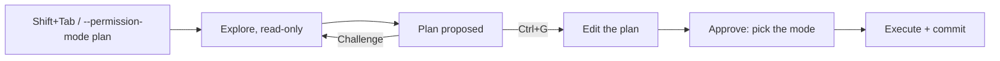

# Module 6.2: Plan Mode

> **Estimated time**: ~35 minutes
>
> **Prerequisite**: Module 6.1 (Think Mode)
>
> **Outcome**: After this module you can enter Claude Code's native plan mode, read and edit
> the plan it proposes, approve it into the permission mode you want, and tell when planning
> is not worth it.

---

## 1. WHY — Why This Matters

You ask for "extract the notification logic into its own service." Claude starts editing at
once. Twenty minutes later there are eleven changed files, two wrong, and you are reading a
diff to work out what it thought you meant.

Plan mode inverts that. It is not a prompt — it is a permission mode that blocks edits, in
all but one session type, until you have read what Claude intends. You decide once, with the
design in front of you, instead of eleven times.

---

## 2. CONCEPT — Core Ideas

Plan mode is a permission mode, and the docs define it exactly: "Plan mode tells Claude to
research and propose changes without making them. Claude reads files, runs shell commands to
explore, and writes a plan, but does not edit your source." One condition is attached:
"**Except in interactive terminal sessions with bypass permissions available**, edits stay
blocked until you approve the plan." Elsewhere — `-p` runs, the Agent SDK, the VS Code chat
panel — "plan mode keeps its blocks".

Three ways in: `Shift+Tab` until the status bar shows `⏸ plan mode on`; prefix one prompt
with `/plan`; or `claude --permission-mode plan`, which `defaultMode: "plan"` in
`.claude/settings.json` makes the project default.

`Shift+Tab` again leaves without approving. Approving "exits plan mode and switches the
session to the permission mode each approve option describes" — you pick the blast radius as
you accept the design.

The course's **PCE loop** — Plan, Challenge, Execute — maps onto the docs' four phases,
Explore → Plan → Implement → Commit:

| PCE step | Native mechanism |
|---|---|
| **Plan** | Explore read-only, then a written plan; `Ctrl+G` edits it |
| **Challenge** | "Review this plan — what could go wrong?" before approving |
| **Execute** | Approve (or `Shift+Tab`) to leave plan mode, then implement |

Challenge is not ceremony. The AI-native SDLC playbook: "The agent that wrote the code has no
way to approve it." (S3) Nor for the plan.

Planning is not free either: "Planning is most useful when you're uncertain about the
approach, when the change modifies multiple files, or when you're unfamiliar with the code
being modified. If you could describe the diff in one sentence, skip the plan." (S1)


```mermaid
graph LR
    A[Shift+Tab / --permission-mode plan] --> B[Explore, read-only]
    B --> C[Plan proposed]
    C -->|Ctrl+G| D[Edit the plan]
    C -->|Challenge| B
    D --> E[Approve: pick the mode]
    E --> F[Execute + commit]
```

---

## 3. DEMO — Step by Step

Lab repo: `src/math.js` (`add`, `divide`) and one test file.

**Step 1: Enter plan mode**

Press `Shift+Tab` until the status bar says so. <!-- docs: permission-modes -->

```text
# Output may vary
────────────────────────────────────────────────────────────────────────────────────
❯
────────────────────────────────────────────────────────────────────────────────────
  ⏸ plan mode on (shift+tab to cycle)
```

The cycle runs `default` → `acceptEdits` → `plan`; from `auto` the first press goes to
`default`. Or start there: `claude --permission-mode plan`.

**Step 2: Ask**

```text
Add input validation to divide() in src/math.js: throw a RangeError when the divisor
is 0. Leave add() alone. Write the plan.
```

Claude reads the file, lists the directory, runs a read-only shell command. Nothing is
edited. The status line names the plan file:

```text
# Output may vary
Planning: /Users/luatnq/.claude/plans/add-input-validation-to-enumerated-prism.md
```

The slug is generated per plan, so it differs from the approval screen below; both captures
are real, from two runs of this walkthrough.

⚠️ Needs verification — that path shows in the live UI but is on no page under
`https://code.claude.com/docs/en/`. Treat `Ctrl+G` as the supported way in.

**Step 3: The plan and the approval prompt**

```text
# Output may vary
 Ready to code?
 Here is Claude's plan:
 Add divide-by-zero validation to divide()
 Context
 src/math.js:2 currently is a bare a / b. With a divisor of 0 JavaScript returns
 Infinity, -Infinity, or NaN (for 0 / 0) instead of failing — a silent bad value
 that propagates to callers. add() is explicitly out of scope and stays as is.
 Change
 src/math.js — guard the divisor in divide(), keeping the existing one-line style
 …
 Claude has written up a plan and is ready to execute. Would you like to proceed?
 ❯ 1. Yes, and use auto mode
   2. Yes, manually approve edits
   3. Tell Claude what to change
      shift+tab to approve with this feedback
 ctrl+g to edit in Vim · ~/.claude/plans/add-input-validation-to-reflective-nova.md
```

Option 3 is the **Challenge** step: send it back with "what breaks if `b` is `'0'`?" and
stay in plan mode.

**Step 4: Approve, and watch the mode change**

Option 1 approves and switches the session out of plan mode.

```text
# Output may vary
  ⎿  Updated src/math.js (+4 -1)
      1  export function add(a, b) { return a + b; }
      2 -export function divide(a, b) { return a / b; }
      2 +export function divide(a, b) {
      3 +  if (b === 0) throw new RangeError('Division by zero');
      4 +  return a / b;
      5 +}
  ⎿  Updated tests/math.test.mjs (+5 -1)
──────────────────────────────────────────────── add-divide-by-zero-validation ─
  ⏵⏵ auto mode on (shift+tab to cycle)
```

Two documented side effects: the mode is `auto` now, and the session took a title from the
plan.

**Step 5: Verify**

```bash
# docs: common-workflows
git diff --stat && npm test 2>&1 | tail -5
```

```text
# Output may vary
 src/math.js           | 5 ++++-
 tests/math.test.mjs   | 6 +++++-
# pass 5
# fail 0
```

If the plan was wrong, `/rewind` (or `Esc` twice on an empty prompt) restores conversation,
code, or both.

---

## 4. PRACTICE — Try It Yourself

### Exercise 1: Plan a multi-file change

**Goal**: Use plan mode where it pays off — an unfamiliar, multi-file change.

**Instructions**:
1. In a real repo, run `claude --permission-mode plan`.
2. Ask for a change touching at least three files.
3. Read the plan: how many files does it name, and are they right?
4. Approve with **Yes, manually approve edits** so you see each write.

**Expected result**: A plan corrected before any file changed.

<details>
<summary>✅ Solution</summary>

The tell that plan mode earned its keep is a plan naming a file you forgot. If it restates
your prompt, you picked a task (S1) says to skip: "If you could describe the diff in
one sentence, skip the plan."
</details>

### Exercise 2: Let Claude interview you into a SPEC.md

**Goal**: Produce a spec for a larger feature, then execute it in a fresh session.

**Instructions**:
1. In plan mode, send the interview prompt from Anthropic's best practices (S1):

```text
I want to build [brief description]. Interview me in detail using the AskUserQuestion tool.

Ask about technical implementation, UI/UX, edge cases, concerns, and tradeoffs. Don't ask
obvious questions, dig into the hard parts I might not have considered.

Keep interviewing until we've covered everything, then write a complete spec to SPEC.md.
```

2. Answer until it stops asking; let it write `SPEC.md`.
3. Quit, start a **fresh** session, implement from `SPEC.md`.

**Expected result**: A self-contained spec, then a clean session.

<details>
<summary>✅ Solution</summary>

"Once the spec is complete, start a fresh session to execute it." (S1) A good spec should
"name the files and interfaces involved, state what is out of scope, and end with an
end-to-end verification step that proves the feature works." Writing `SPEC.md` is itself an
edit, so plan mode asks you to approve it — working as designed.
</details>

### Exercise 3: Challenge the plan

**Goal**: Reject a plan productively instead of fixing it later.

**Instructions**:
1. Get any plan proposed.
2. Choose **Tell Claude what to change**: "Review this plan — what could go wrong in
   production, and what did you assume about the existing code?"
3. Compare it with the first.

**Expected result**: A second plan with its assumptions made explicit.

<details>
<summary>💡 Hint</summary>
Reject on *assumptions*, not style. "What did you assume?" surfaces more than "make it
better".
</details>

<details>
<summary>✅ Solution</summary>

Option 3 keeps you in plan mode, so a revision costs one turn — cheaper than approving and
reverting. That is the Challenge step, and (S3)'s "The agent that wrote the code has no way
to approve it."
</details>

---

## 5. CHEAT SHEET

| Action | How |
|---|---|
| Enter plan mode | `Shift+Tab` until `⏸ plan mode on`, or `/plan <prompt>` |
| Start there | `claude --permission-mode plan` |
| Project default | `"permissions": { "defaultMode": "plan" }` in `.claude/settings.json` |
| Leave without approving | `Shift+Tab` |
| Edit the plan | `Ctrl+G` |
| Approve into auto mode | **Yes, and use auto mode** |
| Approve, review each edit | **Yes, manually approve edits** |
| Challenge | **Tell Claude what to change** |
| Undo after approving | `/rewind`, or `Esc` twice on an empty prompt |
| Opus plans, Sonnet builds | `claude --model opusplan` |

`opusplan` "uses `opus` during plan mode, then switches to `sonnet` for execution"; its banner
reads `Opus Plan`.

---

## 6. PITFALLS — Common Mistakes

| ❌ Mistake | ✅ Correct Approach |
|---|---|
| "do NOT write code yet" in the prompt | Plan mode enforces it; a prompt only asks |
| Planning a one-line fix | "If you could describe the diff in one sentence, skip the plan." (S1) |
| Approving unread, then reverting | **Tell Claude what to change** keeps you in plan mode |
| Expecting plan mode to persist after approval | Approving "exits plan mode". `Shift+Tab` back |
| Assuming it blocks every command | It permits reads and, with auto mode, classifier-approved commands |
| Trusting it under bypass permissions | In interactive terminals with bypass permissions available, the blocks are not enforced |
| Retyping the plan to fix a line | `Ctrl+G` |

---

## 7. REAL CASE — Production Story

**Scenario**: A KMP team shipping an Android + iOS banking client had to move session
handling from the Android module into `commonMain`. A dozen files, two of them
`expect`/`actual` pairs nobody had touched in a year.

**Problem**: The first attempt ran in the default mode. Claude moved the interfaces, the
implementations, then began rewriting the iOS `actual`. The team noticed when the iOS build
broke, six files into a diff they had not read.

**Solution**: They restarted with `claude --model opusplan --permission-mode plan` and asked
for the migration plan only. It named the `expect`/`actual` pair as the risky step and
proposed doing it last, behind the shared interface. They challenged it once — "what did you
assume about the iOS Keychain wrapper?" — and the revision added a step to read that wrapper
first. Then they approved with **Yes, manually approve edits**.

**Result**: The migration landed in one session, iOS green at every step. The takeaway was
the mode, not the prompt: no prompt blocks that first edit; plan mode does.

---

> **Next**: [Module 6.3: Think + Plan Combo](../03-think-plan-combo/) →
