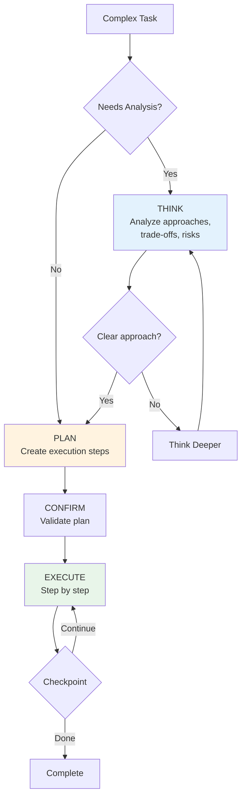

# Module 6.3: Think + Plan Combo

> **Estimated time**: ~30 minutes
>
> **Prerequisite**: Module 6.2 (Plan Mode)
>
> **Outcome**: After this module, you will master the Think→Plan→Execute workflow — knowing exactly when to use Think alone, Plan alone, or the full combo. This is the single most powerful workflow pattern for complex software tasks with Claude Code.

---

## 1. WHY — Why This Matters

You know Think Mode (6.1) and Plan Mode (6.2) separately. But when do you use which — or both? Sometimes you think deeply but plan poorly. Sometimes you plan meticulously but the plan is based on shallow analysis.

The problem: **Think without Plan** = great analysis, chaotic execution. **Plan without Think** = organized steps toward a mediocre solution.

The combo is greater than the sum of its parts. Think first to choose the RIGHT approach, then Plan to execute it the RIGHT way. This is how expert developers work — they don't just think OR plan. They think THEN plan.

---

## 2. CONCEPT — Core Ideas

### The Think→Plan→Execute (TPE) Workflow



1. **THINK**: "Think carefully about the best approach for X. Consider trade-offs, edge cases, alternatives. Don't plan or code yet — just analyze."
2. **PLAN**: "Based on your analysis, create a step-by-step execution plan. List files, dependencies, risks. Don't code yet."
3. **EXECUTE**: "Implement step 1." (with checkpoints)

This is a SUPERSET of PCE from Module 6.2 — adding a Think phase before Planning.

### When to Use Which Mode

| Task Type | Just Code | Plan Only | Think Only | Think + Plan |
|-----------|-----------|-----------|------------|--------------|
| Simple (add field, fix typo) | ✅ | ❌ | ❌ | ❌ |
| Moderate (add endpoint, tests) | ❌ | ✅ | ❌ | ❌ |
| Complex (new feature, refactor) | ❌ | ❌ | ❌ | ✅ |
| Architecture (migration, redesign) | ❌ | ❌ | Analysis only | ✅ Implementation |
| Debugging (root cause) | ❌ | ❌ | ✅ | ❌ |

### The Combo Prompt Pattern

**Phase 1 — THINK:**
```
Think carefully about [problem].
Consider: [specific trade-offs to evaluate]
What are the pros/cons of each approach?
Don't plan or code yet — just analyze.
```

**Phase 2 — PLAN:**
```
Based on your analysis, [chosen approach] is the best fit.
Create a detailed execution plan. List all files, steps, risks.
Don't code yet.
```

**Phase 3 — EXECUTE:**
```
Plan approved. Implement step 1.
```

### What Each Mode Adds

- **Think adds**: deeper analysis, edge case discovery, trade-off reasoning, alternative approaches
- **Plan adds**: execution structure, file mapping, dependency ordering, effort estimation
- **Combo adds**: RIGHT approach executed the RIGHT way

---

## 3. DEMO — Step by Step

**Scenario**: Extract User Service from a monolithic Express API to microservices.

### Step 1: THINK — Deep Analysis First

```bash
$ claude
```

Prompt:
```
Think carefully about extracting the User Service from our monolith.
Consider:
1. Sync vs async communication between services
2. Data ownership — which tables belong to User Service
3. Authentication flow changes
4. Backward compatibility during migration
5. Database strategy — shared DB vs separate DB

Analyze trade-offs for each. Don't plan or code yet.
```

Expected output:
```
## Analysis: User Service Extraction

### 1. Communication Pattern
- Sync (REST/gRPC): Simpler, but creates coupling and single point of failure
- Async (Message Queue): Better resilience, eventual consistency challenges
→ Recommendation: Async for non-critical ops, sync for auth validation

### 2. Data Ownership
- users, user_preferences, user_sessions → User Service
- orders.user_id → stays in Order Service (foreign key reference only)
→ Risk: JOIN queries spanning services need API composition

### 3. Database Strategy
- Shared DB: Easier migration, but defeats microservice isolation
- Separate DB: True isolation, requires data sync strategy
→ Recommendation: Separate DB with event-driven sync
...
```

### Step 2: Evaluate Think Output

Prompt:
```
Good analysis. I agree with separate DB + async events.
One question: what about JOIN queries that currently span user and order tables?
```

Claude thinks deeper, suggests API composition pattern with caching.

### Step 3: PLAN — Based on Think Analysis

Prompt:
```
Based on your analysis: separate DB, async events, API composition.
Create a detailed execution plan for extracting User Service.
List all files, new files, migration steps, risks, checkpoints.
Don't code yet.
```

Expected output:
```
## Execution Plan: User Service Extraction

### Files Affected (23 files)
- src/services/user/ → extract to new service
- src/models/User.ts → move + create shared types
- src/routes/users.ts → convert to API gateway proxy
...

### Execution Steps
1. Create User Service project structure
2. Define shared types package
3. Implement User Service core (auth, profile)
4. Set up message queue (RabbitMQ)
5. Migrate database tables
6. Update monolith to call User Service
7. Implement API composition for cross-service queries
...

### Risks Addressed
- Backward compatibility: API gateway maintains old routes
- Data sync: Event sourcing for audit trail
- JOIN queries: Cached API composition
```

### Step 4: CONFIRM — Validate Against Think Insights

Prompt:
```
Cross-check: does this plan address all risks from Think phase?
Specifically: backward compatibility, data ownership, JOIN query issue.
```

Claude validates completeness.

### Step 5: EXECUTE — Implement with Confidence

Prompt:
```
Plan approved. Implement step 1: Create User Service project structure.
```

Implementation flows smoothly — decisions were made in Think phase.

### Step 6: Compare Results

| Approach | Result |
|----------|--------|
| **Plan Only** | Chose shared DB (shallow analysis) → re-planned at step 8 |
| **Think + Plan** | Chose separate DB with events → executed smoothly |
| **Time saved** | 2 days of re-planning avoided |

---

## 4. PRACTICE — Try It Yourself

### Exercise 1: Mode Selection Challenge

Choose the appropriate mode for each task:

1. Fix a CSS alignment bug → ?
2. Add pagination to an API endpoint → ?
3. Design a caching strategy → ?
4. Migrate from REST to GraphQL → ?
5. Write unit tests for existing function → ?
6. Refactor auth from session to JWT → ?

<details>
<summary>💡 Hint</summary>

Ask yourself:
- How many files involved? (1 = code, 2-5 = plan, 5+ = think+plan)
- Are there architectural decisions? (Yes = need think)
- Is the pattern well-known? (Yes = plan enough)
</details>

<details>
<summary>✅ Solution</summary>

| Task | Mode | Reason |
|------|------|--------|
| CSS fix | Just code | 1 file, clear fix |
| Pagination | Plan only | Known pattern, 2-3 files |
| Caching strategy | Think + Plan | Architectural decision + implementation |
| REST → GraphQL | Think + Plan | Major architecture change |
| Unit tests | Plan only | Known pattern, structured approach |
| Session → JWT | Think + Plan | Security implications, multiple approaches |
</details>

---

### Exercise 2: Quality Comparison

Take ONE complex task and try THREE approaches:
1. Code directly (no think, no plan)
2. Plan only (skip think)
3. Think + Plan combo

Compare results: What did Think add that Plan alone missed?

<details>
<summary>💡 Hint</summary>

Good tasks for this exercise:
- "Add rate limiting to the API"
- "Implement file upload with S3"
- "Add search functionality"

Track: decisions made, issues discovered, rework needed.
</details>

<details>
<summary>✅ Solution</summary>

Example with "Add rate limiting":

**Code directly**: Chose token bucket, hardcoded limits → discovered need for per-user limits later, reworked

**Plan only**: 8-step plan → chose wrong storage (memory instead of Redis) → failed in production with multiple instances

**Think + Plan**: Analyzed storage options, user tiers, distributed systems → chose Redis + sliding window → plan accounted for all edge cases → zero rework

Think caught: distributed system implications, user tier requirements, storage choice
</details>

---

## 5. CHEAT SHEET

### Mode Decision Matrix

| Task Type | Mode | Why |
|-----------|------|-----|
| Simple (1 file) | Just code | Over-processing wastes time |
| Moderate (2-5 files) | Plan only | Structure helps, deep analysis unnecessary |
| Complex (5+ files) | Think + Plan | Need right approach AND right execution |
| Architecture | Think + Plan | Wrong decisions are expensive |
| Debugging | Think only | Analysis matters, no execution plan needed |
| Research | Think only | Reasoning matters, no code |

### TPE Workflow Template

**Phase 1 — THINK:**
```
Think carefully about [problem]. Consider [trade-offs].
Don't plan or code yet.
```

**Phase 2 — PLAN:**
```
Based on analysis, create execution plan.
List files, steps, risks. Don't code yet.
```

**Phase 3 — EXECUTE:**
```
Plan approved. Implement step 1.
```

### /compact Timing Guide

- After THINK → `/compact` → preserve key decisions
- Every 4-5 EXECUTE steps → `/compact` → review progress
- Before asking "are we on track?" → `/compact`

### Quick Self-Check

- "Am I thinking when I should be planning?"
- "Am I planning when I should be thinking?"
- "Did I convert Think insights into Plan steps?"

---

## 6. PITFALLS — Common Mistakes

| ❌ Mistake | ✅ Correct Approach |
|-----------|---------------------|
| Using Think+Plan for simple tasks | Simple (1 file) → just code. Combo is for complex tasks. |
| Thinking and planning in SAME prompt | Separate them. Think FIRST, Plan SECOND. Mixing produces shallow versions of both. |
| Skipping Think for architecture decisions | Architecture needs deep analysis first. Plan without Think = organized march wrong direction. |
| Great analysis but no plan | Think output must feed into Plan. Otherwise analysis sits unused. |
| No `/compact` between Think and Plan | Think fills context. `/compact` to preserve decisions before planning. |
| Re-thinking during Execute | If questioning approach during execution, STOP. Go back to Think. |

---

## 7. REAL CASE — Production Story

**Scenario**: Vietnamese fintech team redesigning payment processing. Support VNPay, Momo, ZaloPay, Stripe. 60+ files, 5 DB tables, 4 external APIs.

**Think Only (first attempt)**:
- Great analysis of provider differences, VND handling, settlement cycles
- No structured execution → chaotic implementation, 3 devs stepping on each other
- **Result**: Abandoned after 4 days

**Plan Only (second attempt)**:
- Organized 15-step plan, clean file assignments
- Shallow analysis → chose Strategy Pattern when Adapter Pattern was better
- **Result**: Discovered mismatch at step 8, had to re-plan. 5 days wasted.

**Think + Plan (third attempt)**:
1. **THINK**: Deep analysis of API contracts, VND decimals, settlement timing → chose Adapter Pattern + Event Sourcing
2. **PLAN**: 18-step plan grounded in analysis, clear file ownership, checkpoints every 4 steps
3. **EXECUTE**: 5 days, zero re-planning

**Result**: Third attempt took 5 days. First two combined took 9 days. Team rule now: "Payment features = always Think+Plan."

---

> **Next**: [Module 7.1: Auto Coding Levels](../../phase-07-multi-agent-auto/01-auto-coding-levels/) →
