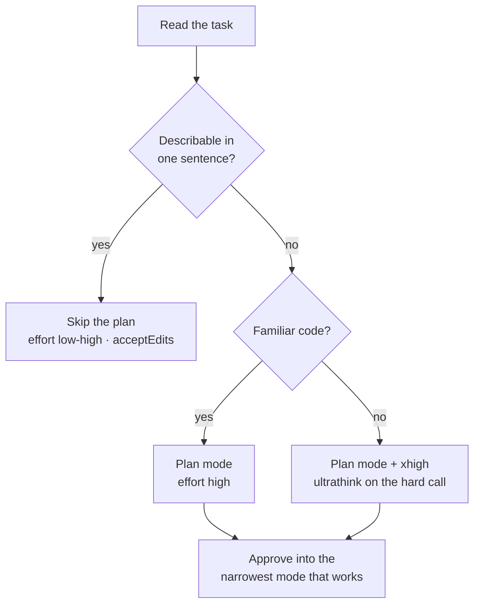

# Module 6.3: Think + Plan Combo

> **Estimated time**: ~30 minutes
>
> **Prerequisite**: Module 6.2 (Plan Mode)
>
> **Outcome**: After this module, you will be able to choose an effort level, a permission
> mode and a plan-or-not decision for a task in one pass, and justify each choice from what
> the feature actually does.

---

## 1. WHY — Why This Matters

Module 6.1 gave you a dial (effort) and Module 6.2 gave you a gate (plan mode). Most people
then pick one setting and use it for everything: always `max`, always plan mode, or never
either. Both habits cost you.

Always planning means a five-minute plan for a typo fix. Never planning means eleven-file
diffs you did not read. The skill is not "use Think + Plan" — it is reading a task in ten
seconds and knowing which of the three dials it deserves.

---

## 2. CONCEPT — Core Ideas

Three independent settings, chosen per task, not per person:

1. **Effort** — how hard Claude reasons. `/effort low|medium|high|xhigh|max`, or `ultrathink`
   for one turn.
2. **Plan or not** — is a written, approved plan worth the turn?
3. **Permission mode** — what you let it do once it starts: `default`, `acceptEdits`, `plan`,
   `auto`, `dontAsk`, `bypassPermissions`.

Anthropic's guidance decides the second one for you: "Planning is most useful when you're
uncertain about the approach, when the change modifies multiple files, or when you're
unfamiliar with the code being modified. If you could describe the diff in one sentence, skip
the plan." (S1)

### The mode-decision matrix

| Task shape | Effort | Plan? | Permission mode |
|---|---|---|---|
| One-sentence diff (typo, log line, rename) | `low`–`high` | No | `acceptEdits` |
| Single-file change, familiar code | `high` | No | `acceptEdits` |
| Multi-file change, familiar code | `high` | Yes | approve into `acceptEdits` |
| Unfamiliar code, any size | `high`–`xhigh` | Yes | approve into **manually approve edits** |
| Architecture or migration | `xhigh`, `ultrathink` on the hard call | Yes, and challenge it | **manually approve edits** |
| Unattended batch or CI | `low`–`medium` | No | `dontAsk` + `--allowedTools` |

The matrix has no "Level 1-3 think ladder" row, because there is no ladder: Claude Code
"passes other phrases such as 'think', 'think hard', and 'think more' through as ordinary
prompt text."


```mermaid
graph TD
    A[Read the task] --> B{Describable in<br/>one sentence?}
    B -->|yes| C[Skip the plan<br/>effort low-high · acceptEdits]
    B -->|no| D{Familiar code?}
    D -->|yes| E[Plan mode<br/>effort high]
    D -->|no| F[Plan mode + xhigh<br/>ultrathink on the hard call]
    E --> G[Approve into the<br/>narrowest mode that works]
    F --> G
```

---

## 3. DEMO — Step by Step

The same lab repo, three tasks, three different answers from the matrix.

**Step 1: A one-sentence diff — skip the plan**

"Add a JSDoc line above `divide()`" is describable in one sentence, so no plan mode and the
narrowest mode that can write: <!-- docs: cli-reference, permission-modes -->

```bash
# docs: cli-reference
claude -p "Add a one-line JSDoc comment above divide() in src/math.js saying it throws \
RangeError on a zero divisor. Nothing else." \
  --permission-mode acceptEdits --allowedTools "Edit"
```

```text
# Output may vary
Added the JSDoc line above `divide()` in `src/math.js:1`.
```

```bash
git diff src/math.js
```

```text
# Output may vary
+/** Divides a by b; throws RangeError when the divisor is zero. */
 export function divide(a, b) {
```

`--permission-mode acceptEdits` and `--allowedTools "Edit"` are both required: a headless run
that writes files must pre-authorize the write, and `Edit` alone is all this task needs.

**Step 2: A change you cannot describe in one sentence — plan it**

```bash
# docs: model-config, permission-modes
claude --model opusplan --permission-mode plan
```

```text
# Output may vary
 ▐▛███▛█   Claude Code v2.1.278
▝▜██████▀  Opus Plan · Claude Max
  ▝▝ ▝▝    ~/cc-lab
────────────────────────────────────────────────────────────────────────────────────
❯
  ⏸ plan mode on (shift+tab to cycle)
```

`Opus Plan` in the banner is `opusplan` at work: Opus does the planning, Sonnet the execution.
You pay Opus prices only for the part where the thinking matters.

**Step 3: Spend effort where the decision is, not everywhere**

Raise the dial for the hard stretch and drop it afterwards, inside the same session:

```text
/effort xhigh
```

```text
# Output may vary
   Effort
                   Faster                                                 Smarter
                   ────────────────────▲──────────────────────┆──────────────────
                   low     medium     high     xhigh      max       ultracode
   ←/→ to adjust · Enter to confirm · s for this session only · Esc to cancel
```

Press `s` to apply it to this session only. For a single hard question instead, keep the
session where it is and put `ultrathink` in that one prompt.

**Step 4: Approve into the narrowest mode that finishes the job**

Approval is the last dial. **Yes, manually approve edits** keeps you in the loop on every
write; **Yes, and use auto mode** hands the rest to the classifier. Choose by how much of the
plan you actually believe — and if you were wrong, `/rewind` restores code, conversation, or
both.

---

## 4. PRACTICE — Try It Yourself

### Exercise 1: Classify five real tasks

**Goal**: Turn the matrix into a reflex.

**Instructions**:
1. List five tasks from your current sprint.
2. For each, write one sentence describing the diff. If you cannot, mark it "plan".
3. Assign an effort level and a permission mode to each.
4. Run the two extremes — your smallest and your largest — and check your call.

**Expected result**: A five-row table, and two runs that either confirm or correct it.

<details>
<summary>💡 Hint</summary>
The one-sentence test is the whole decision for column three. Do not overthink the other two:
`high` and `acceptEdits` are correct far more often than not.
</details>

<details>
<summary>✅ Solution</summary>

Typical outcome: three of five need no plan. That matches (S1) — "If you could describe the
diff in one sentence, skip the plan." The two that do need one are usually the ones touching
code you have not read this quarter, which is the "unfamiliar with the code being modified"
case, not the "big" case.
</details>

### Exercise 2: Cost the combo

**Goal**: Measure what the combo costs against the cheap path on one real task.

**Instructions**:
1. Pick a two- or three-file change.
2. Run A: `claude --permission-mode acceptEdits`, no plan, default effort.
3. `/rewind` back to the start, or `git checkout -- .`.
4. Run B: `claude --model opusplan --permission-mode plan`, `/effort xhigh`, challenge the
   plan once, then approve.
5. Compare wall-clock time and how many corrections each needed afterwards.

**Expected result**: A number you can quote next time someone says planning is overhead.

<details>
<summary>✅ Solution</summary>

Run B usually costs more up front and less overall on multi-file work, because the corrections
after run A each cost a turn and pollute the context. On a one-file change the order flips —
which is exactly why the matrix has rows instead of one answer.
</details>

---

## 5. CHEAT SHEET

| Question | Setting | Values |
|---|---|---|
| How hard should it reason? | `/effort`, `--effort`, `effortLevel` | `low`, `medium`, `high`, `xhigh`, `max`, `ultracode` |
| Just this one turn? | `ultrathink` in the prompt | — |
| Should it plan first? | `Shift+Tab`, `/plan`, `--permission-mode plan` | one-sentence diff → no |
| Who plans, who builds? | `--model opusplan` | Opus plans, Sonnet executes |
| What may it do? | `--permission-mode` | `default`, `acceptEdits`, `plan`, `auto`, `dontAsk`, `bypassPermissions` |
| What may it call? | `--allowedTools` | e.g. `"Edit"`, `"Bash(npm test)"` |
| Undo | `/rewind`, `Esc` twice | conversation, code, or both |

Rules of thumb: default to `high` + `acceptEdits`; add plan mode when the diff needs more than
one sentence; add `xhigh` or `ultrathink` only where a decision forks.

---

## 6. PITFALLS — Common Mistakes

| ❌ Mistake | ✅ Correct Approach |
|---|---|
| Planning every task | "If you could describe the diff in one sentence, skip the plan." (S1) |
| Never planning | Plan when the approach is uncertain, multi-file, or the code is unfamiliar (S1) |
| Running everything at `max` | `max` "may show diminishing returns and is prone to overthinking" |
| `/compact` between thinking and planning | No docs page says thinking or a plan survives or dies at a compact. Use `/clear` between unrelated tasks instead |
| Writing "think first, then plan" in the prompt | Plan mode is the gate; those words are ordinary prompt text |
| Approving into `auto` out of habit | Pick the approve option that matches how much of the plan you believe |
| Headless writes with no permission flag | Every `claude -p` that edits needs `--permission-mode` or `--allowedTools` |

---

## 7. REAL CASE — Production Story

**Scenario**: A Vietnamese fintech team was adding a fourth payment provider (ZaloPay) beside
VNPay, Momo and a card gateway. The provider interface, a DB enum, the reconciliation job and
a webhook route all had to change — plus an `expect`/`actual` pair in the mobile client.

**Problem**: Their house style had become "always plan, always `max`". A two-line enum
addition sat behind a four-minute planning turn, and the reconciliation change — the one part
nobody understood — got the same treatment as the enum, so the plan's risky step was buried
in a list of trivial ones.

**Solution**: They split the work by the matrix instead of the calendar. The enum and the
webhook route went through headless runs with `--permission-mode acceptEdits` and a scoped
`--allowedTools`, no plan. The reconciliation job got `claude --model opusplan
--permission-mode plan` with `/effort xhigh`, one `ultrathink` turn on the settlement-window
question, and a challenge round before approval. They approved that one with **Yes, manually
approve edits**.

**Result**: The trivial parts landed in minutes rather than sitting behind planning turns, and
the risky part got a plan that named the settlement-window assumption out loud. The rule they
kept was the one-sentence test — everything else followed from it. For the automation side of
this, see [Module 7.2: Full Auto
Workflow](../../phase-07-multi-agent-auto/02-full-auto-workflow/); to make a check
non-optional, see [Module 11.3: Hooks
System](../../phase-11-automation-headless/03-hooks-system/).

---

> **Next**: [Module 7.1: Auto Coding Levels](../../phase-07-multi-agent-auto/01-auto-coding-levels/) →
