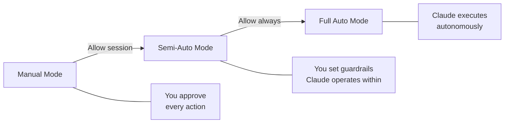

# Module 7.1: Auto Coding Levels

> **Estimated time**: ~30 minutes
>
> **Prerequisite**: Phase 6 (Thinking & Planning), Module 2.2 (Permission System)
>
> **Outcome**: After this module, you will understand the automation spectrum in Claude Code, know how to configure each level, and make informed decisions about when to increase or decrease automation based on task risk.

---

## 1. WHY — Why This Matters

You've been using Claude Code in "approve everything" mode, and one day it deletes your config file while "cleaning up unused files." Or the opposite: you're clicking "approve" 50 times just to add console.log statements to ten functions. Both scenarios waste time and cause frustration.

The real problem isn't Claude Code — it's treating automation as binary (on/off) instead of a spectrum. Some tasks need tight human oversight. Others benefit from letting Claude run freely within guardrails. Knowing which level to use when is a core skill that separates effective Claude Code users from frustrated ones.

---

## 2. CONCEPT — Core Ideas

### The Automation Spectrum

Claude Code operates on a spectrum from full manual control to complete autonomy. Understanding this spectrum helps you match the right automation level to each task's risk profile.



### Level 1: Manual Mode (Default)

This is Claude Code's default behavior. Every file write, command execution, and potentially destructive operation triggers a permission prompt. You review and approve each action individually.

**Best for:**
- Unfamiliar codebases where you're still learning the structure
- High-risk changes (authentication, payments, database schema)
- Learning how Claude Code behaves on your specific project

**Tradeoff:** Maximum safety but slowest execution.

### Level 2: Semi-Auto Mode

The middle ground. When Claude requests permission, choose "Allow for session" instead of "Allow once." This grants blanket approval for similar actions during the current session.

**Best for:**
- Familiar tasks you've done before
- Repetitive operations (formatting 50 files, adding tests)
- Daily development work in codebases you know well

**Tradeoff:** Faster execution with reasonable safety. You set boundaries once, Claude operates within them.

### Level 3: Full Auto Mode

Claude executes your prompt completely autonomously without stopping for approvals. This requires explicit opt-in through command-line flags or configuration.

**Best for:**
- Well-planned tasks with clear requirements (use Think+Plan from Module 6.3 first)
- Sandboxed environments or branches you can easily discard
- CI/CD pipelines where human approval breaks automation

**Tradeoff:** Maximum speed but highest risk. Requires strong planning and trust.

⚠️ **Critical Rule:** Full Auto should ALWAYS be combined with good upfront planning. Never use it for exploratory or ambiguous tasks.

### Risk Assessment Matrix

| Task Risk | Codebase Familiarity | Recommended Level |
|-----------|---------------------|-------------------|
| Low (formatting, tests) | High | Semi-Auto or Full Auto |
| Low (formatting, tests) | Low | Semi-Auto |
| High (DB, auth, payments) | High | Manual or Semi-Auto |
| High (DB, auth, payments) | Low | **Always Manual** |

### Connection to Permission System

These automation levels build on the permission system from Module 2.2: permissions define what Claude can access, automation levels define approval frequency.

### Comparing Automation Approaches

How do Claude Code's automation levels compare across different workflows?

| Approach | Control Level | Speed | Context Quality | Best Scenario |
|----------|--------------|-------|-----------------|---------------|
| **Manual Mode** | Maximum | Slow | Perfect — you verify each step | Learning, high-risk code, security-critical |
| **Semi-Auto Mode** | Balanced | Fast | Good — session-scoped trust | Daily development, feature work |
| **Full Auto Mode** | Minimal | Fastest | Depends on CLAUDE.md quality | CI/CD, sandboxed environments |
| **Multi-Agent** (Phase 7.3) | Per-agent | Parallel | Fresh per agent | Complex multi-file tasks |
| **Headless/SDK** (Phase 11) | Programmatic | Automated | Script-defined | Production pipelines, batch ops |

**Key insight**: These are not competing approaches — they **combine**. A typical advanced workflow might use Semi-Auto for interactive development, spawn Full Auto agents for well-defined subtasks, and orchestrate via SDK in CI/CD. The skill is matching the right automation level to each part of your workflow.

---

## 3. DEMO — Step by Step

**Task:** Refactor `src/utils/helpers.ts` — extract three functions (`validateEmail`, `formatDate`, `parseConfig`) into separate files.

### Demo 1: Manual Mode

**Step 1: Start Claude Code**
```bash
$ claude
```

**Step 2: Give the prompt**
```
Refactor src/utils/helpers.ts:
- Extract validateEmail, formatDate, parseConfig to separate files
- Update imports in helpers.ts
```

**Step 3: First approval prompt**
```
Claude wants to:
  - Write src/utils/validateEmail.ts

Options:
  [y] Allow once
  [a] Allow for session
  [n] Deny

Your choice:
```

You press `y`. Claude creates the file. This repeats for each file.

**Total prompts:** 6-8
**Total time:** ~5 minutes
**Result:** Complete control, but slow for low-risk task.

### Demo 2: Semi-Auto Mode

Same task, different approach.

**Step 3: First approval prompt**
When you see the first prompt, press `a` for "Allow for session."

**Step 4: Watch it execute**
Claude proceeds with remaining file writes without additional prompts.

**Total prompts:** 1-2
**Total time:** ~2 minutes
**Result:** Balanced — guardrails set once, Claude works within them.

### Demo 3: Full Auto Mode ⚠️

```bash
$ claude --dangerously-skip-permissions  # ⚠️ Needs verification
```

Claude executes the entire refactoring without stopping.

**Total prompts:** 0
**Total time:** ~1 minute
**Result:** Fast, but requires trust + planning beforehand.

---

## 4. PRACTICE — Try It Yourself

### Exercise 1: Level Calibration

**Goal:** Experience the difference between Manual and Semi-Auto on a low-risk task.

**Instructions:**
1. Create a test file with 5 simple functions
2. **Round 1 - Manual Mode:** Prompt Claude to add console.log to each function. Count approval prompts.
3. **Round 2 - Semi-Auto Mode:** Revert changes, repeat with "Allow for session" on first prompt.
4. Compare: which felt appropriate for this low-risk task?

<details>
<summary>💡 Hint</summary>

The point is noticing how the flow differs. Manual gives maximum visibility; Semi-Auto gives speed with initial oversight.
</details>

<details>
<summary>✅ Solution</summary>

**Manual mode:** ~5 prompts (one per function edit). Safe but tedious.

**Semi-Auto mode:** ~1 prompt. Much faster for low-risk, repetitive tasks.

**Conclusion:** For low-risk tasks like adding logging, Semi-Auto is the right tool.
</details>

---

### Exercise 2: Risk Assessment Practice

**Goal:** Train your intuition for matching tasks to automation levels.

For each task, decide: Manual, Semi-Auto, or Full Auto?

1. Run Prettier on entire codebase (150 files)
2. Modify database migration file
3. Add new API endpoint (following existing pattern)
4. Update authentication logic
5. Generate unit tests for pure utility functions

<details>
<summary>💡 Hint</summary>

Consider: Is it reversible? What's the blast radius? How well-defined is the task?
</details>

<details>
<summary>✅ Solution</summary>

| Task | Level | Reason |
|------|-------|--------|
| Prettier on 150 files | Semi-Auto or Full Auto | Low risk, reversible, high volume |
| Database migration | **Manual** | High risk, mistakes are costly |
| Add API endpoint | Semi-Auto | Medium risk, follows pattern |
| Auth logic | Manual | High risk, security implications |
| Generate unit tests | Semi-Auto or Full Auto | Low risk, tests don't change production code |
</details>

---

## 5. CHEAT SHEET

### Quick Decision Guide

| Question | If YES → | If NO → |
|----------|----------|---------|
| Is this reversible with `git checkout`? | Semi-Auto OK | Manual |
| Do I understand exactly what Claude will do? | Increase automation | Manual |
| Is this sandboxed/disposable branch? | Full Auto OK | Be cautious |
| Am I learning this codebase? | Manual | Semi-Auto OK |
| Does this touch auth/payments/DB schema? | Manual | — |

### Permission Prompt Shortcuts ⚠️

| Key | Action |
|-----|--------|
| `y` | Allow once |
| `a` | Allow for session |
| `n` | Deny |

⚠️ *Key bindings need verification in current Claude Code version.*

### Level Selection Quick Reference

| Scenario | Level |
|----------|-------|
| First time on this project | Manual |
| Adding tests to 20 functions | Semi-Auto |
| Refactoring database layer | Manual |
| Formatting before commit | Semi-Auto |
| CI/CD documentation | Full Auto |

---

## 6. PITFALLS — Common Mistakes

| ❌ Mistake | ✅ Correct Approach |
|---|---|
| Full Auto on unfamiliar codebase | Start Manual, graduate to Semi-Auto as you learn |
| Manual mode for 100-file refactor | Semi-Auto with "Allow for session" — review final diff instead |
| "Allow always" for everything | Be selective. Safe for reads/tests, not for writes to critical paths |
| Full Auto without planning first | Use Think+Plan (Module 6.3) first, THEN consider Full Auto |
| Same automation level for all tasks | Match level to risk. Format code = Semi-Auto. Auth changes = Manual |
| Full Auto in production environments | Full Auto belongs in sandboxes and CI/CD, not production changes |

---

## 7. REAL CASE — Production Story

**Scenario:** Vietnamese team onboarding to microservices codebase (15 services, shared libraries, internal RPC).

**Week 1 - Manual Mode:** Every action required approval. Slow, but caught misunderstandings and built trust.

**Week 2 - Semi-Auto Mode:** "Allow for session" for repetitive tasks. Velocity increased 3x.

**Week 3 - Full Auto in CI/CD:** Auto-generate API docs on every merge in sandboxed containers.

**The Mistake:** Developer used Full Auto on database migration with vague prompt: "Add user preferences table." Claude made wrong assumptions about column types. Migration failed in staging.

**The Fix:** Reverted to Manual, wrote detailed plan using Think mode, then re-ran with Semi-Auto. Succeeded.

**Lesson:** Team rule: Manual for unfamiliar + high-risk, Semi-Auto for familiar + medium-risk, Full Auto only for planned + sandboxed.

**Result:** After 2 months, velocity increased 40% with zero production incidents from automation mismatches.

---

> **Next**: [Module 7.2: Full Auto Workflow](../02-full-auto-workflow/) →
