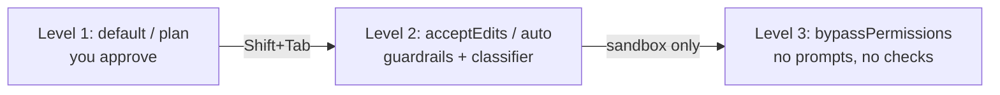

# Module 7.1: Auto Coding Levels

> **Estimated time**: ~30 minutes
>
> **Prerequisite**: Phase 6 (Thinking & Planning),
> [Module 2.2 (Permission System)](../../phase-02-security/02-permission-system/)
>
> **Outcome**: After this module, you will be able to pick a **permission mode** per task using
> the Risk × Familiarity matrix, switch it with `Shift+Tab` / `--permission-mode` /
> `permissions.defaultMode`, and explain why `auto` mode is not `bypassPermissions`.

---

## 1. WHY — Why This Matters

You press "Yes" 40 times to add logging to ten functions. Next day you switch everything off and
Claude "cleans up" a config file you needed. Same mistake twice: treating automation as a switch.

Claude Code ships that spectrum as **permission modes**. The three "levels" here are labels; the
modes are the mechanism, enforced by Claude Code, not by the model.

---

## 2. CONCEPT — Core Ideas

### The modes the docs list

The permissions page lists **six modes plus one alias**. This course groups them into three levels:

| Level | Mode | What runs without asking | Best for |
|---|---|---|---|
| **1 — Manual** | `default` (alias `manual`) | Reads only | Reviewing every action, sensitive work |
| 1 | `plan` | Reads, plus classifier-approved commands when auto mode is available; no source edits until you approve a plan | Exploring before changing anything |
| **2 — Semi-Auto** | `acceptEdits` | Reads, file edits, and `mkdir`/`touch`/`rm`/`rmdir`/`mv`/`cp`/`sed` inside the working dir | Iterating on code you'll review in `git diff` |
| 2 | `auto` | Everything, with a **classifier** reviewing each action | Long tasks, prompt fatigue |
| 2 (CI) | `dontAsk` | Reads + pre-approved tools; anything that would prompt is **denied** | Locked-down scripts |
| **3 — Full Auto** | `bypassPermissions` | Everything | Isolated containers/VMs **only** |

Read the `acceptEdits` row twice: `rm` and `rmdir` are in that set. Auto-approval is scoped to
your working directory and `additionalDirectories` — but inside that scope, a delete runs
without asking.


```mermaid
graph LR
    L1["Level 1: default / plan<br/>you approve"] -->|Shift+Tab| L2["Level 2: acceptEdits / auto<br/>guardrails + classifier"]
    L2 -->|sandbox only| L3["Level 3: bypassPermissions<br/>no prompts, no checks"]
```

### How to set the mode

- **During a session**: `Shift+Tab` cycles `default` → `acceptEdits` → `plan` → (`auto` if
  available) → back. `bypassPermissions` only joins the cycle if you started with it enabled;
  `dontAsk` never does.
- **One session**: `claude --permission-mode plan` (also works with `-p`).
- **Every session in a project**: `permissions.defaultMode` in `.claude/settings.json`. Terminal
  sessions honor every value there **except** `auto` and `bypassPermissions`, which apply only
  from user or managed settings.
- **Org-wide off switch**: `permissions.disableBypassPermissionsMode` / `disableAutoMode` =
  `"disable"` in managed settings.

### What auto mode is — and isn't

`auto` is the built-in starting mode on Pro/Max/Team. A second model, the classifier, reviews
each action and blocks anything that "escalates beyond your request, targets unrecognized
infrastructure, or appears driven by hostile content Claude read". Anthropic reports **84% fewer
prompts** in internal use with this two-layer classifier design (S13, "How we built Claude Code
auto mode", 2026-03-25). The docs are blunt: *"Auto mode reduces permission prompts but does not
guarantee safety."* Level 2 with a reviewer, not Level 3. If the classifier blocks 3 actions in a
row (or 20 total), auto mode pauses and you're prompted again.

### Risk × Familiarity matrix (keep this)

| Task risk | Familiarity | Mode |
|---|---|---|
| Low (formatting, tests) | High | `acceptEdits` or `auto` |
| Low | Low | `plan` first, then `acceptEdits` |
| High (DB, auth, payments) | High | `default` + `permissions.deny` on hot paths |
| High | Low | **`default` — always** |

Modes set the baseline. `permissions.allow/deny/ask` rules layer on top, and **deny rules block
in every mode, including `bypassPermissions`** (Module 2.2). CLAUDE.md is advisory.

> `(S13)`: `docs/references/anthropic-sources.md`.

---

## 3. DEMO — Step by Step

Run in `~/cc-lab` (`src/math.js`, `tests/math.test.mjs`, `npm test`). This machine's user
settings start sessions in `auto`, so each command pins a mode.

**Step 1: Read the mode indicator, then cycle it**

```bash
# docs: permission-modes#switch-permission-modes
claude --permission-mode default
```

Status bar on start, then after each `Shift+Tab`:

```text
# Output may vary
  ⏸ manual mode on
  ⏵⏵ accept edits on (shift+tab to cycle)
  ⏸ plan mode on (shift+tab to cycle)
  ⏵⏵ auto mode on (shift+tab to cycle)
```

Why: that label is the only place the mode is shown — read it before risky work.

**Step 2: Level 1 headless — plan mode proposes, never edits**

```bash
# docs: permission-modes#analyze-before-you-edit-with-plan-mode
claude --permission-mode plan -p "Propose how to add a subtract function to src/math.js with a test. Do not edit any file."
git status --short
```

```text
# Output may vary
Here's the proposal (no files touched; the plan is saved at `~/.claude/plans/propose-how-to-add-keen-dahl.md`).
…
- `src/math.js:1-2` exports `add` and `divide` as one-liners.
…
Run `npm test` — expect 2 passing tests (`add`, `subtract`), 0 failing.
```

`git status` prints nothing: plan mode read the repo and wrote only the plan.

**Step 3: Level 1 interactive — the real permission prompt**

```bash
# docs: permissions#permission-system
claude --permission-mode default
```

Prompt: `Create a file hello.txt containing hi`

```text
# Output may vary
⏺ Write(hello.txt)
 Create file
 hello.txt
  1 hi
 Do you want to create hello.txt?
 ❯ 1. Yes
   2. Yes, and switch to accept edits (auto-approve file edits and common file commands) for this session
      (shift+tab)
   3. No
 Esc to cancel · Tab to amend
```

Option 2 *is* the jump to Level 2. A Bash prompt offers a different second option,
`Yes, and don't ask again for: npm test *`, saved to `.claude/settings.local.json` as
`Bash(npm test *)`. Press `Esc` and Claude reports `User rejected write to hello.txt`.

**Step 4: Headless has no prompt — so the mode decides**

```bash
# docs: headless#auto-approve-tools
claude -p "Create a file hello.txt containing hi" --permission-mode default
ls hello.txt
```

```text
# Output may vary
The write to `hello.txt` was blocked pending your permission. Please approve the write request and I'll create the file, or let me know if you'd prefer a different approach.
ls: hello.txt: No such file or directory
```

`--permission-mode default` forces the stock behavior; on a fresh install you get the same
result without it unless `settings.json` sets `permissions.defaultMode`. Level 2:

```bash
claude -p "Create a file hello.txt containing hi" --permission-mode acceptEdits
cat hello.txt
```

```text
# Output may vary
Created `/Users/luatnq/cc-lab/hello.txt` containing `hi`.
hi
```

**Step 5: Make Level 2 the project default**

```bash
# docs: permission-modes#start-in-a-different-mode
mkdir -p .claude && cat > .claude/settings.json << 'EOF'
{
  "permissions": {
    "defaultMode": "acceptEdits"
  }
}
EOF
claude
```

```text
# Output may vary
  ⏵⏵ accept edits on (shift+tab to cycle)
```

Project settings outrank the user file, so the session starts at Level 2 with no flag.

**Step 6: Level 3 — real flag, sandbox only**

```bash
# docs: cli-reference — equivalent to --permission-mode bypassPermissions
claude --dangerously-skip-permissions
```

The flag is real; don't run it on your host. Use it only inside a sandbox or container (Module
2.3). It refuses to start as root and deny rules still apply — but every prompt and the
classifier are gone.

Clean up: `rm hello.txt .claude/settings.json`.

---

## 4. PRACTICE — Try It Yourself

### Exercise 1: Count the prompts

**Goal**: Feel the difference between Level 1 and Level 2 on a low-risk task.
**Instructions**:
1. `claude --permission-mode default`, prompt: "Add a one-line JSDoc comment above each function
   in src/math.js". Count the prompts.
2. `git checkout -- src`, repeat with `--permission-mode acceptEdits`. Which matched the risk?

**Expected result**: one prompt per edit in `default`; zero in `acceptEdits`.

<details>
<summary>💡 Hint</summary>
Watch the status bar; in `acceptEdits` you review the result with `git diff`, not inline.
</details>

<details>
<summary>✅ Solution</summary>
`default` prompts once per `Edit`. `acceptEdits` auto-approves edits inside the working
directory, so the run is silent; `git diff src/math.js` is your review step.
</details>

### Exercise 2: Pick the mode

**Goal**: Train the matrix. For each task, pick a mode and one rule.
1. Prettier on 150 files. 2. Edit a DB migration. 3. New endpoint following an existing pattern.
4. Change auth logic. 5. Generate tests for pure functions.

<details>
<summary>✅ Solution</summary>

| Task | Mode | Extra guardrail |
|---|---|---|
| Prettier | `acceptEdits` | `git diff --stat` after |
| Migration | `default` | `"deny": ["Edit(./migrations/**)"]` until reviewed |
| Endpoint | `acceptEdits` | `plan` first if the pattern is unclear |
| Auth | `default` | `"deny": ["Read(./.env)"]` |
| Tests | `auto` | Stop hook running `npm test` (Module 11.3) |
</details>

---

## 5. CHEAT SHEET

| Command / Feature | Description | Example |
|---|---|---|
| `Shift+Tab` | Cycle mode in-session | `default` → `acceptEdits` → `plan` → `auto` |
| `--permission-mode <mode>` | Start in a mode; works with `-p` | `claude --permission-mode plan` |
| `permissions.defaultMode` | Default per machine/project/org | `{"permissions": {"defaultMode": "acceptEdits"}}` |
| `/permissions` | View/edit allow, ask, deny rules | rules evaluate deny → ask → allow |
| `/plan` | Plan mode for one prompt | `/plan refactor the parser` |
| `--dangerously-skip-permissions` | = `--permission-mode bypassPermissions` | sandbox/container only |
| `disableBypassPermissionsMode` | Managed off switch | `"disable"` |
| Prompt keys | `1`/`Enter` Yes · `2` session/rule · `Esc` cancel · `Tab` add a comment | — |

---

## 6. PITFALLS — Common Mistakes

| ❌ Mistake | ✅ Correct Approach |
|---|---|
| Teaching or expecting a `[y]/[a]/[n]` prompt | It doesn't exist. Prompts are numbered options; `Esc` cancels, `Tab` adds a note |
| `bypassPermissions` on your laptop | Only inside a sandbox/container; deny rules still hold, nothing else does |
| Treating `auto` as "totally safe" | It reduces prompts; it is not a substitute for review on sensitive changes |
| `defaultMode: "auto"` in `.claude/settings.json` | Ignored there — put it in `~/.claude/settings.json` or managed settings |
| Boundaries stated only in the prompt | The classifier reads them but compaction can drop them; add a `permissions.deny` rule |
| Same mode for every task | Use the matrix: familiarity and blast radius, not habit |

---

## 7. REAL CASE — Production Story

**Scenario**: A Vietnamese team onboarding onto a 15-service backend with shared libraries.

**Problem**: Week 1 in `default` was slow but caught misunderstandings. By week 2 repetitive work
ran in `acceptEdits` and CI docs ran headless with `--permission-mode acceptEdits` in a
container. Then a developer ran a schema change in `auto` with a vague prompt: "Add user
preferences table". Claude guessed the column types; the migration failed in staging.

**Solution**: The team rule became the matrix. Unfamiliar + high-risk → `default`, with
`"deny": ["Edit(./migrations/**)"]` until a human reviews. Familiar + low-risk → `acceptEdits`.
`bypassPermissions` only in the CI container. The migration was redone in `plan` mode, then
executed with `acceptEdits`.

**Result**: No further staging incidents from automation mismatches in the following two months.

---

> **Next**: [Module 7.2: Full Auto Workflow](../02-full-auto-workflow/) →
