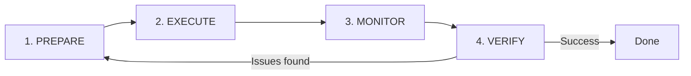

# Module 7.2: Full Auto Workflow

> **Estimated time**: ~35 minutes
>
> **Prerequisite**: Module 7.1 (Auto Coding Levels), Module 6.3 (Think+Plan Combo)
>
> **Outcome**: After this module, you will have a complete workflow for using Full Auto mode safely — from pre-flight checks through post-execution verification. You'll know exactly when Full Auto is appropriate and how to set guardrails.

---

## 1. WHY — Why This Matters

You're either avoiding Full Auto (missing massive productivity gains) or using it recklessly (causing hours of damage). There's no middle ground because no one taught you the actual workflow.

Full Auto isn't a button — it's a protocol with specific steps. Like a pilot's pre-flight checklist, skipping steps leads to crashes. This module gives you that checklist.

---

## 2. CONCEPT — Core Ideas

Full Auto mode gives AI maximum autonomy — decisions, edits, commands without permission at every step. But autonomy without process is chaos.

**The Full Auto Workflow** has four mandatory phases:



### Phase 1: PREPARE (Critical — Never Skip)

Most failures happen here. Always:
- **Think+Plan First**: Complete Module 6.3 workflow. You need an approved plan defining scope and success criteria.
- **Create Safety Net**: Create a git branch. Full Auto without backup is reckless.
- **Define Boundaries**: Specify exactly which files/directories Claude can touch.

### Phase 2: EXECUTE

Start with the right prompt structure:
- Reference the Think+Plan output explicitly
- Specify stop conditions (when to ask for help)
- Include progress checkpoints for large tasks

### Phase 3: MONITOR

Full Auto doesn't mean unattended. Watch for unexpected file access, error messages, and scope creep. Keep Ctrl+C ready.

### Phase 4: VERIFY

After completion:
- Review all changes (`git diff`)
- Run tests
- Verify plan goals achieved

### Full Auto Eligibility Checklist

Not every task qualifies for Full Auto. Use this checklist:

- ✅ Task is well-defined with clear scope
- ✅ Think+Plan has been completed and approved
- ✅ Changes are reversible (git backup exists)
- ✅ You can actively monitor for at least the first 5-10 minutes
- ✅ Failure won't cause permanent damage (production databases, deployed systems are off-limits)

If ANY checkbox is unchecked → use Semi-Auto or Manual mode instead.

---

## 3. DEMO — Step by Step

**Scenario**: You have `src/services/` with 15 service files (~50 functions total) that lack unit tests. You want to generate comprehensive Jest tests.

**Step 1: PREPARE — Create Safety and Plan**

```bash
$ git checkout -b auto/generate-service-tests
$ git status
```

Expected output:
```
On branch auto/generate-service-tests
nothing to commit, working tree clean
```

Now start Claude and run Think+Plan first:

```bash
$ claude
```

```
Think carefully about generating unit tests for all services in src/services/.
Consider: test framework (Jest), mocking strategy for dependencies,
edge cases, error conditions.
Create a detailed execution plan. Don't write any code yet.
```

Claude outputs a plan covering test structure, mocking approach, coverage goals, and file organization. Review it, then compact:

```
/compact
```

**Step 2: EXECUTE — Start Full Auto with Guardrails**

Now activate Full Auto mode. ⚠️ Needs verification on exact flag syntax:

```
Execute the test generation plan you created.

Boundaries:
- Only create new files in src/services/__tests__/
- Do NOT modify any existing service files
- Do NOT touch package.json or jest.config.js

Stop conditions:
- Stop if you encounter a function that requires manual business logic knowledge
- Stop if more than 3 tests fail in a row (suggests wrong approach)

Checkpoints:
- After every 5 service files, summarize: files completed, tests created, any issues
```

**Step 3: MONITOR — Watch Progress**

Terminal shows checkpoint progress. Watch for files created outside `__tests__/`, repeated errors, or service file modifications. Keep Ctrl+C ready.

**Step 4: VERIFY — Check Everything**

```bash
$ git diff --stat
# Shows 15 new test files, 847 insertions

$ git diff src/services/*.ts
# No output = service files untouched

$ npm test
# All 15 test suites pass, 47 tests total
```

**Result**: 50 functions tested in 15 minutes vs. 2-3 hours manually. Zero rollbacks needed.

---

## 4. PRACTICE — Try It Yourself

### Exercise 1: Build Your Pre-Flight Checklist

**Goal**: Create a personalized pre-flight checklist for Full Auto.

**Instructions**:
1. Pick a suitable task (e.g., add JSDoc, convert callbacks to async/await).
2. Define: backup strategy, boundaries, stop conditions, verification plan.
3. Execute Full Auto workflow.
4. Post-mortem: What to add next time?

**Expected result**: Reusable checklist document.

<details>
<summary>💡 Hint</summary>
Start with the eligibility checklist from CONCEPT section, add project-specific items (e.g., database backup).
</details>

<details>
<summary>✅ Solution</summary>

Pre-flight checklist sections: Safety (git branch, backups), Planning (Think+Plan complete, criteria defined), Boundaries (allowed/forbidden paths), Execution (stop conditions, checkpoints, monitoring time), Verification (test/review/rollback commands ready).
</details>

### Exercise 2: Boundary Testing

**Goal**: Write precise boundaries and verify compliance.

**Instructions**:
1. Choose refactoring task (e.g., "Update src/utils/ to TypeScript strict mode").
2. Define allowed/forbidden files explicitly.
3. Write Full Auto prompt with boundaries.
4. Verify: `git diff [forbidden-path]` shows no output.
5. If violated, rewrite boundaries more clearly.

**Expected result**: Understanding enforceable boundaries.

<details>
<summary>💡 Hint</summary>
Use both negative ("do NOT touch") and positive ("only modify") boundaries. Explicit exclusions work better.
</details>

<details>
<summary>✅ Solution</summary>

Specify ALLOWED (modify .ts in src/utils/ root only) and FORBIDDEN (legacy/, index.ts). Verify with `git diff [forbidden-path]` (no output = good). If forbidden files show up, rewrite boundaries more explicitly.
</details>

---

## 5. CHEAT SHEET

### Pre-Flight Checklist

Before starting Full Auto, check ALL items:

- [ ] **Git branch created** (`git checkout -b auto/task-name`)
- [ ] **Think+Plan completed** (Module 6.3)
- [ ] **Boundaries defined** (allowed files/dirs + forbidden files/dirs)
- [ ] **Stop conditions specified** (when Claude should ask instead of guess)
- [ ] **Verification ready** (test command, review command prepared)
- [ ] **I will monitor** (not walking away for next 10+ minutes)

### Full Auto Prompt Template

```
Execute [reference to plan].

Boundaries:
- ALLOWED: Only touch [specific files/directories]
- FORBIDDEN: Do NOT modify [specific files/directories]

Stop conditions:
- Stop if [condition requiring human judgment]
- Stop if [error threshold exceeded]

Checkpoints:
- Report progress after every [N steps/files]
```

### Emergency Stop

**Ctrl+C** — stops execution immediately

### Post-Execution Verification

- [ ] **Review changes**: `git diff` (all changes), `git diff --stat` (summary)
- [ ] **Run tests**: `npm test` / `pytest` / `cargo test`
- [ ] **Verify boundaries**: `git diff [forbidden-path]` should be empty
- [ ] **Check plan**: Did Claude accomplish the plan's goals?

---

## 6. PITFALLS — Common Mistakes

| ❌ Mistake | ✅ Correct Approach |
|---|---|
| **Starting without Think+Plan** | Always complete Think+Plan first. Full Auto executes plans, doesn't create them well. |
| **Walking away** — "I'll check in an hour" | Monitor actively for 5-10 minutes. Catch scope creep early. |
| **No git backup** — on uncommitted changes or main | ALWAYS create feature branch first. Full Auto without git is reckless. |
| **Vague boundaries** — "work on backend stuff" | Specify exact paths: "Only modify src/api/routes/, NOT src/api/middleware/". |
| **No stop conditions** — letting Claude guess | Define explicit stops: "Stop if unsure about business logic." Prevents hallucination. |
| **Skipping verification** — trusting output blindly | NEVER skip `git diff` and tests. Always verify. |
| **Full Auto on main branch** | Feature branches only. Never main/master. |

---

## 7. REAL CASE — Production Story

**Scenario**: Vietnamese startup needed TypeScript migration for 200+ files, 2-week deadline.

**Attempt 1 (Wrong)**: Junior dev ran Full Auto without Think+Plan or boundaries: "Convert entire codebase to TypeScript."
**Result**: Broke 50+ imports, crashed mobile app. 4 hours wasted, then `git reset --hard`.

**Attempt 2 (Right)**: Senior dev used proper workflow:
- **PREPARE**: Created branch, planned 6 batches (utils → services → routes → components → pages → config)
- **EXECUTE**: Batch 1 only touched `src/utils/`, explicit boundaries set
- **MONITOR**: Caught Claude violating boundary (tried fixing import in `src/services/`), stopped (Ctrl+C), clarified, restarted
- **VERIFY**: `git diff`, type-check, tests all passed

Repeated for 6 batches over one week.

**Result**: 200 files migrated in 6 hours active time. Zero rollbacks. Zero production issues. Test coverage improved.

**Quote**: "Full Auto saved us a week, but only because we followed the workflow. The first attempt taught us Full Auto without discipline is automated chaos."

---

> **Next**: [Module 7.3: Multi-Agent Architecture](../03-multi-agent-architecture/) →
