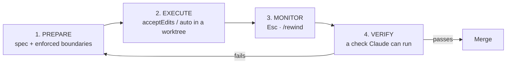

# Module 7.2: Full Auto Workflow

> **Estimated time**: ~35 minutes
>
> **Prerequisite**: Module 7.1 (Auto Coding Levels), Module 6.3 (Think+Plan Combo)
>
> **Outcome**: After this module, you will run a hands-off task through
> **PREPARE → EXECUTE → MONITOR → VERIFY** with boundaries Claude Code *enforces*
> (`permissions.deny`, hooks, `--worktree`, `--max-turns`), and recover with `Esc` and `/rewind`.

---

## 1. WHY — Why This Matters

The old way to keep Claude out of `src/legacy/` was a sentence in the prompt: "please don't touch
X". That is a request, not a boundary. The docs say it plainly: *"Instructions in your prompt or
`CLAUDE.md` shape what Claude tries to do, but they don't change what Claude Code allows."*

Full auto is a protocol, not a flag. The four phases below are the same as before; what changed
is that every boundary now has a mechanism behind it.

---

## 2. CONCEPT — Core Ideas


```mermaid
graph LR
    A["1. PREPARE<br/>spec + enforced boundaries"] --> B["2. EXECUTE<br/>acceptEdits / auto in a worktree"]
    B --> C["3. MONITOR<br/>Esc · /rewind"]
    C --> D["4. VERIFY<br/>a check Claude can run"]
    D -->|fails| A
    D -->|passes| E[Merge]
```

### PREPARE — the spec and the fences

Anthropic's advice for larger features: *"have Claude interview you first"* using the
`AskUserQuestion` tool, write the result to `SPEC.md`, then *"start a fresh session to execute
it"*. *"Time spent making the spec precise pays off more than time spent watching the
implementation."* (S1)

Then fence the run with things Claude Code enforces:

| Boundary | Mechanism | Enforced by |
|---|---|---|
| Paths Claude may not edit | `"permissions": {"deny": ["Edit(./src/legacy/**)"]}` | Claude Code, every mode incl. `bypassPermissions` |
| Commands with custom logic | `PreToolUse` hook, exit 2 ([Module 11.3](../../phase-11-automation-headless/03-hooks-system/)) | Runs before the permission check |
| Your working tree | `claude --worktree <name>` → `.claude/worktrees/<name>` | Separate checkout, own branch |
| Runaway loops (headless) | `--max-turns N` — "Exits with an error when the limit is reached" | Print mode only |
| Spend (headless) | `--max-budget-usd` | Print mode only |

A `Bash(git push *)` deny stops `git push origin main` but not `git -C . push` — for
command-text-independent enforcement use the sandbox (Module 2.3).

### EXECUTE

`acceptEdits` for edits you'll review in `git diff`; `auto` when the run is long and the
classifier's prompt-reduction is worth it. Never `bypassPermissions` outside a container.

### MONITOR

- **`Esc`** interrupts the current turn; the session and context stay. (`Ctrl+C` twice *exits*.)
- **`/rewind`**, or `Esc` `Esc` on an empty input, opens the checkpoint menu: restore code,
  conversation, or both, per prompt you sent. Checkpoints hold the last 100 turns.
- Limitation (S15): *"Checkpointing does not track files modified by Bash commands"* (`rm`, `mv`,
  `cp`), and edits made by subagents aren't restored — use git for those.

### VERIFY

*"Give Claude a check it can run: tests, a build, a screenshot to compare."* (S1) Then confirm the
fence held: `git diff --stat -- <forbidden path>` must print nothing.

> `(S1)`, `(S15)`: `docs/references/anthropic-sources.md`.

---

## 3. DEMO — Step by Step

Run in `~/cc-lab`. Task: add `subtract` to `src/math.js` with a test, without touching
`src/legacy/`.

**Step 1: PREPARE — spec first (interactive)**

```text
I want to add a subtract function to src/math.js. Interview me in detail using the
AskUserQuestion tool. Keep interviewing until we've covered everything, then write a complete
spec to SPEC.md.
```

Answer the questions, review `SPEC.md`, then leave this session — the execution run starts fresh.

**Step 2: PREPARE — a fence Claude Code enforces**

```bash
# docs: permissions#read-and-edit
mkdir -p src/legacy && printf 'export function old(x) { return x; }\n' > src/legacy/old.js
mkdir -p .claude && cat > .claude/settings.json << 'EOF'
{
  "permissions": {
    "deny": ["Edit(./src/legacy/**)"]
  }
}
EOF
```

Prove it. Ask for a violation on purpose:

```bash
claude -p "Rename the function in src/legacy/old.js to legacyOld" --permission-mode acceptEdits
git diff --stat src/legacy
```

```text
# Output may vary
I can't make this edit — `src/legacy/` is blocked by your permission settings (the Edit tool was denied on that directory).
…
If you want me to apply it, either allow edits to `src/legacy/` in your settings (or `.claude/settings.local.json`), or make the one-line change yourself.
```

`git diff --stat src/legacy` prints nothing. `acceptEdits` auto-approves edits, and the deny
rule still won.

**Step 3: EXECUTE — in a worktree, at Level 2**

```bash
# docs: cli-reference --worktree · common-workflows#run-parallel-sessions-with-worktrees
claude --worktree auto-demo --permission-mode acceptEdits -p "Add a subtract(a, b) function to src/math.js and a test for it in tests/math.test.mjs, then run npm test and report the result."
git worktree list
```

```text
# Output may vary
Done. Followed red → green:

- `src/math.js:2` — added `export function subtract(a, b) { return a - b; }`
- `tests/math.test.mjs:5` — added `test('subtract', () => assert.equal(subtract(5, 3), 2))`

**Result of `npm test`:** 2 tests, 2 pass, 0 fail (`add` and `subtract`). …

Changes are uncommitted in the `auto-demo` worktree.
/Users/luatnq/cc-lab                              90c242f [main]
/Users/luatnq/cc-lab/.claude/worktrees/auto-demo  90c242f [worktree-auto-demo] locked
```

Why: the run happened on branch `worktree-auto-demo` in a separate checkout. Your `main` tree is
untouched — `git diff --stat src/math.js` in `~/cc-lab` prints nothing.

**Step 4: MONITOR — interrupt and rewind**

Start an interactive session and make an edit, then open the checkpoint menu:

```bash
# docs: checkpointing#rewind-and-summarize
claude --permission-mode acceptEdits
```

```text
Add a multiply(a, b) function to src/math.js without running any commands
/rewind
```

```text
# Output may vary
   Rewind
   Restore the code and/or conversation to the point before…
   ❯ Add a multiply(a, b) function to src/math.js without running any commands
     math.js +1
     (current)
   Enter to continue · Esc to cancel
```

Select the prompt, then choose an action:

```text
# Output may vary
   The conversation will be unchanged.
   The code will be restored -1 in math.js.
     1. Restore code and conversation
     2. Restore conversation
   ❯ 3. Restore code
     4. Summarize from here
   ↓ 5. Summarize up to here
   ⚠ Rewinding does not affect files edited manually or via bash.
```

After **Restore code**, `git diff src/math.js` is empty. If a turn is going wrong *while* it
runs, press `Esc` first — Claude answers `Interrupted · What should Claude do instead?` and waits.

**Step 5: VERIFY — a check Claude can run, plus the fence**

```bash
# docs: best-practices — "Give Claude a check it can run"
(cd .claude/worktrees/auto-demo && npm test 2>&1 | grep -E '^# (pass|fail)')
git -C .claude/worktrees/auto-demo diff --stat
git -C .claude/worktrees/auto-demo diff --stat -- src/legacy/
```

```text
# Output may vary
# pass 2
# fail 0
 src/math.js         | 1 +
 tests/math.test.mjs | 3 ++-
 2 files changed, 3 insertions(+), 1 deletion(-)
```

The last command prints nothing — the forbidden path is clean. Merge the branch, then clean up:
`git worktree remove .claude/worktrees/auto-demo && git branch -D worktree-auto-demo`,
`rm -rf src/legacy .claude/settings.json`.

---

## 4. PRACTICE — Try It Yourself

### Exercise 1: Fence, then try to break it

**Goal**: Write a deny rule and a `PreToolUse` hook, and watch both hold under `acceptEdits`.
**Instructions**:
1. Deny `Edit(./package.json)` in `.claude/settings.json`.
2. Add a `PreToolUse` hook (matcher `Bash`) that exits 2 when the command contains `git push`.
3. Run `claude -p "Bump the version in package.json and push" --permission-mode acceptEdits`.

**Expected result**: the edit is refused by the deny rule; the push is refused by the hook.

<details>
<summary>💡 Hint</summary>
Hook stdin is JSON; read `.tool_input.command` with `jq`. Module 11.3 has the exact shape.
</details>

<details>
<summary>✅ Solution</summary>

```json
{
  "permissions": { "deny": ["Edit(./package.json)"] },
  "hooks": {
    "PreToolUse": [
      { "matcher": "Bash",
        "hooks": [ { "type": "command",
          "command": "jq -e '.tool_input.command | test(\"git push\") | not' > /dev/null || { echo 'push blocked' >&2; exit 2; }" } ] }
    ]
  }
}
```

Claude reports both refusals; `git log origin/main` shows no new push.
</details>

### Exercise 2: Bounded headless run

**Goal**: Use `--max-turns` as a runaway fence.
**Instructions**: run `claude -p "Make npm test pass" --permission-mode acceptEdits --max-turns 3`
against a deliberately failing test. Observe the exit when the limit hits. Module 7.4 reads the
JSON result of this run.

<details>
<summary>✅ Solution</summary>
`--max-turns` is print-mode only and "Exits with an error when the limit is reached". Raise the
limit or narrow the task; never remove the test to make it pass.
</details>

---

## 5. CHEAT SHEET

| Phase | Command / Feature | Description |
|---|---|---|
| PREPARE | Interview → `SPEC.md` → fresh session | Precise spec beats watching the run (S1) |
| PREPARE | `"deny": ["Edit(./path/**)"]` | Hard fence, all modes |
| PREPARE | `PreToolUse` hook, exit 2 | Custom command-text checks (11.3) |
| PREPARE | `claude --worktree <name>` | Isolated checkout at `.claude/worktrees/<name>` |
| PREPARE | `--max-turns N`, `--max-budget-usd X` | Headless caps |
| EXECUTE | `--permission-mode acceptEdits` / `auto` | Level 2; `bypassPermissions` = container only |
| MONITOR | `Esc` | Interrupt the turn, keep the session |
| MONITOR | `/rewind` (`Esc` `Esc`) | Restore code / conversation / both; summarize |
| VERIFY | `npm test`, build, screenshot | "a check it can run" |
| VERIFY | `git diff --stat -- <forbidden>` | Must be empty |

---

## 6. PITFALLS — Common Mistakes

| ❌ Mistake | ✅ Correct Approach |
|---|---|
| "Do NOT modify src/legacy" in the prompt | `permissions.deny` — the prompt is advisory |
| Reaching for `Ctrl+C` mid-turn | `Esc` pauses the turn and keeps the session; `Ctrl+C` ×2 exits |
| Trusting `/rewind` after `rm`/`mv` in Bash | Checkpoints track file-tool edits only; use git |
| Running on your main checkout | `--worktree` — your tree stays clean, review the branch |
| Headless `-p` with no permission flag | Writes are denied; pass `--permission-mode acceptEdits` or `--allowedTools` |
| Walking away with no check | Give Claude a test/build to run; verify the fence with `git diff` |
| Skipping the spec | Interview → `SPEC.md` → fresh session |

---

## 7. REAL CASE — Production Story

**Scenario**: A Vietnamese startup had to migrate 200+ files to TypeScript in two weeks.

**Problem**: Attempt 1 was one prompt — "Convert the entire codebase to TypeScript" — with no
spec, no fence, on the main checkout. It broke 50+ imports and the mobile build; four hours later
the branch was reset.

**Solution**: Attempt 2 followed the protocol.
- **PREPARE**: Claude interviewed the lead and wrote `SPEC.md` with six batches
  (utils → services → routes → components → pages → config). `.claude/settings.json` denied
  `Edit(./src/services/**)` for batch 1; each batch ran in its own `--worktree`.
- **EXECUTE**: `--permission-mode acceptEdits`, one batch per session.
- **MONITOR**: In batch 1 Claude tried to "fix" an import in `src/services/`; the deny rule
  refused it. The lead pressed `Esc`, tightened the spec, and continued.
- **VERIFY**: `tsc --noEmit`, tests, and `git diff --stat -- src/services/` (empty) before merge.

**Result**: All six batches merged over one week with no rollbacks, and the team kept the
per-batch deny rules as its standard migration template.

---

> **Next**: [Module 7.3: Multi-Agent Architecture](../03-multi-agent-architecture/) →
