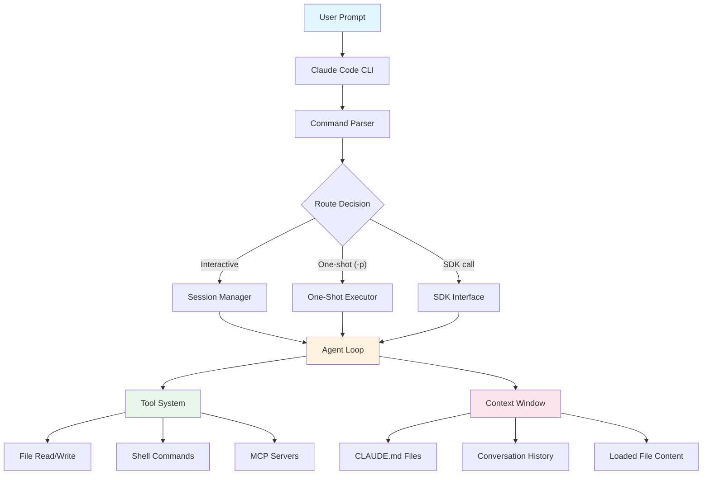
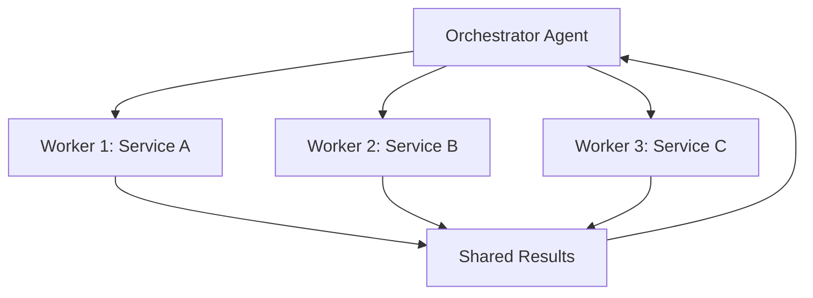
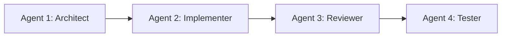
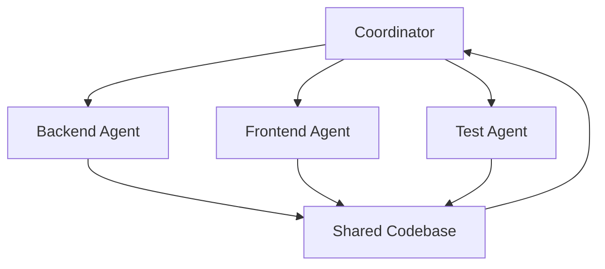

# Module 7.3: Multi-Agent Architecture

> **Estimated time**: ~40 minutes
>
> **Prerequisite**: Module 7.2 (Full Auto Workflow)
>
> **Outcome**: After this module, you will understand multi-agent patterns, know when to use them, and be able to implement basic orchestration using Claude Code's one-shot mode and bash scripting.

---

## 1. WHY — Why This Matters

You're building a massive feature across 10 services. Hour 1: great progress. Hour 2: solid implementation. Hour 3: Claude mixes up service names, references old decisions, suggests tests for unwritten code. Context is polluted.

Multi-agent architecture solves this: orchestrate focused Claude instances — architect, implementers per service, tester, documenter. Each has fresh context and clear handoffs. Like a real dev team, automated.

---

## 2. CONCEPT — Core Ideas

### When to Use Multi-Agent

**Single Agent**: Tasks under 2 hours, single codebase area, coherent context.

**Multi-Agent**: Complex multi-phase tasks, independent subtasks, specialization benefits (design/implementation/testing), context degradation risk.

**Rule of thumb**: If you'd split work among multiple developers, use multi-agent.

### How Claude Code Components Fit Together

Before diving into multi-agent patterns, understand how Claude Code's internal components relate:



**Key relationships**:
- **Agent Loop** is the core engine — it reads context, decides actions, calls tools, and iterates until the task is done
- **Tools** are how the agent acts on the world (reading/writing files, running shell commands, connecting to MCP servers)
- **Context Window** is what the agent knows (CLAUDE.md rules, conversation history, loaded file contents)
- **Multi-agent** = multiple independent Agent Loops, each with its own fresh context, communicating through files on disk

This diagram explains **why multi-agent works**: each agent gets a clean Agent Loop with focused context, avoiding the context pollution that happens when one loop handles too many concerns simultaneously.

### Three Core Patterns

#### Pattern 1: Orchestrator-Worker



**Best for**: Parallel independent subtasks. Orchestrator plans, workers execute, integrates results.

**Example**: Add logging to 10 microservices — orchestrator creates spec, workers implement.

#### Pattern 2: Pipeline (Sequential)



**Best for**: Sequential phases where each agent builds on previous output.

**Example**: API development — architect designs → implementer codes → reviewer checks → tester validates.

#### Pattern 3: Specialist Team



**Best for**: Full-stack features requiring domain expertise.

**Example**: User dashboard — coordinator defines requirements → backend/frontend/test agents work in parallel.

### Agent Communication Methods

**File-Based Handoffs** (recommended): Agent A writes `architecture.md`, Agent B reads it. Clear, auditable, version-controllable.

**Pipes** (advanced): `claude -p "analyze" | claude -p "implement from stdin"`

**JSON Output** ⚠️ Needs verification: `claude -p "output JSON" --output-format json | jq`

### Spawning Fresh Agents

Each agent is a separate Claude Code invocation with fresh context:
```bash
claude -p "your specialized prompt here"
```

No shared memory — communicate via artifacts (files, stdout, environment variables).

---

## 3. DEMO — Step by Step

**Task**: Add a new API endpoint for user preferences, complete with tests and documentation.

### Agent 1: Architect

**Step 1: Design Phase**
```bash
$ claude -p "Design an API endpoint for managing user preferences (theme, language, notifications). Output: route structure, request/response schemas, database changes needed. Write everything to architecture.md"
```

Expected output:
```
Created architecture.md with:
- POST /api/v1/users/:id/preferences
- Schema: { theme: string, language: string, notifications: boolean }
- DB: Add preferences column to users table (JSONB)
```

### Agent 2: Implementer

**Step 2: Implementation Phase**
```bash
$ claude -p "Read architecture.md. Implement the preferences endpoint in src/routes/ and src/services/. Follow existing Express patterns. Use Prisma for DB access."
```

Expected output:
```bash
$ git diff --stat
 src/routes/userPreferences.ts   | 45 +++++++++++++++++++++
 src/services/preferences.ts      | 32 ++++++++++++++
 prisma/schema.prisma             |  1 +
```

### Agent 3: Tester

**Step 3: Testing Phase**
```bash
$ claude -p "Read architecture.md and src/routes/userPreferences.ts. Write comprehensive tests covering happy path, validation errors, not found cases. Use Jest and Supertest."
```

Expected output:
```bash
$ npm test
 PASS  src/routes/userPreferences.test.ts
  ✓ POST /api/v1/users/:id/preferences - success (42ms)
  ✓ POST /api/v1/users/:id/preferences - validation error (15ms)
  ✓ POST /api/v1/users/:id/preferences - user not found (12ms)
```

### Agent 4: Documenter

**Step 4: Documentation Phase**
```bash
$ claude -p "Read architecture.md and src/routes/userPreferences.ts. Update API.md with endpoint documentation including curl examples and response formats."
```

Expected output:
```markdown
## User Preferences

### Update Preferences
POST /api/v1/users/:id/preferences

Request:
{
  "theme": "dark",
  "language": "vi",
  "notifications": true
}
...
```

### Result

Four specialized agents with fresh context, file-based handoffs. Total: ~15 minutes vs. 45+ with degrading context.

---

## 4. PRACTICE — Try It Yourself

### Exercise 1: Build Your First Pipeline

**Goal**: Implement a 3-phase pipeline for adding a new feature

**Instructions**:
1. Choose a small feature with clear phases (e.g., add rate limiting: design → implement → test)
2. Write prompts for 3 agents following the DEMO pattern
3. Create a bash script `pipeline.sh` that runs them in sequence
4. Execute and observe how each agent reads previous output

**Expected result**: Three distinct files (design.md, implementation code, tests), each agent referenced previous work without context pollution.

<details>
<summary>💡 Hint</summary>

Your bash script should look like:
```bash
#!/bin/bash
claude -p "Agent 1 prompt, write to design.md"
claude -p "Agent 2 prompt, read design.md, implement"
claude -p "Agent 3 prompt, read design.md and code, test"
```
</details>

<details>
<summary>✅ Solution</summary>

```bash
#!/bin/bash
set -e

echo "=== Agent 1: Architect ==="
claude -p "Design rate limiting for our API. Strategy: token bucket. Output implementation plan to rate-limit-design.md"

echo "=== Agent 2: Implementer ==="
claude -p "Read rate-limit-design.md. Implement rate limiting middleware in src/middleware/rateLimit.ts using express-rate-limit"

echo "=== Agent 3: Tester ==="
claude -p "Read rate-limit-design.md and src/middleware/rateLimit.ts. Write tests that verify rate limiting works, including burst scenarios"

echo "=== Pipeline complete ==="
git diff --stat
npm test
```

**Result**: Each agent had focused context. Architect wasn't distracted by implementation details. Implementer didn't second-guess design. Tester verified against spec.
</details>

### Exercise 2: Orchestrator-Worker Pattern

**Goal**: Use orchestrator-worker for parallel tasks

**Instructions**:
1. Task: Add error logging to 5 different service files
2. Create orchestrator agent that analyzes files and writes logging-plan.md
3. Create 5 worker agents (or loop through files) that each add logging to one file
4. Run workers in parallel using `&` backgrounding in bash ⚠️ or sequentially

**Expected result**: All 5 files updated with consistent logging, orchestrator's plan followed.

<details>
<summary>💡 Hint</summary>

Orchestrator prompt: "List these 5 files and specify what logging each needs based on its function"
Worker prompt template: "Read logging-plan.md. Add logging to FILE_NAME following the plan."
</details>

<details>
<summary>✅ Solution</summary>

```bash
#!/bin/bash
# Orchestrator
claude -p "Analyze src/services/{user,order,payment,auth,notification}.ts. Create logging-plan.md specifying what logging each file needs."

# Workers (sequential for safety)
for service in user order payment auth notification; do
  claude -p "Read logging-plan.md. Add appropriate logging to src/services/${service}.ts following the plan."
done

git diff --stat
```
</details>

---

## 5. CHEAT SHEET

### Pattern Selection

| Scenario | Pattern | Why |
|----------|---------|-----|
| 10 similar tasks | Orchestrator-Worker | Parallel execution, same template |
| Design → Code → Test | Pipeline | Sequential dependencies, clear handoff |
| Frontend + Backend + DB | Specialist Team | Domain expertise per layer |
| Refactoring one module | Single Agent | Coherent context, no specialization needed |

### Agent Spawning

| Method | Syntax | Use Case |
|--------|--------|----------|
| One-shot | `claude -p "prompt"` | Fresh agent, single task |
| Interactive → one-shot | Start interactive, then spawn via bash | Exploratory then execution |
| Script loop | `for file in *.ts; do claude -p "..."; done` | Batch processing |

### Communication

| Method | Pro | Con |
|--------|-----|-----|
| File handoffs | Clear, auditable, works everywhere | Extra file I/O |
| Pipes | Elegant for simple chains | Hard to debug, no intermediate artifacts |
| Environment vars | Fast for small data | Size limits, shell escaping issues |

---

## 6. PITFALLS — Common Mistakes

| ❌ Mistake | ✅ Correct Approach |
|---|---|
| Using multi-agent for 10-minute single-file task | Use single agent for simple coherent tasks. Multi-agent overhead isn't worth it. |
| Agents with overlapping responsibilities | Define clear boundaries. "Agent A designs, Agent B implements" — no overlap. |
| No shared artifact between agents | Always use handoff files (design.md, spec.json). Agents can't read each other's minds. |
| Running parallel agents on same file | Coordinate file ownership. Parallel agents should touch different files or risk merge conflicts. |
| Over-engineering orchestration | Start simple (bash script). Only add complexity (n8n, etc.) when bash becomes unmanageable. |
| Forgetting fresh context is the point | Don't pass massive context to each agent. Give them focused inputs and trust specialization. |

---

## 7. REAL CASE — Production Story

**Scenario**: Vietnamese fintech startup building payment reconciliation across 6 microservices, 3 databases, 2 third-party APIs.

**Problem**: Single session degraded after 3 days. API contracts inconsistent, tests referenced non-existent endpoints.

**Solution**: Specialist Team pattern:
- **Coordinator**: Created `integration-contract.md` defining all service interfaces
- **6 Service Agents**: Each implemented one microservice from contract
- **Integration Agent**: Built orchestration layer
- **Test Agent**: Added E2E contract compliance tests

**Result**: Completed in 1 day. Zero API mismatches. Each agent had fresh, focused context. Contract document served as single source of truth.

---

> **Next**: [Module 7.4: Agentic Loop Patterns](../04-agentic-loops/) →
