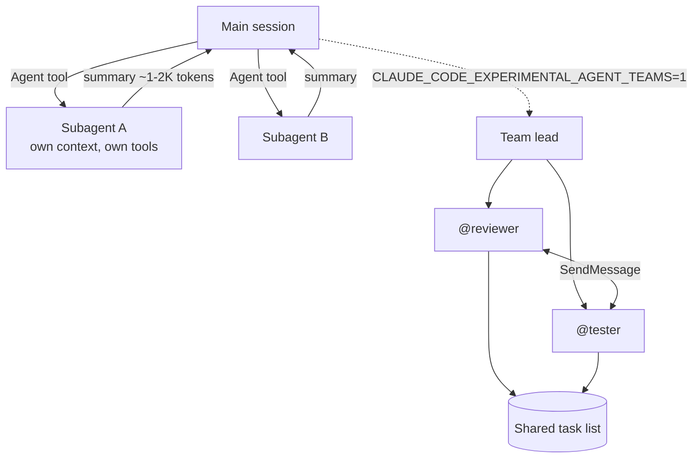

# Module 7.3: Multi-Agent Architecture

> **Estimated time**: ~40 minutes
>
> **Prerequisite**: Module 7.2 (Full Auto Workflow)
>
> **Outcome**: After this module, you will be able to define a **subagent** in
> `.claude/agents/<name>.md`, invoke it by name, run several in parallel, and decide when an
> **agent team** is worth roughly 7× the tokens.

---

## 1. WHY — Why This Matters

Hour one of a big feature is great. By hour three Claude is quoting decisions you reverted and
the context is full of test output nobody will read again. The fix isn't a bigger window; it's
more windows.

Claude Code ships that natively: **subagents** run in their own context and hand back a summary;
**agent teams** run as separate sessions with a shared task list and messaging. No bash loops.

---

## 2. CONCEPT — Core Ideas

### Workflows vs agents (S5)

Anthropic separates *workflows* (code decides what runs next) from *agents* (the model decides).
Its five building blocks map onto this course's three patterns:

| Course pattern | Anthropic pattern | Claude Code mechanism |
|---|---|---|
| **Orchestrator-Worker** | orchestrator-workers / parallelization | Main session spawns parallel subagents; each returns a summary |
| **Pipeline** | prompt chaining | Chained subagents ("use A, then use B on A's output"); at scale, Dynamic Workflows (Module 7.6, Wave 3) |
| **Specialist Team** | evaluator-optimizer | Agent team: named teammates that message each other and claim tasks |


```mermaid
graph TD
    M[Main session] -->|Agent tool| S1["Subagent A<br/>own context, own tools"]
    M -->|Agent tool| S2["Subagent B"]
    S1 -->|summary ~1-2K tokens| M
    S2 -->|summary| M
    M -.->|CLAUDE_CODE_EXPERIMENTAL_AGENT_TEAMS=1| T["Team lead"]
    T --> A["@reviewer"]
    T --> B["@tester"]
    A <-->|SendMessage| B
    A --> L[(Shared task list)]
    B --> L
```

A subagent should return roughly **1,000–2,000 tokens** (S6), not its transcript — that is why
delegation protects the main context.

### Subagents

A subagent is a Markdown file with YAML frontmatter; the body is its system prompt. Locations:
`.claude/agents/` (project, commit it), `~/.claude/agents/` (all projects), `--agents '{…}'`
(this session only). Only `name` and `description` are required:

| Field | Purpose |
|---|---|
| `name`, `description` | Identity; Claude reads `description` to decide when to delegate |
| `tools` | `Read, Grep, Bash` or a YAML list; inherits everything if omitted |
| `model` | `sonnet`, `opus`, `haiku`, `fable`, full ID, or `inherit` |
| `permissionMode` | Applies when the main session is in `default`, `dontAsk` or `plan`; ignored under `acceptEdits`/`auto`/`bypassPermissions` |
| `maxTurns` | Stops the subagent; output is marked partial |
| `skills`, `memory`, `isolation: worktree` | Preload skills; persistent memory (`user`/`project`/`local`); run in its own git worktree |

Built-ins: **Explore** (read-only search), **Plan** (research during plan mode),
**general-purpose** (everything). `/agents` no longer opens a wizard; it prints a reminder.
Invoke by name (*"Use the test-writer subagent to …"*) or force it with `@"test-writer (agent)"`.
A subagent starts fresh: system prompt, task message, CLAUDE.md and git status — not your
conversation.

### Agent teams

⚠️ **Experimental, disabled by default.** Enable with `CLAUDE_CODE_EXPERIMENTAL_AGENT_TEAMS=1`
in your environment or the `env` block of `settings.json`; interactive sessions only. When a team
beats subagents, per the docs: *research and review*, *new modules or features*, *debugging with
competing hypotheses*, *cross-layer coordination*. When it doesn't: *"For sequential tasks,
same-file edits, or work with many dependencies, a single session or subagents are more
effective."*

Cost decides. Agent teams use *"approximately 7x more tokens than standard sessions"* (S15);
Anthropic's research system measured multi-agent runs at ~15× a chat (S10). Start with 3–5
teammates, give each its own files, shut them down when done.

> `(S5)`, `(S6)`, `(S10)`, `(S15)`: `docs/references/anthropic-sources.md`.

---

## 3. DEMO — Step by Step

Run in `~/cc-lab`. Interactive captures are trimmed to the relevant rows.

**Step 1: Define a project subagent**

```bash
# docs: sub-agents#write-subagent-files
mkdir -p .claude/agents && cat > .claude/agents/test-writer.md << 'EOF'
---
name: test-writer
description: Writes node:test unit tests for a given source file. Use when asked to add or extend tests.
tools: Read, Write, Bash
model: sonnet
---
You are a test writer. Read the source file you are given, write or extend
tests in tests/ using node:test and node:assert/strict, run `npm test`, and
report only the test names and the pass/fail counts.
EOF
```

Why: `tools` is the fence — no `Edit`, no `WebFetch`.

**Step 2: Invoke it by name (Orchestrator-Worker, one worker)**

```bash
# docs: sub-agents#invoke-subagents-explicitly
claude --permission-mode acceptEdits
```

Prompt: `Use the test-writer subagent to add three tests for src/math.js`

```text
# Output may vary
⏺ test-writer(Add three tests for math.js)
  ⎿  Backgrounded agent (↓ to manage · ctrl+o to expand)
⏺ The test-writer subagent is running. It's extending tests/math.test.mjs with three new tests …
✻ Waiting for 1 background agent to finish
 Bash command · from the test-writer agent
   npm test -- tests/math.test.mjs 2>&1 | tail -30
 Do you want to proceed?
 ❯ 1. Yes
   2. Yes, and don’t ask again for: npm test *
   3. Yes, and switch to auto mode · auto mode handles these prompts for you
   4. No
⏺ Agent "Add three tests for math.js" finished · 37s
```

The row `test-writer(…)` proves delegation. The Bash prompt surfaces in *your* session with the
subagent's name — `acceptEdits` covers its `Write`, not its `npm test`. Afterwards:

```bash
git diff --stat && npm test 2>&1 | grep -E '^# (pass|fail)'
```

```text
# Output may vary
 tests/math.test.mjs | 5 ++++-
 1 file changed, 4 insertions(+), 1 deletion(-)
# pass 4
# fail 0
```

**Step 3: `/agents` — a reminder, not a list**

```text
# Output may vary
❯ /agents
  ⎿  The /agents wizard has been removed.
     Ask Claude to create or update subagents for you (e.g. "create a code-reviewer subagent that ..."),
     or edit the files directly:
       • .claude/agents/       (this project)
       • ~/.claude/agents/     (all projects)
```

`/tasks` lists running and recently finished subagents.

**Step 4: Two subagents in parallel (Orchestrator-Worker)**

```bash
# docs: sub-agents#run-parallel-research
claude --permission-mode default
```

Prompt: `Use two subagents in parallel: one lists every exported function in src/, the other
lists every TODO comment in the repo. Report both lists.`

```text
# Output may vary
⏺ 2 background agents launched (↓ to manage)
   ├ List exported functions in src/
   └ List TODO comments in repo
✻ Waiting for 2 background agents to finish
⏺ Agent "List exported functions in src/" finished · 1m 1s
  The first subagent finished: src/ has two exported functions, both in src/math.js. …
```

Both ran as built-in Explore agents in the background; only summaries came back.

**Step 5: An agent team (Specialist Team)**

This machine has `CLAUDE_CODE_EXPERIMENTAL_AGENT_TEAMS=1` in `~/.claude/settings.json`.

```bash
# docs: agent-teams#start-your-first-agent-team
claude --permission-mode default
```

Prompt: `Spawn two teammates named reviewer and tester. reviewer reads src/math.js and lists 3
edge cases; tester reads tests/math.test.mjs and lists 3 missing tests. Each reports back in
bullets, then ask both to shut down and summarize.`

```text
# Output may vary
⏺ 2 background agents launched (↓ to manage)
   ├ @reviewer
   └ @tester
› Message from @reviewer (ctrl+o to expand)
⏺ Teammate @reviewer finished
› Message from @tester (ctrl+o to expand)
⏺ Both reports are in. Sending shutdown requests to both.
⏺ Shutdown requests sent to both teammates. Here's the summary:
  reviewer — 3 edge cases in src/math.js
  - divide by zero — divide(1, 0) → Infinity, divide(-1, 0) → -Infinity, divide(0, 0) → NaN; …
  tester — 3 missing tests in tests/math.test.mjs
  - divide happy path — divide is exported but never imported or tested at all …
  Overlap worth acting on: both flagged divide(x, 0) … No files were modified by either teammate.
```

Teammates are addressed as `@reviewer`/`@tester`, message the lead directly, and exit on a
shutdown request. Clean up: `rm -rf .claude/agents && git checkout -- tests`.

---

## 4. PRACTICE — Try It Yourself

### Exercise 1: A read-only reviewer

**Goal**: Define `security-reviewer` that can look but never edit.
**Instructions**: create `.claude/agents/security-reviewer.md` with `tools: Read, Grep, Glob`
and `model: sonnet`, then ask `Use the security-reviewer subagent to review src/`.

**Expected result**: a findings list; `git status` unchanged.

<details>
<summary>✅ Solution</summary>

```markdown
---
name: security-reviewer
description: Read-only security review of source files. Use before merging.
tools: Read, Grep, Glob
model: sonnet
---
Review the files you are given for injection, secrets and unsafe defaults.
Report each finding as: severity, file:line, one-sentence fix. Never edit files.
```

Without `Edit`/`Write` in `tools`, the agent cannot change anything — a fence, not a request.
</details>

### Exercise 2: Orchestrator with JSON summaries

**Goal**: Three subagents, one merged report.
**Instructions**: prompt: `Use three subagents in parallel — exports, TODOs, test names. Each
must return a JSON object {"area": …, "items": […]} and nothing else. Merge them into one JSON
array.` Confirm three short objects came back, not three transcripts.

<details>
<summary>✅ Solution</summary>
The subagent's *report* is what enters your context; a strict shape keeps it near the 1–2K-token
target (S6).
</details>

### Exercise 3: Writer / Reviewer in two sessions (S1)

**Goal**: A fresh-context review that isn't biased by the code it just wrote.
**Instructions**:
1. Session A: `claude --permission-mode acceptEdits` →
   `Implement a clamp(x, lo, hi) function in src/math.js`.
2. Session B: `claude --worktree review --permission-mode default` → `Review the clamp
   implementation in @src/math.js. Look for edge cases and consistency with existing functions.`
3. Paste B's findings into A: `Here's the review feedback: […]. Address these issues.`

<details>
<summary>✅ Solution</summary>
Session B never saw A's reasoning, so it reviews the code, not the intent. `--worktree` lets B
run tests without disturbing A's tree.
</details>

---

## 5. CHEAT SHEET

| Command / Feature | Description | Example |
|---|---|---|
| `.claude/agents/<name>.md` | Project subagent (commit it) | `name`, `description`, `tools`, `model` |
| `~/.claude/agents/` | Personal subagents, all projects | — |
| `--agents '{…}'` | Session-only subagents as JSON | `claude --agents '{"reviewer": {"description": …, "prompt": …}}'` |
| `Use the <name> subagent to …` | Natural-language delegation | Claude decides |
| `@"<name> (agent)"` | Force that subagent | `@"test-writer (agent)" cover src/math.js` |
| `--agent <name>` | Whole session runs as that subagent | `claude --agent security-reviewer` |
| Explore / Plan / general-purpose | Built-ins (read-only / plan research / everything) | deny with `Agent(Explore)` |
| `/tasks` | Running and finished background work | — |
| `CLAUDE_CODE_EXPERIMENTAL_AGENT_TEAMS=1` | Enable teams (experimental) | `env` in settings.json |
| `Spawn N teammates …` | Start a team in natural language | name them for `@name` messaging |
| `Ask the <name> teammate to shut down` | Graceful teammate exit | — |
| `--teammate-mode` | `in-process` (default), `auto`, `tmux`, `iterm2` | split panes need tmux/iTerm2 |

---

## 6. PITFALLS — Common Mistakes

| ❌ Mistake | ✅ Correct Approach |
|---|---|
| Bash loops of `claude -p` writing files with no permission flag | Native subagents, or `-p` with `--permission-mode acceptEdits` / `--allowedTools` |
| Treating agents as sealed boxes that only talk via files | Subagents return a summary; teammates share a task list and message each other |
| A team for a sequential, same-file change | Single session or chained subagents; teams are ~7× the tokens |
| Subagents that return whole transcripts | Ask for a short, structured report (~1–2K tokens) |
| Expecting `/agents` to list agents | It prints a reminder; check `.claude/agents/` and `/tasks` |
| `permissionMode: bypassPermissions` in a subagent | Ignored unless the main session already bypasses; use `tools` as the fence |
| Two teammates editing one file | Give each teammate its own files; overwrites are silent |

---

## 7. REAL CASE — Production Story

**Scenario**: A Vietnamese fintech team building payment reconciliation across six services,
three databases and two third-party APIs.

**Problem**: One long session degraded after three days: contracts drifted between services and
tests referenced endpoints that no longer existed.

**Solution**: The lead wrote `integration-contract.md` in a plan-mode session, then, with agent
teams enabled, spawned six teammates named after the services — each a `tools`-restricted
subagent definition with the contract as its spawn prompt — plus a read-only `contract-tester`
that ran the E2E suite. Review happened in a fresh `--worktree` session (Writer/Reviewer).

**Result**: The reconciliation layer shipped in a day with zero API mismatches. The seven agent
files stayed in `.claude/agents/` and now run as plain subagents whenever a full team isn't worth
its tokens.

---

> **Next**: [Module 7.4: Agentic Loop Patterns](../04-agentic-loops/) →
