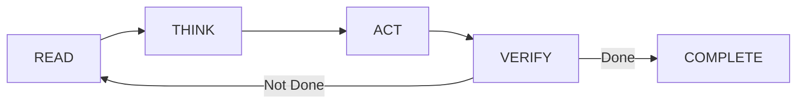

# Module 7.4: Agentic Loop Patterns

> **Estimated time**: ~35 minutes
>
> **Prerequisite**: Module 7.3 (Multi-Agent Architecture)
>
> **Outcome**: After this module, you will recognize fundamental agentic loop patterns in Claude Code, know how to prompt for specific loop behaviors, and be able to detect and break out of unproductive loops.

---

## 1. WHY — Why This Matters

Claude runs for 10 minutes, seems busy, but you have no idea if it's making progress. Sometimes it loops endlessly trying the same failing approach. Other times it gives up too early when one more attempt would have worked. You feel out of control — should you stop it? Let it run? You're just guessing.

Understanding agentic loops gives you visibility and control. You'll recognize: "Ah, it's in a self-correction loop trying to fix that test — let it run." Or: "Wait, it's repeating the same failed approach for the third time — I need to intervene." You shift from passive observer to active conductor.

---

## 2. CONCEPT — Core Ideas

### The Fundamental Loop: RTAV

Every agentic action in Claude Code follows this cycle:



- **READ**: Claude examines code, errors, test outputs, file states
- **THINK**: Analyzes what to do next (visible when Think Mode is enabled)
- **ACT**: Makes changes, runs commands, edits files
- **VERIFY**: Checks if the action worked (tests pass? error gone? goal met?)

The loop continues until verification passes OR max iterations reached OR human intervenes.

### Pattern 1: Self-Correction Loop

**Trigger**: Test fails, linter error, build breaks
**Cycle**: Analyze error → hypothesize root cause → implement fix → re-run verification
**Healthy**: Converges in 2-4 iterations, each iteration fixes at least one issue
**Unhealthy**: Same error repeats 3+ times, no measurable progress
**Prompt example**: "Run tests. If any fail, analyze and fix. Repeat until all pass or 5 attempts."

This is the most common loop pattern. It's how Claude "debugs itself."

### Pattern 2: Iterative Refinement Loop

**Trigger**: "Improve", "optimize", "refine", "make it better"
**Cycle**: Evaluate current state → identify improvement → implement → measure
**Healthy**: Each iteration shows measurable improvement (faster, smaller, cleaner)
**Unhealthy**: Changes without improvement, endless tweaking, over-engineering
**Prompt example**: "Optimize this function. Benchmark after each change. Stop when improvement < 5%."

This loop requires clear success metrics. Without them, it can run forever.

### Pattern 3: Exploration Loop

**Trigger**: Uncertainty, multiple possible approaches, "try different ways"
**Cycle**: Try approach A → evaluate → try approach B → evaluate → compare → choose best
**Healthy**: Systematic comparison with clear criteria, reaches decision
**Unhealthy**: Endless exploration, analysis paralysis, no decision
**Prompt example**: "Try 3 caching strategies. Benchmark each. Recommend best with trade-offs."

This loop needs explicit: (1) how many options to try, (2) evaluation criteria, (3) decision rule.

### Loop Termination Conditions

Every loop must have a way to stop:

| Termination Type | Example |
|------------------|---------|
| **Success** | "All tests pass" |
| **Max iterations** | "Try at most 5 times" |
| **Threshold** | "Stop when response time < 100ms" |
| **Timeout** | "Stop after 10 minutes" |
| **Human intervention** | User types "stop" or presses Ctrl+C |

Without termination conditions, loops run until token budget exhausted.

### Recognizing Stuck Loops

Watch for these red flags:

- Same error message appearing in 3+ consecutive iterations
- Same files edited repeatedly with similar changes
- No measurable progress toward goal
- Token usage spiking without visible output
- Claude expressing confusion or uncertainty repeatedly

When you see these, intervene immediately. Don't wait.

---

## 3. DEMO — Step by Step

**Goal**: Fix a failing test suite using an explicit self-correction loop.

**Setup**: Assume you have a Node.js project with failing tests in `npm test`.

**Step 1: Start interactive session**

```bash
$ claude
```

Expected output:
```
Claude Code v1.x
Type /help for commands
>
```

**Step 2: Invoke self-correction loop with explicit termination**

Prompt:
```
Run npm test.

If any tests fail:
1. Read the failing test and the code it tests
2. Analyze why the test is failing
3. Fix the code (not the test, unless the test itself is wrong)
4. Run npm test again

Repeat this cycle until all tests pass, or you've tried 5 times without progress.

After each iteration, report:
- How many tests still failing
- What you fixed
- Whether you're making progress
```

**Step 3: Observe healthy loop progression**

Expected output:
```
Running npm test...

FAIL src/services/userService.test.ts
  × should fetch user by ID (45ms)
  × should handle missing user (12ms)
  × should validate email format (8ms)

3 tests failed.

=== ITERATION 1 ===
Reading userService.test.ts and userService.ts...

Analysis: Tests expect async function but implementation is synchronous.
Root cause: Missing async/await in fetchUser() method.

Fixing: Converting fetchUser() to async...
Running npm test...

FAIL src/services/userService.test.ts
  ✓ should fetch user by ID (52ms)
  × should handle missing user (15ms)
  × should validate email format (9ms)

Progress: 3 failures → 2 failures. Moving forward.

=== ITERATION 2 ===
Analysis: Missing null check when user not found.

Adding null check before email validation...
Running npm test...

PASS src/services/userService.test.ts
  ✓ should fetch user by ID (48ms)
  ✓ should handle missing user (14ms)
  ✓ should validate email format (11ms)

All tests passing! ✓
Loop terminating: success condition met.
```

**Key observations**:
- Iteration 1: 3 failures → 2 failures (progress!)
- Iteration 2: 2 failures → 0 failures (success!)
- Total: 2 iterations. Healthy convergence.
- Each iteration fixed at least one issue

**Step 4: Recognize unhealthy loop (simulation)**

If you saw this instead:

```
=== ITERATION 1 ===
Fixing typo in line 45: "usr" → "user"...
Running npm test...
FAIL 3 tests failed

=== ITERATION 2 ===
Fixing typo in line 45: "usr" → "user"...
Running npm test...
FAIL 3 tests failed

=== ITERATION 3 ===
Fixing typo in line 45: "usr" → "user"...
Running npm test...
FAIL 3 tests failed
```

This is stuck. Same fix repeated, no progress. Intervene:

```
Stop. You're repeating the same fix three times.

Let's analyze:
1. Is the fix actually being applied? Show me the file after your changes.
2. Is there a different root cause you haven't considered?
```

**Step 5: Check token usage**

```
/cost
```

Expected output:
```
Session cost: $0.15
Tokens used: 45,000 input / 12,000 output
```

If cost is rising fast without progress, that confirms stuck loop.

---

## 4. PRACTICE — Try It Yourself

### Exercise 1: Invoke and Observe RTAV

**Goal**: Recognize the RTAV cycle in a real Claude Code session.

**Instructions**:
1. Pick a task with clear verification: fix a bug, pass a test, or resolve a linter error
2. Prompt Claude with explicit loop instructions including max iterations
3. Watch the output carefully — identify READ, THINK, ACT, VERIFY phases
4. Note: How many iterations did it take? Did it converge successfully?

**Expected result**: You can identify each RTAV phase and predict when the loop will terminate.

<details>
<summary>💡 Hint</summary>

Good prompt structure:
```
[TASK]: Fix the failing test in userService.test.ts

[LOOP]:
1. Read test and implementation
2. Analyze cause of failure
3. Fix implementation
4. Run npm test

Repeat until passing or 5 attempts.

[REPORTING]:
After each iteration, tell me what you tried and whether it's working.
```

This makes the loop explicit and observable.
</details>

<details>
<summary>✅ Solution</summary>

Full prompt:
```
Read userService.test.ts and identify the failing assertion.
Fix the implementation in userService.ts to make it pass.
Run npm test.

If still failing, analyze the new error and fix again.
Maximum 5 attempts.

Report after each iteration:
- What you changed
- Test result
- Progress assessment
```

Observing RTAV:
- **READ**: You'll see Claude reading test file and implementation file
- **THINK**: "Analysis: The test expects..." (especially clear with Think Mode)
- **ACT**: "Editing userService.ts..." followed by code changes
- **VERIFY**: "Running npm test..." followed by output

Healthy loop: 1-3 iterations to pass.
Stuck loop: Same error 3+ times → intervene.
</details>

### Exercise 2: Break a Stuck Loop

**Goal**: Practice recognizing and intervening when a loop gets stuck.

**Instructions**:
1. Give Claude a challenging problem (flaky test, complex refactoring)
2. Watch for stuck loop signs: same fix repeated, no progress, same error 3+ times
3. When you spot it, intervene with: "Stop and explain what you've tried so far"
4. Guide Claude to a different approach based on the explanation

**Expected result**: You recognize stuck loops within 3 iterations and intervene effectively.

<details>
<summary>💡 Hint</summary>

Stuck loop signs:
- Same error message 3+ times
- Same files edited repeatedly
- Token count rising without output progress
- Claude says "trying again" without changing approach

Intervene early. Waiting doesn't help.
</details>

<details>
<summary>✅ Solution</summary>

Intervention phrases that work:

**When stuck on same error:**
```
Stop. You've tried this approach 3 times with the same result.

Explain:
1. What have you tried?
2. What stayed the same each time?
3. What might you be missing?
```

**When changing without progress:**
```
Stop. Let's step back.

What is the actual root cause here? Not just the symptom.
Explain your theory before fixing anything.
```

**When algorithm is wrong:**
```
You're stuck because the approach is wrong, not the implementation.

Try a completely different algorithm. What are 2-3 alternative ways to solve this?
```

After intervention, give either:
- More context Claude was missing
- Clearer success criteria
- Permission to try radically different approach
</details>

---

## 5. CHEAT SHEET

### Loop Patterns

| Pattern | Trigger Words | Healthy Signs | Stuck Signs |
|---------|---------------|---------------|-------------|
| Self-Correction | "fix", "debug", "until passes" | Fewer errors each iteration | Same error repeating 3+ times |
| Iterative Refinement | "improve", "optimize", "refine" | Measurable improvement each round | Changes without gains |
| Exploration | "try approaches", "compare options" | Systematic evaluation, reaches decision | Endless trying, no decision |

### Prompts to Invoke Loops

| Loop Type | Prompt Template |
|-----------|-----------------|
| Self-Correction | "Fix [problem]. Test after each fix. Repeat until passing or 5 attempts." |
| Iterative Refinement | "Optimize [metric]. Measure after each change. Stop when improvement < X%." |
| Exploration | "Try [N] approaches for [goal]. Evaluate each on [criteria]. Recommend best." |

### Intervention Phrases

| Situation | What to Say |
|-----------|-------------|
| Stuck loop | "Stop. Explain what you've tried so far." |
| Wrong direction | "Let's try a completely different approach." |
| Sufficient progress | "That's good enough. Move on to next task." |
| Emergency stop | Press Ctrl+C |

### Context Management in Loops

| Trigger | Action |
|---------|--------|
| Loop > 10 iterations | `/compact` to compress context |
| Token budget concern | `/cost` to check usage |
| Context feels degraded | `/clear` and restart with summary |

---

## 6. PITFALLS — Common Mistakes

| ❌ Mistake | ✅ Correct Approach |
|---|---|
| No termination condition — loop runs until token exhaustion | Always specify: max iterations, success criteria, or timeout. "Until done" is too vague. |
| Letting stuck loops run, hoping Claude self-corrects | If no progress after 3 iterations, intervene immediately. Waiting wastes tokens and time. |
| Over-optimizing with endless refinement | Define "good enough" upfront: "Stop when tests pass" not "make it perfect." |
| Ignoring `/compact` — letting context degrade over 20+ iterations | Use `/compact` every 5-10 iterations in long loops to maintain coherence. |
| Blaming Claude when loops fail — "the AI is broken" | Often the loop design is wrong: unclear goal, missing termination, or insufficient context. |
| Micromanaging every iteration — approving each step | Let Claude loop autonomously. Intervene only when stuck, unsafe, or done. Trust the cycle. |

---

## 7. REAL CASE — Production Story

**Scenario**: A Vietnamese fintech company was migrating 50 REST API endpoints to GraphQL. Each endpoint needed: GraphQL schema definition, resolver implementation, existing test update, and verification that the test passed.

**Initial approach (before understanding loops)**: Developers prompted Claude for each endpoint individually. 50 separate Claude sessions. Each required explaining context again. Approaches varied between endpoints. Total time: 3 days across 2 developers.

**After learning agentic loops**:

The team wrote one prompt with an explicit loop structure:

```
Read endpoints.json which lists all 50 REST endpoints.

For each endpoint:
1. Create GraphQL schema based on REST contract
2. Implement resolver using existing service layer
3. Update test file to call GraphQL instead of REST
4. Run test — if fails, analyze and fix, then re-run
5. Move to next endpoint ONLY when current endpoint's test passes

Report progress every 10 endpoints completed.
Maximum 3 fix attempts per endpoint — if still failing after 3, report it for human review.
```

**Result**: Claude ran a self-correction loop for each endpoint autonomously. 47 out of 50 succeeded without human intervention. 3 needed manual help (complex auth edge cases). Total time: 4 hours (mostly Claude running unattended).

**Key insight from the team lead**: "We didn't make Claude smarter. We didn't switch models. We just made the loop explicit — defined the cycle, the verification, and the termination condition. That clarity turned a 3-day task into a 4-hour task. The loop structure was the entire difference."

**Token cost**: $12 for the full migration vs. estimated $40-50 if done endpoint-by-endpoint. Loop efficiency matters for cost too.

---

> **Next**: [Module 7.5: Multi-Agent Orchestration Tools](../05-orchestration-tools/) →
