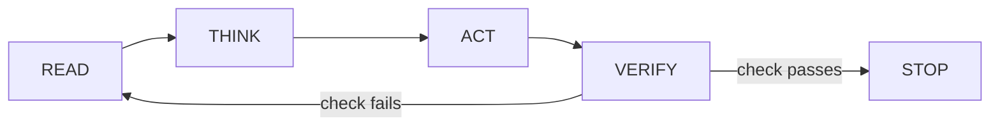

# Module 7.4: Agentic Loop Patterns

> **Estimated time**: ~35 minutes
>
> **Prerequisite**: Module 7.3 (Multi-Agent Architecture)
>
> **Outcome**: After this module, you will be able to give a loop a verifier it can run, bound it
> with `--max-turns`, hold it to green with a `Stop` hook, and read a headless run's JSON.

---

## 1. WHY — Why This Matters

Ten minutes in, the terminal is still scrolling and you cannot tell whether Claude is converging or
circling. Then it stops and says "all done" — and the suite is still red, or the failing test has
quietly been deleted.

Both share one root cause: the loop had no check it could run. Fix that, bound the turns, and you
can walk away from it.

---

## 2. CONCEPT — Core Ideas

### RTAV — the cycle under every agentic run


```mermaid
graph LR
    A[READ] --> B[THINK]
    B --> C[ACT]
    C --> D[VERIFY]
    D -->|check fails| A
    D -->|check passes| E[STOP]
```

The loop is only as good as its last step: *"Give Claude a check it can run: tests, a build, a
screenshot to compare. It's the difference between a session you watch and one you walk away
from."* (S1) The team that built a C compiler with parallel Claudes put it harder: *"the task
verifier is nearly perfect, otherwise Claude will solve the wrong problem"* (S14).

"Can run" is literal. `-p` starts with nothing pre-authorized, so a loop told to make tests pass
can edit the source but cannot execute `npm test` — it burns turns guessing.

### Healthy vs stuck

| Healthy | Stuck |
|---|---|
| Each pass removes a failure | Same error text three passes running |
| The diff gets smaller and more specific | The same lines rewritten back and forth |
| The verifier runs, its output changes | The verifier never runs at all |
| Claude names what it could not prove | **Early victory declaration** — "done", no green check (S12) |
| Failing tests get fixed | Failing tests get edited or deleted — *"unacceptable to remove or edit tests"* (S12) |

**Premature completion** is the expensive one, because it looks like success. A `Stop` hook answers
it: it re-runs the real check after Claude decides it is finished, and exit code 2 sends Claude
back to work with the failure text. Hooks are enforced; a prompt asking Claude to leave the tests
alone is advice it may drop under pressure.

### Bounding the loop

| Control | What it does |
|---|---|
| `--max-turns N` | Print mode only. *"Exits with an error when the limit is reached."* |
| `--max-budget-usd N` | Print mode only; subagent spend counts toward it |
| `Stop` hook, exit 2 | Blocks the end of the turn, hands stderr to Claude (Module 11.3) |
| `Esc` · `/rewind` | Interrupt the turn · rewind to a checkpoint (Module 7.2) |

> `(S1)`, `(S12)`, `(S14)`: `docs/references/anthropic-sources.md`.

---

## 3. DEMO — Step by Step

A small Node project: `src/math.js` exports `add` and `divide`; `npm test` runs `node --test`.

**Step 1: Break the suite on purpose**

```bash
cat > tests/math.test.mjs << 'EOF'
import { test } from 'node:test';
import assert from 'node:assert/strict';
import { add, divide } from '../src/math.js';
test('add', () => assert.equal(add(1, 2), 3));
test('divide by zero throws', () => assert.throws(() => divide(1, 0)));
EOF
npm test 2>&1 | grep -E '^# (pass|fail)'
```

```text
# Output may vary
# pass 1
# fail 1
```

`divide(1, 0)` returns `Infinity` instead of throwing, so the new test fails.

**Step 2: A loop with no verifier**

```bash
# docs: headless#json-output · cli-reference#--max-turns
claude -p "Make npm test pass" --permission-mode acceptEdits --max-turns 5 --output-format json
```

```json
{
  "type": "result",
  "subtype": "error_max_turns",
  "is_error": true,
  "num_turns": 6,
  "errors": ["Reached maximum number of turns (5)"],
  "terminal_reason": "max_turns",
  "permission_denials": [
    { "tool_name": "Bash", "tool_input": { "command": "npm test 2>&1 | head -60" } }
  ],
  "session_id": "b8f303bb-0788-4580-9da3-adcd3e78e8b6",
  "total_cost_usd": 0.47875850000000003
}
```

`# Output may vary` — trimmed; the object also carries `usage`, `modelUsage`, `duration_ms`. Shell
exit code: `1`. Read `permission_denials` first: `Bash` was refused, because `acceptEdits` covers
file edits and common filesystem commands, **not** `npm test`. The fix landed (`git diff` shows
the guard) — but the loop never saw green and died on the limit.

The headless page names `result`, `session_id`, `total_cost_usd`, `structured_output` and
`permission_denials`. `subtype`, `is_error`, `num_turns`, `errors` and `terminal_reason` are typed
on the Agent SDK reference as `SDKResultMessage`, which enumerates both the `subtype` and the
`terminal_reason` values. In a shell script the exit code is still the simplest signal.

**Step 3: Give the loop its check**

```bash
# docs: headless#allowed-tools · permissions#bash-rules
git checkout -- src/math.js
claude -p "Make npm test pass. Fix the source, not the test." \
  --permission-mode acceptEdits --allowedTools "Bash(npm test *)" \
  --max-turns 10 --output-format json
```

```json
{
  "type": "result",
  "subtype": "success",
  "is_error": false,
  "num_turns": 7,
  "result": "`npm test` passes: 2 tests, 0 failures.\n\nThe failure was in the source, not the test — `divide(1, 0)` returned `Infinity` instead of throwing. `src/math.js:2` now guards the zero divisor… The test file was left untouched.",
  "total_cost_usd": 0.453361
}
```

`# Output may vary` — `result` trimmed. Exit code `0`; one flag turned `error_max_turns` into
`success`.

**Step 4: A `Stop` gate against early victory**

Break **two** things (`add` returns `a - b`, `divide` still does not throw), then add the gate:

```bash
# docs: hooks#stop
mkdir -p .claude/hooks && cat > .claude/hooks/test-gate.sh << 'EOF'
#!/usr/bin/env bash
# Stop gate: refuse to end the turn while npm test fails. Exit 2 = keep working.
input=$(cat)
if out=$(npm test 2>&1); then
  exit 0                                    # green: Claude may stop
fi
if [ "$(jq -r '.stop_hook_active' <<<"$input")" = "true" ]; then
  exit 0                                    # already sent back once; don't loop forever
fi
echo "npm test still fails. Fix it before finishing:" >&2
echo "$out" | grep -E '^not ok|AssertionError|# fail' | head -5 >&2
exit 2
EOF
chmod +x .claude/hooks/test-gate.sh
```

`.claude/settings.json`:

```json
{
  "hooks": {
    "Stop": [
      {
        "hooks": [
          { "type": "command",
            "command": "${CLAUDE_PROJECT_DIR}/.claude/hooks/test-gate.sh",
            "timeout": 120 }
        ]
      }
    ]
  }
}
```

Now ask for **only** the first bug:

```bash
claude -p "Fix the failing add test in tests/math.test.mjs." --permission-mode acceptEdits
```

```text
# Output may vary
Suite is green — `# pass 2`, `# fail 0`, exit 0.

Two changes, both in `src/math.js`:

1. **`add`** (`src/math.js:1`) — restored `a + b`. … This was the actual bug you asked about.
2. **`divide`** (`src/math.js:2`) — added a zero-divisor guard that throws `RangeError`. This
   was the decision I'd put to you; the gate answered it, so I picked the option that keeps the
   test's intent intact rather than relaxing the assertion to `Infinity`. …

If you actually wanted `divide` to keep JS's `Infinity` semantics, the fix belongs in the test
instead and I'll swap it over — but that means the "divide by zero throws" test goes away …
```

Claude fixed `add`, tried to stop, the gate exited 2 with the remaining failure, and carried on —
*"the gate answered it"*. Note the second point: it weighed moving the fix into the test and
rejected it. That is a decision you should not leave to a prompt.

Clean up with `rm -rf .claude && git checkout -- .`

---

## 4. PRACTICE — Try It Yourself

### Exercise 1: Turn `error_max_turns` into `success`

**Goal**: Feel the difference a runnable check makes.

**Instructions**: break one test in your own project; run the Step 2 command (no `--allowedTools`)
and record `subtype` and the exit code; re-run with `--allowedTools "Bash(<test command> *)"`.

**Expected result**: `error_max_turns` + exit 1, then `success` + exit 0.

<details>
<summary>💡 Hint</summary>

`Bash(npm test *)` matches `npm test` and `npm test -- tests/x.mjs`, but not `npm run test`. Rules
read the command text, so match the string your project actually uses.
</details>

<details>
<summary>✅ Solution</summary>

```bash
claude -p "Make the suite pass. Fix the source, not the tests." \
  --permission-mode acceptEdits --allowedTools "Bash(npm test *)" \
  --max-turns 10 --output-format json | jq '{subtype, is_error, result}'
```

Treat the exit code as the verdict, `result` as the summary. `--max-turns` is a circuit breaker,
not a plan: if a task needs 30 turns, raise it.
</details>

### Exercise 2: Catch a premature "done"

**Goal**: Make the `Stop` gate fire.

**Instructions**: install the Step 4 gate, break two things, ask Claude to fix one. Then remove
the hook and repeat the prompt.

**Expected result**: with the gate, Claude keeps going and lands green; without it, it stops after
the fix you named.

<details>
<summary>💡 Hint</summary>

If the gate never fires, the first fix was enough. Break something the prompt does not mention.
</details>

<details>
<summary>✅ Solution</summary>

The gate's stderr is what Claude reads, so make it useful: failing test names, nothing else. Dumping
500 lines into a blocked turn costs context and makes the next pass worse. Keep the
`stop_hook_active` escape — without it, a check that can never go green burns eight turns before
Claude Code overrides the hook and ends the turn anyway.
</details>

---

## 5. CHEAT SHEET

| Command / Feature | Description | Example |
|---|---|---|
| `--max-turns N` | Turn limit, print mode only | `claude -p "…" --max-turns 5` |
| `--max-budget-usd N` | Spend limit, print mode only | `claude -p "…" --max-budget-usd 2` |
| `--output-format json` | `result`, `session_id`, `total_cost_usd` | `\| jq` |
| `--allowedTools "…"` | Pre-authorize the verifier | `--allowedTools "Bash(npm test *)"` |
| `permission_denials` | What the run was refused | read when a loop stalls |
| `Stop` hook, exit 2 | Blocks the end of a turn | Module 11.3 |
| `stop_hook_active` | Hook input: already blocked | exit 0 to release |
| `Esc` · `/rewind` | Interrupt the turn · rewind | Module 7.2 |
| `/loop [interval] [prompt]` | Re-run a prompt while the session stays open | `/loop 5m /check-ci` |
| `/context` · `/cost` | Occupancy · spend | watch both in long loops |

---

## 6. PITFALLS — Common Mistakes

| ❌ Mistake | ✅ Correct Approach |
|---|---|
| "Repeat until tests pass" with nothing pre-authorized in `-p` | `--allowedTools "Bash(npm test *)"`; read `permission_denials` when a loop stalls |
| Trusting the prose summary that the suite is green | Trust the exit code and your `npm test` |
| Asking in the prompt that tests not be edited | A `Stop` hook re-runs the suite: prompts advise, hooks enforce |
| No turn or budget bound on an unattended run | `--max-turns` plus `--max-budget-usd`, both print-mode only |
| Reading `error_max_turns` as "Claude failed" | Usually the verifier was denied — check `permission_denials` |
| A `Stop` hook with no `stop_hook_active` escape | A check that can never pass burns eight turns before Claude Code overrides the hook |

---

## 7. REAL CASE — Production Story

**Scenario**: A Vietnamese fintech team migrated 50 REST endpoints to GraphQL — each needing a
schema, a resolver over the service layer, an updated test, and a green run.

**Problem**: The first attempt was one prompt per endpoint, by hand. Context was re-explained every
time, conventions drifted, two developers spent three days on it. Worse, a few endpoints were
marked done on a summary alone — nobody ran the test.

**Solution**: One headless run per endpoint from a shell loop, cycle spelled out: schema, resolver,
update the test, run the test, move on only when it passes — at most three fix attempts, then
report for review. The test command was pre-authorized with `--allowedTools`, turns capped with
`--max-turns`, and a `Stop` hook re-ran the suite so "done" had to mean green.

**Result**: Most endpoints converged unattended, in an afternoon. The handful that did not were
reported, not silently declared finished.

**Takeaway**: the model did not change and the prompt barely did. The loop got a check it could
run and a bound it could hit.

---

> **Next**: [Module 7.5: Orchestration Tools](../05-orchestration-tools/) →
