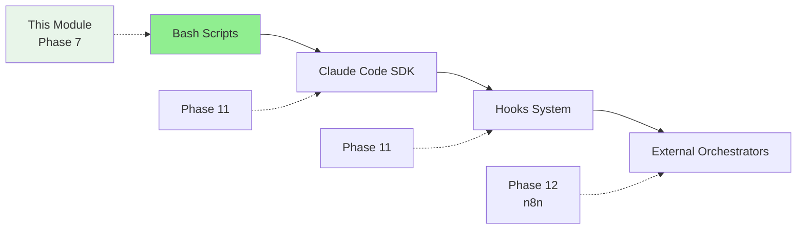
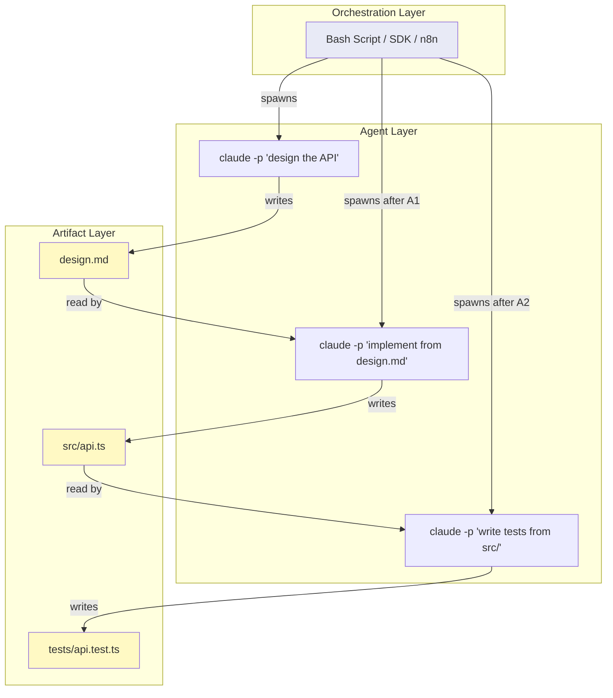

# Module 7.5: Orchestration Tools

> **Estimated time**: ~35 minutes
>
> **Prerequisite**: Module 7.4 (Agentic Loop Patterns)
>
> **Outcome**: After this module, you will understand the orchestration tool landscape, be able to write basic bash scripts for multi-agent coordination, and know when to graduate to more advanced tools.

---

## 1. WHY — Why This Matters

You've learned multi-agent patterns and agentic loops, but you're still doing everything manually — opening multiple terminals, copy-pasting between them, manually coordinating handoffs. For a 3-agent pipeline, you're spending 10 minutes just orchestrating the conversation flow. There must be a way to automate this.

Orchestration tools let you script the coordination. From simple bash scripts to full SDK integration, there's a spectrum of tools for different automation needs. The right tool can turn a 10-minute manual process into a 10-second automated one.

---

## 2. CONCEPT — Core Ideas

### The Orchestration Spectrum

From simple to complex, here's the tool landscape:



### Level 1: Bash Scripts (This Module's Focus)

`claude -p` is the foundation of scripted orchestration:
- **One-shot execution**: run, get result, exit
- **File-based communication**: output to files, read from files
- **Combine with bash**: loops, variables, conditionals, functions

**Good for**: Simple pipelines, CI/CD integration, quick automation

### Level 2: Claude Code SDK (Preview — Phase 11)

Programmatic control from Node.js/Python:
- Structured responses
- Error handling
- State management

**Good for**: Complex applications, custom tools
⚠️ SDK details verified in Phase 11

### Level 3: Hooks System (Preview — Phase 11)

Event-driven automation:
- Pre/post hooks for file writes, commands
- Trigger scripts on Claude actions
- Validation, logging, integration

**Good for**: Reactive workflows, guardrails
⚠️ Hooks details verified in Phase 11

### Level 4: External Orchestrators (Preview — Phase 12)

Visual workflow engines (n8n, etc.):
- Multi-system integration
- Visual workflow design
- Enterprise-grade features

**Good for**: Complex multi-system workflows
Details in Phase 12

### Choosing the Right Level

| Need | Tool | Why |
|------|------|-----|
| Quick automation | Bash script | Simple, no dependencies |
| CI/CD pipeline | Bash + `claude -p` | Integrates anywhere |
| Complex application | SDK (Phase 11) | Programmatic control |
| Event-driven workflow | Hooks (Phase 11) | React to actions |
| Enterprise orchestration | n8n (Phase 12) | Visual, maintainable |

**Key principle**: Start simple. Graduate to complexity only when you need the features. Most teams never need beyond bash scripts.

### Data Flow in Orchestration

Understanding how data moves between the three layers of an orchestrated workflow:



**Three layers at play**:

1. **Orchestration Layer**: Controls sequencing, parallelism, and error handling. This is your bash script, SDK code, or n8n workflow. It never touches code directly — it only spawns agents and checks results.

2. **Agent Layer**: Each `claude -p` invocation runs with fresh context. Agents don't know about each other. They receive instructions from the orchestrator and produce artifacts.

3. **Artifact Layer**: Files on disk that carry data between agents. Agent 1 writes `design.md`, Agent 2 reads it as input. This is the communication channel — agents talk through files, not through shared memory.

**Why this separation matters**: The orchestration layer is debuggable (it's just bash/code). The agent layer is replaceable (swap models, change prompts). The artifact layer is inspectable (check intermediate files). When something goes wrong, you can pinpoint exactly which layer failed.

---

## 3. DEMO — Step by Step

**Task**: Build a code review pipeline with 3 specialized agents that runs automatically.

**Step 1: Create the orchestration script**

```bash
#!/bin/bash
# code-review-pipeline.sh

FILE_TO_REVIEW=$1

if [ -z "$FILE_TO_REVIEW" ]; then
  echo "Usage: ./code-review-pipeline.sh <file>"
  exit 1
fi

echo "=== Code Review Pipeline ==="
echo "Target: $FILE_TO_REVIEW"

# Agent 1: Security Review
echo ""
echo "[1/3] Security review..."
claude -p "Review $FILE_TO_REVIEW for security issues.
Focus on: SQL injection, XSS, auth bypass, secrets exposure.
List issues with line numbers." > security-review.md

# Agent 2: Performance Review
echo "[2/3] Performance review..."
claude -p "Review $FILE_TO_REVIEW for performance issues.
Focus on: N+1 queries, memory leaks, blocking calls, inefficient loops.
List issues with line numbers." > performance-review.md

# Agent 3: Style Review
echo "[3/3] Style review..."
claude -p "Review $FILE_TO_REVIEW for code style issues.
Focus on: naming conventions, function length, documentation gaps.
List issues with line numbers." > style-review.md

# Aggregator: Combine results
echo ""
echo "Aggregating results..."
claude -p "Read security-review.md, performance-review.md, style-review.md.
Create unified REVIEW.md with sections:
- Critical (security)
- Important (performance)
- Minor (style)
Prioritize by severity." > /dev/null

echo "✓ Review complete! See REVIEW.md"
```

**Why this works**: Each `claude -p` call is independent. Output goes to files. Next agent reads from files. Simple coordination through the filesystem.

**Step 2: Run the pipeline**

```bash
$ chmod +x code-review-pipeline.sh
$ ./code-review-pipeline.sh src/services/userService.ts
```

Expected output:
```
=== Code Review Pipeline ===
Target: src/services/userService.ts

[1/3] Security review...
[2/3] Performance review...
[3/3] Style review...

Aggregating results...
✓ Review complete! See REVIEW.md
```

**Why this matters**: No manual intervention. Pass the file path, get structured review. CI/CD ready.

**Step 3: Examine the output**

```bash
$ cat REVIEW.md
```

Expected output:
```markdown
# Code Review: src/services/userService.ts

## Critical (Security)
- **Line 45**: SQL query uses string concatenation — potential injection
- **Line 78**: API key hardcoded in source

## Important (Performance)
- **Line 23**: N+1 query in getUserOrders() loop
- **Line 56**: Blocking file read in async function

## Minor (Style)
- **Line 12**: Function fetchUser lacks JSDoc
- **Line 34**: Magic number 86400 should be constant
```

**Key observations**:
- 4 agents total (3 reviewers + 1 aggregator)
- File-based communication between agents
- Sequential execution but could be parallelized
- CI/CD ready — no interactive prompts

---

## 4. PRACTICE — Try It Yourself

### Exercise 1: Parallel Execution

**Goal**: Make the code review pipeline faster with parallel agents.

**Instructions**:
1. Modify `code-review-pipeline.sh` to run 3 review agents in parallel
2. Use `&` to background each agent
3. Use `wait` to wait for all to complete
4. Measure time difference vs sequential

**Expected result**: ~3x faster for 3 parallel agents.

<details>
<summary>💡 Hint</summary>

```bash
# Run in parallel
claude -p "security review..." > security.md &
claude -p "performance review..." > perf.md &
claude -p "style review..." > style.md &
wait  # Wait for all background jobs
```
</details>

<details>
<summary>✅ Solution</summary>

```bash
#!/bin/bash
# code-review-pipeline-parallel.sh

FILE=$1

if [ -z "$FILE" ]; then
  echo "Usage: ./code-review-pipeline-parallel.sh <file>"
  exit 1
fi

echo "=== Parallel Code Review Pipeline ==="
echo "Target: $FILE"
echo ""
echo "Running 3 agents in parallel..."

START=$(date +%s)

# Parallel execution
claude -p "Review $FILE for security issues.
Focus on: SQL injection, XSS, auth bypass, secrets.
List issues with line numbers." > security-review.md &

claude -p "Review $FILE for performance issues.
Focus on: N+1 queries, memory leaks, blocking calls.
List issues with line numbers." > performance-review.md &

claude -p "Review $FILE for style issues.
Focus on: naming, function length, documentation.
List issues with line numbers." > style-review.md &

# Wait for all background jobs to complete
wait

echo "All agents done in $(($(date +%s) - START)) seconds"
echo ""
echo "Aggregating results..."

claude -p "Read security-review.md, performance-review.md, style-review.md.
Create unified REVIEW.md with sections:
- Critical (security)
- Important (performance)
- Minor (style)
Prioritize by severity." > /dev/null

echo "✓ Review complete! See REVIEW.md"
```

**Timing comparison**:
- Sequential: ~45 seconds (15s × 3)
- Parallel: ~18 seconds (concurrent execution)
- **Speedup**: 2.5x faster

**Why parallel works here**: Three agents analyze the same file independently. No dependencies between them.
</details>

### Exercise 2: Error Handling

**Goal**: Make the pipeline robust with error handling.

**Instructions**:
1. Check exit codes after each `claude -p` call
2. If an agent fails, retry once
3. Log all errors to `error.log`
4. Exit with failure if any agent fails after retry

**Expected result**: Robust pipeline that handles transient failures.

<details>
<summary>💡 Hint</summary>

```bash
claude -p "task" > output.md
if [ $? -ne 0 ]; then
  echo "Failed! Retrying..."
  claude -p "task" > output.md
  if [ $? -ne 0 ]; then
    echo "Retry failed" >> error.log
    exit 1
  fi
fi
```
</details>

<details>
<summary>✅ Solution</summary>

```bash
#!/bin/bash
# code-review-pipeline-robust.sh

FILE=$1

if [ -z "$FILE" ]; then
  echo "Usage: ./code-review-pipeline-robust.sh <file>"
  exit 1
fi

# Error handling function
run_agent() {
  local name=$1
  local prompt=$2
  local output=$3

  echo "[$name] Running..."
  claude -p "$prompt" > "$output"

  if [ $? -ne 0 ]; then
    echo "[$name] Failed! Retrying..." >&2
    sleep 2
    claude -p "$prompt" > "$output"

    if [ $? -ne 0 ]; then
      echo "$(date): $name failed after retry" >> error.log
      echo "[$name] Failed after retry" >&2
      return 1
    fi
  fi

  echo "[$name] Done"
  return 0
}

echo "=== Robust Code Review Pipeline ==="
echo "Target: $FILE"
echo ""

# Run each agent with error handling
run_agent "Security" \
  "Review $FILE for security issues. Focus on: SQL injection, XSS, auth bypass." \
  "security-review.md" || exit 1

run_agent "Performance" \
  "Review $FILE for performance issues. Focus on: N+1 queries, memory leaks." \
  "performance-review.md" || exit 1

run_agent "Style" \
  "Review $FILE for style issues. Focus on: naming, documentation." \
  "style-review.md" || exit 1

echo ""
echo "All agents succeeded. Aggregating..."

run_agent "Aggregator" \
  "Read security-review.md, performance-review.md, style-review.md.
Create unified REVIEW.md with prioritized sections." \
  "/dev/null" || exit 1

echo "✓ Review complete! See REVIEW.md"
```

**What this handles**:
- Network failures (retry mechanism)
- Logging (error.log tracks failures)
- Clean exits (return codes propagate)
- User feedback (clear status messages)
</details>

---

## 5. CHEAT SHEET

### Bash + Claude One-Liners

```bash
# Basic one-shot
claude -p "task" > output.md

# With file content
claude -p "Review: $(cat file.ts)"

# Sequential pipeline
claude -p "design API" > design.md && \
claude -p "Implement based on design.md"

# Parallel agents
claude -p "task1" > out1.md &
claude -p "task2" > out2.md &
wait

# Loop over files
for f in src/*.ts; do
  claude -p "Review $f" > "reviews/$(basename $f .ts).md"
done

# Conditional execution
claude -p "check code" > result.md
if grep -q "ERROR" result.md; then
  claude -p "fix errors in result.md"
fi
```

### Error Handling Pattern

```bash
claude -p "task" > output.md
if [ $? -ne 0 ]; then
  echo "Failed!" >> error.log
  exit 1
fi
```

### Retry Pattern

```bash
run_with_retry() {
  local cmd=$1
  $cmd || { sleep 2; $cmd; }
}

run_with_retry "claude -p 'task' > output.md"
```

### Tool Selection Guide

| Need | Tool | Reason |
|------|------|--------|
| Quick automation | Bash | Simple, no dependencies, works everywhere |
| CI/CD pipeline | Bash + `claude -p` | Integrates with GitHub Actions, GitLab CI, etc. |
| Complex application | SDK (Phase 11) | Programmatic control, structured data |
| Event-driven workflow | Hooks (Phase 11) | React to Claude actions automatically |
| Enterprise orchestration | n8n (Phase 12) | Visual design, multi-system integration |

---

## 6. PITFALLS — Common Mistakes

| ❌ Mistake | ✅ Correct Approach |
|-----------|-------------------|
| Jumping to SDK for simple automation | Start with bash. Graduate to SDK when you need programmatic control. 90% of teams never need beyond bash. |
| No error handling in scripts | Always check `$?`. Add retries for transient failures. Log errors to file. Exit with non-zero on failure. |
| Sequential when parallel is possible | Use `&` and `wait` for independent agents. 3x faster for 3 parallel agents. Parallelize everything that can run concurrently. |
| Unstructured output between agents | Request structured output (JSON or markdown sections) for reliable parsing. "List issues with line numbers" is better than "tell me about problems". |
| Hardcoding file paths and prompts | Use variables and arguments: `$1`, `$FILE`, `$TASK`. Make scripts reusable. One script for all files, not one script per file. |
| Ignoring token costs in loops | Add cost checks. Estimate before running: files × tokens/file × price. One team ran a loop on 10,000 files by accident — $2,000 bill. |
| Over-engineering orchestration | This module = foundation. Advanced patterns in Phase 11-12. Master bash first. You don't need SDK unless bash is painful. |

---

## 7. REAL CASE — Production Story

**Scenario**: Vietnamese fintech team needed nightly code quality checks on 200-file microservices codebase. Manual reviews took 2+ hours daily. Senior dev spent first hour of each day just reviewing changes from offshore team.

**Problem**: Manual process didn't scale. Offshore team (different timezone) pushed code at 6 PM Vietnam time. Morning reviews delayed critical bug fixes by 12+ hours.

**Solution**: Bash orchestration running in CI.

```bash
#!/bin/bash
# nightly-review.sh

echo "Starting nightly review at $(date)"

# Create reports directory
mkdir -p reports

# Review each service in parallel
for dir in src/services/*/; do
  service=$(basename "$dir")
  echo "Reviewing $service..."

  claude -p "Review $dir for issues. Focus on:
  - Security vulnerabilities (SQL injection, XSS, auth bypass)
  - Performance problems (N+1 queries, memory leaks)
  - Code style violations

  Format as markdown with sections:
  - CRITICAL (security issues - must fix immediately)
  - WARNINGS (performance issues - should fix this sprint)
  - NOTES (style issues - nice to fix)

  Include file:line references for each issue." \
    > "reports/${service}.md" &
done

# Wait for all reviews to complete
wait

echo "All reviews complete. Aggregating..."

# Aggregate all reports
claude -p "Read all files in reports/.
Create summary.md with:
1. Executive Summary (count of critical/warning/note issues)
2. Critical Issues (must fix today)
3. Warnings (should fix this week)
4. Notes (backlog)

For each issue: service name, file, line, description, recommendation." \
  > summary.md

# Alert on critical issues
if grep -q "CRITICAL" summary.md; then
  # Extract critical count
  CRITICAL_COUNT=$(grep -c "CRITICAL" summary.md)

  # Send to Slack
  curl -X POST "$SLACK_WEBHOOK" \
    -H 'Content-Type: application/json' \
    -d "{\"text\":\"⚠️ Nightly review found $CRITICAL_COUNT critical issues. See summary.md\"}"
fi

echo "Review complete at $(date). See summary.md"
```

**CI Integration** (GitHub Actions):

```yaml
# .github/workflows/nightly-review.yml
name: Nightly Code Review

on:
  schedule:
    - cron: '0 14 * * *'  # 9 PM Vietnam time (UTC+7)

jobs:
  review:
    runs-on: ubuntu-latest
    steps:
      - uses: actions/checkout@v3
      - name: Run review pipeline
        env:
          SLACK_WEBHOOK: ${{ secrets.SLACK_WEBHOOK }}
        run: ./scripts/nightly-review.sh
      - name: Upload reports
        uses: actions/upload-artifact@v3
        with:
          name: review-reports
          path: |
            reports/
            summary.md
```

**Results**:
- **Time**: 2 hours manual → 15 minutes automated
- **Coverage**: 100% of changed files reviewed daily
- **Response**: Critical issues trigger Slack alert, team sees notification in morning
- **Cost**: ~$3/night (200 files × ~2000 tokens/file × $0.003/1K tokens)
- **ROI**: Senior dev time saved = 10 hours/week = $500/week value

**Key insight from team lead**: "We evaluated n8n and custom SDK solutions, but bash + `claude -p` was enough. The key wasn't the tool — it was making it automatic. Now the offshore team gets feedback in their morning (our evening), and we see results in our morning. 24-hour feedback loop became 12 hours. Can't imagine going back to manual reviews."

**Evolution**: After 3 months, they added performance benchmarking and dependency vulnerability scanning to the same pipeline. Still bash. Still works.

---

> **Phase 7 Complete!** You now understand multi-agent architecture, agentic loops, and orchestration basics. You can build automated pipelines with bash scripts and know when to graduate to more advanced tools.
>
> **Next Phase**: [Phase 8: Meta-Debugging](../../phase-08-meta-debugging/01-hallucination-detection/) — Learn to debug Claude itself when things go wrong.
