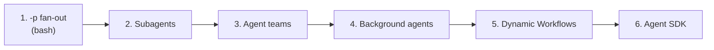

# Module 7.5: Orchestration Tools

> **Estimated time**: ~35 minutes
>
> **Prerequisite**: Module 7.4 (Agentic Loop Patterns)
>
> **Outcome**: After this module, you will be able to fan a task out over many files with
> `claude -p`, manage **background agents** (`--bg`, `claude agents`), and name the rung of the
> ladder a job belongs on.

---

## 1. WHY — Why This Matters

Fifty files need the same mechanical change. You could paste fifty prompts into one session and
watch the context rot, or write one line of bash. Later the job grows teeth — an hour of work, on
three repos, while you do something else — and bash is no longer the answer.

There is a ladder here, and most people never look past the rung they learned first. Knowing all
six means picking the cheapest that fits.

---

## 2. CONCEPT — Core Ideas

### The ladder


```mermaid
graph LR
    A["1. -p fan-out<br/>(bash)"] --> B["2. Subagents"]
    B --> C["3. Agent teams"]
    C --> D["4. Background agents"]
    D --> E["5. Dynamic Workflows"]
    E --> F["6. Agent SDK"]
```

1. **Headless fan-out** — `claude -p` in a shell loop: one cold session per item, no shared state,
   testable exit codes. For independent, mechanical items.
2. **Subagents** — delegation inside one session; each returns a summary (Module 7.3).
3. **Agent teams** — named teammates, shared task list, messaging (Module 7.3). ⚠️ Experimental,
   disabled by default. For research, review, separate modules.
4. **Background agents** — sessions detached from your terminal, managed with `claude agents`.
   For long work you check later.
5. **Dynamic Workflows** — a JavaScript script orchestrating many subagents at once, run by a
   runtime, when a job needs more agents than one conversation can coordinate. Covered later.
6. **[Agent SDK](../../phase-11-automation-headless/02-claude-agent-sdk/)** — your own program
   drives the loop, when the orchestration *is* the product.

### Choosing a rung (S15)

| | Subagents | Agent teams | Workflows |
|---|---|---|---|
| Who decides what runs next | *"Claude, turn by turn"* | *"The lead agent, turn by turn"* | *"The script"* |
| Where intermediate results live | *"Claude's context window"* | *"A shared task list"* | *"Script variables"* |
| Scale | *"A few delegated tasks per turn"* | *"A handful of long-running peers"* | *"Dozens to hundreds of agents per run"* |

Headless fan-out sits below all three: the shell decides, the filesystem holds results, scale is
however many times your loop runs. Nothing here is free — every `claude -p` pays for a cold
context, and a teammate is a whole extra session, which the costs page puts at *"approximately 7x
more tokens than standard sessions when teammates run in plan mode"* (S15). Climb when the job
needs it, not because a rung is newer.

### Fan-out is denied by default

`claude -p` starts with nothing pre-authorized, so the loop body must say what it may do:
`--allowedTools "Edit,Bash(git commit *)"` or `--permission-mode acceptEdits`. Without that, each
run edits nothing and the loop reports success over fifty no-ops.

> `(S1)`, `(S15)`: `docs/references/anthropic-sources.md`.

---

## 3. DEMO — Step by Step

**Step 1: Three files needing the same change**

```bash
cat > src/strings.js << 'EOF'
export function slugify(s) { return s.toLowerCase().trim().replace(/\s+/g, '-'); }
EOF
# …and src/arrays.js (chunk), src/dates.js (isoDay)
git add src/*.js && git commit -q -m "add three helper modules"
```

**Step 2: Fan out with `-p` (S1)**

```bash
# docs: headless#allowed-tools · best-practices#parallel-sessions
for f in src/strings.js src/arrays.js src/dates.js; do
  echo "=== $f ==="
  claude -p "Add a one-line JSDoc comment above the exported function in $f, then commit just
that file with the message 'docs: jsdoc for $f'. Reply with OK or FAIL and nothing else." \
    --permission-mode default --allowedTools "Edit,Bash(git commit *)"
done
```

```text
# Output may vary
=== src/strings.js ===
OK

=== src/arrays.js ===
OK

=== src/dates.js ===
OK
```

```bash
git log --oneline -4
```

```text
# Output may vary
27c7597 docs: jsdoc for src/dates.js
f56e1ec docs: jsdoc for src/arrays.js
ec31a8e docs: jsdoc for src/strings.js
5c47bb5 add three helper modules
```

Three cold sessions, three commits, no shared context. Two details make it work: the prompt ends in
a one-word contract (`OK`/`FAIL`), and `--allowedTools` names exactly what a run may do — edit that
file, commit. `--permission-mode default` forces the stock behaviour; on a fresh install you get
the same without it unless `settings.json` sets `permissions.defaultMode`.

**Step 3: Dispatch a background agent**

```bash
# docs: cli-reference#bg · agent-view
claude --bg --name exports-audit --permission-mode default \
  "List every exported function in src/ as a Markdown table with columns file and function."
```

```text
# Output may vary
Starting background service…
backgrounded · 5db069a6 · exports-audit
  claude agents             list sessions
  claude attach 5db069a6    open in this terminal
  claude logs 5db069a6      show recent output
  claude stop 5db069a6      stop this session
```

Note the shape: `--bg` takes its prompt **positionally**, refuses `-p`, returns at once, and prints
the four commands you will need.

**Step 4: Watch it, then stop it**

```bash
claude agents --json
```

```json
[
  {
    "pid": 9102,
    "id": "5db069a6",
    "cwd": "/Users/luatnq/cc-lab",
    "kind": "background",
    "startedAt": 1790084514332,
    "sessionId": "5db069a6-905f-44ab-98a5-e17e7dcb6e19",
    "name": "exports-audit",
    "status": "idle",
    "state": "done"
  }
]
```

`# Output may vary` — one entry shown; the array covers every session on the machine, so filter by
`cwd`. Poll `state`: `working`, `blocked`, `done`, `failed`, `stopped`. Bare `claude agents` opens
the interactive agent view and needs a real terminal; `claude logs <id>` prints recent output,
`claude attach <id>` opens the session here.

```bash
claude stop 5db069a6
```

```text
# Output may vary
stopped 5db069a6
```

Always stop what you start — background agents outlive their shell.

**Step 5: Rungs 2 and 3 you already have**

Rule of thumb: stay in one session (subagents, teams — Module 7.3) while the work shares context,
fan out with `-p` when items are independent, detach with `--bg` when the work outlives your
attention. For CI, see Module 11.4.

---

## 4. PRACTICE — Try It Yourself

### Exercise 1: Refine on three, then run the set

**Goal**: Make a fan-out prompt safe before it touches fifty files.

**Instructions**: pick a mechanical change across many files. Run the loop over **three**, read the
diffs, fix the prompt, then run the rest. Each run answers `OK` or `FAIL`.

**Expected result**: three clean diffs — and a prompt you trust on the rest.

<details>
<summary>💡 Hint</summary>

Anthropic on this pattern: *"Refine your prompt based on what goes wrong with the first 2-3 files,
then run on the full set."* (S1)
</details>

<details>
<summary>✅ Solution</summary>

```bash
for f in $(cat files.txt); do
  claude -p "Migrate $f … Return OK or FAIL." --allowedTools "Edit,Bash(git commit *)" \
    || echo "$f" >> failed.txt
done
```

Committing per file makes the loop restartable: a failed file is one `git revert` away and
`failed.txt` is your retry list.
</details>

### Exercise 2: Dispatch, poll, stop

**Goal**: Run a long job detached and manage it from the CLI.

**Instructions**: dispatch a read-only audit with `claude --bg --name <name>`, poll
`claude agents --json` until `state` is `done`, read it with `claude logs <id>`, then
`claude stop <id>`.

**Expected result**: `state` moves `working` → `done`; the entry disappears after the stop.

<details>
<summary>💡 Hint</summary>

Filter the array — it lists every Claude Code session on the machine:
`claude agents --json | jq '[.[] | select(.cwd == "'"$PWD"'")]'`
</details>

<details>
<summary>✅ Solution</summary>

A background agent that needs a permission it lacks goes to `state: "blocked"` and waits instead of
failing. So `--bg` jobs should be read-only or carry an explicit `--permission-mode` /
`--allowedTools`: nobody is there to answer the prompt.
</details>

---

## 5. CHEAT SHEET

| Command / Feature | Description | Example |
|---|---|---|
| `for f in …; do claude -p … done` | Fan-out, one session per item | `--allowedTools "Edit,Bash(git commit *)"` |
| `--allowedTools` · `--permission-mode` | Pre-authorize the loop body | required when `-p` writes |
| `--output-format json` | Machine-readable result | `\| jq` |
| `claude --bg "<prompt>"` | Dispatch a background session | `--name` labels it; refuses `-p` |
| `claude agents` | Agent view (interactive) | `--json`, `--json --all`, `--cwd` |
| `claude attach <id>` · `claude logs <id>` | Open it here · print recent output | — |
| `claude stop <id>` | Stop it (alias `claude kill`) | always clean up |
| `state` | `working`, `blocked`, `done`, `failed`, `stopped` | poll this |
| Subagents · agent teams · Agent SDK | Rungs 2, 3 and 6 | Modules 7.3, 11.2 |

---

## 6. PITFALLS — Common Mistakes

| ❌ Mistake | ✅ Correct Approach |
|---|---|
| "Bash is enough for everything" | Enough for independent mechanical items; shared context wants subagents, long detached work wants `--bg` |
| `claude -p "fix $f"` with no permission flag | Nothing is pre-authorized in `-p`: the run edits nothing and still bills |
| An agent team for a same-file refactor | Teams cost far more (S15) and overwrite each other; use one session |
| Free-form output parsed with `grep` | End the prompt with a contract: `OK`/`FAIL`, or `--output-format json` |
| Running the loop on all 50 files first | Refine on 2-3, read the diffs, then run the set (S1) |
| `claude --bg -p "…"` | `--bg` takes the prompt positionally and refuses `-p` |
| Leaving background agents running | `claude agents --json`, then `claude stop <id>` |

---

## 7. REAL CASE — Production Story

**Scenario**: A Vietnamese fintech team ran a nightly quality pass over a microservices repo. The
offshore team pushed at 18:00 local time; a senior dev spent the first hour of every morning
reading those diffs by hand, so fixes landed a day late.

**Problem**: The first automation was one `claude -p` per service writing a report file — and the
reports came out empty. Nothing was pre-authorized, so every run was denied before it wrote a line,
while the loop reported success because `claude` exited cleanly.

**Solution**: Two changes. The loop body got `--allowedTools` naming exactly the tools a reviewer
needs, and each run used `--output-format json` so the wrapper could test the result instead of
trusting the exit path. Per-service runs fan out with `&` and `wait`; aggregation stays one session
reading the reports, because that part is not independent. It runs from CI (Module 11.4).

**Result**: Feedback now waits for the offshore team when they start their day. The pipeline is
still a shell script — the ladder was at the right rung, the permissions were wrong.

**Takeaway**: when a fan-out "works" but produces nothing, suspect permissions, not prompts.

---

> **Phase 7 complete.** You can pick a permission level, run a bounded auto workflow, delegate to
> subagents and teams, close a loop with a verifier, and orchestrate across sessions.
>
> **Next**: [Phase 8: Meta-Debugging](../../phase-08-meta-debugging/01-hallucination-detection/) →
