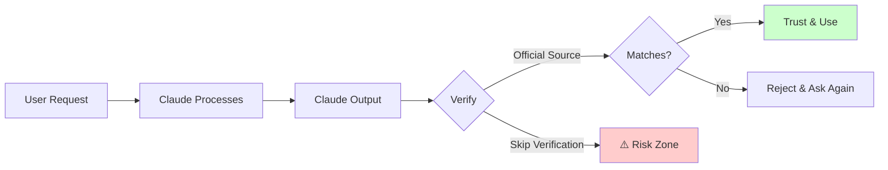

# Module 8.1: Hallucination Detection & Prevention

> **Estimated time**: ~35 minutes
>
> **Prerequisite**: Module 7.5 (Multi-Agent Orchestration Tools)
>
> **Outcome**: After this module, you will be able to systematically detect and prevent AI hallucinations in Claude's outputs, protecting your projects from plausible but incorrect information.

---

## 1. WHY — Why This Matters

You're building a React Native app. Claude confidently suggests installing `react-native-fast-image-loader` to optimize image loading. The package name looks professional, follows naming conventions, and Claude provides detailed usage examples. You run `npm install react-native-fast-image-loader`, wait through the installation, add the import, configure your app, and... "Module not found."

Thirty minutes later, you discover the package doesn't exist. Claude hallucinated it. The confidence in its tone made you skip verification. This happens constantly — not just with packages, but with API methods, CLI flags, configuration syntax, and even security settings. **AI hallucinations are the silent time-sink in AI-assisted development.** The cost isn't just lost time; it's misplaced trust that can lead to production bugs, security vulnerabilities, or architectural decisions based on features that don't exist.

---

## 2. CONCEPT — Core Ideas

**Hallucination** in AI systems means generating plausible but factually incorrect information. Claude (and all large language models) predict the most likely next tokens based on patterns in training data, not by looking up verified facts in real-time databases. This fundamental architecture means Claude can be confidently wrong.

### Why Hallucinations Happen

LLMs are pattern-completion engines, not search engines. When Claude sees "react-native-" it knows hundreds of real packages start that way. If it hasn't seen the exact package you need in training data, it constructs a plausible name following the pattern. To Claude, `react-native-fast-image-loader` looks just as valid as `react-native-fast-image` (which is real).

### Common Hallucination Categories

1. **Package/Library Names**: `awesome-react-hooks`, `python-json-validator-plus` — sound real, don't exist
2. **API Methods**: `fs.readFileAsync()` (Node.js fs is callback-based), `Array.findLast()` (older JS)
3. **CLI Flags**: `git commit --auto-stage`, `docker run --safe-mode` — invented flags
4. **File Paths**: `~/.claude/cache/sessions/`, `/usr/local/share/claude/` — may not exist
5. **Version Numbers**: "Added in v2.3.4", "Deprecated in v3.1.0" — manufactured history
6. **Configuration Syntax**: Wrong YAML indentation, non-existent config keys

### Risk Levels

| Risk | Scenario | Impact |
|------|----------|--------|
| **Low** | Wrong comment or variable name | Easy to spot during review |
| **Medium** | Wrong API method | Compile error or runtime crash |
| **High** | Wrong security configuration | Silent vulnerability in production |
| **Critical** | Wrong package name from malicious registry | Supply chain attack vector |

The danger isn't just wasted time — it's that plausible-sounding errors bypass your mental red flags.

### Verification Mental Model



**Core principle**: Confidence doesn't equal accuracy. Always verify against authoritative sources.

---

## 3. DEMO — Step by Step

**Scenario**: You're optimizing image loading in a React Native app. Claude suggests a package that sounds perfect but might not exist.

### Step 1: Suspect — Receive the Suggestion

You ask Claude: "What's the best package for fast image loading in React Native?"

Claude responds:
```
I recommend using `react-native-fast-image-loader`. It provides
automatic caching, lazy loading, and placeholder support.

Install it with:
npm install react-native-fast-image-loader
```

**Red flag check**: Generic descriptive name, no GitHub link provided, too-perfect feature match.

### Step 2: Verify — Check Official Registry

Before running the install command, verify the package exists:

```bash
$ npm view react-native-fast-image-loader
```

Expected output if it doesn't exist:
```
npm error code E404
npm error 404 Not Found - GET https://registry.npmjs.org/react-native-fast-image-loader
npm error 404 'react-native-fast-image-loader@latest' is not in this registry.
```

**Why this matters**: You just saved 30+ minutes of debugging why your import isn't working.

### Step 3: Correct — Request Verified Alternatives

Go back to Claude with evidence:

```
That package doesn't exist in npm (I verified with `npm view`).
What are REAL alternatives? Provide the exact npm package names
that I can verify exist.
```

Claude's corrected response might be:
```
You're right, I apologize. Here are real alternatives:

1. `react-native-fast-image` - Most popular option
2. `react-native-cached-image` - Good caching support
3. `expo-image` - If using Expo

Verify each with `npm view <package-name>` before installing.
```

### Step 4: Re-Verify Each Suggestion

Check EACH suggested package:

```bash
$ npm view react-native-fast-image
# Output shows package details = EXISTS ✓

$ npm view react-native-cached-image
# Output shows package details = EXISTS ✓

$ npm view expo-image
# Output shows package details = EXISTS ✓
```

### Step 5: Trust — Use Only After Verification

Now you can safely install:

```bash
$ npm install react-native-fast-image
```

**Verification time**: 2 minutes
**Debugging time saved**: 30+ minutes
**Return on investment**: 15x

---

## 4. PRACTICE — Try It Yourself

### Exercise 1: Hallucination Hunting

**Goal**: Develop a suspicious eye for potential hallucinations.

**Instructions**:
1. Ask Claude to recommend 3 libraries for data validation in Python
2. Identify 3 potential hallucination points in its response (package names, methods, config)
3. Verify each point using official sources (PyPI, GitHub, docs)
4. Document: What was hallucinated? What was real?

**Expected result**: A verification report showing which suggestions passed and which failed.

<details>
<summary>💡 Hint</summary>
Check package names on pypi.org first, then verify API examples in official docs. Don't trust Claude's "this package provides X method" until you see it in the package's own documentation.
</details>

<details>
<summary>✅ Solution</summary>

**Verification Process**:
```bash
# Check each package exists
pip show pydantic  # ✓ Real - most popular validation library
pip show validators  # ✓ Real - simple validation functions
pip show schema  # ✓ Real - exists but less common

# Then verify API examples in official docs
# Visit https://docs.pydantic.dev for pydantic
# Visit https://pypi.org/project/validators/ for validators
```

**Common hallucinations in this scenario**:
- Method names that sound right but don't exist (e.g., `pydantic.validate_dict()` instead of proper model validation)
- Configuration options that are invented (e.g., `validators.strict_mode=True`)
- Mixing API from different libraries

**Lesson**: Package names are easier to verify than API details. Always check official docs for usage examples.
</details>

---

### Exercise 2: API Method Verification

**Goal**: Verify an API method actually exists before using it.

**Instructions**:
1. Ask Claude how to read a file asynchronously in Node.js
2. Claude might suggest `fs.readFileAsync()` (which doesn't exist natively)
3. Verify using Node.js official documentation at nodejs.org
4. Find the ACTUAL correct method

**Expected result**: You identify the hallucination and find the real async file reading methods (`fs.promises.readFile()` or `fs.readFile()` with callback).

<details>
<summary>💡 Hint</summary>
Node.js core `fs` module doesn't have `readFileAsync()`. Check the "File System" section in Node.js docs, specifically look for the `fs.promises` namespace.
</details>

<details>
<summary>✅ Solution</summary>

**Hallucinated suggestion**:
```javascript
// ❌ This doesn't exist in Node.js core
const data = await fs.readFileAsync('file.txt', 'utf8');
```

**Real methods**:
```javascript
// ✅ Modern Promise-based approach (Node.js 10+)
import { readFile } from 'fs/promises';
const data = await readFile('file.txt', 'utf8');

// ✅ Or using the promises namespace
import fs from 'fs';
const data = await fs.promises.readFile('file.txt', 'utf8');

// ✅ Traditional callback approach
import fs from 'fs';
fs.readFile('file.txt', 'utf8', (err, data) => {
  if (err) throw err;
  console.log(data);
});
```

**Verification source**: https://nodejs.org/api/fs.html#promise-example
</details>

---

### Exercise 3: Path Verification

**Goal**: Verify file paths exist before trying to use them.

**Instructions**:
1. Ask Claude where Claude Code stores its configuration
2. Claude might suggest paths like `~/.claude/config.json` or `~/.config/claude/settings.json`
3. Verify each path on your actual system with `ls -la`
4. Find the REAL config location (hint: it might be different)

**Expected result**: You identify which paths are real vs hallucinated on your system.

<details>
<summary>💡 Hint</summary>
Configuration paths vary by installation method and OS. Check with `ls -la ~/.config/`, `ls -la ~/Library/Application\ Support/`, and the official Claude Code docs.
</details>

---

## 5. CHEAT SHEET

| Hallucination Type | Verification Method | Command/Tool | Authoritative Source |
|---|---|---|---|
| **npm package** | Registry lookup | `npm view <package>` | npmjs.com |
| **Python package** | PyPI lookup | `pip show <package>` | pypi.org |
| **Node.js API** | Official docs | N/A | nodejs.org/api |
| **Browser API** | MDN reference | N/A | developer.mozilla.org |
| **CLI flag** | Help text or man page | `command --help` or `man command` | Tool's official docs |
| **Git command** | Git documentation | `git help <command>` | git-scm.com/docs |
| **File path** | File system check | `ls -la <path>` | Your actual system |
| **Config syntax** | Tool documentation | N/A | Tool's official config reference |
| **Library version** | Changelog | Check repo tags/releases | GitHub releases page |
| **React/Vue API** | Framework docs | N/A | react.dev, vuejs.org |

### Quick Verification Workflow

```bash
# Packages
npm view <package-name>     # npm
pip show <package-name>     # Python
gem list <gem-name>         # Ruby
go get -u <package>@latest  # Go (will fail if not real)

# CLI flags
<command> --help
man <command>

# File paths
ls -la <path>
find ~ -name "<filename>"

# APIs - Must check official docs (no shortcut)
```

### Red Flags Checklist

Before trusting Claude's output, check for:
- [ ] Generic descriptive names (`awesome-X`, `fast-Y-loader`, `super-Z-utils`)
- [ ] No source links provided (no GitHub, no docs URL)
- [ ] "This was added in version X.Y.Z" claims (invented history)
- [ ] Suspiciously perfect feature match (too good to be true)
- [ ] Mixed or inconsistent syntax styles
- [ ] Deprecated warnings without source citation

---

## 6. PITFALLS — Common Mistakes

| ❌ Mistake | ✅ Correct Approach |
|---|---|
| **Trusting confident-sounding responses** | Confidence ≠ accuracy. Claude sounds equally confident whether right or wrong. Always verify. |
| **Only checking the first suggestion** | Verify ALL suggestions, not just the first. Hallucinations can appear anywhere in the response. |
| **Using Claude to verify Claude** | Don't ask Claude "Does X exist?" — it will often confidently confirm its own hallucination. Use external sources. |
| **Assuming "it compiled" means correct** | Compilation success doesn't guarantee runtime behavior is correct. Test actual functionality. |
| **Skipping verification for "simple" things** | Simple things hallucinate too. Package names and CLI flags are common hallucination targets. |
| **Trusting code that "looks right"** | Syntax highlighting and proper formatting don't mean the code uses real APIs. Verify method names. |
| **Relying on Claude's "source citations"** | Claude can't browse the web in real-time. It's reconstructing likely URLs from memory, not linking to actual current pages. |
| **Batch-installing multiple packages without checking** | Check EACH package individually. A real-looking list might contain 2 real packages and 1 hallucinated one. |

### The Most Dangerous Hallucination Type

**Security configurations** are the highest-risk hallucinations because they fail silently:

```yaml
# ❌ Hallucinated Docker security config
docker:
  security:
    safe_mode: true          # Doesn't exist
    auto_scan_vulnerabilities: true  # Not a real flag
```

This looks professional, passes YAML validation, but does nothing. Your deployment runs without the security you think you have.

**Protection**: Always cross-reference security configs with official docs before deploying.

---

## 7. REAL CASE — Production Story

**Scenario**: Vietnamese fintech team building payment gateway integration for a mobile banking app.

**Problem**: The team was integrating with a local payment provider's API. Claude suggested an endpoint structure that looked correct:

```javascript
// Claude's suggestion
const response = await fetch('https://api.payment-provider.vn/v2/transactions/create', {
  method: 'POST',
  headers: {
    'X-API-Key': apiKey,
    'X-Signature': signature,
  },
  body: JSON.stringify({
    amount: 100000,
    currency: 'VND',
    auto_confirm: true,  // ← Hallucinated field
  })
});
```

The code looked professional. Variable names matched the provider's documentation style. The team implemented it, wrote tests with mocked responses (which passed), and deployed to staging.

**Staging failed**: Real API calls returned `400 Bad Request`. The `auto_confirm` field didn't exist — Claude had invented it based on common API patterns. The actual API required a separate `/confirm` endpoint call.

**Impact**:
- 2 days of debugging (weekend work to meet deadline)
- Customer complaints about incomplete transactions in staging
- Team trust in AI assistance dropped significantly

**Root cause**: Team skipped verification because:
1. The suggestion matched the provider's naming conventions
2. Mocked tests passed (they mocked the wrong behavior)
3. Claude explained the logic clearly (which reinforced false confidence)

**Fix implemented**:
```markdown
# Added to team's CLAUDE.md

## AI Output Verification Protocol

Before implementing ANY external API suggestion from AI:

1. ✅ Check official API documentation (not AI-suggested docs)
2. ✅ Verify endpoint URLs in provider's actual API reference
3. ✅ Test each field with minimal real API call in development
4. ✅ Review AI-suggested fields against API schema/OpenAPI spec
5. ✅ For payment/financial APIs: Manual peer review REQUIRED

Never trust AI for external API structures without verification.
```

**Lesson**: The more critical the integration (payments, security, data privacy), the more rigorous your verification must be. Claude doesn't have real-time access to API documentation — it's reconstructing likely patterns from training data.

**Result**: Team now verifies all AI suggestions against official sources before implementation. Saved 15+ hours in the next integration by catching 3 hallucinated config fields during verification phase.

---

## Key Takeaways

1. **Hallucinations are normal AI behavior** — not a bug, but a fundamental characteristic of how LLMs work
2. **Confidence doesn't correlate with accuracy** — Claude sounds equally sure whether right or wrong
3. **Verification is non-negotiable** — especially for packages, APIs, security configs, and external integrations
4. **Use authoritative sources** — npm registry, official docs, man pages, not Claude verifying Claude
5. **Red flags are your friends** — generic names, perfect feature matches, no source links = verify immediately
6. **Critical systems need critical verification** — payments, security, data privacy require manual peer review

Hallucination detection isn't about mistrusting AI — it's about **verifying AI**, which is faster than debugging AI. A 2-minute verification saves a 2-hour debugging session.

---

> **Next**: [Module 8.2: Loop Detection & Breaking](../02-loop-detection/) →
