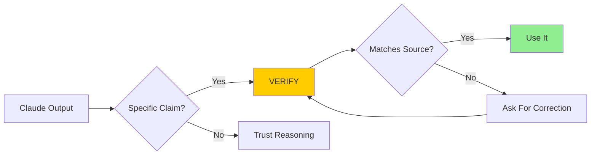

# Module 8.1: Hallucination Detection & Prevention

> **Estimated time**: ~30 minutes
>
> **Prerequisite**: Module 7.5 (Multi-Agent Orchestration Tools)
>
> **Outcome**: After this module, you will recognize hallucination patterns, know the verification
> commands that catch them, and build the habit of checking before you trust.

---

## 1. WHY — Why This Matters

Claude confidently tells you: "Install `npm install vnpay-nodejs`, then call
`VNPay.createPaymentUrl(params)`." You implement it. Build fails. Thirty minutes of debugging later,
the package doesn't exist.

Or worse: Claude suggests a method name that sounds exactly right. It compiles. It ships. Production
breaks because the method never existed.

Claude doesn't signal uncertainty. A wrong answer sounds just as confident as a right one.
Hallucination detection is YOUR job, not Claude's.

---

## 2. CONCEPT — Core Ideas

### What Is a Hallucination?

**Hallucination** = the model generates plausible-sounding but incorrect information. Claude isn't
"lying" — it genuinely predicts the most likely next tokens based on patterns in training data, not
by looking anything up in a live database. That's why a fake package name can look identical to a
real one: not malicious, just a structural limitation.

### Hallucination Categories

| Category | Example | Risk |
|----------|---------|------|
| Package names | `npm install vnpay-nodejs` (real: `vnpay`) | High |
| API methods | `array.flattenDeep()` (native `Array` has no such method — that's lodash) | High |
| CLI flags | `git commit --auto-stage` (invented) | Medium |
| File paths | `src/utils/helpers.ts` that doesn't exist in this repo | Medium |
| Version claims | "Added in v2.3.4" (fabricated history) | High |
| Config syntax | A `tsconfig` option that was never real | High |

### Why Claude Hallucinates

Training data is full of similar-looking names and patterns, and Claude interpolates between them.
It has no live connection to npm's registry baked into its weights — even when it **does** have
tools that can check (see below), it still has to actually use them. A name that "fits the pattern"
of hundreds of real packages looks just as valid to the model as one it has actually seen.

**Correction**: Claude Code is not blind to the internet — it has `WebFetch`/`WebSearch` and can run
`npm view` or `curl` itself when asked. The risk isn't "Claude can't check," it's that **it often
doesn't check unless verification is part of the request**.

### Trust But Verify

**Trust** Claude's reasoning and general approach — it's usually excellent there.
**Verify** every specific, checkable claim: a package name, a method name, a path, a version.

Rule of thumb: the more specific and checkable the claim, the more it needs verification.

### Red Flags

Be extra suspicious when you see:
- A package/method name that sounds "too perfect" for your exact use case
- A specific version number ("added in v2.3.4")
- A file path Claude never actually read
- A CLI flag Claude hasn't run `--help` to confirm


```mermaid
graph LR
    A[Claude Output] --> B{Specific Claim?}
    B -->|Yes| C[VERIFY]
    B -->|No| D[Trust Reasoning]
    C --> E{Matches Source?}
    E -->|Yes| F[Use It]
    E -->|No| G[Ask For Correction]
    G --> C

    style C fill:#ffcc00
    style F fill:#90EE90
```

---

## 3. DEMO — Step by Step

**Scenario**: You're integrating VNPay for a Vietnamese e-commerce checkout. You ask Claude for the
right npm package.

### Step 1: Receive the Suggestion

Claude responds:
```text
Use the `vnpay-nodejs` package:
npm install vnpay-nodejs

import VNPay from 'vnpay-nodejs';
const url = VNPay.createPaymentUrl(params);
```

**Red flag**: `<provider>-nodejs` and `createPaymentUrl` are both generic guesses, not verified facts.

### Step 2: Verify the Package

```bash
$ npm view vnpay-nodejs
```

Real output (run 2026-09-28):
```text
# Output may vary
npm error code E404
npm error 404 Not Found - GET https://registry.npmjs.org/vnpay-nodejs - Not found
npm error 404
npm error 404  'vnpay-nodejs@*' is not in this registry.
npm error 404
npm error 404 Note that you can also install from a
npm error 404 tarball, folder, http url, or git url.
npm error A complete log of this run can be found in: …
```

**Confirmed: hallucination.** You just avoided 30+ minutes of debugging a broken import.

### Step 3: Ask for a Verified Correction

```text
`vnpay-nodejs` doesn't exist — npm view returned a 404. Search npmjs.com for the
real VNPay library and give me the exact package name so I can verify it myself.
```

Claude's corrected response:
```text
You're right, sorry. The real package is `vnpay`:
npm install vnpay
```

### Step 4: Re-Verify

```bash
$ npm view vnpay
```

Real output:
```text
# Output may vary
vnpay@2.5.0 | MIT | deps: 1 | versions: 53
An open-source nodejs library support to payment with VNPay
https://vnpay.js.org

dependencies:
dayjs: ^1.11.13
```

**Confirmed: real.** Now check the API too — don't trust the method name yet:

```bash
$ npm install vnpay
$ cat node_modules/vnpay/README.md | head -60
```

The README shows the real method is `buildPaymentUrl()`, not `createPaymentUrl()` as guessed.

### Step 5: Trust — Now You Can Use It

**Verification workflow**: Suspect → Verify → Correct → Re-verify → Trust. Two minutes of `npm
view` saved a debugging session and, in this case, saved shipping a call to a method that doesn't
exist.

---

## 4. PRACTICE — Try It Yourself

### Exercise 1: Hallucination Hunting

**Goal**: Build a suspicious eye for AI suggestions.

**Instructions**:
1. Ask Claude to recommend 3 npm packages for a task (e.g., date formatting).
2. Run `npm view <package>` for each one; count how many are hallucinated.

**Expected result**: At least one of the three fails verification.

<details>
<summary>✅ Solution</summary>

```bash
$ npm view moment    # ✓ real — long-established package
$ npm view dayjs     # ✓ real — widely used
$ npm view date-fns  # ✓ real — widely used
```

Anything named like `super-date-formatter` or `vn-date-utils` should be verified immediately —
generic, "too perfect" names are the most common hallucination pattern.
</details>

### Exercise 2: API Method Verification

**Goal**: Verify a method exists before implementing against it.

**Instructions**:
1. Ask Claude for a way to deep-flatten a nested array in JavaScript without a library.
2. Claude may suggest `array.flattenDeep()` — a lodash method, not native `Array`.
3. Check the MDN `Array.prototype` reference for the real method.

<details>
<summary>✅ Solution</summary>

**Hallucinated**:
```javascript
// ❌ Not a native Array method
const flat = nested.flattenDeep();
```

**Real** (native, ES2019+):
```javascript
// ✅ Array.prototype.flat() with Infinity depth
const flat = nested.flat(Infinity);
```

**Verification source**: developer.mozilla.org/en-US/docs/Web/JavaScript/Reference/Global_Objects/Array/flat
</details>

### Exercise 3: Path Verification

**Goal**: Verify a file path before trusting it.

**Instructions**: Ask Claude where a config or util lives in your project, then run `ls <path>` or
`find . -name "<filename>"` yourself and compare.

<details>
<summary>✅ Solution</summary>

```bash
# Claude says: "Config lives at src/config/settings.ts"
$ ls src/config/settings.ts
ls: src/config/settings.ts: No such file or directory  # Output may vary

$ find . -name "settings.ts"
./src/lib/config.ts   # Output may vary — real file, different path
```

Claude guessed a conventional path instead of reading the real project structure. `ls`/`find` are
ground truth — never trust a path you haven't checked yourself.
</details>

---

## 5. CHEAT SHEET

| Type | Command | Example |
|------|---------|---------|
| npm package | `npm view <package>` | `npm view vnpay` |
| Python package | `pip show <package>` | `pip show requests` |
| Go module | `go list -m -versions <module>` | `go list -m -versions github.com/gin-gonic/gin` |
| CLI flag | `<command> --help` | `git --help` |
| File path | `ls <path>` | `ls src/utils/` |
| Find a file | `find . -name "<file>"` | `find . -name "*.ts"` |
| Man page | `man <command>` | `man curl` |

### Red Flag Phrases → Verification

- "You can use package X" → `npm view X`
- "Call X.method()" → check the official docs/source
- "The file is at src/..." → `ls src/...`
- "Added in version X.Y.Z" → check the changelog/release tags

### Verification Prompts That Work

```text
"Verify this package exists on npm before suggesting it — run npm view yourself."
"Read the actual README/types of this package before describing its API."
```

---

## 6. PITFALLS — Common Mistakes

| ❌ Mistake | ✅ Correct Approach |
|---|---|
| Trusting a confident-sounding response | Confidence ≠ accuracy. Claude sounds equally sure whether right or wrong. |
| Checking only the first suggestion | Verify every suggestion — hallucinations hide anywhere in a list. |
| Using Claude to verify Claude ("does X exist?") | Use an external source: registry, docs, filesystem. |
| Assuming "Claude can't browse the web" excuses unverified claims | Claude has `WebFetch`/`WebSearch` and can run `npm view` itself — ask it to actually check. |
| Accepting the first passing test run as proof | (S12) **Early victory declaration**: "it ran once" isn't "it's correct." Re-run and inspect. |
| Trusting a fix with no independent check | (S14) "The task verifier is nearly perfect, otherwise Claude will solve the wrong problem" — give it a real check to run. |
| Batch-installing suggested packages without checking each one | A list of 3 can contain 2 real packages and 1 hallucinated one. |

### The Most Dangerous Hallucination: Fake Security Config

```yaml
# ❌ Hallucinated Docker security config — parses fine, does nothing
docker:
  security:
    safe_mode: true                 # not a real key
    auto_scan_vulnerabilities: true # not a real flag
```

It passes YAML validation and looks professional. It provides zero actual protection.

---

## 7. REAL CASE — Production Story

**Scenario**: A Vietnamese startup team integrating VNPay for mobile banking checkout.

**What happened**: A developer asked Claude for the VNPay npm package and got the same
`vnpay-nodejs` / `createPaymentUrl()` suggestion as the DEMO above. The naming matched VNPay's
conventions and Claude explained the flow clearly, which reinforced false confidence — no one ran
`npm view` first. Two hours into implementation, the build still wouldn't resolve the import.

**Root cause found**: `npm view vnpay-nodejs` returned a 404. Both the package name and the method
name were hallucinated — plausible guesses built from VNPay's naming style, not verified facts.

**Cost**: roughly 4 hours total (2 hours implementing the wrong package, 2 hours debugging why
nothing resolved) versus 30 seconds for `npm view`.

**Fix the team adopted** (added to CLAUDE.md): `npm view <package>` before any install; read the
real README/types before using a suggested method name; a second engineer reviews payment
integrations before merge.

**Result**: the team runs `npm view` reflexively now. The next integration caught 3 hallucinated
config fields during verification — before they cost a minute of debugging. Team rule: "New
package? `npm view` first. New API? Read the types first. No exceptions."

---

### Key Takeaways

1. Hallucination is normal model behavior, not a bug.
2. Confidence doesn't correlate with accuracy.
3. Verification is non-negotiable for packages, APIs, security config, and integrations.
4. Claude can check things for you — ask it to verify instead of assuming it can't.
5. Give it (and yourself) a real check to run, not a narrated success (S12, S14).

A 2-minute `npm view` beats a 2-hour debugging session, every time.

---

> **Next**: [Module 8.2: Loop Detection & Breaking](../02-loop-detection/) →
