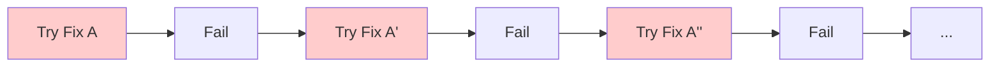

# Module 8.2: Loop Detection & Breaking

> **Estimated time**: ~30 minutes
>
> **Prerequisites**: Module 8.1 (Hallucination Detection), Module 7.4 (Agentic Loop Patterns)
>
> **Outcome**: After this module, you will recognize stuck loop patterns, know multiple intervention strategies, and be able to break loops effectively without losing progress.

---

## 1. WHY — Why This Matters

Claude has been running for 15 minutes. The token counter is climbing. You see the same error message flash by three times. Claude keeps saying "Let me try a different approach" but the approaches look suspiciously similar. You've burned $5 in tokens and the bug still isn't fixed.

Stuck loops are token-burning, time-wasting traps. They happen to everyone — beginners and experts alike. The difference? Experts detect and break them FAST. They don't wait for 10 iterations hoping "the next try will work." They recognize the pattern after 3 attempts and intervene.

Claude doesn't know it's stuck. It will keep trying indefinitely. YOU are the circuit breaker.

---

## 2. CONCEPT — Core Ideas

### What is a Stuck Loop?

A **stuck loop** is when Claude repeatedly attempts similar solutions without making progress. Unlike healthy iteration (which converges toward a solution), stuck loops spin in place.

Characteristics:
- Same or similar errors repeating
- Files edited multiple times with minor variations
- No measurable progress toward the goal
- Token usage climbing without output progress

### Stuck Loop Pattern



Note: A' ≈ A ≈ A'' — slight variations of the same approach, all failing the same way.

### Detection Signals

| Signal | Reliability | Example |
|--------|-------------|---------|
| Same error 3+ times | Very High | "TypeError: X is not a function" repeating |
| Same file edited repeatedly | High | `userService.ts` modified 4 times |
| "Let me try another approach" but similar code | High | Slight variations of same fix |
| Token usage spiking | Medium | `/cost` shows rapid increase |
| Time without visible progress | Medium | 5+ minutes, same problem |
| Claude apologizing repeatedly | Medium | "Sorry, let me try again" |

### Why Loops Get Stuck

1. **Fundamental misunderstanding**: Claude is solving the wrong problem
2. **Missing information**: A file not read, an error not seen
3. **Impossible task**: Conflicting requirements that can't be satisfied
4. **Context pollution**: Old failed attempts confusing new ones

### The 3-Strike Rule

**If the same approach fails 3 times with similar results, intervene immediately.** Don't wait for 5 or 10. Three is the pattern — after that, more attempts rarely help.

### Loop Breaking Strategies (Escalation Ladder)

| Level | Strategy | When to Use |
|-------|----------|-------------|
| 1 | **Redirect** | "Stop. Try a completely different approach." |
| 2 | **Information inject** | "Here's context you might be missing: ..." |
| 3 | **Decompose** | "This is too complex. Solve just [smaller piece] first." |
| 4 | **Context refresh** | `/compact` to clean up, preserve key decisions |
| 5 | **Nuclear reset** | `/clear` and start fresh with lessons learned |
| 6 | **Human takeover** | Some things need human debugging |

---

## 3. DEMO — Step by Step

**Scenario**: Claude is trying to fix a TypeScript type error that keeps recurring.

### Step 1: Observe the Loop Forming

```
Claude: I'll fix the type error in userService.ts...
[Edits file]

Error: Type 'string' is not assignable to type 'User'

Claude: Let me adjust the type annotation...
[Edits same file]

Error: Type 'string' is not assignable to type 'User'

Claude: I see, let me try casting...
[Edits same file]

Error: Type 'string' is not assignable to type 'User'
```

### Step 2: Recognize Stuck Loop Signals

Checklist:
- ✅ Same error 3 times
- ✅ Same file edited repeatedly
- ✅ Approaches are variations of same idea (type adjustments)

**Verdict**: This is a stuck loop. Time to intervene.

### Step 3: Intervene with Redirect

Instead of letting Claude try a 4th type adjustment, you interrupt:

```
Stop. You've tried type adjustments 3 times and got the same error.

Let's step back. Before trying to fix, explain:
1. What is the actual data flowing into this function?
2. Where does the 'string' value originate?
3. Is the type definition correct, or is the data wrong?
```

**Why this works**: You're asking for ANALYSIS instead of more ATTEMPTS. Changing from "fix the symptom" to "understand the cause."

### Step 4: Claude Reframes the Problem

```
Claude: You're right. Let me trace the data flow...

[Reads calling code]

I found it! The API response returns `user: string` (just the user ID),
but the function expects `user: User` (the full object).

The fix isn't type casting — it's fetching the full user object
before calling this function.
```

### Step 5: Verify Escape from Loop

```bash
$ npm run typecheck
```

Expected output:
```
No errors found.
```

**Key insight**: The loop broke because the FRAMING changed. Claude was stuck trying to fix types when the real problem was data flow. Your intervention redirected from "how do I make this type work?" to "what data is actually here?"

---

## 4. PRACTICE — Try It Yourself

### Exercise 1: Loop Simulation

**Goal**: Practice recognizing stuck loop signals.

**Instructions**:
1. Give Claude an intentionally tricky problem (conflicting requirements work well)
2. Watch for stuck loop signals as Claude works
3. Count iterations before you intervene
4. Practice the redirect: "Stop. Explain what you've tried and why it's not working."

**Expected result**: You recognize the loop within 3-4 iterations and intervene effectively.

<details>
<summary>💡 Hint</summary>

Good "trap" prompts that often cause loops:
- "Make this function both sync and async"
- "Add feature X without changing any existing code"
- "Fix the bug" (without providing error details)

Watch for the signals: repeated errors, same file edits, apologetic language.
</details>

### Exercise 2: The 3-Strike Drill

**Goal**: Practice the 3-strike rule.

**Instructions**:
1. Pick a real bug in your codebase
2. Let Claude try to fix it — count the attempts
3. After strike 3 (3 similar failures), intervene using the escalation ladder
4. Note which strategy worked

<details>
<summary>✅ Solution</summary>

**Effective intervention patterns**:

After 3 type errors:
```
Stop. The type error keeps recurring. Before another fix attempt:
1. Read the actual runtime value with console.log
2. Compare to what the type expects
3. Tell me which one is wrong
```

After 3 test failures:
```
Stop. Let's check our assumptions:
1. What does the test actually assert?
2. What does the function actually return?
3. Which one needs to change?
```

The key is asking Claude to ANALYZE before attempting again.
</details>

### Exercise 3: Context Refresh

**Goal**: Practice using `/compact` to break loops.

**Instructions**:
1. Get into a stuck loop intentionally (use Exercise 1's method)
2. Run `/compact`
3. Reframe the problem with fresh wording
4. Compare Claude's behavior before and after refresh

**Expected result**: After `/compact`, Claude often approaches the problem differently because old failed attempts are compressed out of active context.

---

## 5. CHEAT SHEET

### Stuck Loop Signals

| Signal | Action |
|--------|--------|
| Same error 3+ times | 🚨 Intervene NOW |
| Same file edited 3+ times | 🚨 Intervene NOW |
| "Let me try again" with similar code | ⚠️ Watch closely |
| Token burn without progress | ⚠️ Check `/cost` |

### Intervention Escalation Ladder

1. **Redirect**: "Stop. Different approach."
2. **Information**: "You might be missing: ..."
3. **Decompose**: "Just solve [smaller part] first."
4. **Refresh**: `/compact`
5. **Reset**: `/clear`
6. **Human**: You take over

### Intervention Prompts

```
"Stop. You've tried X three times. Explain why it's failing."

"Before fixing, analyze: where does this data actually come from?"

"Let's step back. Is the problem what we think it is?"

"Forget the previous attempts. Fresh approach: ..."
```

### Emergency Commands

| Command | Effect |
|---------|--------|
| `Ctrl+C` | Emergency stop |
| `/cost` | Check token burn |
| `/compact` | Compress context, preserve decisions |
| `/clear` | Nuclear reset (loses progress) |

---

## 6. PITFALLS — Common Mistakes

| ❌ Mistake | ✅ Correct Approach |
|-----------|---------------------|
| Letting loops run hoping "next try will work" | 3-strike rule. Intervene after 3 similar failures. |
| Intervening too early (after 1 retry) | Some iteration is healthy. Wait for pattern, not single failure. |
| "Try harder" interventions ("Really fix it this time") | Change APPROACH, not intensity. Ask for analysis. |
| `/clear` as first response | Escalate: redirect → refresh → reset. `/clear` loses progress. |
| Not checking `/cost` during long sessions | Monitor `/cost`. Stuck loops burn tokens fast. |
| Blaming Claude ("Why can't you fix this?") | Loops mean misalignment. Provide info, change angle. |
| Ignoring your own confusion | If YOU don't understand why it's failing, Claude can't either. |

---

## 7. REAL CASE — Production Story

**Scenario**: Vietnamese dev team debugging an authentication flow. Claude kept trying to fix a "token expired" error by adjusting token refresh logic. 7 attempts, 45 minutes, $8 in tokens.

**What happened**: Each "fix" was a variation of token refresh timing — adjust the expiry window, add a buffer, refresh earlier. Same error every time. Claude was stuck in a "token refresh" mental model.

**The break**: After 7 attempts, the dev finally said:

```
Stop. Forget token refresh. Read the ACTUAL error log, not just
the error message. What's the full context?
```

**Discovery**: The error log showed the token wasn't expired — it was INVALID. The staging environment was using a different API key than production. Token refresh could never fix an invalid key.

**Lesson**: The loop was stuck because the FRAMING was wrong. "Expired" vs "Invalid" — completely different problems requiring completely different solutions. Breaking the loop required changing the frame, not trying harder within it.

**Team rule now**: "After 3 similar failures, we don't try again. We ask: 'What are we assuming that might be wrong?'"

**Cost of waiting**: $8 and 45 minutes vs. intervening at attempt 3 (~$3, ~15 minutes). Early detection matters.

---

> **Next**: [Module 8.3: Context Confusion](../03-context-confusion/) →
