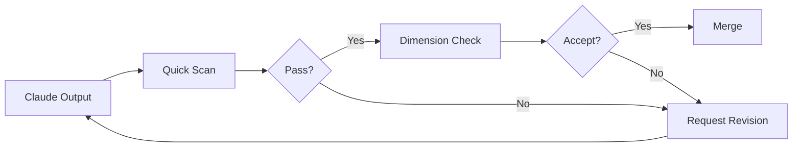

# Module 8.4: Quality Assessment

> **Estimated time**: ~30 minutes
>
> **Prerequisite**: Module 8.3 (Context Confusion)
>
> **Outcome**: After this module, you will have a systematic approach to assessing Claude's output quality, a personal checklist for acceptance criteria, and know when to push for better vs. accept "good enough."

---

## 1. WHY — Why This Matters

Claude produces code. It runs. Tests pass. You merge it. Next week, a colleague asks "Why is this function 200 lines?" You realize you accepted Claude's first output without EVALUATING it.

The code worked but wasn't good. Quality assessment bridges the gap between "it works" and "it's good." Without it, you're trading development speed for technical debt.

---

## 2. CONCEPT — Core Ideas

### Quality Dimensions for Claude Output

| Dimension | Questions to Ask | Red Flags |
|-----------|-----------------|-----------|
| **Correctness** | Does it do what was asked? | Missing requirements, wrong behavior |
| **Completeness** | Is anything left TODO? | `// TODO`, incomplete handlers, missing edge cases |
| **Consistency** | Does it match codebase patterns? | Different naming, different patterns than existing code |
| **Cleanliness** | Is the code maintainable? | 200-line functions, no comments, duplication |
| **Appropriateness** | Is the solution suitable? | Over-engineered for simple task, under-engineered for complex one |

### The Assessment Loop



### Quick Scan Checklist (30 seconds)

Before any deep analysis, do a 30-second gut check:

- [ ] Reasonable length? (not suspiciously short or absurdly long)
- [ ] Familiar patterns? (looks like rest of codebase)
- [ ] No obvious TODOs or placeholders?
- [ ] No commented-out code?
- [ ] Makes sense at first glance?

If Quick Scan fails, request revision immediately. Don't waste time on deep assessment.

### Deep Assessment (when Quick Scan passes)

Run automated checks:
```bash
npm run lint      # Style and basic issues
tsc --noEmit      # Type errors
npm test          # Functionality
git diff          # Review actual changes
```

Then ask Claude for self-review:
- "What would a senior dev criticize about this?"
- "What edge cases might this miss?"
- "Is there a simpler approach?"

### The "Good Enough" Decision

Not all code needs to be perfect.

| Risk Level | Standard | Example |
|------------|----------|---------|
| **High** | Every issue fixed | Payments, authentication, data handling |
| **Medium** | Critical issues fixed | User-facing features |
| **Low** | Works correctly, tech debt noted | Internal tools, prototypes |

Decision factors: Risk level, time pressure, and permanence.

---

## 3. DEMO — Step by Step

**Scenario**: Claude implemented a user search feature. Let's assess it systematically.

### Step 1: Quick Scan

Claude produces 100 lines of search code. Quick scan:

- [x] Length: ~100 lines — reasonable for search feature
- [x] Patterns: Uses async/await like rest of codebase
- [x] TODOs: None visible
- [x] First glance: Looks coherent

Quick Scan passes. Move to deeper check.

### Step 2: Run Automated Checks

```bash
$ npm run lint
```

Expected output:
```
No errors found.
```

```bash
$ tsc --noEmit
```

Expected output:
```
No errors.
```

```bash
$ npm test
```

Expected output:
```
PASS src/services/userService.test.ts
  ✓ should search users by name
  ✓ should return empty array for no matches
```

Automated checks pass. But let's go deeper.

### Step 3: Review with git diff

```bash
$ git diff --stat
```

Expected output:
```
 src/services/userService.ts | 100 +++++++++++++++++++++++++++++
 src/routes/users.ts         |  20 ++++++
 2 files changed, 120 insertions(+)
```

Review the actual code. Notice: Large function, no pagination, no rate limiting.

### Step 4: Ask Claude for Self-Review

```
You: Review the search implementation you just wrote.
What would a senior dev criticize?

Claude: Good points of feedback:
1. No pagination — could return 10,000 results
2. No rate limiting — could be abused
3. Search query not sanitized — potential injection
4. No caching — same search hits DB every time
```

Self-review surfaces real issues that tests and linters missed.

### Step 5: Decide — Accept or Revise?

Categorize the issues:

| Issue | Priority | Action |
|-------|----------|--------|
| No pagination | HIGH | Fix now |
| No sanitization | HIGH | Fix now |
| No rate limiting | MEDIUM | Fix later |
| No caching | LOW | Premature optimization |

```
You: Good feedback. Please add:
1. Pagination (limit 50 per page)
2. Query sanitization

We'll add rate limiting and caching later.
```

**Result**: Caught real issues before merge through systematic assessment.

---

## 4. PRACTICE — Try It Yourself

### Exercise 1: Quick Scan Training

**Goal**: Build your personal Quick Scan checklist.

**Instructions**:
1. Ask Claude to implement a feature (e.g., "Add email validation to signup")
2. Time yourself doing Quick Scan (target: <30 seconds)
3. Note what you instinctively check for
4. Write down your personal Quick Scan checklist

**Expected result**: A personalized 5-7 item checklist you can use consistently.

<details>
<summary>💡 Hint</summary>

Good Quick Scan items:
- File length vs. expected complexity
- Imports (are they familiar packages?)
- Function names (do they match codebase conventions?)
- Error handling (any try/catch visible?)
- Magic numbers or hardcoded values
</details>

### Exercise 2: Self-Review Prompts

**Goal**: Find which self-review prompts work best.

**Instructions**:
1. Get code from Claude
2. Ask Claude to review its own code with different prompts:
   - "What's wrong with this code?"
   - "What would a senior dev change?"
   - "What edge cases might fail?"
   - "Is there a simpler approach?"
3. Note which prompts produce the most actionable feedback

<details>
<summary>✅ Solution</summary>

**Most effective prompts** (in order):

1. **"What would a senior dev criticize?"** — Gets architectural and style feedback
2. **"What edge cases might fail?"** — Surfaces missing error handling
3. **"Is there a simpler approach?"** — Catches over-engineering

Less effective:
- "What's wrong?" — Too vague, gets generic responses
- "Review this code" — No direction, unfocused feedback
</details>

### Exercise 3: Good Enough Decision

**Goal**: Practice categorizing issues by priority.

**Instructions**:
1. Get code from Claude for a medium-complexity feature
2. List all issues found
3. Categorize each: Must Fix Now / Fix Later / Acceptable

**Expected result**: A prioritized list with clear reasoning.

---

## 5. CHEAT SHEET

### Quick Scan Checklist

- [ ] Reasonable length
- [ ] Familiar patterns
- [ ] No TODOs/placeholders
- [ ] No commented-out code
- [ ] Makes sense at first glance

### Automated Checks

```bash
npm run lint      # Style issues
tsc --noEmit      # Type errors
npm test          # Functionality
git diff          # Review changes
```

### Self-Review Prompts

```
"What would a senior dev criticize about this?"
"What edge cases might fail?"
"Is there a simpler approach?"
"What happens if this input is very large?"
```

### Good Enough Matrix

| Risk Level | Standard | Action |
|------------|----------|--------|
| High (payments, auth) | Every issue fixed | Thorough review required |
| Medium (user features) | Critical issues fixed | Quick Scan + automated |
| Low (internal/prototype) | Works correctly | Quick Scan, note tech debt |

---

## 6. PITFALLS — Common Mistakes

| ❌ Mistake | ✅ Correct Approach |
|-----------|---------------------|
| Accepting first output without any review | At minimum: Quick Scan every time |
| Running only automated checks | Linters miss design issues. Human review required. |
| Perfectionism on low-risk code | Good enough IS good enough for prototypes |
| Accepting "works" as sufficient for high-risk | High-risk code needs thorough review |
| Not using Claude to review Claude's code | Self-review prompts catch real issues |
| Checking quality only at the end | Assess during development, not just after |
| Ignoring gut feeling "this seems wrong" | If it feels off, investigate before accepting |

---

## 7. REAL CASE — Production Story

**Scenario**: Vietnamese fintech team building transaction history feature. Claude produced working code, tests passed, looked fine at first glance.

**What happened**: Code went to production. A user with 50,000+ transactions triggered the endpoint. No pagination. No date range limits. The service tried to load all transactions into memory. Memory spike. Service crashed. 30 minutes of downtime.

**What was missed**:
- No pagination (returned ALL transactions)
- No date range validation (could query 10 years of data)
- No limit on response size

**What should have happened**:
1. Quick Scan would flag "100 lines seems short for large data handling"
2. Self-review prompt: "What happens with 50,000 transactions?"
3. Claude would respond: "This loads all into memory. Add pagination."

**Result**: Team added assessment workflow. Quick Scan + self-review prompt became standard. PR checklist now includes edge case review. Prevented estimated $5,000 in lost transactions.

---

> **Next**: [Module 8.5: Emergency Procedures](../05-emergency-procedures/) →
