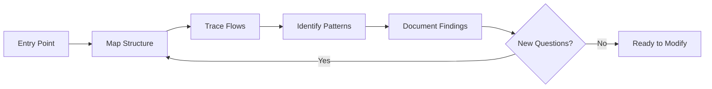

# Module 9.1: Archeology Mode

> **Estimated time**: ~35 minutes
>
> **Prerequisite**: Phase 8 (Meta-Debugging)
>
> **Outcome**: After this module, you will have a systematic approach to understanding legacy codebases with Claude Code, know which questions to ask, and be able to build mental models of unfamiliar code.

---

## 1. WHY — Why This Matters

New job, new codebase. 500,000 lines of code. No documentation worth reading. You're assigned a bug in `PaymentProcessor.java` — a 2,000-line file with methods named `process()`, `handle()`, `doIt()`. You have no idea what any of it does.

Your instinct is to start reading line by line. That will take weeks.

Claude Code can accelerate this 10x — if you know how to direct it. Archeology Mode is the systematic approach to excavating understanding from legacy code. Discovery before modification.

---

## 2. CONCEPT — Core Ideas

### What is Archeology Mode?

Archeology Mode is systematic exploration of unfamiliar codebases. The goal: build a mental model BEFORE making changes. Claude becomes your exploration partner, not just a code writer. Discovery-oriented, not modification-oriented.

### The Excavation Framework



### Excavation Layers

| Layer | Questions | Claude Prompt |
|-------|-----------|---------------|
| **Project** | What does this do? Tech stack? | "Read package.json, README, main entry. Summarize project purpose." |
| **Module** | Major components? | "List directories in src/. Explain what each likely does." |
| **File** | What does this file do? | "Read [file]. Explain purpose and main functions." |
| **Function** | Inputs, outputs, side effects? | "Explain [function]. What are inputs, outputs, side effects?" |
| **Line** | Why is this line here? | "Why is line 45 doing X? What would break if removed?" |

### Key Archeology Prompts

Copy-paste ready:
- "Explain this codebase like I'm a new developer joining the team."
- "What are the 5 most important files in this project and why?"
- "Trace the execution flow from [entry point] to [output]."
- "What does [function] do? What are its side effects?"
- "Why might the original developer have written it this way?"
- "What would I need to understand to safely modify [component]?"

### Git as Time Machine

```bash
git log --oneline -20 [file]   # Recent history
git blame [file]               # Who wrote each line, when
git show [commit]              # What changed in that commit
```

Ask Claude: "Read this git blame output. What does the history tell us about this file's evolution?"

---

## 3. DEMO — Step by Step

**Scenario**: Inherited an e-commerce backend. Need to understand the order processing system.

### Step 1: Project Layer — Get the Big Picture

```text
You: Read package.json, README.md, and the main entry point.
Give me a 2-paragraph summary of what this project does and its tech stack.

Claude: This is an e-commerce backend built with Express.js and PostgreSQL.
It handles product catalog, shopping cart, order processing, and payment
integration with Stripe and PayPal. The codebase appears to be 4-5 years old
based on dependency versions...
```

### Step 2: Module Layer — Map the Territory

```text
You: List the directories under src/. For each, explain what it likely
contains based on naming and any files you can see.

Claude:
- src/routes/ — API endpoint definitions
- src/services/ — Business logic (orderService, paymentService, etc.)
- src/models/ — Database models (Sequelize ORM)
- src/utils/ — Shared utilities
- src/middleware/ — Express middleware (auth, logging, etc.)
```

### Step 3: File Layer — Zoom into Target

```text
You: Read src/services/orderService.js. This is what I need to modify.
Explain its purpose, main functions, and dependencies.

Claude: This file handles order lifecycle management:
- createOrder() — Creates new order from cart
- processPayment() — Integrates with paymentService
- updateOrderStatus() — State machine for order status
Dependencies: paymentService, inventoryService, emailService
Side effects: Sends emails, updates inventory, logs to analytics
```

### Step 4: Function Layer — Understand the Specific

```text
You: Explain processPayment() in detail. What inputs, outputs,
side effects? What could go wrong?

Claude:
Inputs: orderId, paymentMethod, amount
Process:
1. Validates order exists and is in 'pending' state
2. Calls paymentService based on method (Stripe/PayPal)
3. Updates order status based on payment result

Side effects:
- Writes to payment_transactions table
- Sends confirmation email on success
- Logs to analytics

Potential issues:
- No retry logic if payment service times out
- Race condition possible if called twice for same order
```

### Step 5: Document Findings

```text
You: Based on our exploration, create a brief architecture document
for the order processing system. I'll add it to our docs.
```

**Result**: Full understanding of order system in one session, ready to modify safely.

---

## 4. PRACTICE — Try It Yourself

### Exercise 1: New Codebase Onboarding

**Goal**: Practice the Excavation Framework on unfamiliar code.

**Instructions**:
1. Find an open-source project you've never seen (GitHub trending works)
2. Clone it
3. Use the Excavation Framework: Project → Module → File → Function
4. Time yourself: can you explain the project in 30 minutes?

<details>
<summary>💡 Hint</summary>

Start with:
```text
"Read package.json (or equivalent) and README.
Summarize: what does this project do, what's the tech stack?"
```

Then map structure:
```text
"List the main directories. What does each contain?"
```
</details>

### Exercise 2: Git Time Travel

**Goal**: Use git history to understand code evolution.

**Instructions**:
1. Pick a complex file in any project
2. Run `git log --oneline -20 [file]`
3. Ask Claude: "Read this git history. What story does it tell about this file's evolution?"
4. Pick an interesting commit, run `git show [commit]`, ask Claude to explain

### Exercise 3: Explain Like I'm New

**Goal**: Practice targeted archeology prompts.

**Instructions**:
1. Pick a function you don't understand
2. Prompt: "Explain [function] like I'm a new developer. What would I need to know to modify it safely?"
3. Follow up: "What questions should I ask before changing this code?"

<details>
<summary>✅ Solution</summary>

Effective follow-ups:
- "What other functions call this one?"
- "What tests cover this function?"
- "What happens if this function fails?"
- "Are there any hidden assumptions in this code?"
</details>

---

## 5. CHEAT SHEET

### Excavation Framework

1. **Project** → **Module** → **File** → **Function** → **Line**
2. Start broad, zoom in as needed
3. `/compact` after each layer exploration

### Key Archeology Prompts

```text
"Explain this codebase like I'm a new developer."
"What are the 5 most important files?"
"Trace execution from [A] to [B]."
"What does [function] do? Side effects?"
"Why was it written this way?"
"What do I need to know to safely modify [X]?"
```

### Git Time Machine

```bash
git log --oneline -20 [file]   # Recent history
git blame [file]               # Who wrote what
git show [commit]              # What changed
```

### Context Management

- `/compact` after each layer exploration
- Start fresh session for new area of codebase
- Document findings as you go

---

## 6. PITFALLS — Common Mistakes

| ❌ Mistake | ✅ Correct Approach |
|-----------|---------------------|
| Starting to modify before understanding | Archeology FIRST. Understand before changing. |
| Reading code line-by-line yourself | Let Claude summarize. Ask targeted questions. |
| Asking "explain everything" | Layer by layer: Project → Module → File → Function |
| Ignoring git history | Git blame and log tell stories. Include them. |
| Trusting Claude's understanding completely | Verify critical claims. Claude can misinterpret too. |
| No documentation of findings | Write down what you learn. Future you will thank you. |
| Exploring everything at once | Focus on what you need to modify. Targeted archeology. |

---

## 7. REAL CASE — Production Story

**Scenario**: Vietnamese developer joins fintech company. Assigned to fix bug in transaction reconciliation — 8-year-old codebase, original team gone, 50,000 lines of Java.

**Old approach (week 1)**: Reading code manually, taking notes, confused by undocumented business rules. Progress: understood maybe 20% after 5 days.

**Archeology Mode (week 2)**:
- Day 1: Project layer — Claude summarized entire architecture in 2 hours
- Day 2: Module layer — Mapped all services and their interactions
- Day 3: File layer — Deep dive into ReconciliationService.java
- Day 4: Function layer — Understood reconcile() and its 15 helper methods
- Day 5: Found the bug — edge case in currency conversion not handled

**Result**: 5 days with Claude vs estimated 3 weeks manually. Developer documented findings, created architecture diagram, and fixed bug.

**Quote**: "Claude didn't write a single line of code that week. It just helped me READ. That was more valuable than any code generation."

---

> **Next**: [Module 9.2: Incremental Refactoring](../02-incremental-refactoring/) →
