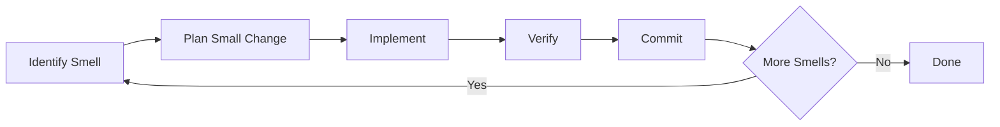

# Module 9.2: Incremental Refactoring

> **Estimated time**: ~35 minutes
>
> **Prerequisite**: Module 9.1 (Archeology Mode)
>
> **Outcome**: After this module, you will have a systematic approach to refactoring legacy code incrementally, know how to guide Claude toward safe changes, and understand the refactor-test-commit workflow.

---

## 1. WHY — Why This Matters

You understand the legacy code now (Module 9.1). Time to improve it. You ask Claude to "refactor this 500-line function." Claude produces a beautiful rewrite — that breaks 3 integrations you didn't know existed. Two days of debugging later, you revert everything.

Big refactors are risky. Incremental refactoring is how professionals improve legacy code: small steps, each verified, always rollback-ready. Claude can help — but needs to be guided toward incrementalism.

---

## 2. CONCEPT — Core Ideas

### The Incremental Principle

- One change at a time
- Verify after each change
- Commit after each verified change
- Rollback must be trivial

### The Refactoring Loop



### Safe Refactoring Patterns

| Pattern | Risk Level | Example |
|---------|------------|---------|
| Rename variable/function | Very Low | `data` → `userData` |
| Extract method | Low | Pull 10 lines into new function |
| Extract class | Medium | Move related methods to new class |
| Change signature | Medium | Add/remove parameters |
| Restructure logic | High | Change conditionals, loops |
| Change data structures | Very High | Array → Map, sync → async |

### Guiding Claude Toward Incrementalism

Key prompts:
- "Suggest the SMALLEST refactoring that improves this code."
- "What's ONE thing we could rename to improve readability?"
- "Extract ONLY the validation logic into a separate function."
- "DO NOT change the public interface. Internal only."
- "After this change, existing tests MUST still pass."

### The Strangler Fig Pattern

Don't rewrite old code — wrap it:
1. Create wrapper that calls old function
2. New code calls wrapper
3. Gradually move logic from old to wrapper
4. Eventually, old code is empty and removed

Ask Claude: "Create a wrapper for [old function] that I can gradually migrate to."

---

## 3. DEMO — Step by Step

**Scenario**: Legacy function `saveUserData()` — 200 lines, does validation, processing, AND saving. Need to break it apart.

### Step 1: Identify the Smell

```text
You: Read saveUserData() in userService.js.
What code smells do you see? List them by how easy they are to fix.

Claude:
1. Function does 3 things (validate, process, save) — extract methods
2. Magic numbers (line 45: if (age > 18)) — extract constants
3. Deep nesting (4 levels of if) — flatten conditionals
4. Unclear variable names (d, x, temp) — rename

Easiest to hardest: Rename → Constants → Extract methods → Flatten
```

### Step 2: Plan the Smallest Change

```text
You: Let's start with the easiest. Suggest ONLY variable renames
that would improve readability. Don't change any logic.

Claude:
- Line 12: d → userData
- Line 34: x → validationResult
- Line 56: temp → processedData
```

### Step 3: Implement with Verification

```text
You: Make only those 3 renames. Nothing else.

Claude: [Makes exactly 3 renames]
```

```bash
$ npm test
```

Output:
```text
PASS  src/services/userService.test.js
All tests passed ✓
```

### Step 4: Commit the Increment

```bash
$ git add userService.js
$ git commit -m "refactor: rename unclear variables in saveUserData"
```

### Step 5: Next Increment

```text
You: Good. Next: extract the validation logic (lines 20-50) into
a separate function validateUserData(). Keep the same behavior.

Claude: [Extracts validation into new function]
```

```bash
$ npm test
```

Output:
```text
PASS  src/services/userService.test.js
All tests passed ✓
```

```bash
$ git commit -am "refactor: extract validateUserData from saveUserData"
```

### Step 6: Continue Until Clean

- Increment 3: Extract `processUserData()`
- Increment 4: Extract constants
- Increment 5: Flatten conditionals

Each: implement → test → commit

**Result**: 200-line function → 4 clean functions + constants. 5 commits. Each commit is safe rollback point. Zero breakage.

---

## 4. PRACTICE — Try It Yourself

### Exercise 1: The Rename Game

**Goal**: Practice the lowest-risk refactoring.

**Instructions**:
1. Find a file with unclear variable names
2. Ask Claude to suggest ONLY renames (no logic changes)
3. Implement, test, commit
4. Repeat until naming is clean

<details>
<summary>💡 Hint</summary>

```text
"List all variable names in this function that could be clearer.
Suggest better names. Do NOT change any logic."
```
</details>

### Exercise 2: Extract Method Drill

**Goal**: Practice incremental extraction.

**Instructions**:
1. Find a long function (50+ lines)
2. Ask Claude: "What's ONE section I could extract into a helper function?"
3. Extract just that section
4. Test, commit
5. Repeat 3 times

### Exercise 3: Strangler Fig Practice

**Goal**: Learn the wrap-and-migrate pattern.

**Instructions**:
1. Pick a legacy function you want to replace
2. Ask Claude to create a wrapper that calls the old function
3. Move ONE piece of logic from old to wrapper
4. Test, commit
5. Repeat until old function is empty

<details>
<summary>✅ Solution</summary>

```text
Step 1: "Create a wrapper function newProcessOrder() that
simply calls the old processOrder() and returns its result."

Step 2: "Move ONLY the validation logic from processOrder()
into newProcessOrder(). Keep everything else calling the old function."

Step 3: Repeat for each piece of logic until old function is empty.
```
</details>

---

## 5. CHEAT SHEET

### Incremental Refactoring Loop

1. Identify smell
2. Plan smallest fix
3. Implement
4. Test
5. Commit
6. Repeat

### Safe Refactoring Prompts

```text
"What's the SMALLEST change to improve this?"
"Suggest ONLY renames, no logic changes."
"Extract ONLY [specific section] into new function."
"DO NOT change public interface."
"Existing tests MUST still pass."
```

### Risk Levels

- **Very Low**: Rename, reformat
- **Low**: Extract method, add comments
- **Medium**: Extract class, change signature
- **High**: Restructure logic
- **Very High**: Change data structures

### Git Rhythm

```bash
# After each increment:
npm test && git commit -am "refactor: [what you did]"
```

---

## 6. PITFALLS — Common Mistakes

| ❌ Mistake | ✅ Correct Approach |
|-----------|---------------------|
| "Refactor this whole file" | "What's ONE smell to fix first?" |
| Multiple changes in one commit | One logical change per commit |
| Refactoring without tests | If no tests, add them first (Module 9.3) |
| Changing logic while refactoring | Refactor = same behavior, different structure |
| Not testing after each step | Test after EVERY increment. Non-negotiable. |
| Letting Claude rewrite everything | Guide toward small, specific changes |
| Refactoring under deadline pressure | Don't refactor if you can't do it right |

---

## 7. REAL CASE — Production Story

**Scenario**: Vietnamese e-commerce company, legacy order processing — 800-line function, 5 years of patches, "works but don't touch it" reputation.

**Failed attempt (big bang)**: Junior dev asked Claude to "refactor this function." Claude produced elegant rewrite. Broke payment integration, shipping calculation, and audit logging. 3 days to revert and recover.

**Successful attempt (incremental)**:
- Week 1: Rename variables (15 commits, zero breaks)
- Week 2: Extract validation, processing, persistence (8 commits, 1 minor fix)
- Week 3: Extract shipping calculation into service (4 commits)
- Week 4: Add proper error handling (6 commits)

**Result**: Same function, now 5 clean files, 33 commits, each revertible. Zero production incidents.

**Quote**: "The trick was telling Claude 'one small thing at a time.' It wanted to rewrite everything. We had to hold it back."

---

> **Next**: [Module 9.3: Legacy Test Generation](../03-legacy-test-generation/) →
