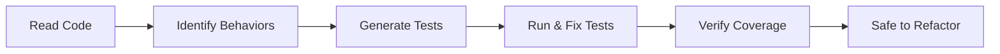

# Module 9.3: Legacy Test Generation

> **Estimated time**: ~35 minutes
>
> **Prerequisite**: Module 9.2 (Incremental Refactoring)
>
> **Outcome**: After this module, you will know how to use Claude Code to generate characterization tests for legacy code, understand what to test and what to skip, and have a workflow for adding tests before refactoring.

---

## 1. WHY — Why This Matters

You want to refactor that 500-line function. No tests exist. "I'll just be careful and manually test." Famous last words.

You refactor. It seems to work. You deploy. Next morning: production incident. A rarely-used code path you didn't test was broken. Customer data corrupted.

Tests are the safety net for refactoring. No tests = no safety net = high risk. Claude Code can generate tests for legacy code faster than you can write them — giving you that safety net before you start changing things.

---

## 2. CONCEPT — Core Ideas

### Characterization Tests vs. Unit Tests

| Type | Question It Answers |
|------|---------------------|
| Unit Test | Does the code do what it SHOULD? |
| Characterization Test | What does the code CURRENTLY do? |

Legacy code is "correct" by virtue of being in production. Users depend on its current behavior. Characterization tests capture that behavior — even if it seems wrong. The goal is detecting changes, not verifying correctness.

### The Test Generation Workflow



Key insight: When tests fail, fix the TEST, not the code. The code is "correct" — it's what's running in production.

### What to Test in Legacy Code

| Priority | What | Why |
|----------|------|-----|
| High | Public interface / API | Used by other code |
| High | Happy path flows | Most common usage |
| Medium | Edge cases in code | Explicit handling exists |
| Medium | Error handling | Failure modes matter |
| Low | Internal helpers | Changed during refactor anyway |

### Coverage Goals

Don't aim for 100%. Aim for "enough to refactor safely":
- 70-80% coverage of the specific function is usually enough
- Focus on code you're about to change
- Test behaviors, not lines

---

## 3. DEMO — Step by Step

**Scenario**: Legacy function `calculateDiscount()` — no tests, about to refactor.

### Step 1: Read and Identify Behaviors

```text
You: Read calculateDiscount() in pricingService.js.
List all the behaviors/paths through this function.

Claude:
1. Returns 0 if user is not logged in
2. Returns 10% for regular users
3. Returns 15% for premium users
4. Returns 30% for VIP users
5. Caps discount at 50% regardless of user type
6. Throws error if amount is negative
```

### Step 2: Generate Characterization Tests

```text
You: Generate Jest tests for calculateDiscount() that capture ALL those behaviors.
These are characterization tests — capture what it DOES, not what it SHOULD do.

Claude: [Generates test file with 6 test cases]
```

### Step 3: Run and Verify

```bash
$ npm test pricingService.test.js
```

Output:
```text
PASS  pricingService.test.js
  calculateDiscount
    ✓ returns 0 for non-logged-in user
    ✓ returns 10% for regular user
    ✓ returns 15% for premium user
    ✓ returns 30% for VIP user
    ✓ caps at 50% max discount
    ✓ throws on negative amount

6 tests passed
```

### Step 4: Handle Test Failures

Suppose one test fails — Claude assumed wrong behavior:

```text
FAIL: expected 20% for premium, got 15%
```

```text
You: The test is failing. The CODE is correct — it's in production.
The actual discount for premium users is 15%, not 20%.
Fix the test to match actual behavior.

Claude: [Fixes test assertion from 20% to 15%]
```

### Step 5: Check Coverage

```bash
$ npm run test:coverage -- --collectCoverageFrom="**/pricingService.js"
```

Output:
```text
pricingService.js | 85% coverage
```

Good enough to refactor safely.

### Step 6: Now Safe to Refactor

```text
You: We have tests. Now refactor calculateDiscount() to use
a strategy pattern instead of if-else chain.

Any refactoring that changes behavior will be caught by tests.
```

---

## 4. PRACTICE — Try It Yourself

### Exercise 1: Test What Exists

**Goal**: Generate characterization tests for existing code.

**Instructions**:
1. Find a function without tests in any project
2. Ask Claude to list all behaviors/paths
3. Generate tests for each behavior
4. Run tests — all should pass (if not, fix tests)
5. Check coverage

<details>
<summary>💡 Hint</summary>

```text
"Read [function]. What are all the possible execution paths?
Generate a test case for each path."
```
</details>

### Exercise 2: Golden Master

**Goal**: Capture complex output as regression baseline.

**Instructions**:
1. Pick a function with complex output (formatting, calculations)
2. Run it with 10 different inputs, capture outputs
3. Ask Claude to generate tests asserting those exact outputs
4. Now you have regression detection

### Exercise 3: Test Before Refactor

**Goal**: Practice the full workflow.

**Instructions**:
1. Pick a function you want to refactor
2. Generate characterization tests
3. Achieve 70%+ coverage
4. Do a small refactor
5. Run tests — did they catch anything?

<details>
<summary>✅ Solution</summary>

Workflow:
1. `"List all behaviors in [function]."`
2. `"Generate tests for each behavior."`
3. Run tests, fix any that fail (fix TEST, not code)
4. Check coverage, add more tests if needed
5. Refactor with confidence
</details>

---

## 5. CHEAT SHEET

### Test Generation Workflow

1. Read code, list behaviors
2. Generate tests for each behavior
3. Run tests (expect all pass)
4. If fail: fix TEST, not code
5. Check coverage
6. Now safe to refactor

### Key Prompts

```text
"List all behaviors/paths in [function]."
"Generate characterization tests capturing current behavior."
"Test is failing but CODE is correct. Fix the test."
"What edge cases does this code handle?"
```

### Coverage Guidelines

| Goal | Target |
|------|--------|
| Minimum | 70% of function-to-refactor |
| Good | 80% with edge cases |
| Overkill | 100% (not worth the effort) |

### Characterization vs. Unit Test

| Characterization | Unit |
|-----------------|------|
| What does it DO? | What SHOULD it do? |
| Fix test on failure | Fix code on failure |
| Before refactoring | During development |

---

## 6. PITFALLS — Common Mistakes

| ❌ Mistake | ✅ Correct Approach |
|-----------|---------------------|
| Fixing code when tests fail | Fix TESTS. Code is "correct" (it's in production). |
| Aiming for 100% coverage | 70-80% of code-to-refactor is enough. |
| Testing internal helpers | Focus on public interface. Helpers will change. |
| Verifying "correct" behavior | Verify CURRENT behavior, even if it's a bug. |
| Generating tests without running | ALWAYS run. Claude may misunderstand behavior. |
| Skipping tests "I'll be careful" | Tests are safety net. Always add before refactor. |
| Complex mocking for legacy code | Start with integration-level tests. Mock less. |

---

## 7. REAL CASE — Production Story

**Scenario**: Vietnamese fintech, legacy loan calculation module. 2,000 lines, zero tests, 8 years old. Business wants new loan type added. Team afraid to touch it.

**Old approach**: "We'll be careful" → Added new loan type → Broke existing calculation for edge case → ₫500M miscalculation discovered after 2 weeks → Painful fix and customer complaints.

**New approach with Claude**:
1. Claude analyzed code, identified 15 distinct calculation paths
2. Generated 45 characterization tests in 3 hours
3. Tests revealed 3 undocumented behaviors (not bugs — features no one remembered)
4. Achieved 78% coverage on loan calculation core
5. Added new loan type, tests caught 2 regressions during development
6. Zero production issues

**Investment**: 3 hours generating tests
**Saved**: Weeks of debugging, potential ₫ millions in miscalculations

**Quote**: "The tests weren't about proving correctness. They were about proving we didn't break the thing that's been working for 8 years."

---

> **Next**: [Module 9.4: Tech Debt Analysis](../04-tech-debt-analysis/) →
